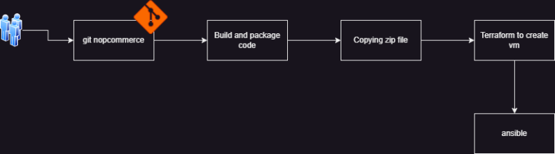

Ansible Workshop
-----------------

* We will be create CI CD Pipeline which builds nopcommerce code and creates a zip file.
* I need a playbook to
   * install nop on ubuntu 22.04
   * install mysql on ubuntu 22.04
* This playbook will be called from terraform or jenkins
* inputs for you will be
   * zip file path for you to copy
   * database username and password
* Expectations:
   * database should be connected from nop server
* Manual Steps: [Refer Here](https://docs.nopcommerce.com/en/installation-and-upgrading/installing-nopcommerce/installing-on-linux.html)  


* [Refer Here](https://github.com/AjayWorkShop/nopCommerceForAnsible) for the git repo

### Setups:
#### Lets create VM as `Node-1` 
* Install dotnet 7 on `node 1`
```bash
sudo apt-get update && \
  sudo apt-get install -y dotnet-sdk-7.0
```
* Install jenkins on `node 1` [Refer Here](https://www.jenkins.io/doc/book/installing/linux/#debianubuntu) for jenkins installation
  * steps:
```bash
sudo apt update
sudo apt install openjdk-17-jdk -y
sudo wget -O /usr/share/keyrings/jenkins-keyring.asc \
  https://pkg.jenkins.io/debian-stable/jenkins.io-2023.key
echo deb [signed-by=/usr/share/keyrings/jenkins-keyring.asc] \
  https://pkg.jenkins.io/debian-stable binary/ | sudo tee \
  /etc/apt/sources.list.d/jenkins.list > /dev/null
sudo apt-get update
sudo apt-get install jenkins 
```  
#### Lets create VM as `Node-2`
* Install terraform and ansible on `node 2`
```bash
# Ansible installation
sudo apt update
sudo apt install software-properties-common
sudo add-apt-repository --yes --update ppa:ansible/ansible
sudo apt install ansible -y
# Terraform installation
sudo apt-get update && sudo apt-get install -y gnupg software-properties-common
wget -O- https://apt.releases.hashicorp.com/gpg | \
gpg --dearmor | \
sudo tee /usr/share/keyrings/hashicorp-archive-keyring.gpg
echo "deb [signed-by=/usr/share/keyrings/hashicorp-archive-keyring.gpg] \
https://apt.releases.hashicorp.com $(lsb_release -cs) main" | \
sudo tee /etc/apt/sources.list.d/hashicorp.list
sudo apt update
sudo apt-get install terraform -y
```
#### Build steps:
```
git clone https://github.com/WorkshopsByKhaja/nopCommerceForAnsible.git
cd nopCommerceForAnsible
dotnet build src/NopCommerce.sln
```
* [Refer Here](https://github.com/AjayWorkShop/nopCommerceForAnsible/blob/main/Jenkinsfile) for jenkinsfile

