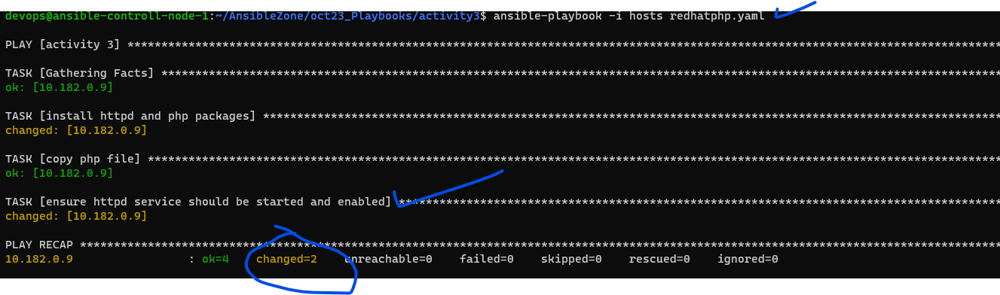
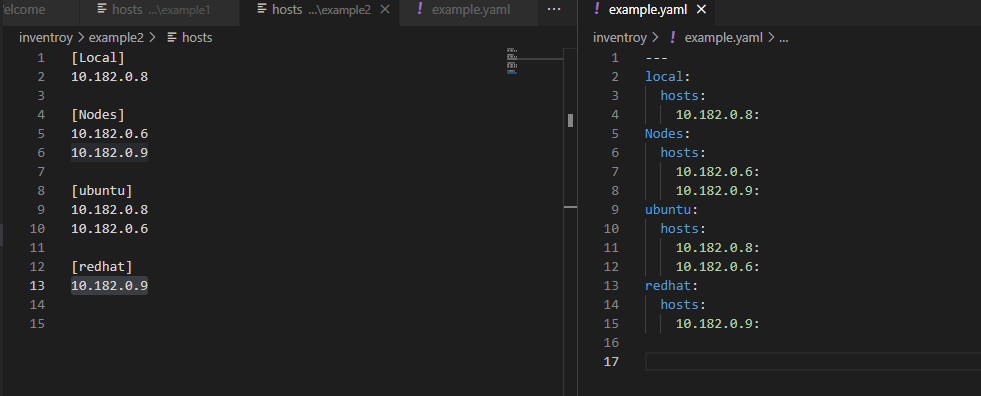

Ansible Introduction
---------------------
* [Refer Here](https://www.ansible.com/) for Ansible official docs
* Ansible is majorly used in DevOps to deploy applications into servers across various environments.
* Ansible in CI/CD pipeline is called by some engine for example => (Jenkins => Ansible, AzureDevOps => Ansible …)
### Configuration Management types:
   * **pull based CM:**
     * Nodes will communicate with CM Server to deploy configuration
     * For this to happen, We need to
       * install agent software on node and configure it to connect to the server to communicate with CM.
     * **Examples:**
       * Chef
       * Puppet
         * Works on agent base and using puppet/chef agent 
         * agent pulls the agent configuration 

   * **push based CM:**  
      * CM Server communicates with Nodes to deploy configuration
      * For this to happen we need details such as
         * ip address of node
         * credentials of node

      * **Examples:**
        * Ansible
        * Salt 
   * **Ansible:**
      * no agent needed works on SSH
      * not complex 
      * it pushes the configuration 
      * it works on credentials 
      * it is agent less   

      

### Ansible Execution Approaches/can use in two ways
  * Ansible Ad-Hoc Commands
     * [Refer Here](https://docs.ansible.com/ansible/latest/command_guide/intro_adhoc.html)
     * it is used for one time activity/non repetitive tasks
     * This uses the following structure below
    ```
    ansible -i hosts  -m [module-name] -a "[arguments]" 
    ansible -i hosts -m shell -a "cat/ect/passwd/"
    ``` 
  * Ansible Playbooks
     * [Refer Here](https://docs.ansible.com/ansible/latest/playbook_guide/playbooks_intro.html)
     * It is used for repetitive tasks and This is yaml representation of sequence of commands

       `ansible-playbook -i hosts playbook.yml`

### Declarative vs Procedural
* Understanding Declarative vs Procedural


* In Declarative programming, we define what we want is(desired state).
* The job of the tool is to ensure desired state is met every time during execution.
* **Idempotence:**
    * The result of execution of CM Script is same when we execute it once or multiple times
* **Configuration Drift:**
    * is known as Difference between desired state and actual state.

### Ansible Architecture
  * Overview
  

### Components:
  * **Ansible control node:** This is where ansible is installed
  * **Nodes:** This is where we want to perform deployments
  * **Inventory:** list of nodes and their information like ip address
  * **Playbook:** Where we write instruction What has to be done on the node
  
### Workflow:
  * We develop playook and specify inventory and execute the playbook on ansible control node
  * Now ansible tries to establish connection to node
  * Now the ansible playbook is executed with the help of python on node.

### Authentication in Linux or Credentials
  * Linux uses SSH (Secure Shell) for connecting to other instances
  * There are two types of Authentication/credentials
    * username and password
    * username and key pair

### Procedure to Transfer ID_RSA Private/Public Key from our local terminal to VMS 

```
# this below command says transfer id_rsa key to particular server with their server username and public ip
sftp -i .\id_rsa_AjaykumarRamesh dell@34.16.183.64
# which file to transfer
put id_rsa_AjaykumarRamesh
# output below
Uploading id_rsa_AjaykumarRamesh to /home/dell/id_rsa_AjaykumarRamesh 100% 3389 15.0KB/s   00:00 id_rsa_AjaykumarRamesh
# then say 
bye
```
* Check this below id_rsa key file has been transferred to server

* Now Ansible controller server can connect to node-1 but before that needs to change the id_rsa file permission to `chmod 400 id_rsa_AjaykumarRamesh`
* because id_rsa key file are too open for others users can misuse it.
* Now then login from ansible controller server and access the node-1

`ssh -i id_rsa_AjaykumarRamesh dell@10.182.0.6`
* Observe the below screen shot


### Lab Setup:
 * Overview
 
* We will create a user called as `devops` on `ansible-controller` and `node-1`
* Enable password based authentication since in 
AWS it is disabled
* Try to login from `ansible-controller` to `node-1` using devops user

### Solutions:
* In Ansible-Controller server:
* Enable password based authentication
  * check the value of PasswordAuthentication in file called `/etc/ssh/sshd_config` and change it to `yes` 
  
    `sudo nano /etc/ssh/sshd_config`
  * before changing
  
  * After changing
  

  * Restart sshd 
  
    `sudo systemctl restart sshd`
* Create a user called as `devops`

     `sudo adduser devops`
* Now repeat the same above steps on `node-1`
* Now connect from our laptop to VMS by using `username` and `password` not required to give `-i option and id_rsa` since we have username and password
```
ssh username@ip-addresss
ssh devops@34.125.18.117
```
* Now from `ansible-controller` connect to `node-1` 
```
ssh devops@<public-id-address/private-ip-address>
ssh devops@10.182.0.6
```

### Setting up password less authentication between linux machines
* **Steps:**
  * create two VMS called `ansible-controller` and `node-1`
  * create users called `devops` in Two VMS
  * Enable password based authentication for two VMS in file called `/etc/ssh/sshd_config` and change it to `yes`
    * Restart sshd  `sudo systemctl restart sshd`
  * Add two VMS users to `sudoers file` or `sudoers group`  
    * In this case we will be editing sudoers file directly
    ```bash
    sudo visudo
    CTRL X => to save the file after edit
    ```
    * Refer Below screen shot for saving the file
    
    * Check whether `devops` user has sudo permission  in two VMS or not
    ```bash
    su devops
    cd ~
    pwd
    sudo apt update
    ```
  * Generate key pair from `ansible-controller`
    ```bash
    ssh-keygen -t rsa -b 2048
    ``` 
    
  * Now copy the public key from `ansible-controller` into `node-1`
  ```bash
  ssh-copy-id <username>@<noe-1-private-ip-address>
  ssh-copy-id devops@10.182.0.6
  ```
  
  * Now Login into `node-1` and check whether public key is copied 
  ```bash
  cd ~
  ls -al
  cd .ssh/
  ls
  cat authorized_keys
  ```
  
  * After the ssh-copy-id is success, then we can login directly by using ip address as both machines have same username and password less authentication is setup
  ```
  ssh <node-1-private-ip>
  ssh 10.182.0.6
  ```
  

### Ansible setup:
* we have two machines with common user devops with sudo permissions and password less authentication setup between `ansible-controller` and `node-1`
* Ensure python 3 is installed on both server
   
   `python3 --version`
* [Refer Here](https://docs.ansible.com/ansible/latest/installation_guide/index.html) for Ansible installation guide
* We have two approaches to install ansible
   * using python
      * [Refer Here](https://docs.ansible.com/ansible/latest/installation_guide/intro_installation.html#installing-and-upgrading-ansible-with-pip)
   * using package managers like apt or yum (dnf)
      * [Refer Here](https://docs.ansible.com/ansible/latest/installation_guide/installation_distros.html#installing-ansible-on-ubuntu)
```bash
sudo apt update
sudo apt install software-properties-common
sudo add-apt-repository --yes --update ppa:ansible/ansible
sudo apt install ansible -y 
ansible --version
```      

* Overview


### Test ansible connectivity from ansible controller to node-1
* Create a file with `node-1` ip address in it
 ```
 echo 34.16.190.235 > hosts
 cat hosts
 ```
 
* execute the following command `ansible -i hosts -m ping all` or `ansible -m ping -i hosts all`
 

### Adding users to sudo
* [Refer Here](https://linuxize.com/post/how-to-add-user-to-sudoers-in-ubuntu/) for debian based systems
* [Refer Here](https://developers.redhat.com/blog/2018/08/15/how-to-enable-sudo-on-rhel) for redhat based systems

YAML
----
* This is data representation language which uses name values
```
<name>: <value_pair>
   or
<key>: <value_pair>  
```
* YAML is inspired from python, so indentation’s become mandatory
* YAML files generally have `.yaml` or `.yml` as extensions
* Lets categorize data
   * Scalar/Simple
      * text 
      * number
      * boolean
   * Complex
      * list/array
      * map/dictionary/object

#### Ansible Playbook Syntax:
* [Refer Here](https://docs.ansible.com/ansible/latest/reference_appendices/YAMLSyntax.html) 

* Sample Yaml Syntax:
```yaml
---
name: test
mobile: '999999999'
email: test@test.com
CareerObjective: |
  A motivated individual with in-depth knowledge of languages 
  and development tools, seeking a position in a growth-oriented 
  company where I can use my skills to the advantage of the 
  company while having the scope to develop my own skills.
ProfessionalSummary:
  - Involved in designing CI/CD pipleines
  - Hands on experience in Develpoing Ansible playbooks
Skills:
  os:
    - windows
    - linux
  cm:
    - Ansible
  container:
    - Docker
Work experience:
  - company: xyz limited
    duration: Dec 2021 - present
    designation: DevOps Engineer
    RandR:
      - Ensuring Pipelines are healthy
      - Developing playbooks
  - company: abc limited
    duration: Dec 2019 - Dec 2021
    designation: DevOps Engineer
    RandR:
      - Ensuring Pipelines are healthy
      - Developing playbooks
```
### Basic structure of Ansible playbook
```yaml
---
- name: <name of playbook - text>
  hosts: <where to execute-text>
  become: <need sudo permissions -bool>
  tasks: # <list of task>
  - name: Ensure apache is at the latest version # name of task
    ansible.builtin.yum: # module name
      name: httpd # module arguments
      state: latest # state
```

* Ansible Playbook structure:


### Lets create a simple playbook
  * Goal: create a file @ `/tmp/1.txt` 
  * manual Command:
 
     `touch /tmp/1.txt`
  * where to execute: all machines
  * Approximate playbook
  ```yaml
  ---
  - name: create file play
    hosts: all
    become: no
    tasks:
    - name: create a file
      ansible.builtin.file:
      path: /tmp/1.txt
      state: file 
  ```
Ways of Working in Ansible
---------------------------
* Figure out the manual steps
* Execute and verify if they are working
* for each manual step findout an ansible module which can help

Ansible Module
--------------
* this is the smallest unit of work in Ansible
* Module takes some inputs which are generally referred as parameters and it has state
* Ansible modules [Refer Here](https://docs.ansible.com/ansible/2.9/modules/list_of_all_modules.html)

### Activity: install apache server on node 1
* manual steps: [Refer Here](https://www.digitalocean.com/community/tutorials/how-to-install-the-apache-web-server-on-ubuntu-22-04)

```bash
sudo apt update
sudo apt install apache2 -y
```
### Way of Finding modules:

* [Refer Here](https://github.com/codesquareZone/AnsibleZone/commit/076dfe292ae06007f36635375fa2a066da1cf076) for apache-2 yaml file
* **Ansible Playbook Execution Approach:**
* Ansible to take help
 
  `ansible-playbook --help`
  * **Syntax check:**

    `ansible-playbook -i hosts --syntax-check apache.yaml`
    
  
  * Check the execution like (dry run). Note this is not always correct

    `ansible-playbook -i hosts --check apache.yaml`
     

  * Now lets execute the playbook
  
    `ansible-playbook -i hosts apache.yaml`   
    
  * Now installed apache2 on `node-1` with our yaml file
  

  * Now Lets re-run the ansible playbook, it will not do nothing since ansible is `idempotent`
  

### Activity 2: Install php on apache server
* Manual steps:
```
sudo apt udpate 
sudo apt install apache2 -y
sudo apt install php libapache2-mod-php php-mysql -y
```
* Lets create a file `/var/www/html/info.php` with the following content below
  
        <?php phpinfo(); ?>
* [Refer Here](https://github.com/codesquareZone/AnsibleZone/commit/8f897fb75b7b974407a650bca3e7db31c1b37e26?diff=split&w=0) for php yaml file
* Execute ansible playbook after syntax check and check
```
# syntax check
ansible-playbook -i hosts --syntax-check php.yml
# check 
ansible-playbook -i hosts --check php.yml
# Execute playbook
ansible-playbook -i hosts php.yml
```

* Now access `http://publicip/info.php` and `http://34.125.18.117/info.php`


### Activity 3: Perform the activity2 on redhat
* I need to setup/create a redhat vm with devops user and passwd
* Enable password authentication to yes in this file called `/etc/ssh/sshd_config` and Restart `systemctl restart sshd`
* Add devops user to sudoers group
* Copy the `ansible controller` public key to `Redhat-node`
```
ssh-copy-id devops@10.182.0.9
ssh-copy-id devops@<redhat-node-private-ip>
```
* manual steps:
```
sudo dnf install httpd -y
sudo dnf install php php-cli php-common php-gd php-mysqlnd php-pdo -y
```
* Lets create a file /var/www/html/info.php with the following content
  `<?php phpinfo(); ?>`
* [Refer Here](https://github.com/codesquareZone/AnsibleZone/commit/c8f5e1504266907f177a42f62f65034e3da34f60) for redhat yaml file
* Execute ansible playbook after syntax check and check
```
ansible-playbook -i hosts --syntax-check redhatphp.yaml
ansible-playbook -i hosts --check redhatphp.yaml
ansible-playbook -i hosts redhatphp.yaml
```

* In Redhat Linux Distribution after installing httpd we needs to start the service and enable it for next time restarting the service means by automatically service should start so we need to add one more line of yal for service to start


* [Refer Here](https://github.com/codesquareZone/AnsibleZone/commit/b935c11f6d7f0b37dc642c44e033650152036144) for service yaml file


* Now Access the application `http://34.125.107.165` and `http://34.125.107.165/info.php`


Inventories in Ansible
-----------------------
* Inventory is collection of nodes.
* Inventory is of two types
   * Static
   * Dynamic
* **Inventory can be written in two formats:**
    * ini format
    * yaml format
* **ini format:**
```
ipaddress/name

[group1]
ipaddress/name
ipaddress/name

[group2]
ipaddress/name
ipaddress/name
```
* [Refer Here](https://github.com/codesquareZone/AnsibleZone/commit/5ba26591b77eef4718e68970bdeaf02ef543be03) for sample inventories in ini format

* [Refer Here](https://github.com/codesquareZone/AnsibleZone/commit/89fa37d5241ec9fac3f3054e932cbef4582dd35c) for sample os groups of inventories in ini format


* [Refer Here](https://docs.ansible.com/ansible/latest/inventory_guide/intro_inventory.html#defining-variables-in-ini-format) for inventory documentation
* Yaml Inventories Examples
* [Refer Here](https://github.com/codesquareZone/AnsibleZone/commit/c7708b477acd2fa0bfef48de40ccd995f944e5d6) 



### Ansible Facts
* it will collect some information about client server/nodes like `operating systems, IP addresses, attached filesystems,` and many more. by using  `module` called `setup` and it will gather all the information to Ansible controller, this is known as Ansible Facts
* For `Module Setup` [Refer Here](https://docs.ansible.com/ansible/latest/collections/ansible/builtin/setup_module.html)
* Example of ansible collecting facts
```
ansible -i example2 Nodes -m setup
```
 * [Refer Here](https://github.com/codesquareZone/AnsibleZone/commit/c22375b95aa9a7a164b4bae9e46f2d73dfb33201) for ansible_facts output
* To Filter the output 

  `ansible -i example2 all -m setup -a "filter=*ansible_os_family"`


### Activity 4: Lets write one playbook for installing php in both redhat and ubuntu
* using Ansible facts with `when` conditionals statement installing `php` on both `ubuntu` and `Redhat` os
* [Refer Here](https://docs.ansible.com/ansible/latest/playbook_guide/playbooks_conditionals.html) when conditional docs
* [Refer Here](https://github.com/codesquareZone/AnsibleZone/commit/7a36920591442584d71457ce94a15876cdda050d) for when conditions yaml file
   * [Refer Here](https://github.com/codesquareZone/AnsibleZone/commit/be9dbb2aa2165d8609ccd93a34949f21332e7c09) for when conditions yaml file added error fix


* **Add a failback message for unsupported operating systems:**
* By using `msg` module we will resolve this issue
   * [Refer Here](https://docs.ansible.com/ansible/latest/collections/ansible/builtin/fail_module.html) for  failing execution with msg module
* [Refer Here](https://github.com/codesquareZone/AnsibleZone/commit/2f20facdb52173efa7ceb4b6d5fc1d0ae52e024b) for msg yaml file

* **Lets parametrize using Ansible variables with help debug module:**
* [Refer Here](https://docs.ansible.com/ansible/latest/playbook_guide/playbooks_variables.html) for ansible variables docs
* [Refer Here](https://docs.ansible.com/ansible/latest/inventory_guide/intro_inventory.html#adding-variables-to-inventory) for Adding variables into inventory docs 
* [Refer Here](https://docs.ansible.com/ansible/latest/collections/ansible/builtin/debug_module.html) debug module docs 
* **debug module version-1:**
* [Refer Here](https://github.com/codesquareZone/AnsibleZone/commit/616a9ed107d669b22921e34c738ef67973d90845) for debug yaml file

* **debug module version-2:**
* [Refer Here](https://github.com/codesquareZone/AnsibleZone/commit/23bfed88e8f2f9d25479db47325828ebcdcfe807) for using debug module added variables

* [Refer Here](https://github.com/codesquareZone/AnsibleZone/commit/bc47331713ee03ce7131a3d9ac200dd01b00b6fc) for using debug module added variables
* ** Generic OS package manager:**
* [Refer Here](https://docs.ansible.com/ansible/latest/collections/ansible/builtin/package_module.html) for generic package manager official docs
* Lets use generic package manager, by using this generic os package manager instead of we using `apt for ubuntu` and `yum/dnf for Redhat` like multiple module, we can use only one package manager called `package` module, so that if it ubuntu it will take `apt` nor if it is Redhat it will take `yum/dnf`
* [Refer Here](https://github.com/codesquareZone/AnsibleZone/commit/fde1a2f23f940faa1a9f73b0792074477071a866) for Generic packages module yaml file
* **Loops Concept:**
* [Refer](https://docs.ansible.com/ansible/latest/playbook_guide/playbooks_loops.html) for Loops docs
* Now Lets use Loops concept to install multiple packages
* [Refer Here](https://github.com/codesquareZone/AnsibleZone/commit/9f462e87dc23cdf7ce3b42f342e7f4577b696a3c) for loop in yaml file
* Finally using loops and package module installed required packages on ubuntu and redhat


* **Adding variables directley in the yaml file:**
* refer this below examples of yaml file but this variables works only for ubuntu not for redhat because we have added variables in yaml only for ubuntu packages

```yaml
---
- name: activity 4
  hosts: all
  become: true
  tasks:
  - name: fail on unsupported operating systems
    ansible.builtin.fail:
      msg: "This playbook will work on Debian and RedHat Only"
    when: ansible_facts["os_family"] != "Debian" and ansible_facts["os_family"] != "RedHat"
    vars:
      all_packages:
      - apache2
      - php
      - libapache2-mod-php
      - php-mysql
      ackage_name: apache2 
- php-mysql
  - name: print the value
    ansible.builtin.debug:
      var: all_packages   
  - name: install httpd/apache2 and php packages
    ansible.builtin.package:
      name: "{{ item }}"
      state: present  
    loop: "{{ all_packages }}"       
  - name: copy php file
    ansible.builtin.copy:
      content: <?php phpinfo(); ?>
      dest:  /var/www/html/info.php
  - name: ensure httpd service should be started and enabled
    ansible.builtin.service:
      name: "{{ package_name }}"
      state: started
      enabled: true
```

* **Using group vars and host vars installing the packages for ubuntu and redhat:**
* Note:
   * group vars file name should be group name exactly
   * host vars file name should be ip name or dns name exactly 
* [Refer Here](https://github.com/codesquareZone/AnsibleZone/commit/c671a63fad499227607e5c2e46290908c3ee8a85) for group and host variable yaml file

* So here we have defined group variable and host variable but highest priority it will take first for host variable ans also we called in php.yml file host variable only by using debug module.
* **Now to call group variable:**
 * to call group variable in php.yaml file we will be changing host variable to group variable in debug module
 * so in gorup there two hosts so for that host it will call only group variable
* [Refer Here](https://github.com/codesquareZone/AnsibleZone/commit/43dcc88dfac8e82d4c3d86fe3328c3975ab788f1) for group variable yaml file

* **Examples: that host level variable has higher priority:**
 * here in this examples we are calling group level variable but for one host i have changed group varaible to different value so let see what it prints 
 * `10.182.0.2` for this ubuntu host i have changed to purpose to practice and other host same purpose to learning 
 * let us see the output 
 
* [Refer Here](https://github.com/codesquareZone/AnsibleZone/commit/be3194604cefdb53d5682940281c4815972c21d7) for changes host variable yaml file
* **Examples:** for executing variable in the commandline while executing ansible playbook by using command called `-e` because in ansible variable highest priority is given to `-e variable`
* Lets us see result while executing 

`ansible-playbook -i hosts -e purpose="nothing" --check php.yaml`

* **Finally:**
   * **Group level variable:** can be used comman to all the host means list of host which is there in that group and also group level variable will be applicable to all the elements in the groups 
   * **Host level variable:** can be used only for host elements means particular host only applicable that packages
* **For Example group level variable:**
    * refer below yaml file format
```webserver.yaml
---

purpose: learning

all_packages:
- apache2
- php
- libapache2-mod-php
- php-mysql
package_name: apache2 
```
* **Varaibles Rules in Ansible:**
  * `-e` passing the variables while executing playbook will be given highest priority
  * Host level variables will be given second highest priority
  * Group vars variables will be given third highest priority
  * vars variables which will be defined in the yaml/playbook file will be given forth highest priority


Activity 5: Install tomcat 10 server
-------------------------------------
* **Target environments:**
  * ubuntu
  * redhat
* **References docs:**
  * ubuntu [Refer Here](https://linuxize.com/post/how-to-install-tomcat-10-on-ubuntu-22-04/)
  * redhat based [Refer Here](https://linuxize.com/post/how-to-install-tomcat-9-on-centos-7/)

* **Ubuntu Manual Steps:**
```bash
sudo apt update
sudo apt install openjdk-11-jdk -y
sudo useradd -m -U -d /opt/tomcat -s /bin/false tomcat
# wha this above third command says is => create user with following information
# username = tomcat
# group = tomcat
# homedir = /opt/tomcat
# shell = /bin/false
MAJOR_VERSION="10"
VERSION="10.1.17"
wget "https://dlcdn.apache.org/tomcat/tomcat-${MAJOR_VERSION}/v${VERSION}/bin/apache-tomcat-${VERSION}.tar.gz" -P /tmp
# This above command uses variable concept and download tomcat tar to /tmp
# file path: /tmp/apache-tomcat-10.1.14.tar.gz
sudo tar -xf /tmp/apache-tomcat-${VERSION}.tar.gz -C /opt/tomcat/
# extract tar file to /opt/tomcat
sudo ln -s /opt/tomcat/apache-tomcat-${VERSION} /opt/tomcat/latest
# Create a link for /opt/tomcat/apache-tomcat-10.1.14 to /opt/tomcat/latest
sudo chown -R tomcat: /opt/tomcat
# change the ownership for folder /opt/tomcat
sudo sh -c 'chmod +x /opt/tomcat/latest/bin/*.sh'
# Add execute permissions in bin directory for shell files
```

* Creating service files will be done at a later point of time

### Ansible implementations
* writing playbook and executing for above manual steps 
* [Refer Here](https://docs.ansible.com/ansible/latest/collections/ansible/builtin/user_module.html) for creating user in ansible official docs
* [Refer Here](https://docs.ansible.com/ansible/latest/collections/ansible/builtin/group_module.html) for creating group in ansible official docs

* **Creating user and group:**
* [Refer Here](https://github.com/codesquareZone/AnsibleZone/commit/3698929d5f49c642582553099b781f38f8461ce8) for yaml file install java creating user and group  
* We ran into issue [Refer Here](https://github.com/codesquareZone/AnsibleZone/commit/3f075e3743ad741d7f8a98fe095913c2d955a383)  for the fix
* After checking syntax and dry run, execute the ansible playbook
```
ansible-playbook -i hosts --syntax-check tomcat.yaml
ansible-playbook -i hosts --check tomcat.yaml
ansible-playbook -i hosts tomcat.yaml
```
* **Downloading tomcat version:**
* [Refer Here](https://docs.ansible.com/ansible/latest/collections/ansible/builtin/get_url_module.html) for downloading in ansible official docs


* [Refer Here](https://github.com/codesquareZone/AnsibleZone/commit/8ecdd7d1ed33f8eb2912228f5f6ec73c09f5145a) for download the tomcat version yaml file


* **To extract tomcat tar file:**
* Step: 1 or Version: 1 
  * we show in this below yaml file only to extract tomcat but even we have option to download and extract so we are removing the download steps in the yaml file because it is unnecessary of adding steps, which will show in below version-2 for downloading and extracting it. 
* [Refer Here](https://docs.ansible.com/ansible/latest/collections/ansible/builtin/unarchive_module.html) for unarchive/extract tomcat official docs
* [Refer Here](https://github.com/codesquareZone/AnsibleZone/commit/a371abdd344a2fdd0aa8492191b5ea9f61a4c773) for extract tomcat yaml file

* Steps: 2 or Version: 2
* **Download and Extract tomcat file:**
  * also here we are adding the one more steps called creating directory and then download and extract tomcat
    * [Refer Here](https://docs.ansible.com/ansible/latest/collections/ansible/builtin/file_module.html) for creating directory official docs
* [Refer Here](https://github.com/codesquareZone/AnsibleZone/commit/693a5120b3b8432e53bd76175922718e47102980) for download and extract tomcat yaml file


* [Refer Here](https://github.com/codesquareZone/AnsibleZone/commit/90a7b4e5fa6b60f06a21dd11ea69b968501cc90b) for creating directory yaml file 

* Refer below screen shot directory created and download and extracted tomcat into node-1


* **To Add Symlink:**
* [Refer Here](https://docs.ansible.com/ansible/latest/collections/ansible/builtin/file_module.html) for adding symlink official docs
* [Refer Here](https://github.com/codesquareZone/AnsibleZone/commit/f548f021258fcb0234ea60bd6a022496a8b9187f) for symbolic link yaml file

* observe below screen shot symbolic link has created


* **To change the ownership for folder `/opt/tomcat`:**
* [Refer Here](https://docs.ansible.com/ansible/latest/collections/ansible/builtin/file_module.html) for changing ownership of directory official docs
* [Refer Here](https://github.com/codesquareZone/AnsibleZone/commit/3b8a0ffed9d54be51ef1880e734aeb0bd20c9599) for changing ownership of directory yaml file

* Observe below changed ownership for directory `/opt/tomcat`


* To Add execute permissions in `/opt/tomcat/latest/bin` directory for shell files:**
* In Ansible we have two modules such as `command` and `shell` which execute raw low level linux commands and these are not `idempotent`. It is our job to make them `idempotent` 
   * [Refer Here](https://docs.ansible.com/ansible/latest/collections/ansible/builtin/command_module.html) for command module official docs
   * [Refer Here](https://docs.ansible.com/ansible/latest/collections/ansible/builtin/shell_module.html) for shell module official docs
* Lets use this in a raw way with `command` module and execute with raw linux commands (`with no idempotence`) 
* Observe below screen shot  ``.sh` shell files with no execute permissions

* [Refer Here](https://github.com/codesquareZone/AnsibleZone/commit/a7eeb75e597911c0702b05892b08941798185c0b) for execute permissions with command module yaml file

* Observe below screen shot  ``.sh` shell files with execute permissions

* so why we are using below register variables and different modules is `command` in ansible is raw linux so it is not idempotent and it will not have so much intelligence to ensure already permission has given, when we run each time it will execute so we want to make it idempotent.  
* **Ansible register variables:**
   * [Refer Here](https://docs.ansible.com/ansible/latest/playbook_guide/playbooks_variables.html#registering-variables) ansible register variables
* Using register variables and debug modules printing the output of shell script files 
* [Refer Here](https://github.com/codesquareZone/AnsibleZone/commit/76a9feafb670af4291a7b752ddfb2863a9770222) for register and debug module to print output yaml file

* **Loop with debug and msg:**
* by using loop, debug and msg printing the each files 
* [Refer Here](https://github.com/codesquareZone/AnsibleZone/commit/e01b3c8e1e11525922aa4c18fed47679c87d7ad0) for loop, debug and msg yaml file to print each shell files

* **Adding file permission using file module:**
* [Refer Here](https://docs.ansible.com/ansible/latest/collections/ansible/builtin/file_module.html) for file module official docs
* [Refer Here](https://github.com/codesquareZone/AnsibleZone/commit/ddd296769af45975d7ea1761d3cf0f291c96f807) for file permissions iteratively for shell files

* observe now below screen shot shell files permission has been changed.


Install tomcat 10 server on Redhat
----------------------------------
* Manual Steps:

```bash
sudo yum install java-11-openjdk -y
sudo useradd -m -U -d /opt/tomcat -s /bin/false tomcat
# create user with following information
# username = tomcat
# group = tomcat
# homedir = /opt/tomcat
# shell = /bin/false
MAJOR_VERSION="10"
VERSION="10.1.14"
wget "https://dlcdn.apache.org/tomcat/tomcat-${MAJOR_VERSION}/v${VERSION}/bin/apache-tomcat-${VERSION}.tar.gz" -P /tmp
# download tomcat tar to /tmp
# file path: /tmp/apache-tomcat-10.1.14.tar.gz
sudo tar -xf /tmp/apache-tomcat-${VERSION}.tar.gz -C /opt/tomcat/
# extract tar file to /opt/tomcat
sudo ln -s /opt/tomcat/apache-tomcat-${VERSION} /opt/tomcat/latest
# Create a link for /opt/tomcat/apache-tomcat-10.1.14 to /opt/tomcat/latest
sudo chown -R tomcat: /opt/tomcat
# transfer of ownership to tomcat user
sudo sh -c 'chmod +x /opt/tomcat/latest/bin/*.sh'
# Add execute permissions to all scripts in bin directory
```
* Apart for java installation rest of steps are same,
to make this playbook work with redhat
* [Refer Here](https://github.com/codesquareZone/AnsibleZone/commit/c54f189a76b6718eb7f77c75e6431a392cfbdc49) for redhat installation of tomcat 10 server yaml file

* observe below screen shot it downlaod and extract the tomcat and also changed permission to shell files


* **Ubuntu Service File:**
  * Now we need to create a service/SystemD file for ubuntu with the following contents in the file `/etc/systemd/system/tomcat.service`

```
[Unit]
Description=Tomcat 10 servlet container
After=network.target

[Service]
Type=forking

User=tomcat
Group=tomcat

Environment="JAVA_HOME=/usr/lib/jvm/java-11-openjdk-amd64"
Environment="JAVA_OPTS=-Djava.security.egd=file:///dev/urandom -Djava.awt.headless=true"

Environment="CATALINA_BASE=/opt/tomcat/latest"
Environment="CATALINA_HOME=/opt/tomcat/latest"
Environment="CATALINA_PID=/opt/tomcat/latest/temp/tomcat.pid"
Environment="CATALINA_OPTS=-Xms512M -Xmx1024M -server -XX:+UseParallelGC"

ExecStart=/opt/tomcat/latest/bin/startup.sh
ExecStop=/opt/tomcat/latest/bin/shutdown.sh

[Install]
WantedBy=multi-user.target
```
* In above service file we have multiple values so copying the contents directly in the service file, doesn't make any sense because it is know as static service file, so in future if user wants to change the some options then this static service file will not work, so to overcome this issue we have to create dynamic service file.
* **jinja templates:**
  * This is were jinja template came into picture.
  * [Refer Here](https://docs.ansible.com/ansible/latest/playbook_guide/playbooks_templating.html) for jinja templates official docs
  * By using jinja template we will make service file as dynamic so that users can change any value or pass any variables
* [Refer Here](https://docs.ansible.com/ansible/latest/collections/ansible/builtin/template_module.html#examples) for templates module official docs
* [Refer Here](https://docs.ansible.com/ansible/latest/collections/ansible/builtin/systemd_service_module.html) for systemd_service module official docs
* [Refer Here](https://github.com/codesquareZone/AnsibleZone/commit/f9b663429ffac732d1626b72b7a757aed4dd9d74) for jinja template and service file added and reloaded daemon enabled service started yaml file

* Now Access the application tomcat
  `http://34.125.197.209:8080/`


* **Redhat Service File:**
* Now we need to create a service file for ubuntu with the following contents in the file /etc/systemd/system/tomcat.service
* We are using same service file for both redhat and ubuntu with minor changes
```
[Unit]
Description=Tomcat 10 servlet container
After=network.target

[Service]
Type=forking

User={{ username }}
Group={{ groupname }}

Environment="JAVA_HOME=/usr/lib/jvm/java-{{ java_version }}-openjdk-amd64"

Environment="JAVA_HOME=/usr/lib/jvm/jre"

Environment="JAVA_OPTS=-Djava.security.egd=file:///dev/urandom -Djava.awt.headless=true"

Environment="CATALINA_BASE={{ homedir }}/latest"
Environment="CATALINA_HOME={{ homedir }}/latest"
Environment="CATALINA_PID={{ homedir }}/latest/temp/tomcat.pid"
Environment="CATALINA_OPTS=-Xms512M -Xmx1024M -server -XX:+UseParallelGC"

ExecStart={{ homedir }}/latest/bin/startup.sh
ExecStop={{ homedir }}/latest/bin/shutdown.sh

[Install]
WantedBy=multi-user.target
```  
* [Refer Here](https://github.com/codesquareZone/AnsibleZone/commit/1e26a857ec409fae5fde47c9f3c3b3a8644757f0) for the changes done to accommodate the same service file for both redhat and ubuntu with minor changes yaml file
* Now check be screen shot copied contents to service file and reloaded daemon, enabled and started service 

* Observe the service for Redhat machine

* observe the service for ubuntu machine

* Now access the application tomcat
   `http://34.125.180.87:8080/`
   

* **Handlers and Notify:**
* [Refer Here](https://docs.ansible.com/ansible/latest/playbook_guide/playbooks_handlers.html) for handlers and notify official docs
* Using handlers and notify we will restart the tomcat at the last when only configuration changes
* [Refer Here](https://github.com/codesquareZone/AnsibleZone/commit/d707dfa4ac28938faf6cbaa4e377f1a9bf2bc144) for hanlders and notify yaml file
* Look at the below screen shot, changes has taken place so notify called handlers to take action, so it is restarted service 


* **Flush Handlers with Notify:**
* [Refer Here](https://docs.ansible.com/ansible/latest/collections/ansible/builtin/meta_module.html) for flush handlers official docs 
* notify will call handlers and handlers usually execute at the last, scenario where we want to execute handlers at the beginning then we can use this `flush handler`
* refer below example for `flush handlers` 
* [Refer Here](https://github.com/codesquareZone/AnsibleZone/commit/2a792c199281343d7cc157cf0c221232b70b1891) for flush handlers yaml files


Configuring Tomcat Web Management Interface On Ubuntu and Redhat
-----------------------------------------------------------------
* At this point, you should be able to access Tomcat using a web browser on port `8080`
* The web management interface is not accessible because we have not created a user yet.
* Tomcat users and roles are defined in the `tomcat-users.xml` file. By default, this file includes comments and examples showing you how to create a user or role.
* In this example, we’ll create a user with `“admin-gui”` and `“manager-gui” roles`.
* The “admin-gui” role allows the user to access the /`host-manager/html` URL and create, delete, and otherwise manage virtual hosts. 
* The “manager-gui” role allows the user to deploy and undeploy web applications without restarting the container through the `/host-manager/html interface`.
* **Steps:**
```bash
# Open the `tomcat-users.xml` file with your text editor and create a new user, as shown below:
sudo vi /opt/tomcat/latest/conf/tomcat-users.xml
# copy the below role and user content to `tomcat-users.xml` file
<tomcat-users>
<!--
    Comments
-->
   <role rolename="admin-gui"/>
   <role rolename="manager-gui"/>
   <user username="admin" password="admin_password" roles="admin-gui,manager-gui"/>
</tomcat-users>
# save the file `tomcat-users.xml`
```
* To enable access to the web interface from anywhere, open the following two files and add below content and save the file.
```bash
# For the Manager app:
sudo nano /opt/tomcat/latest/webapps/manager/META-INF/context.xml
# For the Host Manager app:
sudo nano /opt/tomcat/latest/webapps/host-manager/META-INF/context.xml
# content to change for allow all ips access is below
# here to access tomcat web interface from any where or any ips, we have mentioned allow=".*" means allow all
<Context antiResourceLocking="false" privileged="true" >
<!--
  <Valve className="org.apache.catalina.valves.RemoteAddrValve"
         allow=".*" />
-->
</Context>
# content to change for and If you want to access the web interface only from a specific IP then add your public IP to the list below, like screen shot below.
```


* Once done, restart the Tomcat service for changes to take effect:
`sudo systemctl restart tomcat`
* These above entire steps refer below link
  * [Refer Here](https://linuxize.com/post/how-to-install-tomcat-10-on-ubuntu-22-04/)
* [Refer Here](https://github.com/codesquareZone/AnsibleZone/commit/ca5dd52ed82bfe14941aee1cfa0cf33753070e72) for Configuring Tomcat Web Management Interface yaml file

* Now Access the tomcat web interface for Manager app and Host Manager app, for both ubuntu and Redhat


### Tags in ansible
* [Refer Here](https://docs.ansible.com/ansible/latest/playbook_guide/playbooks_tags.html) for tags offcial docs
* Lets add the tags to the tomcat playbook
  * [Refer Here](https://github.com/codesquareZone/AnsibleZone/commit/7e861df653b1fba6ccc2ee722697d2d0c8c699b7) for tags yaml file

```
# this lists all tags in the tasks menioned 
ansible-playbook -i hosts --list-tags tomcat.yaml
# runs only tasks with tag install
ansible-playbook -i hosts --tag install tomcat.yaml
# run every thing but skips tag configure
ansible-playbook -i hosts --skip-tags configure tomcat.yaml
```
* by using tags we can run particular/specific block of task in playbook or even we can skip specific block of task in playbook

### Re-usablity in Ansible
* Using Ansible we can reuse the playbooks in 3 ways
   * import or include playbooks
   * roles
   * collections

### Import or include playbooks:
* [Refer Here](https://github.com/codesquareZone/AnsibleZone/commit/ba4a20725e2439ebebca62eea1c3a4a7d59f1903) for two simple playbooks first and second which print message

* **Import Way/Version:1**
* Now we want to execute both at a time first and second playbook
* [Refer Here](https://docs.ansible.com/ansible/latest/collections/ansible/builtin/import_playbook_module.html#examples) for import playbook official docs
* [Refer Here](https://github.com/codesquareZone/AnsibleZone/commit/b828d3a61f1d08d9873ebc9b90b630fd27510a34) for combine and calling playbook yaml file

* the above approach brings reusability but the hosts and other details are define in the individual playbooks, so it is not so useful, if i want to do any changes then i needs to do it in that particular playbook.
* **Import Way/Version:2**
* [Refer Here](https://github.com/codesquareZone/AnsibleZone/commit/00061f6d0275e3da6d50935fc2fcb58d2615277c) for  an approach where we have used import combined tasks
for calling tasks playbook yaml file

* We can acheive the same by using include tasks refer below
* **Include Tasks Module:**
* [Refer Here](https://docs.ansible.com/ansible/latest/collections/ansible/builtin/include_tasks_module.html) for include tasks module official docs
* [Refer Here](https://github.com/codesquareZone/AnsibleZone/commit/c4ca5505c09db831d00311d3cac8d320b24e049e) for include tasks yaml file

#### Difference between include_ and import_ in ansible
* **include:** is dynamic i.e. we have flexibility fo using include tasks conditionally
* **import:** is static i.e. we need to execute this unconditionally

Ansible Roles
-------------
* roles ia a modular way of writing playing book, means splitting playbooks into multiple files, to make playbook looks simple
* Ansible role helps in creating reusability
* [Refer Here](https://docs.ansible.com/ansible/latest/playbook_guide/playbooks_reuse_roles.html) for ansible roles official docs
* **Command to create roles:**
```
mkdir roles
cd roles
ansible-galaxy --help
ansible-galaxy init apache-webserver
ansible-galaxy init <roles_name> 
```
* When initialize the roles first time, type of folders and files will be created by default is below:
* Folder Structure:


* [Refer Here](https://github.com/codesquareZone/AnsibleZone/commit/03e6a1c15019c8becb398d354f9d932e87a12f21) for roles skelton/structure 

* Command to get/copy folders from remote server to local server:
```bash
# enter below command in location of local server
sftp devops@35.203.172.30
# enter password to connect remote server
devops@35.203.172.30's password:
# it will show connection
Connected to 35.203.172.30.
# enter what to copy/get
sftp> get -r roles
# finally close the connection saying bye
sftp> bye
```
* There are lot of reusable roles created by Ansible community and they push to Ansible-Galaxy [Refer Here](https://galaxy.ansible.com/ui/)
* when we want to install the roles written by Ansible community then we needs to install that particular roles to our local system from ansible galaxy
* I Folled this roles from ansible galaxy so follow this link [Refer Here](https://galaxy.ansible.com/ui/standalone/roles/alikins/java/documentation/)

* **Steps:** 
```bash
# To Install Any roles from ansible galaxy
ansible-galaxy role install geerlingguy.java
# installed roles will be saved to default location below 
/home/devops/.ansible/roles//geerlingguy.java
# To install roles on our own path then use -p
ansible-galaxy role install geerlingguy.java -p /home/devops
# by default install roles on our own path then edit below ansible file
ansible-cfg
```
* After installing roles to local terminal then follow below steps to execute it
```
# create file
vi java.yaml
# copy the below content in that file
---
- hosts: localhost
  become: yes
  roles:
    - geerlingguy.java
# execute below command to install that roles 
ansible-playbook -i hosts --check java.yaml        
```
* Observer the below screen shot java is installed


* Even we can publish our roles to ansible galaxy

#### Tomcat 10 roles
* so now we will be writing our own roles for tomcat 10
* [Refer Here](https://github.com/codesquareZone/AnsibleZone/commit/14e085d893d0ec4c7cebaf31300fa9cf784d9fa6) for tomcat10 roles yaml file

  `ansible-playbook -i activity5/hosts install_tomcat.yml`


### Ansible Galaxy:
* [Refer Here](https://galaxy.ansible.com/ui/)
* Ansible galaxy means sharing of roles or collections of roles
* it is like any repository or docker hub repository, so that every one will create different kinds of roles and publish to ansible galaxy

### Ansible Collections:
* [Refer Here](https://docs.ansible.com/ansible/latest/collections_guide/index.html) for official docs
* Ansible Collections means writing our own modules for our playbook.

### Ansible Special variables
* [Refer Here](https://docs.ansible.com/ansible/latest/reference_appendices/special_variables.html) for official docs
* these are ansible special variables we can set in the host-vars,group-vars, directly on playbook vars or passing -e vars
* for more information read the documents

### Ansible Parallelism
* **Forks:** [Refer Here](https://docs.ansible.com/ansible/latest/playbook_guide/playbooks_strategies.html) 
  * Forks means execute the tasks parallel at a time
  * usually in ansible all tasks will execute one by one or sequence order, so to overcome this sequence order we can use fork then it will execute parallel or at a time in all the machines
  * In Ansible default number of forks is 5 
* We can change the default fork value in two places
  * while passing ad-hoc or playbook command or in `/etc/ansible/ansible.cfg` file location change the default value
  ```
  ansible -i hosts -f 10 -m [module] -a [“arguments”]
  ansible-playbook -i hosts -f 10 playbook.yml
  ```


### Execution strategies In Ansible:
* **serial:**
  * Ansible playbooks will run parallel with all the host, so by setting te serial keyword, we can run the task host by host or percentage or batch wise.
* [Refer Here](https://docs.ansible.com/ansible/latest/playbook_guide/playbooks_strategies.html) 

* **throttle:**
  * throttling refers to the process of limiting the number of hosts that a task can operate on at the same time.
  * [Refer Here](https://linuxhint.com/ansible-throttle/) 
  * [Refer Here](https://docs.ansible.com/ansible/latest/playbook_guide/playbooks_strategies.html#id5) for official docs

#### Inventory ordering strategies:
* as we mentioned the inventory order it will executes the task but even we change that behavior for that [Refer Here](https://docs.ansible.com/ansible/latest/playbook_guide/playbooks_strategies.html#ordering-execution-based-on-inventory)


Ansible on Windows
-------------------
* Lets see how to make ansible work with windows servers

* Ansible control node cannot be on windows, where as nodes can be windows
* Ansible requires Powershell 3.0 or newer and atleast .net 4.0 on the windows servers
* Ansible connects to windows servers using two ways
    * winrm
       * winRM protocol to establish connection with Windows Hosts (it works on windows server 2016 later)
    * ssh (experimental)
#### Steps:    
* Lets create linux machine and Install ansible and consider as control node
* Lets create windows 2016 server machine and consider as windows node
* Login into the Windows Node
* Create a file in C:\ConfigureRemotingForAnsible.ps1 with following content [Refer Here](https://raw.githubusercontent.com/AlbanAndrieu/ansible-windows/master/files/ConfigureRemotingForAnsible.ps1)

```ps1
#!powershell
#Requires -Version 3.0

# Configure a Windows host for remote management with Ansible
# -----------------------------------------------------------
#
# This script checks the current WinRM (PS Remoting) configuration and makes
# the necessary changes to allow Ansible to connect, authenticate and
# execute PowerShell commands.
#
# All events are logged to the Windows EventLog, useful for unattended runs.
#
# Use option -Verbose in order to see the verbose output messages.
#
# Use option -CertValidityDays to specify how long this certificate is valid
# starting from today. So you would specify -CertValidityDays 3650 to get
# a 10-year valid certificate.
#
# Use option -ForceNewSSLCert if the system has been SysPreped and a new
# SSL Certificate must be forced on the WinRM Listener when re-running this
# script. This is necessary when a new SID and CN name is created.
#
# Use option -EnableCredSSP to enable CredSSP as an authentication option.
#
# Use option -DisableBasicAuth to disable basic authentication.
#
# Use option -SkipNetworkProfileCheck to skip the network profile check.
# Without specifying this the script will only run if the device's interfaces
# are in DOMAIN or PRIVATE zones.  Provide this switch if you want to enable
# WinRM on a device with an interface in PUBLIC zone.
#
# Use option -SubjectName to specify the CN name of the certificate. This
# defaults to the system's hostname and generally should not be specified.

# Written by Trond Hindenes <trond@hindenes.com>
# Updated by Chris Church <cchurch@ansible.com>
# Updated by Michael Crilly <mike@autologic.cm>
# Updated by Anton Ouzounov <Anton.Ouzounov@careerbuilder.com>
# Updated by Nicolas Simond <contact@nicolas-simond.com>
# Updated by Dag Wieërs <dag@wieers.com>
# Updated by Jordan Borean <jborean93@gmail.com>
# Updated by Erwan Quélin <erwan.quelin@gmail.com>
# Updated by David Norman <david@dkn.email>
#
# Version 1.0 - 2014-07-06
# Version 1.1 - 2014-11-11
# Version 1.2 - 2015-05-15
# Version 1.3 - 2016-04-04
# Version 1.4 - 2017-01-05
# Version 1.5 - 2017-02-09
# Version 1.6 - 2017-04-18
# Version 1.7 - 2017-11-23
# Version 1.8 - 2018-02-23
# Version 1.9 - 2018-09-21

# Support -Verbose option
[CmdletBinding()]

Param (
    [string]$SubjectName = $env:COMPUTERNAME,
    [int]$CertValidityDays = 1095,
    [switch]$SkipNetworkProfileCheck,
    $CreateSelfSignedCert = $true,
    [switch]$ForceNewSSLCert,
    [switch]$GlobalHttpFirewallAccess,
    [switch]$DisableBasicAuth = $false,
    [switch]$EnableCredSSP
)

Function Write-Log
{
    $Message = $args[0]
    Write-EventLog -LogName Application -Source $EventSource -EntryType Information -EventId 1 -Message $Message
}

Function Write-VerboseLog
{
    $Message = $args[0]
    Write-Verbose $Message
    Write-Log $Message
}

Function Write-HostLog
{
    $Message = $args[0]
    Write-Output $Message
    Write-Log $Message
}

Function New-LegacySelfSignedCert
{
    Param (
        [string]$SubjectName,
        [int]$ValidDays = 1095
    )

    $hostnonFQDN = $env:computerName
    $hostFQDN = [System.Net.Dns]::GetHostByName(($env:computerName)).Hostname
    $SignatureAlgorithm = "SHA256"

    $name = New-Object -COM "X509Enrollment.CX500DistinguishedName.1"
    $name.Encode("CN=$SubjectName", 0)

    $key = New-Object -COM "X509Enrollment.CX509PrivateKey.1"
    $key.ProviderName = "Microsoft Enhanced RSA and AES Cryptographic Provider"
    $key.KeySpec = 1
    $key.Length = 4096
    $key.SecurityDescriptor = "D:PAI(A;;0xd01f01ff;;;SY)(A;;0xd01f01ff;;;BA)(A;;0x80120089;;;NS)"
    $key.MachineContext = 1
    $key.Create()

    $serverauthoid = New-Object -COM "X509Enrollment.CObjectId.1"
    $serverauthoid.InitializeFromValue("1.3.6.1.5.5.7.3.1")
    $ekuoids = New-Object -COM "X509Enrollment.CObjectIds.1"
    $ekuoids.Add($serverauthoid)
    $ekuext = New-Object -COM "X509Enrollment.CX509ExtensionEnhancedKeyUsage.1"
    $ekuext.InitializeEncode($ekuoids)

    $cert = New-Object -COM "X509Enrollment.CX509CertificateRequestCertificate.1"
    $cert.InitializeFromPrivateKey(2, $key, "")
    $cert.Subject = $name
    $cert.Issuer = $cert.Subject
    $cert.NotBefore = (Get-Date).AddDays(-1)
    $cert.NotAfter = $cert.NotBefore.AddDays($ValidDays)

    $SigOID = New-Object -ComObject X509Enrollment.CObjectId
    $SigOID.InitializeFromValue(([Security.Cryptography.Oid]$SignatureAlgorithm).Value)

    [string[]] $AlternativeName  += $hostnonFQDN
    $AlternativeName += $hostFQDN
    $IAlternativeNames = New-Object -ComObject X509Enrollment.CAlternativeNames

    foreach ($AN in $AlternativeName)
    {
        $AltName = New-Object -ComObject X509Enrollment.CAlternativeName
        $AltName.InitializeFromString(0x3,$AN)
        $IAlternativeNames.Add($AltName)
    }

    $SubjectAlternativeName = New-Object -ComObject X509Enrollment.CX509ExtensionAlternativeNames
    $SubjectAlternativeName.InitializeEncode($IAlternativeNames)

    [String[]]$KeyUsage = ("DigitalSignature", "KeyEncipherment")
    $KeyUsageObj = New-Object -ComObject X509Enrollment.CX509ExtensionKeyUsage
    $KeyUsageObj.InitializeEncode([int][Security.Cryptography.X509Certificates.X509KeyUsageFlags]($KeyUsage))
    $KeyUsageObj.Critical = $true

    $cert.X509Extensions.Add($KeyUsageObj)
    $cert.X509Extensions.Add($ekuext)
    $cert.SignatureInformation.HashAlgorithm = $SigOID
    $CERT.X509Extensions.Add($SubjectAlternativeName)
    $cert.Encode()

    $enrollment = New-Object -COM "X509Enrollment.CX509Enrollment.1"
    $enrollment.InitializeFromRequest($cert)
    $certdata = $enrollment.CreateRequest(0)
    $enrollment.InstallResponse(2, $certdata, 0, "")

    # extract/return the thumbprint from the generated cert
    $parsed_cert = New-Object System.Security.Cryptography.X509Certificates.X509Certificate2
    $parsed_cert.Import([System.Text.Encoding]::UTF8.GetBytes($certdata))

    return $parsed_cert.Thumbprint
}

Function Enable-GlobalHttpFirewallAccess
{
    Write-Verbose "Forcing global HTTP firewall access"
    # this is a fairly naive implementation; could be more sophisticated about rule matching/collapsing
    $fw = New-Object -ComObject HNetCfg.FWPolicy2

    # try to find/enable the default rule first
    $add_rule = $false
    $matching_rules = $fw.Rules | ? { $_.Name -eq "Windows Remote Management (HTTP-In)" }
    $rule = $null
    If ($matching_rules) {
        If ($matching_rules -isnot [Array]) {
            Write-Verbose "Editing existing single HTTP firewall rule"
            $rule = $matching_rules
        }
        Else {
            # try to find one with the All or Public profile first
            Write-Verbose "Found multiple existing HTTP firewall rules..."
            $rule = $matching_rules | % { $_.Profiles -band 4 }[0]

            If (-not $rule -or $rule -is [Array]) {
                Write-Verbose "Editing an arbitrary single HTTP firewall rule (multiple existed)"
                # oh well, just pick the first one
                $rule = $matching_rules[0]
            }
        }
    }

    If (-not $rule) {
        Write-Verbose "Creating a new HTTP firewall rule"
        $rule = New-Object -ComObject HNetCfg.FWRule
        $rule.Name = "Windows Remote Management (HTTP-In)"
        $rule.Description = "Inbound rule for Windows Remote Management via WS-Management. [TCP 5985]"
        $add_rule = $true
    }

    $rule.Profiles = 0x7FFFFFFF
    $rule.Protocol = 6
    $rule.LocalPorts = 5985
    $rule.RemotePorts = "*"
    $rule.LocalAddresses = "*"
    $rule.RemoteAddresses = "*"
    $rule.Enabled = $true
    $rule.Direction = 1
    $rule.Action = 1
    $rule.Grouping = "Windows Remote Management"

    If ($add_rule) {
        $fw.Rules.Add($rule)
    }

    Write-Verbose "HTTP firewall rule $($rule.Name) updated"
}

# Setup error handling.
Trap
{
    $_
    Exit 1
}
$ErrorActionPreference = "Stop"

# Get the ID and security principal of the current user account
$myWindowsID=[System.Security.Principal.WindowsIdentity]::GetCurrent()
$myWindowsPrincipal=new-object System.Security.Principal.WindowsPrincipal($myWindowsID)

# Get the security principal for the Administrator role
$adminRole=[System.Security.Principal.WindowsBuiltInRole]::Administrator

# Check to see if we are currently running "as Administrator"
if (-Not $myWindowsPrincipal.IsInRole($adminRole))
{
    Write-Output "ERROR: You need elevated Administrator privileges in order to run this script."
    Write-Output "       Start Windows PowerShell by using the Run as Administrator option."
    Exit 2
}

$EventSource = $MyInvocation.MyCommand.Name
If (-Not $EventSource)
{
    $EventSource = "Powershell CLI"
}

If ([System.Diagnostics.EventLog]::Exists('Application') -eq $False -or [System.Diagnostics.EventLog]::SourceExists($EventSource) -eq $False)
{
    New-EventLog -LogName Application -Source $EventSource
}

# Detect PowerShell version.
If ($PSVersionTable.PSVersion.Major -lt 3)
{
    Write-Log "PowerShell version 3 or higher is required."
    Throw "PowerShell version 3 or higher is required."
}

# Find and start the WinRM service.
Write-Verbose "Verifying WinRM service."
If (!(Get-Service "WinRM"))
{
    Write-Log "Unable to find the WinRM service."
    Throw "Unable to find the WinRM service."
}
ElseIf ((Get-Service "WinRM").Status -ne "Running")
{
    Write-Verbose "Setting WinRM service to start automatically on boot."
    Set-Service -Name "WinRM" -StartupType Automatic
    Write-Log "Set WinRM service to start automatically on boot."
    Write-Verbose "Starting WinRM service."
    Start-Service -Name "WinRM" -ErrorAction Stop
    Write-Log "Started WinRM service."

}

# WinRM should be running; check that we have a PS session config.
If (!(Get-PSSessionConfiguration -Verbose:$false) -or (!(Get-ChildItem WSMan:\localhost\Listener)))
{
  If ($SkipNetworkProfileCheck) {
    Write-Verbose "Enabling PS Remoting without checking Network profile."
    Enable-PSRemoting -SkipNetworkProfileCheck -Force -ErrorAction Stop
    Write-Log "Enabled PS Remoting without checking Network profile."
  }
  Else {
    Write-Verbose "Enabling PS Remoting."
    Enable-PSRemoting -Force -ErrorAction Stop
    Write-Log "Enabled PS Remoting."
  }
}
Else
{
    Write-Verbose "PS Remoting is already enabled."
}

# Ensure LocalAccountTokenFilterPolicy is set to 1
# https://github.com/ansible/ansible/issues/42978
$token_path = "HKLM:\SOFTWARE\Microsoft\Windows\CurrentVersion\Policies\System"
$token_prop_name = "LocalAccountTokenFilterPolicy"
$token_key = Get-Item -Path $token_path
$token_value = $token_key.GetValue($token_prop_name, $null)
if ($token_value -ne 1) {
    Write-Verbose "Setting LocalAccountTOkenFilterPolicy to 1"
    if ($null -ne $token_value) {
        Remove-ItemProperty -Path $token_path -Name $token_prop_name
    }
    New-ItemProperty -Path $token_path -Name $token_prop_name -Value 1 -PropertyType DWORD > $null
}

# Make sure there is a SSL listener.
$listeners = Get-ChildItem WSMan:\localhost\Listener
If (!($listeners | Where {$_.Keys -like "TRANSPORT=HTTPS"}))
{
    # We cannot use New-SelfSignedCertificate on 2012R2 and earlier
    $thumbprint = New-LegacySelfSignedCert -SubjectName $SubjectName -ValidDays $CertValidityDays
    Write-HostLog "Self-signed SSL certificate generated; thumbprint: $thumbprint"

    # Create the hashtables of settings to be used.
    $valueset = @{
        Hostname = $SubjectName
        CertificateThumbprint = $thumbprint
    }

    $selectorset = @{
        Transport = "HTTPS"
        Address = "*"
    }

    Write-Verbose "Enabling SSL listener."
    New-WSManInstance -ResourceURI 'winrm/config/Listener' -SelectorSet $selectorset -ValueSet $valueset
    Write-Log "Enabled SSL listener."
}
Else
{
    Write-Verbose "SSL listener is already active."

    # Force a new SSL cert on Listener if the $ForceNewSSLCert
    If ($ForceNewSSLCert)
    {

        # We cannot use New-SelfSignedCertificate on 2012R2 and earlier
        $thumbprint = New-LegacySelfSignedCert -SubjectName $SubjectName -ValidDays $CertValidityDays
        Write-HostLog "Self-signed SSL certificate generated; thumbprint: $thumbprint"

        $valueset = @{
            CertificateThumbprint = $thumbprint
            Hostname = $SubjectName
        }

        # Delete the listener for SSL
        $selectorset = @{
            Address = "*"
            Transport = "HTTPS"
        }
        Remove-WSManInstance -ResourceURI 'winrm/config/Listener' -SelectorSet $selectorset

        # Add new Listener with new SSL cert
        New-WSManInstance -ResourceURI 'winrm/config/Listener' -SelectorSet $selectorset -ValueSet $valueset
    }
}

# Check for basic authentication.
$basicAuthSetting = Get-ChildItem WSMan:\localhost\Service\Auth | Where-Object {$_.Name -eq "Basic"}

If ($DisableBasicAuth)
{
    If (($basicAuthSetting.Value) -eq $true)
    {
        Write-Verbose "Disabling basic auth support."
        Set-Item -Path "WSMan:\localhost\Service\Auth\Basic" -Value $false
        Write-Log "Disabled basic auth support."
    }
    Else
    {
        Write-Verbose "Basic auth is already disabled."
    }
}
Else
{
    If (($basicAuthSetting.Value) -eq $false)
    {
        Write-Verbose "Enabling basic auth support."
        Set-Item -Path "WSMan:\localhost\Service\Auth\Basic" -Value $true
        Write-Log "Enabled basic auth support."
    }
    Else
    {
        Write-Verbose "Basic auth is already enabled."
    }
}

# If EnableCredSSP if set to true
If ($EnableCredSSP)
{
    # Check for CredSSP authentication
    $credsspAuthSetting = Get-ChildItem WSMan:\localhost\Service\Auth | Where {$_.Name -eq "CredSSP"}
    If (($credsspAuthSetting.Value) -eq $false)
    {
        Write-Verbose "Enabling CredSSP auth support."
        Enable-WSManCredSSP -role server -Force
        Write-Log "Enabled CredSSP auth support."
    }
}

If ($GlobalHttpFirewallAccess) {
    Enable-GlobalHttpFirewallAccess
}

# Configure firewall to allow WinRM HTTPS connections.
$fwtest1 = netsh advfirewall firewall show rule name="Allow WinRM HTTPS"
$fwtest2 = netsh advfirewall firewall show rule name="Allow WinRM HTTPS" profile=any
If ($fwtest1.count -lt 5)
{
    Write-Verbose "Adding firewall rule to allow WinRM HTTPS."
    netsh advfirewall firewall add rule profile=any name="Allow WinRM HTTPS" dir=in localport=5986 protocol=TCP action=allow
    Write-Log "Added firewall rule to allow WinRM HTTPS."
}
ElseIf (($fwtest1.count -ge 5) -and ($fwtest2.count -lt 5))
{
    Write-Verbose "Updating firewall rule to allow WinRM HTTPS for any profile."
    netsh advfirewall firewall set rule name="Allow WinRM HTTPS" new profile=any
    Write-Log "Updated firewall rule to allow WinRM HTTPS for any profile."
}
Else
{
    Write-Verbose "Firewall rule already exists to allow WinRM HTTPS."
}

# Test a remoting connection to localhost, which should work.
$httpResult = Invoke-Command -ComputerName "localhost" -ScriptBlock {$env:COMPUTERNAME} -ErrorVariable httpError -ErrorAction SilentlyContinue
$httpsOptions = New-PSSessionOption -SkipCACheck -SkipCNCheck -SkipRevocationCheck

$httpsResult = New-PSSession -UseSSL -ComputerName "localhost" -SessionOption $httpsOptions -ErrorVariable httpsError -ErrorAction SilentlyContinue

If ($httpResult -and $httpsResult)
{
    Write-Verbose "HTTP: Enabled | HTTPS: Enabled"
}
ElseIf ($httpsResult -and !$httpResult)
{
    Write-Verbose "HTTP: Disabled | HTTPS: Enabled"
}
ElseIf ($httpResult -and !$httpsResult)
{
    Write-Verbose "HTTP: Enabled | HTTPS: Disabled"
}
Else
{
    Write-Log "Unable to establish an HTTP or HTTPS remoting session."
    Throw "Unable to establish an HTTP or HTTPS remoting session."
}
Write-VerboseLog "PS Remoting has been successfully configured for Ansible."
```
* Launch Powershell as Administrative and execute the following 

`powershell.exe -ExecutionPolicy ByPass C:\ConfigureRemotingForAnsible.ps1`


* Now verify the winrm with the following commands

  `Get-ChildItem WSMan:\localhost\Service\Auth`
  

   `winrm get winrm/config`
   

* we need to know some special variables to work with windows.
```
ansible_user=ajay_gcp1989
ansible_password="lEpKkMCJC(3Kc1K"
ansible_connection="winrm"
ansible_winrm_server_cert_validation=ignore
```
* Lets create a inventory in ansible control node with following entries
```
# create a file
vi win_hosts
# copy the below contents in hosts file which is created

[windows]
10.128.0.2

[windows:vars]
ansible_user=ajay_gcp1989
ansible_password="lEpKkMCJC(3Kc1K"
ansible_connection="winrm"
ansible_winrm_server_cert_validation=ignore
```


* Lets check ansible connectivity with windows server
   * [Refer Here](https://docs.ansible.com/ansible/2.9/modules/list_of_windows_modules.html)  for list of windows modules
   * out of above list will one module to check ansible connectivity on windows server

`ansible -m win_ping -i win_hosts windows`


### Activity 6: Lets install google chrome and iis server on windows server 
  * we can install google chrome, vscode and iis server through chocolatey, so first we have to install chocolatey on windows node
```bash
# Command to install chocolatey on window server
Set-ExecutionPolicy Bypass -Scope Process -Force; [System.Net.ServicePointManager]::SecurityProtocol = [System.Net.ServicePointManager]::SecurityProtocol -bor 3072; iex ((New-Object System.Net.WebClient).DownloadString('https://community.chocolatey.org/install.ps1'))
``` 

* playbook below:

```playbook 
---
- name: learning on windows
  hosts: windows
  tasks:
    - name: install utilities
      win_chocolatey:
        name:
          - googlechrome
          - vscode
        state: present
    - name: install iis
      win_feature:
        include_management_tools: yes
        name: Web-Server
        state: present
```
* Now Execute above playbook

`ansible-playbook -i win_hosts windows.yaml`

#### Ansible playbook detailed output for successful or unsuccessful
* Use the `--verbose or -v` 


### Important Keywords In Ansible

* **Debug:** 
  * which prints or display message 
* **group_var:** 
  * to store groups variables 
* **Host_var:**
  * to store hosts variables
* **Register:**
  * register is a way to capture the output from task execution and store it in a variable
* **When:** 
   * is used to condition statement
* **Not:** 
  * is used to check the condition is not equal statement !== 
* **Tags:** 
  * is used to execute particular or certain black of plays
* **With_Items:** 
   * it is loop is used as variables to install multiple itmes/software
* **loops:**  
   * it is loop is used as variables to install multiple itmes/software 
* **Gather_Facts:** 
   * Ansible will collect all the information of other servers/nodes like host name, ip address, os information etc:-
* **msg:**
   * To display some message to users
* **Handlers:-** 
    * will take action when confguration chagnes and gets notify 
    * running operations on change
* **Notify:**    
   * it will notify to handlers when task as any change
* **ignore_error:**
   * it is known as error handling
   *  when task failed ansible will not execute rest of the task so mentioning ignore_error ansible can ignore current task and move on to next task    
*  **Jinja Template:**   
    * it gives value for dynamic files
    * refer old repo for brief details
    * jinja supports for dynamic files or expressions
* **Vars:**
   * variables which is used in the ansible playbook directley 
* **Include:**
  * this is used to separate our playbook and task with two different file
  * we can mention our all task details or information in the another yml file and just we needs to add the another yml file name in the playbook mentioning include key and value 

### Types of modules:
* Debug
* Copy
* APT
* yum
* command
* shell
* DNF
* service
* File
* Git
* Archive
* git-url

etc:-  

