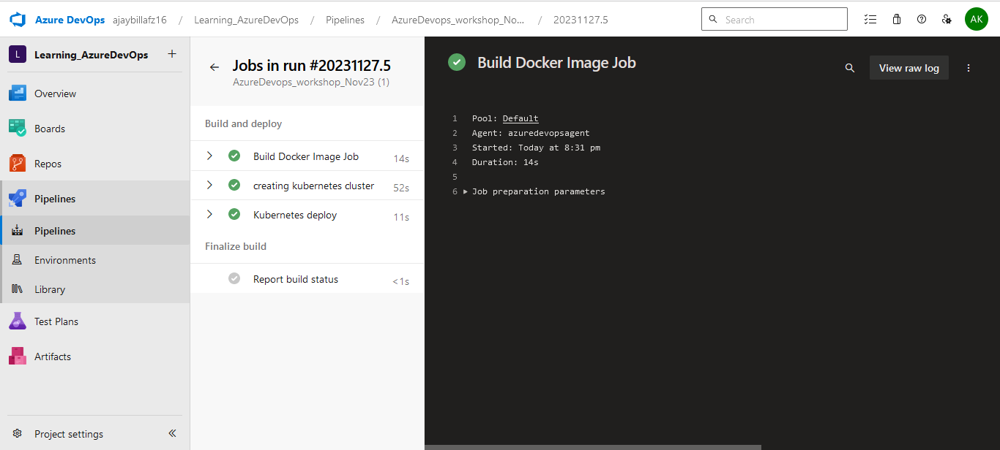

### What types of options we can implement for workshop
#### Infrastructure Wise:
* Static Infrastructure
* Dynamic Infrastructure

#### Technology Wise:
* Virtual Machine
* Cloud Platforms
* Containers
* App/Play Stores => frontend app and push to for customer to download => like swiggy and zomato

### what we are trying to do is Combinations of both:
* Virtual Machine Static Infrastructure


* Virtual Machine Dynamic Infrastructure


### Containerized Application Deployment:
* which we will be doing it.


### In Workshop:
* We will be deploying a containerized microservices into k8s cluster
* Options:
  * Kubernetes Cluster
    * AKS
    * EKS

* Container Registry
   * Docker Hub

* Security (ignored)
* unit testing (ignored)

### Setups
* git
* docker

```bash
cd /tmp
curl -fsSL https://get.docker.com -o install-docker.sh
sh install-docker.sh
sudo usermod -aG docker <username>
# exit and relogin
docker info
```

* terraform [Refer Here](https://developer.hashicorp.com/terraform/tutorials/aws-get-started/install-cli)

```bash
sudo apt-get update && sudo apt-get install -y gnupg software-properties-common
wget -O- https://apt.releases.hashicorp.com/gpg | \
gpg --dearmor | \
sudo tee /usr/share/keyrings/hashicorp-archive-keyring.gpg
echo "deb [signed-by=/usr/share/keyrings/hashicorp-archive-keyring.gpg] \
https://apt.releases.hashicorp.com $(lsb_release -cs) main" | \
sudo tee /etc/apt/sources.list.d/hashicorp.list
sudo apt update
sudo apt-get install terraform -y
```

* Ensure you have docker hub account
* Ensure cloud cli is installed
  * Install Azure CLI and configure azure cli [Refer Here](https://learn.microsoft.com/en-us/cli/azure/install-azure-cli)

  ```bash
  curl -sL https://aka.ms/InstallAzureCLIDeb | sudo bash
  az login
  ```

* Install AWS CLI and configure [Refer Here](https://docs.aws.amazon.com/cli/latest/userguide/getting-started-install.html) 

```bash
sudo apt update && sudo apt install unzip -y
curl "https://awscli.amazonaws.com/awscli-exe-linux-x86_64.zip" -o "awscliv2.zip"
unzip awscliv2.zip
sudo ./aws/install
```
---

### The Pipelines Which will working for Workshop:


### For Repository:
* refer this repository for `k8s yaml`,`docker file`,`terraform code` and `azure-pipelines.yaml`
   * [Refer Here](https://github.com/AjayWorkShop/AzureDevops_workshop_Nov23/tree/dev)

#### Pipelines:
* **Stage:1**
    * Building, Packaging and publishing the docker image
    * Docker container registry: yet to create after seeing the image         
* Structure:

* Commands to build docker image:

```bash
cd src
docker image build -t ajaykumarramesh/azuredevopsworkshopnov23:v1.0.0.
docker image push ajaykumarramesh/azuredevopsworkshopnov23:v1.0.0
```
* Note: every build should have a different tag value. we can use Build Id for this

* **Stage:2**
    *  Creating infrastructure using terraform

* ensure in the node kubectl is installed `az aks install-cli` or [Refer Here](https://kubernetes.io/docs/tasks/tools/install-kubectl-linux/)

#### AWS:
* Ensure AWS CLI is configured
* commands to execute terraform

```bash
terraform init
terraform apply -auto-approve
```

#### Azure
* Ensure Azure CLI is configured
* commands to execute terraform
```bash
cd deploy/tf_azure
terraform init
terraform apply -auto-approve
```

* **Stage:3**
    * Deploy the application into kubernetes cluster

* commands to execute kubernetes

`kubectl apply -f deploy/k8s`

* Note: during manual execution this command will fail

### Hints:
* Ensure your work done in this pipeline is reusable i.e. ideally you should be creating templates for every stage with parameters
---

## Actual Steps to Execute Above Workshop Plan:

### Step:1 
* create docker image 
  * under => [
AzureDevops_workshop_Nov23/src](https://github.com/AjayWorkShop/AzureDevops_workshop_Nov23/tree/dev/src)
  * create file called `index.html` 
  ```html
  <!DOCTYPE html>
  <html>
  <body style="background-color:powderblue;">

  <h1>This is a Azure DevOps Workshop</h1>
  <p>version: 1.0.0</p>
  </body>
  </html>
  ```  
 * add below content in the `Dockerfile` 

 ```Dockerfile
 FROM nginx
 ADD index.html /usr/share/nginx/html/index.html 
 ```

### Step:2
* create azure agent:
  * create azure VM with 2 cpus and 8 gb ram
  * configure azure agent for azure devops 
* install below required softwares:
  
```bash
sudo apt update
# install docker 
curl -fsSL https://get.docker.com -o install-docker.sh
sh install-docker.sh
sudo usermod -aG docker ubuntu
exit 
re-login
docker info
# install terraform
sudo apt-get update && sudo apt-get install -y gnupg software-properties-common
wget -O- https://apt.releases.hashicorp.com/gpg | \
gpg --dearmor | \
sudo tee /usr/share/keyrings/hashicorp-archive-keyring.gpg
echo "deb [signed-by=/usr/share/keyrings/hashicorp-archive-keyring.gpg] \
https://apt.releases.hashicorp.com $(lsb_release -cs) main" | \
sudo tee /etc/apt/sources.list.d/hashicorp.list
sudo apt update
sudo apt-get install terraform -y
# docker login or we can create service account in azure devops
docker login
username
password
# azure cli
curl -sL https://aka.ms/InstallAzureCLIDeb | sudo bash
# after executing the below command enter the code displayed on terminal to authenticate
az login
# Install kubectl
sudo az aks install-cli
```   

### Step:3
* create azure k8s cluster using terraform
  * already azure k8s cluster terraform code is written in the location [Refer Here](https://github.com/AjayWorkShop/AzureDevops_workshop_Nov23/tree/dev/deploy/tf_azure) just use in the `azure-pipelines.yaml`
* create azure storage account, azure container and azure backend to store the terraform state file.
  * we cannot create using terraform code so these all created manually 

### step:4
* login to azure agent which is created
* after login just cross check the manually resources will be created or not by executing all these commands
```bash
git clone https://github.com/AjayWorkShop/AzureDevops_workshop_Nov23.git
cd AzureDevops_workshop_Nov23/
git checkout dev
cd src
docker image build -t ajaykumarramesh/azuredevopsworkshopnov23:v1.0.0 .
docker image ls
docker container run -d -p 80:80 --name testnginx ajaykumarramesh/azuredevopsworkshopnov23:v1.0.0
docker container ls
# cross check and access application
http://<ip_address>:<port_no>
docker push ajaykumarramesh/azuredevopsworkshopnov23:v1.0.0
cd deploy/tf_azure 
terraform init
terraform apply -auto-approve 
# to get .kube file into our local 
az aks get-credentials --resource-group myAksResourceGroup --name myAKSCluster
kubectl get nodes
cd deploy/k8s/
kubectl apply -f deployapp.yaml
kubectl get all -n workshop
kubectl get pods -n workshop
# after created manual resources by these above commands needs to delete it 
terraform destroy -auto-approve
kubectl delete -f deployapp.yaml
```
### Step:5
* create repository in azure devops
  * navigate => repo => new repository => enter name of the repository => /AzureDevops_workshop_Nov23 => click create
* execute below commands in the local terminal to add repository which is created in azure devops 

```bash
git remote add ado https://ajaybillafz16@dev.azure.com/ajaybillafz16/Learning_AzureDevOps/_git/AzureDevops_workshop_Nov23
git remote -v
git push ado dev
# then refresh azure devops repo to get all the pushed 
```
* now create azure-pipelines.yaml file and push to azure repo to run the pipeline 
* and create pipeline in azure devops and run and check the all the resources has created or automated through azure devops pipelines
* azure-pipelines.yaml got success and created all the resources as expected



