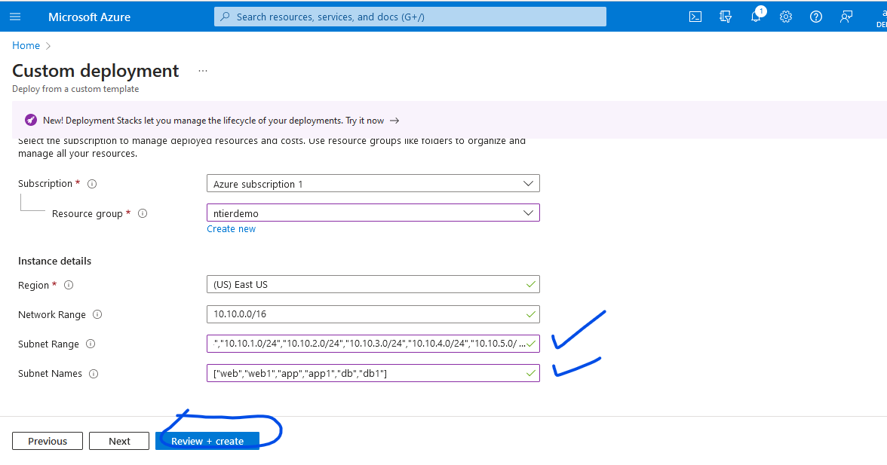
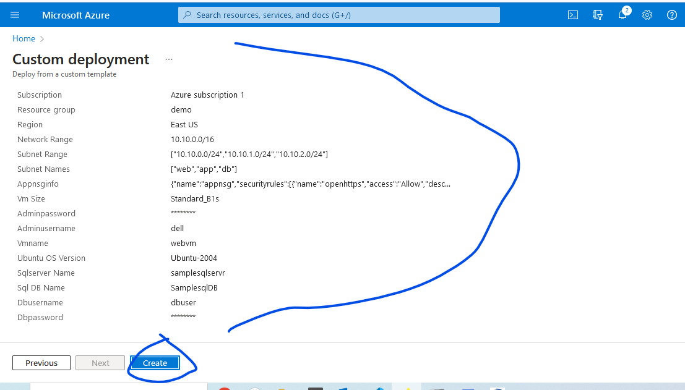

Infrastructure as Code
----------------------

* This is an approach of managing infrastructure where infrastructure is described in configuration files and then used to create the infra automatically.

* Tools:
   * Azure:
     * ARM Templates
     * Bicep
   * AWS:
     * Cloud formation     
  * Generic:
     * Terraform
* Advantages:
   * Reusability
     * managing multiple environments
   * Every change in infra is version controlled

Azure Resource Manager (ARM)
----------------------------
* This is the basis for Azure IaC Capabilities via ARM templates.
* Azure provides capabilities by Resource Providers which are registered to subscription.
* Resource Providers provide services and operations
* refer the below image


* When we are using Azure either from portal/CLI/Powershell/SDK we interact with Resource providers
* **Experiment:** Create a vm in Azure Portal.
  * After successful creation
    * Navigate to Resource Group => deployments
    
    * Select deployments and view template
    
    
* So when we create something from azure portal it is creating template.
* Azure CLI/Powershell and SDK directly interact with Management API of Azure cloud to create resources where as portal tries to create a template. 
* **Experiment:** Create a storageaccount in Azure Cli.  
```
az storage account create \
  --name experiemtntesting \
  --resource-group armdemo \
  --location eastus \
  --sku Standard_RAGRS \
  --kind StorageV2 \
  --allow-blob-public-access false
```
* Check this below screen shot storage account is created through azure cli

* Check this below screen shot of azure portal storage account has created in the same resources group where vm is created


* Observe this below screen shot, when we created storage account using azure cli, it has not created any template.


#### To create custom templates for our infrastructure we need to express infrastructure as a code using ARM/Bicep:
* ARM uses json
* ARM templates of syntax [Refer Here](https://learn.microsoft.com/en-us/azure/azure-resource-manager/templates/syntax)

* Workflow for creating infra as code:


* We use IaC Whenever we need to work with creating/modifying infrastructure on various environments 

ARM Templates
--------------
* Template is used to Create infrastructure. This template can be applied at multiple levels
   * Resource Group Deployment
   * Subscription Deployment
   * Management Group Deployment
   * Tenant Deployment

* ARM Template is a json file [Refer Here](https://learn.microsoft.com/en-us/azure/azure-resource-manager/templates/syntax#template-format) for the basic structure of Json file

```Json
{
  "$schema": "https://schema.management.azure.com/schemas/2019-04-01/deploymentTemplate.json#",
  "languageVersion": "",
  "contentVersion": "",
  "apiProfile": "",
  "definitions": { },
  "parameters": { },
  "variables": { },
  "functions": [ ],
  "resources": [ ], /* or "resources": { } with languageVersion 2.0 */
  "outputs": { }
}
```
* In the above Json file basic structure not every field is required.
* At a Bare minimum template filed is required is below:
```Json
{
    "$schema": "https://schema.management.azure.com/schemas/2019-04-01/deploymentTemplate.json#",
    "contentVersion": "",
    "resources": [  ]
}
```

ARM Template – Ways of Working
------------------------------

* Make a list of manual steps required to create infrastructure
* For each step try to figure out what are the inputs

### Demonstration – Ways Of Working
#### Manual Steps:
  * Create a virtual network
     * inputs:
        * resource group
        * virtual network name
        * address space

### ARM Template
 * For writing the template lets use visual studio code and ensure
    * Azure CLI is installed on local terminal
    * Azure resource Manager Extension is installed in visual studio code
    
* for arm templates reference [Refer Here](https://learn.microsoft.com/en-us/azure/templates/) and for virtual network in arm template [Refer Here](https://learn.microsoft.com/en-us/azure/templates/microsoft.network/virtualnetworks?pivots=deployment-language-arm-template)
  * scroll to resources you want to create 
    * click on service you want to create
    
    * under service click on resources you want to create
    
* [Refer Here](https://github.com/codesquareZone/ARMZone/commit/55d26e06901d40b66cb6a9dfc67cf2d07ef1d68e) for virtual network arm template json file

#### Deploy arm template which written above
* Create a resource group

* Now create template to deploy virtual network


* Now copy and paste ur template to create

* Review and create

* virtual network resource has created successfully


### Architecture of the application
* which will be creating through arm template
* overview


* Manual Steps:
  * Create a network and 3 subnets
  
  
  
  

#### Using ARM Templates to create the virtual network with 3 subnets
  * Resources to be created are: 
    * virtual network
    * 3 subnets
* [Refer Here](https://github.com/codesquareZone/ARMZone/commit/1f4fdd4cf92eef84f48d3a32d8b4ab1b32345504) for ntier template for virtual network with 3 subnetes json file
##### Deploy the arm template for virutal network with 3 subnetes


* Successfully created virtual network and 3 subnets


Experiment
----------

### Change 1: I want to make a change which will create this network in the resource group’s location rather than this network is creating in the east us always which is mentioned in the location field

* So for this option to use, we will use the ARM Templates Functions [Refer Here](https://learn.microsoft.com/en-us/azure/azure-resource-manager/templates/template-functions)
* In ARM Templates Functions, there is a function called as resourceGroup which we will use the option [Refer Here](https://learn.microsoft.com/en-us/azure/azure-resource-manager/templates/template-functions-scope#resourcegroup)

* Lets us deploy arm template to see change:1
  * [Refer Here](https://github.com/codesquareZone/ARMZone/commit/5549a8fc6e0d48a85e4a883e572d854f28a8d7a5) for json file adding resource location
  
  
  * Now it has not done anything since resource group is in east us, so the first change has evident.
  
  

### Change 2: I want to give an option to the user to set address space for network and also for 3 subnets address space
* To acheive this i should be using parameters [Refer Here](https://learn.microsoft.com/en-us/azure/azure-resource-manager/templates/parameters)
* ARM Templates support the following Data types [Refer Here](https://learn.microsoft.com/en-us/azure/azure-resource-manager/templates/data-types)
  * array
  * bool
  * int
  * object
  * secureObject
  * securestring
  * string

* Lets us deploy arm template to see change:2
  * Note: here we can use type string or array, both examples are in one json file 
  * [Refer Here](https://github.com/codesquareZone/ARMZone/commit/5f5245eef056c53ccf3c88817be1d7e99ac0db6a) for parameters for subents json file
  
  * Now observe here address space we got is default so now user has option to change it
  
  * now we have changed to custom address space
  
  * now check the network range and also subnet range which is created
  
  

### Change 3: Create subnets depending on the variable passed
* and also v-net is a parent and subnets are creating with in a parent, like a child, so we needs to write subnets into different block 
* The following example shows the child resource outside of the parent resource. You might use this approach if the parent resource isn't deployed in the same template, or if want to use copy to create more than one child resource.
   * [Refer Here](https://learn.microsoft.com/en-us/azure/azure-resource-manager/templates/child-resource-name-type) for better understanding of parent child
* [Refer Here](https://github.com/codesquareZone/ARMZone/commit/d0fdbab8d616c0c88a2f2a7f46904fe9b5f4372d) for the subnets as outside the parent resources rather than with in network resource and within in the parent resources json file


* observe the below screen shot benefits of parent and child creating arm template is order of creation resources


* **Resource iteration in ARM templates:**
* Now lets implement resource iteration using copy loop
  * by using this copy loop we can create multiple subnets or can make our subnet creation dynamic
  * [Refer Here](https://learn.microsoft.com/en-us/azure/azure-resource-manager/templates/template-functions-string#format) format function 
* Lets deploy dynamic subnet creation
* [Refer Here](https://github.com/codesquareZone/ARMZone/commit/6cf0baf7fa6b741123383f7c27ce4b811ad8545f) for subnet creation depending on the subnet cidr ranges passed as dynamic values 

* observe here we have added 6 subnets and 6 subnets names as dynamic 

* check this below screen shot, order of creation since it is parent and child block and also we have added copy loop and formate function so as per our dynamic value we have passed based on that subnet and names created


* **Resource Id:**
   * every resource has been created will have the unique resource id, so it identify even using this resource id. [Refer Here](https://learn.microsoft.com/en-us/azure/azure-resource-manager/templates/template-functions-resource#resourceid) 

* **Depends On:**
    * This defines order of creation resources


### Change – 4: Add network security group with static rules
* [Refer Here](https://learn.microsoft.com/en-us/azure/templates/microsoft.network/networksecuritygroups?pivots=deployment-language-arm-template) for networkSecurityGroups static rules
* Create a network security group for web,
  * open all outgoing connections
  * incoming:
     * Allow 443 tcp port => https
     * Allow 80 tcp port => http
     * Allow 22 tcp => ssh
* **Manual steps:**
  * [Refer Here](https://learn.microsoft.com/en-us/azure/virtual-network/manage-network-security-group?tabs=network-security-group-portal) 
* Lets Deploy arm template for static security rules
   * [Refer Here](https://github.com/codesquareZone/ARMZone/commit/568b24a83edd2913563419080bc1ad080a957fd9) for nsg inbound security rules json file
   * static network security groups created for web
   
   

### Change -5: Try to make changes in network security group with dynamic rules
* [Refer Here](https://learn.microsoft.com/en-us/azure/templates/microsoft.network/networksecuritygroups/securityrules?pivots=deployment-language-arm-template#resource-format-1) for networkSecurityGroups/securityRules dynamic 
* Lets try to create dynamic network security group for app
  * open all outgoing connections
  * incoming
     * Allow 22 tcp => ssh
     * Allow 443 tcp port => https
* Lets Deploy arm template for dynamic security rules
* [Refer Here](https://github.com/codesquareZone/ARMZone/commit/ac76e6bf774aacf49e7d7c3de1b560ada7f2adc0) for dynamic security rules json files 
* dynamic network security groups created for app


### change-6: Create a nic with public ip, 
* Overview


* [Refer Here](https://learn.microsoft.com/en-us/azure/templates/microsoft.network/publicipaddresses?pivots=deployment-language-arm-template#resource-format-1) for public ip address
* [Refer Here](https://learn.microsoft.com/en-us/azure/templates/microsoft.network/networkinterfaces?pivots=deployment-language-arm-template) for network interface
* Lets deploy arm template for nic with public ip 
* [Refer Here](https://github.com/codesquareZone/ARMZone/commit/9ae07e2dbd7d862987b9db6c13fa92197d8f14c6) for nic with public ip dynamic way json file
* created nic and web public ip

* Lets use variables, to avoid using multiple times of same name/value or if we use same name multiple times we can create variables
  * [Refer Here](https://learn.microsoft.com/en-us/azure/azure-resource-manager/templates/syntax#variables)
* [Refer Here](https://github.com/codesquareZone/ARMZone/commit/3f4cc311c5a15142a2837f61c17b48c81bc1d457) for variables to create above nic and public json file


### Change-7: Create a parameters files with values
* to keep our parameters in different files and easily we can change the values 
* like how we do in terraform keeps our tf.vars files separate to change the value similar way 
* [Refer Here](https://learn.microsoft.com/en-us/azure/azure-resource-manager/templates/parameter-files) official for docs on paramters file
* to create parameters files we have option in the json template file follow that.
* Lets deploy arm template with parameters file


* we have uploaded two files one is resource and another is parameters file, now resources has created


### Change – 8: Add web vm
* vmimage: ubuntu 22.04
* subnet: web
* [Refer Here](https://learn.microsoft.com/en-us/azure/templates/microsoft.compute/virtualmachines?pivots=deployment-language-arm-template) for virtual machine resource
* Lets deploy arm template for web vm with parameters file
* [Refer](https://github.com/codesquareZone/ARMZone/commit/61c4d577a0459371ceb77989af8bd0338b464ed7) for parameters and vm json file

* vm has created successfully
 
* lets login into created vm
 

### Change – 9: Add database
* [Refer Here](https://learn.microsoft.com/en-us/azure/azure-sql/database/single-database-create-arm-template-quickstart?view=azuresql) for sql database manual creation
* [Refer Here](https://learn.microsoft.com/en-us/azure/templates/microsoft.sql/servers?pivots=deployment-language-arm-template) for sql server resource
* [Refer Here](https://learn.microsoft.com/en-us/azure/templates/microsoft.sql/servers/databases?pivots=deployment-language-arm-template) for sql server database resource
* Lets deploy arm template for sql server and sql db creation
* [Refer Here](https://github.com/codesquareZone/ARMZone/commit/c61a40724bf105ab5d25df1f0d72fefa9cf830ee) for sql server and sql db json file


* created sql server and sql db 


Azure Bicep
-----------

* Bicep is a Domain specific language that uses declarative syntax to deploy Azure resources
* Bicep [Refer Here](https://learn.microsoft.com/en-us/azure/azure-resource-manager/bicep/overview?tabs=bicep) for official docs
* Install bicep extension into visual studio code [Refer Here](https://marketplace.visualstudio.com/items?itemName=ms-azuretools.vscode-bicep)
* [Refer Here](https://learn.microsoft.com/en-us/azure/azure-resource-manager/bicep/parameters) Parameters and variables in Bicep

### Sample network Bicep template
* two bicep template has been written with two different sytle of parametes 
* [Refer Here](https://github.com/codesquareZone/BicepZone/commit/5397a8ac483022f5c1a68ded1523dd5d5c47cd94) for bicep sample network template with object style of parameters
* [Refer Here](https://github.com/codesquareZone/BicepZone/commit/b09ce5d925e61f8dbc6cf2486272da989bf5104b) for bicep sample network template with object and string style of parameters 


