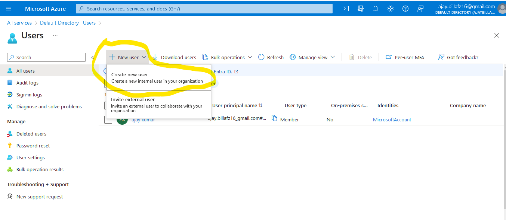
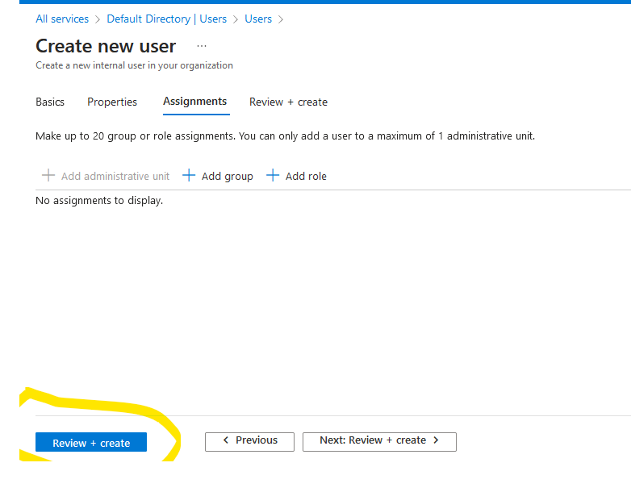
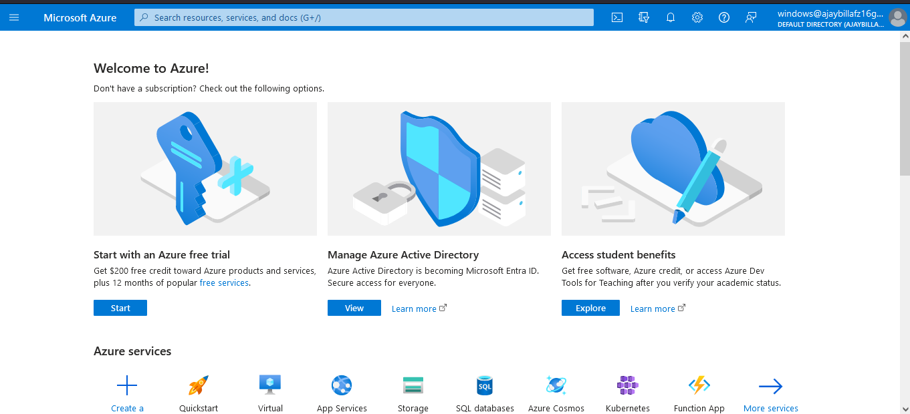
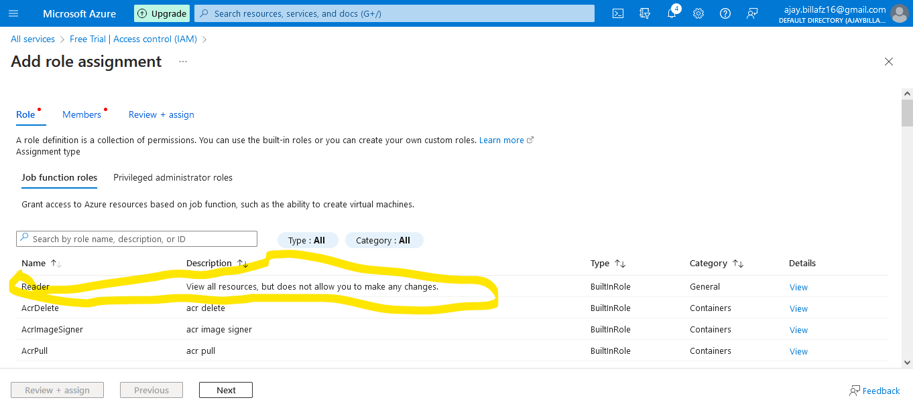
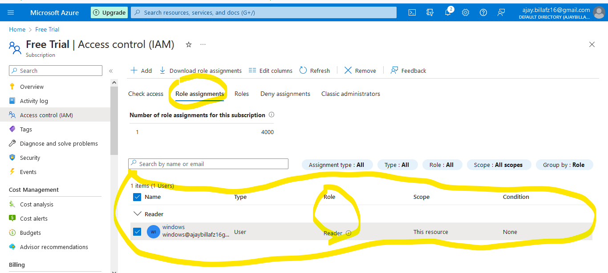
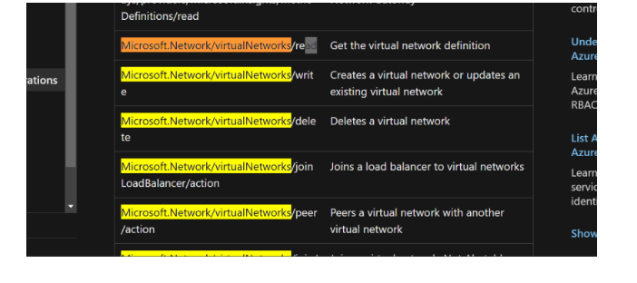

# Identity Use Cases of Azure

## Authentication & Authorization:

* **Authentication:**
  
   * is basic identity information to enter into some system
   * Authentication is a where we can access someone resource or service in the system or their account


* **Authorization:**

  * is about the specifics of what is allowed and what is not.
  * after accessing someone's system or account what resource or service we can access is known as Authorization
  

Azure Free Account Opening Link:
---------------------------------
* [Refer Here](https://azure.microsoft.com/en-us/free/)


Tenant:
-------

* when we create account tenant will create and tenant will manage the users device and groups 
* Tenant will have all the user information
* Tenant i.e. Azure Active Directory (AAD) manages users, devices and Groups

* Azure Account will have subscriptions. A subscription will be linked to a tenant during creation
* Since Tenant manages user information, if we need users from different domains to be logged into azure, we sync/federate Tenant to other identity system. The most popular system for managing users on-premises is microsoft active directory.
* every tenant has tenant id then only azure will know which tenant will you speak about 
* every tenant id will have primary domain 

* when we create azure account default active directory/tenant will be created
* each tenant will have unique tenant id and primary domain `<name>..onmicrosoft.com`  
* every user created will have one id called `<username>@<primarydomain>` 
  * in my case below:
  ```
  admin@ajaybillafz16gmail.onmicrosoft.com
  ```
* We can map our organization domain name by doing some extra steps (will bw discussed later) like below
```
Change from => admin@ajaybillafz16gmail.onmicrosoft.com
To => admin@force1alliedservices.com
```

Subscriptions:
-------------

* Azure Account will have subscriptions and subscriptions will have resource groups and any resource which we created has to be part of some resource group
* subscriptions will have resource group
* subscriptions will be linked to tenant
* subscriptions will have only one tenant not more then that 
* different subscriptions have same tenant. but same subscriptions will not have more then one tenant it is not valid.
* one azure account can have multiple subscriptions 
* account should be fully operate means person should have tenant as well as subscriptions other unable to see resources or service to work with it or create anything 

Active Directory:
------------------

* microsoft has active directory which stores all the information about users, devices ect:-

* for an examples if i want to give access to infosys 50k employees connection to my azure account then i can have connection between azure active directory i.e(tenant) and infosys active directory so that they can login into my azure account.they can login with their user id and password.it will synchronization/federated.

* 


Azure AD Use cases:
--------------------

* User, Group management
* Importing users from existing identities
    * Azure AD Sync/Federation
* Managing RBAC(Roll Back Access Control) means giving what ever access to the particular groups or individual
  * Management Group
  * subscription
  * resource group level
  * resource level
* Other
    * pricing models of azure ad


# Lets Create User in Azure:

* Navigate to azure active directory 
* Lets create user called as `windows`


* Select user and click on new user and create user


* Fill the details below and click on next:properties


* Not required to fill anything since it is just trial in our organization we have to fill all the details
click on next:assignment


* Not required to fill click on Review:create


* Click on create


### After created azure account above screen shots:

* The user principle name is `windows@ajaybillafz16gmail.onmicrosoft.com`
* Now open a different browser of launch inprivate/incognito and navigate to portal.azure.com
* login and check to understand better



* user is created and shaded with yellow pen
* now it is authenticate to azure account but not authorization, and there is no subscriptions it is empty
* 

* IN Azure the permission given at subscription level drills down to all resource groups and resources and the permissions given to the resource group applies to all resources in resource group

* We can apply permission as of now at
  * subscription level
  * resource group level
  * resource level
* by giving read permissions at subscription level

* Now lets give authorization permission for above user
logging into my owner account 
  * By navigating to `subscription` > `Select my Subscription` `> select Access Control` > `Like below screen shot`
  *  

* `Add Role Assignments`


* `Selected members to give access`




* Now login as windows user
* windows user has subscriptions with that he has resource group but only has read/view permission but he is unable to delete anything below screen shot proves it. this is known as authorization

* As we have experimented this user has only read permissions above screen shot.
* now lets give permission to this user on resource group `sample`
* Login in as owner account, Navigate to resource group

* Now lets check access for windows user


# Subscription giving permission through `Resource Providers` and `Resource Types`

* Authorization in Azure is acheived by Role assignment to user principal
* Exact Permissions at subscription/resource group/resource level is set by Role and Microsoft has pre-defined roles

* **Azure organizes resources in the following way:**
  * Every subscription will have resource providers which provide resource types and actions.
  * New updates will lead to new API Versions
  * **Azure resource providers and resource types to check in portal refer below link:**
       * [Refer Here](https://learn.microsoft.com/en-us/azure/azure-resource-manager/management/resource-providers-and-types)

* When we want to give permissions we need to know resource type and actions.
* Match Service to resource provider [Refer Here](https://learn.microsoft.com/en-us/azure/azure-resource-manager/management/azure-services-resource-providers)   
* Figure out operations by resource provider [Refer Here](https://learn.microsoft.com/en-us/azure/role-based-access-control/resource-provider-operations)

Find operations to create, view and update virtual networks:
---------------------------------------------------
* Find the provider
* [Refer Here](https://learn.microsoft.com/en-us/azure/azure-resource-manager/management/azure-services-resource-providers) and search for service
* Now Find the resource Type `Microsoft.Network/virtualNetworks`
* Now search for operations in the following page [Refer Here](https://learn.microsoft.com/en-us/azure/role-based-access-control/resource-provider-operations)
* 


