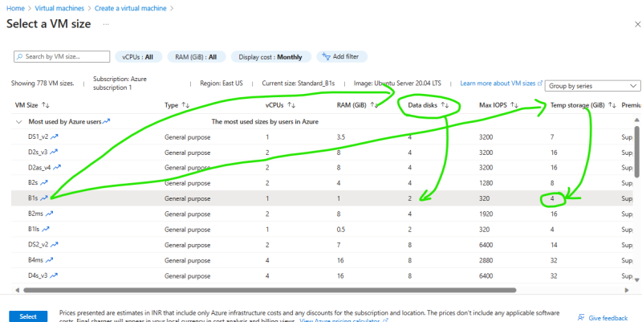
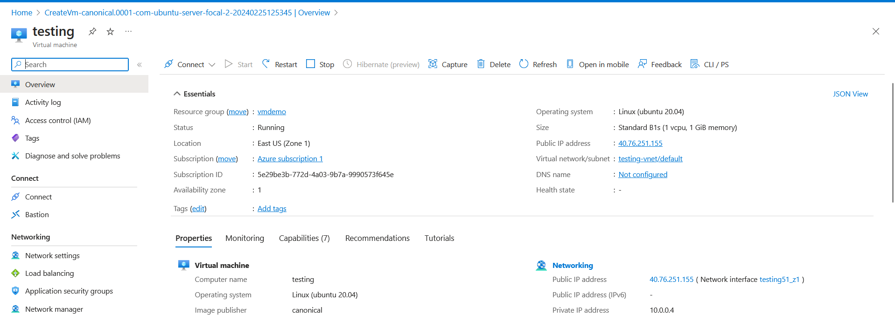

Virtualization
---------------
* Overview of Virtualization


### Cloud
* Cloud is all about using someone else’s hardware
* We have discussed about regions, zones and datacenters
* Types of Cloud
   * Public cloud
   * Private Cloud
   * Hybrid Cloud
   * Community Cloud
   * Multi Cloud

### Public Cloud
* Here we will have Cloud Services Provider (CSP) like Azure, AWS, GCP owning infrastructure (Regions, Zones, Datacenters) and Cloud service Consumers creating accounts and using services

* Service:
   * What cloud offers
   * Here CSP has ownership
* Resources:
   * What we create
   * Here consumers have ownership

### Cloud Services Provider
* Azure is a Public cloud services provider
* They organize the infrastructure across
   * Region
      * Zones
         * Datacenters
             * Racks
                 * Server
      * Datacenters
           * Racks
              * Server
                  

* Explore Globe of Azure [Refer Here](https://datacenters.microsoft.com/globe/explore) 
* data center tour [Refer Here](https://news.microsoft.com/stories/microsoft-datacenter-tour/)


IaaS vs PaaS vs SaaS
---------------------

* Overview


Azure Compute Services
----------------------
* Choosing the Right Azure Compute Service


* IaaS:
   * Azure Virtual Machines
   * Azure Virtual Machine Scalesets

* PaaS:
   * Azure App Services
   * Azure Spring Apps
   * Azure Kubernetes Services
   * Azure Container Instances

* FaaS:
   * Azure Functions

Billing
--------
* Azure charges for services
  * Unit of time: generally hourly in few services its second
  * If you give long term commmitment ( 1 year or 3 years) we get extra discounts (Azure Reservations/Azure Service Plans)
  * To make revenue out of free hardware they run some auction kind of model (Azure Spot Instances)


Azure Account
-------------
* Our Accounts: Free tier
   * [Refer Here](https://azure.microsoft.com/en-us/free/) for Azure Free tier

* Enterprise Accounts


Ways of Working in Azure
------------------------
* We have 3 major ways of accessing azure
    * From Browser (Portal)
    * From Command Line (Azure CLI)
    * From Templates (IaC/ ARM Templates/Azure Bicep/ Terraform)

### Quick Start: Create a Linux Virtual Machine
* [Refer Here](https://learn.microsoft.com/en-us/azure/virtual-machines/linux/quick-create-portal?tabs=ubuntu) for Azure Quickstart


Azure Virtual Machines
----------------------

* This is a service offered by Azure to create virtual machines
* Internally Azure Virtual machines depend on other components
* For any virtual machines at a bare minimum we need to configure the below details
   * Virtual Machine Images: Azure has three types of images
      * OS images
      * Market place
      * Custom images

   * Network
   * Disk
   * Location
   * Size


* We have created a Virtual machine and then the Resource visualizer image is as shown below


### Azure Virtual Machine has 3 types of disks
* OS Disk:
  * Non Ephemeral i.e. Disk contents will be available even after deleting virtual machine
  * This disk contains OS
* Data Disk
  * Non Ephemeral i.e. Disk contents will be available even after deleting virtual machine
  * This disk contains contents other than OS
* Temp Disk:
   * Ephemeral Storage i.e. Disk contents will be wiped once the vm is shutdown

* Temp Disk Size is based on VM Size and Number of Disks which can be attached to vm are also dictated by vm size


### Credentials
* Linux:
   * Username and Password
   * Username and key
* Windows
   * Username and Password

* Key: Azure has a service where you can create private key and public key, called as (key pair) or import your existing keys.

#### upload public key to azure cloud
* in this case we have to create key pair in our local terminal by using `ssh-keygen` command then private key we will have in our local terminal location called `~/.ssh/id_rsa` and public key `~/.ssh/id_rsa.pub` we will upload in the azure cloud
* **Steps:**


### To generate new key pair from azure cloud
* in this case We can get the private key from Azure and we can download to our system, and safety is our responsibility because once we lost the key it is not possible to recur it.


* In this case public key is with azure under ssh keys

* private key is in my local system under location downloads


### Login into vms
* Windows:
   * RDP (Remote Desktop Protocol): Gives visual interface to work with windows from remote
     * command mstsc -v <ipaddress>
     * port: TCP 3389
* Linux
   * SSH (Secure Shell): Gives shell interface /terminal access to work with linux vms
      * command
         * with username and password ssh username@ipaddress
         * with username and key ssh -i <path to private key> username@ipaddress
      * port: TCP 22
* Note:
    * If your vm is created with key and if you execute ssh username@ipaddress it checks for the key in ~/.ssh/id_rsa


### Tags
* When we create any resource we can tag the resources.
* Tagging is helpful for
   * querying resources
   * filtering bills
* Whenever you create any resource atleast have these tags
```
project: learning
env: dev
purpose: learning
```


### Create linux vm with username and password


* Login into vm
   * Option:1 
   
   * Option:2
   * while login into linux vms, if we dont provide username then it will take systems current username but this doesn't work in powershell only linux or gitbash


### Create linux vm with username and key


* Login into vm
  * Option:1 
  
  * Option:2
  
  * Option:3
  

### Create windows server and login into
* this demo i am not doing it since i know the steps.


Virtual Machines
----------------
* Virtual Machine Life Cycle (States): This is for on-demand instances.[Refer Here](https://learn.microsoft.com/en-us/azure/virtual-machines/states-billing#power-states-and-billing)

* In Azure when we stop the vm from portal or from azure cli we are deallocating

Azure Virtual Machine connectivity
----------------------------------
* In the last session we had spoken about ssh and rdp
* Azure portal allows to connect to Azure VMS using many ways
   * Native SSH or RDP
   * SSH using Azure CLI
   * Bastion


#### Azure Bastion:
* Bastion is considered to be safe as we need not expose RDP and SSH Ports to all ips


* Enterprise Clients/companies prefer using Bastion for connecting vms’s securely
* Two options in creating bastion 
   * Option:1
      * we can enable azure bastion while creating vnet
      * so that by default it will create `AzureBastionSubnet` and while in azure portal under vms it allow us to login in bastion tab
      
   * Option:2
      * after creating vm then under bastion tab we need click deploy bastion so that it will create `AzureBastionSubnet` and allow us to use bastion.
         

### Azure Virtual Machine – Extra’s Features
* Reset Passwords in Virtual Machine

* We can run the commands in Azure VMs without login into vm's through portal by using using run command if we have administrator rights.


* Azure Vms have agents which make this possible, means all the task like, reset password, connect and run script, etc: many more...
* Auto Shutdowns:
  * this enable automatic shutdown the vm's on Scheduled time
  


Virtual Machine Sizes
----------------------
* VMs are categoriezed by purpose which is referred as type [Refer Here](https://learn.microsoft.com/en-us/azure/virtual-machines/sizes)

* Each virtual machine which we create will be from some physical server
* Azure Vm size naming convention [Refer Here](https://learn.microsoft.com/en-us/azure/virtual-machines/vm-naming-conventions)
* Note: We can create a Azure vm with one size or type and then resize to other size (type)


### Resize Vm
* Lets create vm with size `Standard B1s`


* Now Resize vm to to `b1ls`


* Changing the size of virtual machines is referred as vertical scaling.
* Lets look at two term of vm's size:
   * scale up and scale down (Vertical scaling) means changing the configuration of vms' 
   * scale in and scale out (Horizontal scaling) means increase number of vm's

* Every Vmsize in Azure dictates the following
   * Family (Subfamily)
   * Additive
   * Number of cpus
   * RAM size
   * Data Disk count
   * Temp Disk size
   * Max IOPS (Disk speed max)
* Price of virtual machine
   * price of vm size
   * price of disk
   * price of public ip
* [Refer Here](https://azure.microsoft.com/en-in/pricing/calculator/) for pricing calculator
* Virtual machine selector [Refer Here](https://azure.microsoft.com/en-us/pricing/vm-selector/)


### Activity
* Create a ubuntu linux vm with 22,80 (ssh,http) port
* ssh into the vm and execute the following
```bash
sudo apt update
sudo apt install apache2 -y
```


* We can use user data. User data executes after the vm creation. To use user data use the Advanced tab and select user data and enter the following
```bash
#!/bin/bash
apt update
apt install apache2 -y
```


* access from browser http://publicip

* Custom data allows us to use cloud-init which is a yaml file [Refer Here](https://cloudinit.readthedocs.io/en/latest/reference/examples.html) for more [Refer Here](https://learn.microsoft.com/en-us/azure/virtual-machines/custom-data) azure official docs


### Azure vm extensions
* we can install extension for both linux and windows machine 
* [Refer Here](https://learn.microsoft.com/en-us/azure/virtual-machines/extensions/overview) for official docs


* Even we can install extension Create a virtual machine.


### Azure VM Applications
* [Refer Here](https://learn.microsoft.com/en-us/azure/virtual-machines/vm-applications?tabs=ubuntu) for official docs

### Azure Compute Gallery
* [Refer Here](https://learn.microsoft.com/en-us/azure/virtual-machines/create-gallery?tabs=portal%2Cportaldirect%2Ccli2) for creating a gallery
* TBD: We will be using compute gallery to store vm images


### Azure Instance metadata service
* by using IMS we can get information about vm's, incase if we dont have to access to cloud portal, information like which region, which cloud etc:
* this api service is given by all the cloud to get information for our vm's
* [Refer Here](https://learn.microsoft.com/en-us/azure/virtual-machines/instance-metadata-service?tabs=linux) for official docs


### Activity:
#### Network Security Groups
* Network security groups are attached to nic and they have allow or deny rules

* As per above image we needs to create resource in azure using azure cli interface

### Virtual Machine Creation
* Required:
    * Resource Group
    * Virtual Network and subnet
    * Network security group
    * Network interface
    * Virtual machine

### Azure CLI
* Azure CLI is a command line way of interacting with azure cloud/resource creation
   * [Refer Here](https://learn.microsoft.com/en-us/cli/azure/install-azure-cli) azure cli installation
```
# install azure cli through chocolatey
choco install azure-cli
# authenticate with azure cloud
az login 
```   
* Login is success below screen shot


### How to find Azure cli commands to create all the resources in azure cloud
* Navigate to [Refer Here](https://learn.microsoft.com/en-us/cli/azure/) 
  * And click on reference or ctrl find and search the resources to create
  
* Ensure Azure CLI Extension is installed in visual studio code
  * so that this will help us in writing azure cli commands while creating resource in vscode

* starting the file with extension `.azcli` while we writing the resource so that azure cli will help us. 

### Experiment:
* **Steps:**
* create a resource group

  `az group create --location "eastus" --name "vmdemo"`
  
  
* Create a virtual network

  `az network vnet create --name "vmnet" --resource-group "vmdemo" --address-prefixes "10.0.0.0/16"`
  
  
* Create a subnet
```
az network vnet subnet create `
--name "web" `
--resource-group "vmdemo" `
--vnet-name "vmnet" `
--address-prefixes "10.0.0.0/24" 
```  


* Create a network security group

  `az network nsg create --name "webnsg" --resource-group "vmdemo" --location "eastus"`


* Create a rule to open 80 port to every one
```
az network nsg rule create `
 --name "AllowHttp" `
 --nsg-name "webnsg" `
 --priority 300 `
 --access "Allow" `
 --resource-group "vmdemo" `
 --source-address-prefixes "*" `
 --destination-address-prefixes "*" `
 --destination-port-ranges "80" `
 --direction "Inbound" `
 --protocol "Tcp" `
 --source-port-ranges "*"
```


* Create a rule to open 22 port to every one
```
az network nsg rule create `
 --name "AllowSSH" `
 --nsg-name "webnsg" `
 --priority 310 `
 --access "Allow" `
 --resource-group "vmdemo" `
 --source-address-prefixes "*" `
 --destination-address-prefixes "*" `
 --destination-port-ranges "22" `
 --direction "Inbound" `
 --protocol "Tcp" `
 --source-port-ranges "*"
```


* Create a nic with only private ip attached to web subnet with webnsg
```
az network nic create `
    --name "webnic" `
    --resource-group "vmdemo" `
    --location "eastus" `
    --vnet-name "vmnet" `
    --subnet "web" `
    --network-security-group "webnsg"
```  


* Create a vm
```
az vm create `
    --name "webvm" `
    --resource-group "vmdemo" `
    --location "eastus" `
    --admin-password "azureuser@123" `
    --admin-username "dell" `
    --nics "webnic" `
    --image "Ubuntu2204"
```


* Now over all resources is created

* Now after examining the created resource just delete it
* Delete all the resource by deleting resource group

  `az group delete --name "vmdemo"`


* **Create a reusable script to create:**
  * for above created resource through azure cli
* **We have create a script with variables:**
   * [Refer Here](https://github.com/codesquareZone/AzureCliZone/commit/9af4de48429c27c5108fa8adf44026ff02da31c8) for azure cli script to create resources
* Now execute this above script in the azure cloud shell
```
git clone https://github.com/codesquareZone/AzureCliZone.git
cd AzureCliZone/
chmod +x azurecli.sh
./azurecli.sh
```     
* just few lines of screen shot i have posted here for an reference 

* After executed above script in the azure cloud shell, all te resource has been created in azure cloud


* **To make this script to display the message for users:**
  * Like if resource is already `exists`, not to create the resources
  * Like if resource is `doesn't exists`, then it should create resource
* [Refer Here](https://github.com/codesquareZone/AzureCliZone/commit/f3a869e3cbff96541667695791368cecfcd2394d) for azure cli script if else 


* **References:**
   * Azure CLI Bash [Refer Here](https://learn.microsoft.com/en-us/cli/azure/azure-cli-learn-bash) 
   * Bash cheatsheet [Refer Here](https://devhints.io/bash)

### Create positional parameters/arguments 
* script to create resources in azure using azure cli with positional parameters
* [Refer Here](https://github.com/codesquareZone/AzureCliZone/commit/520e76f6ab456bf1a12affc36aade4f961d02c59) for positional parameters scripts


### keyword arguments scripts
* script to create resources in azure using azure cli with keywords arguments
* [Refer Here](https://github.com/codesquareZone/AzureCliZone/commit/6cfddbc89cfab2e5af05a5157b77d1e35d24ff11) for keyword arguments azurecli script


Azure Powershell
----------------
* Azure Offers command line capabilities over powershell
* Powershell will have cmdlets which will be in the form of `verb-noun` eg:- `New-Item` or `Get-Process`
* [Refer Here](https://learn.microsoft.com/en-us/powershell/azure/install-azps-windows?view=azps-11.3.0&tabs=powershell&pivots=windows-psgallery) Install Azure PowerShell on Windows
* [Refer Here](https://learn.microsoft.com/en-us/azure/virtual-machines/linux/quick-create-powershell) for powershell to create a linux vm

* Basic Commands
```
Get-Command
Get-Help
Get-Help Get-Acl -online
Get-Help Get-Process -online
Get-Process | Where ProcessName -eq Notepad
Get-Process | Where ProcessName -eq Notepad | Stop-Process
Get-AzResourceGroup | Where Location -eq eastus | Select ResourceGroupName
Get-AzResourceGroup | Where Location -eq eastus
Get-AzResourceGroup | Select ResourceGroupName
Get-Help New-AzResourceGroup -online
Get-Command '*-AzVirtualNetwork'
Get-Help New-AzVirtualNetwork -online
Get-Help New-AzVM -online
Get-Credentials
Remove-AzResourceGroup -Name myvm
```

* To Authenticate azure cloud from local powershell
```
Connect-AzAccount
```
* Then authenticate login into your azure account


### Activity:
#### Lets create linux vm in azure powershell
* [Refer Here](https://github.com/codesquareZone/AzureCliZone/commit/a3e51c445e4ced9f30bde1f053fc5f2f2b504139) for powershell commands to create resource in azure
* copy this script and paste into powershell, it will ask for credentials provide it, it will create the resources in azure
* Output in powershell after executing powershell commands

* Created resources in azure 


### To create virtual machine in azure using powershell
* [Refer Here](https://learn.microsoft.com/en-us/powershell/module/az.compute/new-azvm?view=azps-11.3.0) for official docs
* in above url just execute one command it will create virtual machine in azure
```PowerShell
New-AzVM -Name commandVm -Credential (Get-Credential)
         or
New-AzVM -Name MymVm -Credential (Get-Credential) -SecurityType "Standard"
```
* This example script shows how to create a virtual machine. The script will ask a user name and password for the VM. This script uses several other cmdlets.


Azure Vm creation
-----------------
* Create a ubuntu linux vm and install the following
```bash
sudo apt update
sudo apt install apache2 stress -y
sudo apt install php libapache2-mod-php php-mysql -y
```
* Create a file at /var/www/html/info.php with following content
```php
<?php
phpinfo();
?>
```
* Access the `http://publicip/info.php`
* Big Picture for Horizontal Scaling with Zero down time deployments


