Virtualization
---------------
* Overview of Virtualization
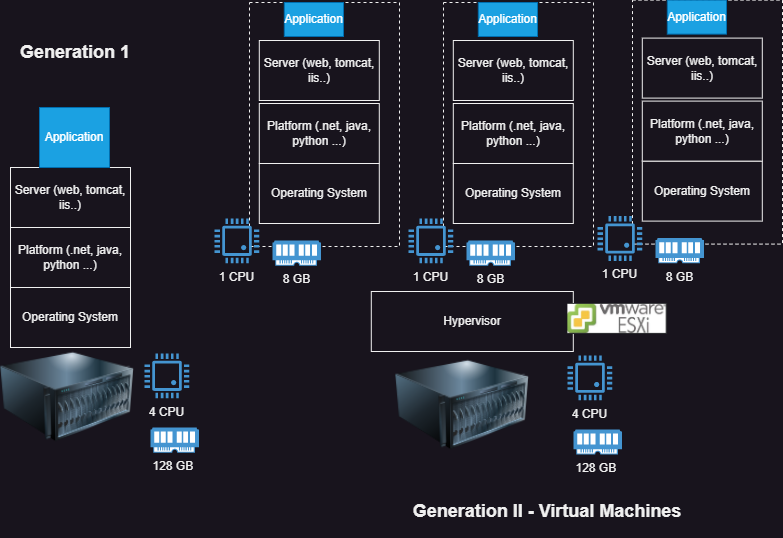

### Cloud
* Cloud is all about using someone else’s hardware
* We have discussed about regions, zones and datacenters
* Types of Cloud
   * Public cloud
   * Private Cloud
   * Hybrid Cloud
   * Community Cloud
   * Multi Cloud

### Public Cloud
* Here we will have Cloud Services Provider (CSP) like Azure, AWS, GCP owning infrastructure (Regions, Zones, Datacenters) and Cloud service Consumers creating accounts and using services
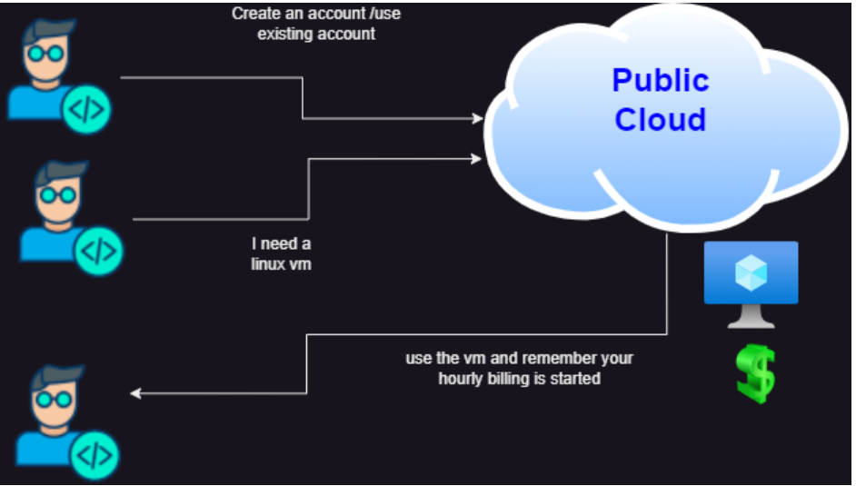
* Service:
   * What cloud offers
   * Here CSP has ownership
* Resources:
   * What we create
   * Here consumers have ownership

### Cloud Services Provider
* Azure is a Public cloud services provider
* They organize the infrastructure across
   * Region
      * Zones
         * Datacenters
             * Racks
                 * Server
      * Datacenters
           * Racks
              * Server
                  

* Explore Globe of Azure [Refer Here](https://datacenters.microsoft.com/globe/explore) 
* data center tour [Refer Here](https://news.microsoft.com/stories/microsoft-datacenter-tour/)


IaaS vs PaaS vs SaaS
---------------------

* Overview


Azure Compute Services
----------------------
* Choosing the Right Azure Compute Service


* IaaS:
   * Azure Virtual Machines
   * Azure Virtual Machine Scalesets

* PaaS:
   * Azure App Services
   * Azure Spring Apps
   * Azure Kubernetes Services
   * Azure Container Instances

* FaaS:
   * Azure Functions

Billing
--------
* Azure charges for services
  * Unit of time: generally hourly in few services its second
  * If you give long term commmitment ( 1 year or 3 years) we get extra discounts (Azure Reservations/Azure Service Plans)
  * To make revenue out of free hardware they run some auction kind of model (Azure Spot Instances)


Azure Account
-------------
* Our Accounts: Free tier
   * [Refer Here](https://azure.microsoft.com/en-us/free/) for Azure Free tier

* Enterprise Accounts


Ways of Working in Azure
------------------------
* We have 3 major ways of accessing azure
    * From Browser (Portal)
    * From Command Line (Azure CLI)
    * From Templates (IaC/ ARM Templates/Azure Bicep/ Terraform)

### Quick Start: Create a Linux Virtual Machine
* [Refer Here](https://learn.microsoft.com/en-us/azure/virtual-machines/linux/quick-create-portal?tabs=ubuntu) for Azure Quickstart


Azure Virtual Machines
----------------------

* This is a service offered by Azure to create virtual machines
* Internally Azure Virtual machines depend on other components
* For any virtual machines at a bare minimum we need to configure the below details
   * Virtual Machine Images: Azure has three types of images
      * OS images
      * Market place
      * Custom images

   * Network
   * Disk
   * Location
   * Size


* We have created a Virtual machine and then the Resource visualizer image is as shown below


### Azure Virtual Machine has 3 types of disks
* OS Disk:
  * Non Ephemeral i.e. Disk contents will be available even after deleting virtual machine
  * This disk contains OS
* Data Disk
  * Non Ephemeral i.e. Disk contents will be available even after deleting virtual machine
  * This disk contains contents other than OS
* Temp Disk:
   * Ephemeral Storage i.e. Disk contents will be wiped once the vm is shutdown

* Temp Disk Size is based on VM Size and Number of Disks which can be attached to vm are also dictated by vm size


### Credentials
* Linux:
   * Username and Password
   * Username and key
* Windows
   * Username and Password

* Key: Azure has a service where you can create private key and public key, called as (key pair) or import your existing keys.

#### upload public key to azure cloud
* in this case we have to create key pair in our local terminal by using `ssh-keygen` command then private key we will have in our local terminal location called `~/.ssh/id_rsa` and public key `~/.ssh/id_rsa.pub` we will upload in the azure cloud
* **Steps:**

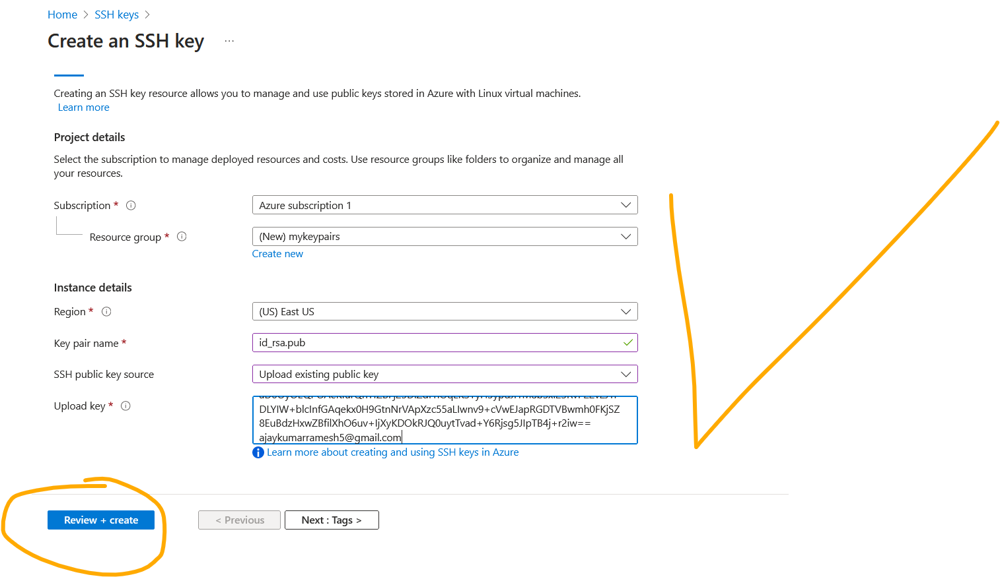
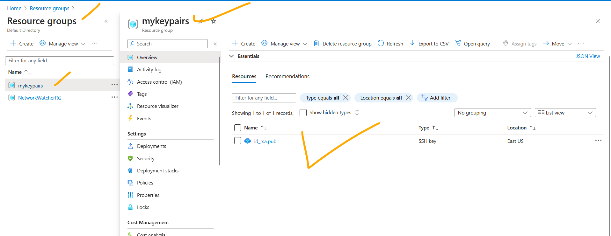


### To generate new key pair from azure cloud
* in this case We can get the private key from Azure and we can download to our system, and safety is our responsibility because once we lost the key it is not possible to recur it.


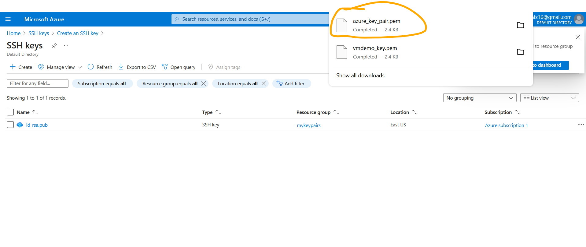
* In this case public key is with azure under ssh keys

* private key is in my local system under location downloads


### Login into vms
* Windows:
   * RDP (Remote Desktop Protocol): Gives visual interface to work with windows from remote
     * command mstsc -v <ipaddress>
     * port: TCP 3389
* Linux
   * SSH (Secure Shell): Gives shell interface /terminal access to work with linux vms
      * command
         * with username and password ssh username@ipaddress
         * with username and key ssh -i <path to private key> username@ipaddress
      * port: TCP 22
* Note:
    * If your vm is created with key and if you execute ssh username@ipaddress it checks for the key in ~/.ssh/id_rsa


### Tags
* When we create any resource we can tag the resources.
* Tagging is helpful for
   * querying resources
   * filtering bills
* Whenever you create any resource atleast have these tags
```
project: learning
env: dev
purpose: learning
```


### Create linux vm with username and password

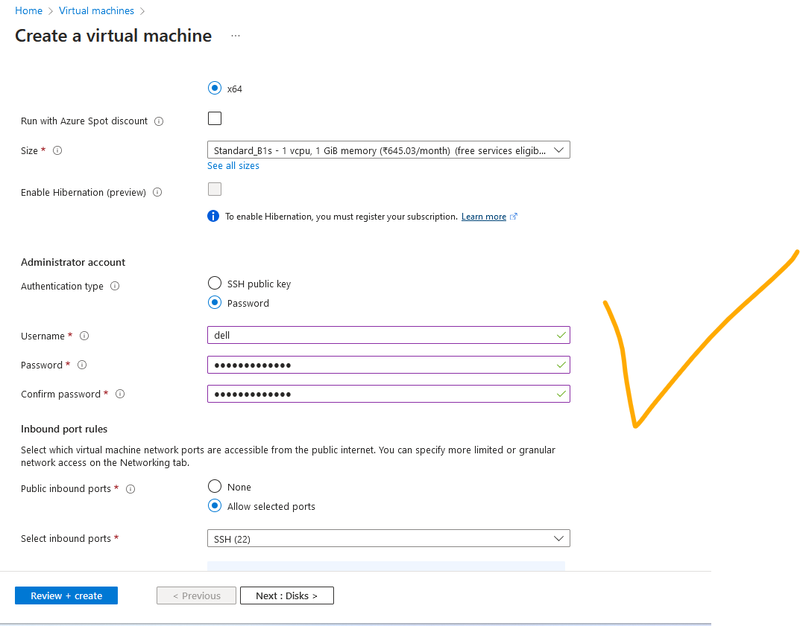
* Login into vm
   * Option:1 
   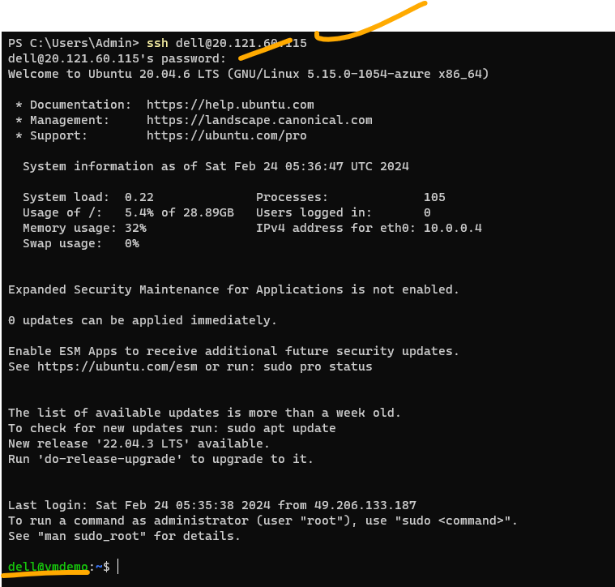
   * Option:2
   * while login into linux vms, if we dont provide username then it will take systems current username but this doesn't work in powershell only linux or gitbash
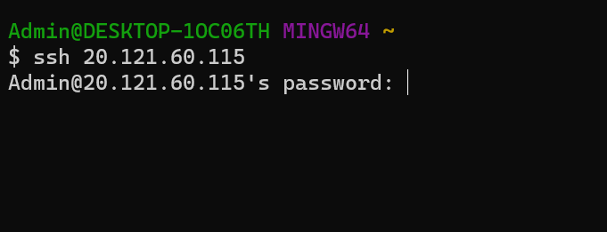

### Create linux vm with username and key
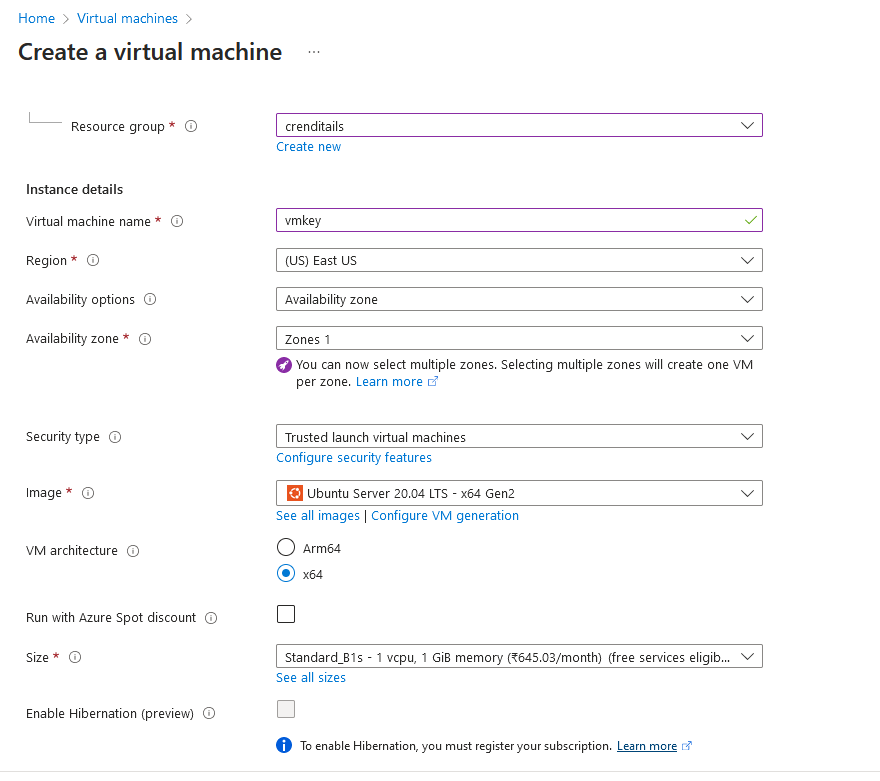
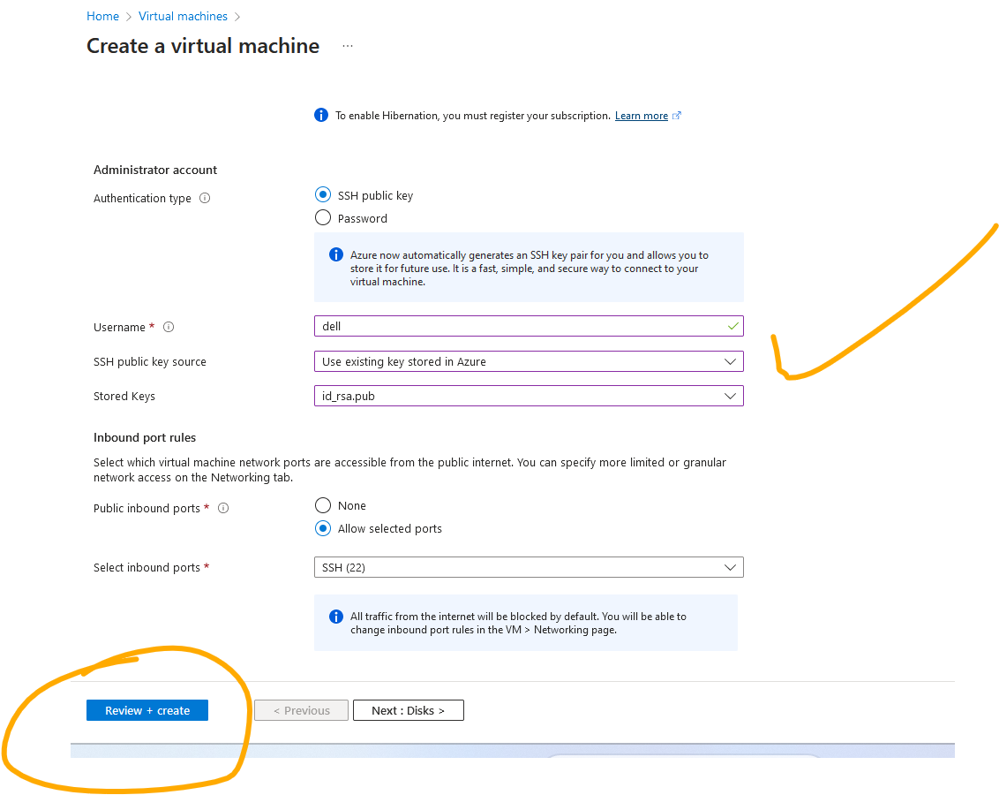
* Login into vm
  * Option:1 
  
  * Option:2
  
  * Option:3
  

### Create windows server and login into
* this demo i am not doing it since i know the steps.


Virtual Machines
----------------
* Virtual Machine Life Cycle (States): This is for on-demand instances.[Refer Here](https://learn.microsoft.com/en-us/azure/virtual-machines/states-billing#power-states-and-billing)

* In Azure when we stop the vm from portal or from azure cli we are deallocating

Azure Virtual Machine connectivity
----------------------------------
* In the last session we had spoken about ssh and rdp
* Azure portal allows to connect to Azure VMS using many ways
   * Native SSH or RDP
   * SSH using Azure CLI
   * Bastion


#### Azure Bastion:
* Bastion is considered to be safe as we need not expose RDP and SSH Ports to all ips


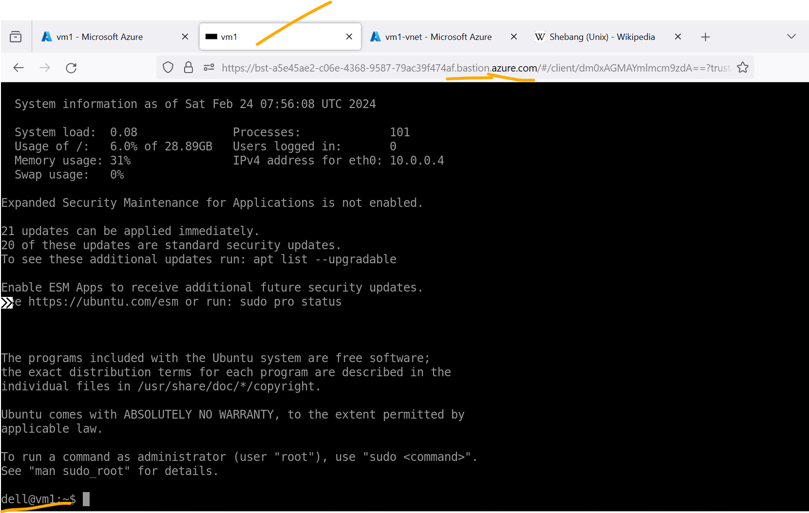
* Enterprise Clients/companies prefer using Bastion for connecting vms’s securely
* Two options in creating bastion 
   * Option:1
      * we can enable azure bastion while creating vnet
      * so that by default it will create `AzureBastionSubnet` and while in azure portal under vms it allow us to login in bastion tab
      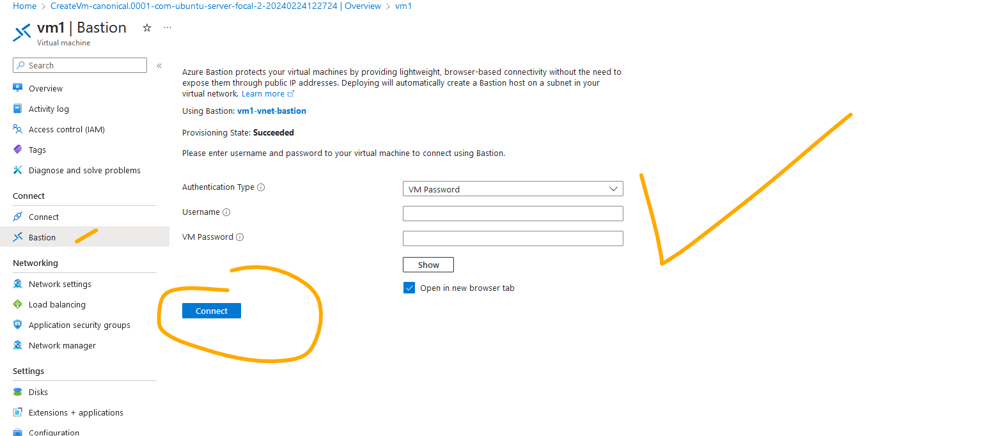
   * Option:2
      * after creating vm then under bastion tab we need click deploy bastion so that it will create `AzureBastionSubnet` and allow us to use bastion.
         

### Azure Virtual Machine – Extra’s Features
* Reset Passwords in Virtual Machine

* We can run the commands in Azure VMs without login into vm's through portal by using using run command if we have administrator rights.
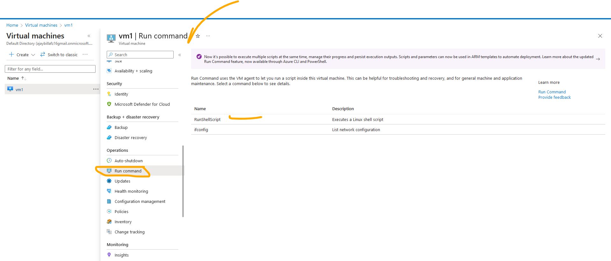
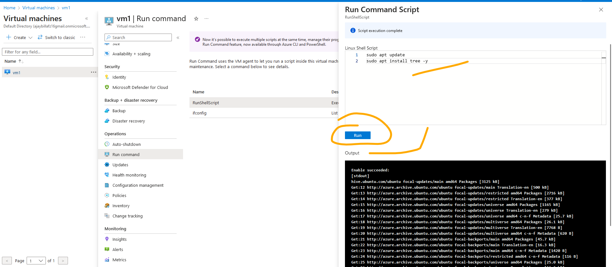
* Azure Vms have agents which make this possible, means all the task like, reset password, connect and run script, etc: many more...
* Auto Shutdowns:
  * this enable automatic shutdown the vm's on Scheduled time
  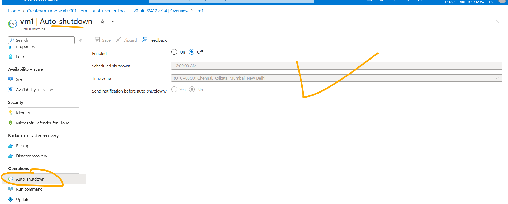


Virtual Machine Sizes
----------------------
* VMs are categoriezed by purpose which is referred as type [Refer Here](https://learn.microsoft.com/en-us/azure/virtual-machines/sizes)

* Each virtual machine which we create will be from some physical server
* Azure Vm size naming convention [Refer Here](https://learn.microsoft.com/en-us/azure/virtual-machines/vm-naming-conventions)
* Note: We can create a Azure vm with one size or type and then resize to other size (type)


### Resize Vm
* Lets create vm with size `Standard B1s`


* Now Resize vm to to `b1ls`


* Changing the size of virtual machines is referred as vertical scaling.
* Lets look at two term of vm's size:
   * scale up and scale down (Vertical scaling) means changing the configuration of vms' 
   * scale in and scale out (Horizontal scaling) means increase number of vm's

* Every Vmsize in Azure dictates the following
   * Family (Subfamily)
   * Additive
   * Number of cpus
   * RAM size
   * Data Disk count
   * Temp Disk size
   * Max IOPS (Disk speed max)
* Price of virtual machine
   * price of vm size
   * price of disk
   * price of public ip
* [Refer Here](https://azure.microsoft.com/en-in/pricing/calculator/) for pricing calculator
* Virtual machine selector [Refer Here](https://azure.microsoft.com/en-us/pricing/vm-selector/)


### Activity
* Create a ubuntu linux vm with 22,80 (ssh,http) port
* ssh into the vm and execute the following
```bash
sudo apt update
sudo apt install apache2 -y
```
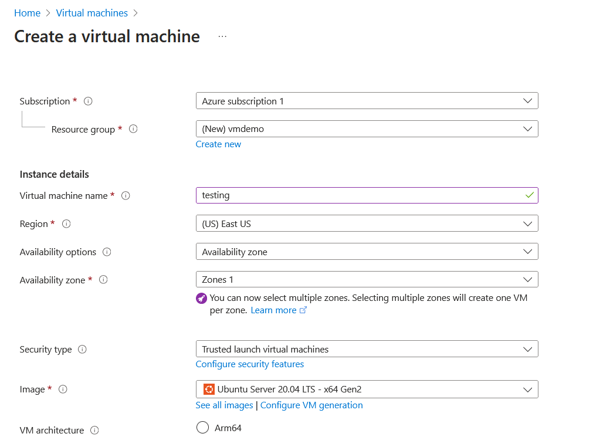

* We can use user data. User data executes after the vm creation. To use user data use the Advanced tab and select user data and enter the following
```bash
#!/bin/bash
apt update
apt install apache2 -y
```
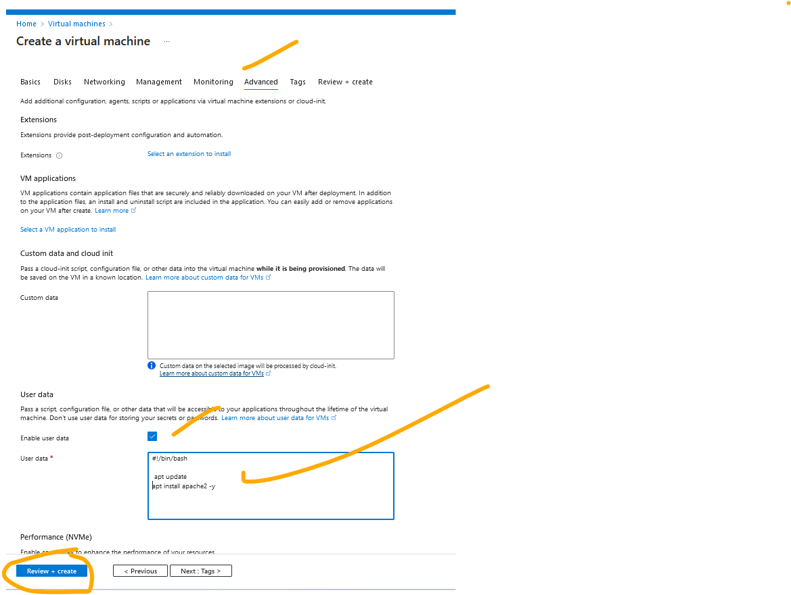

* access from browser http://publicip
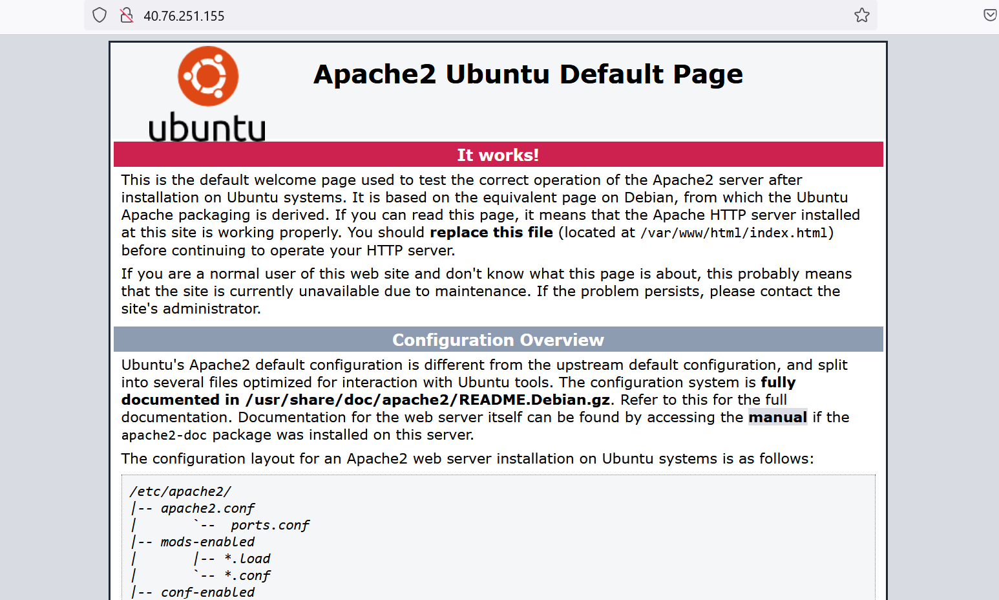
* Custom data allows us to use cloud-init which is a yaml file [Refer Here](https://cloudinit.readthedocs.io/en/latest/reference/examples.html) for more [Refer Here](https://learn.microsoft.com/en-us/azure/virtual-machines/custom-data) azure official docs


### Azure vm extensions
* we can install extension for both linux and windows machine 
* [Refer Here](https://learn.microsoft.com/en-us/azure/virtual-machines/extensions/overview) for official docs

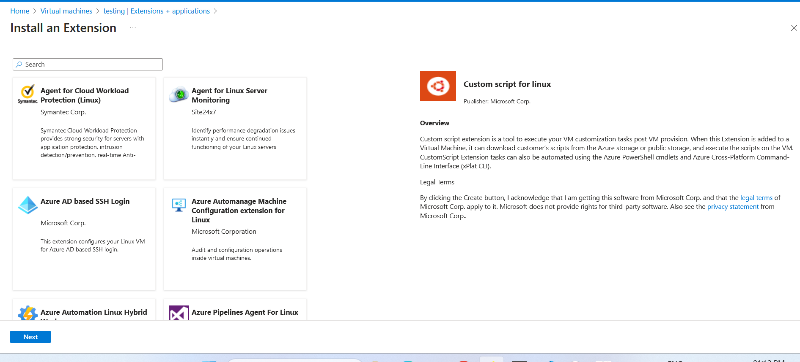
* Even we can install extension Create a virtual machine.
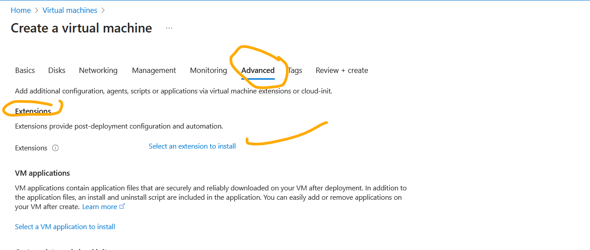

### Azure VM Applications
* [Refer Here](https://learn.microsoft.com/en-us/azure/virtual-machines/vm-applications?tabs=ubuntu) for official docs

### Azure Compute Gallery
* [Refer Here](https://learn.microsoft.com/en-us/azure/virtual-machines/create-gallery?tabs=portal%2Cportaldirect%2Ccli2) for creating a gallery
* TBD: We will be using compute gallery to store vm images


### Azure Instance metadata service
* by using IMS we can get information about vm's, incase if we dont have to access to cloud portal, information like which region, which cloud etc:
* this api service is given by all the cloud to get information for our vm's
* [Refer Here](https://learn.microsoft.com/en-us/azure/virtual-machines/instance-metadata-service?tabs=linux) for official docs
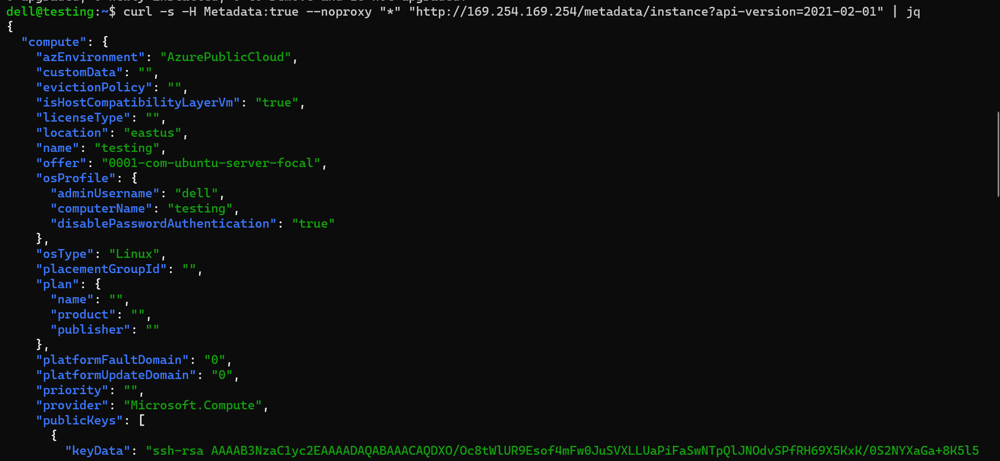


### Activity:
#### Network Security Groups
* Network security groups are attached to nic and they have allow or deny rules
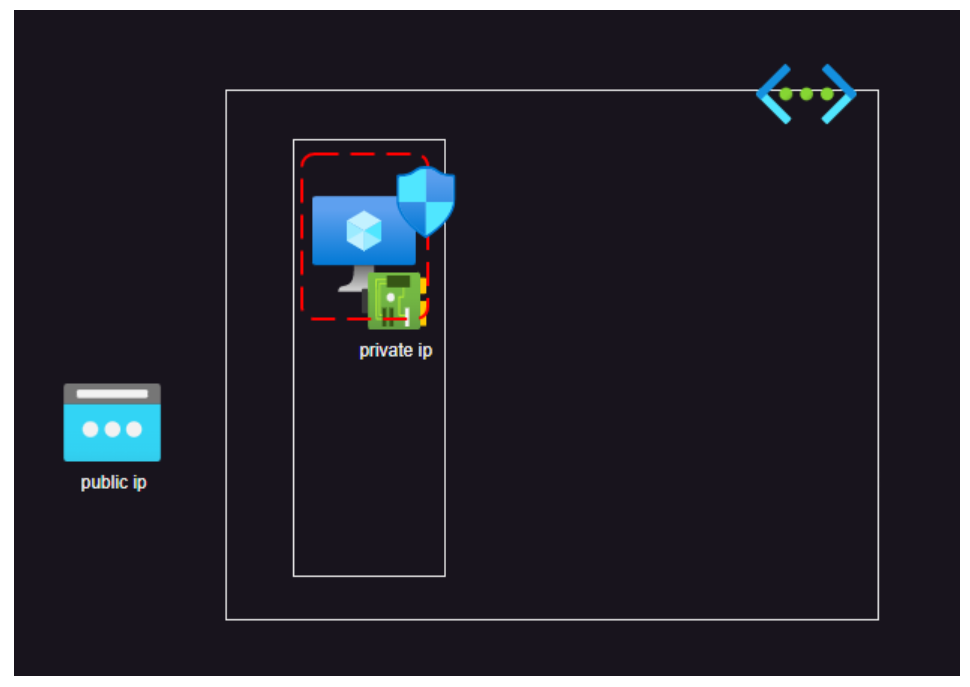
* As per above image we needs to create resource in azure using azure cli interface

### Virtual Machine Creation
* Required:
    * Resource Group
    * Virtual Network and subnet
    * Network security group
    * Network interface
    * Virtual machine

### Azure CLI
* Azure CLI is a command line way of interacting with azure cloud/resource creation
   * [Refer Here](https://learn.microsoft.com/en-us/cli/azure/install-azure-cli) azure cli installation
```
# install azure cli through chocolatey
choco install azure-cli
# authenticate with azure cloud
az login 
```   
* Login is success below screen shot


### How to find Azure cli commands to create all the resources in azure cloud
* Navigate to [Refer Here](https://learn.microsoft.com/en-us/cli/azure/) 
  * And click on reference or ctrl find and search the resources to create
  
* Ensure Azure CLI Extension is installed in visual studio code
  * so that this will help us in writing azure cli commands while creating resource in vscode

* starting the file with extension `.azcli` while we writing the resource so that azure cli will help us. 

### Experiment:
* **Steps:**
* create a resource group

  `az group create --location "eastus" --name "vmdemo"`
  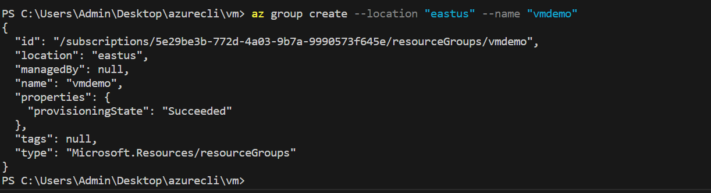
  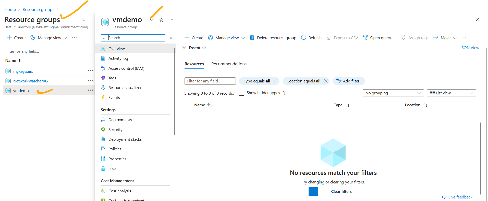
* Create a virtual network

  `az network vnet create --name "vmnet" --resource-group "vmdemo" --address-prefixes "10.0.0.0/16"`
  
  
* Create a subnet
```
az network vnet subnet create `
--name "web" `
--resource-group "vmdemo" `
--vnet-name "vmnet" `
--address-prefixes "10.0.0.0/24" 
```  


* Create a network security group

  `az network nsg create --name "webnsg" --resource-group "vmdemo" --location "eastus"`


* Create a rule to open 80 port to every one
```
az network nsg rule create `
 --name "AllowHttp" `
 --nsg-name "webnsg" `
 --priority 300 `
 --access "Allow" `
 --resource-group "vmdemo" `
 --source-address-prefixes "*" `
 --destination-address-prefixes "*" `
 --destination-port-ranges "80" `
 --direction "Inbound" `
 --protocol "Tcp" `
 --source-port-ranges "*"
```

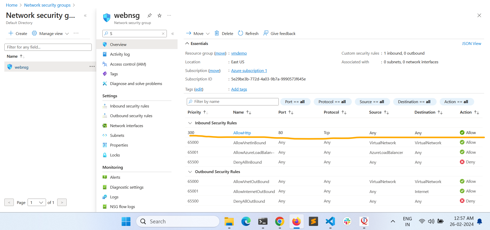

* Create a rule to open 22 port to every one
```
az network nsg rule create `
 --name "AllowSSH" `
 --nsg-name "webnsg" `
 --priority 310 `
 --access "Allow" `
 --resource-group "vmdemo" `
 --source-address-prefixes "*" `
 --destination-address-prefixes "*" `
 --destination-port-ranges "22" `
 --direction "Inbound" `
 --protocol "Tcp" `
 --source-port-ranges "*"
```


* Create a nic with only private ip attached to web subnet with webnsg
```
az network nic create `
    --name "webnic" `
    --resource-group "vmdemo" `
    --location "eastus" `
    --vnet-name "vmnet" `
    --subnet "web" `
    --network-security-group "webnsg"
```  
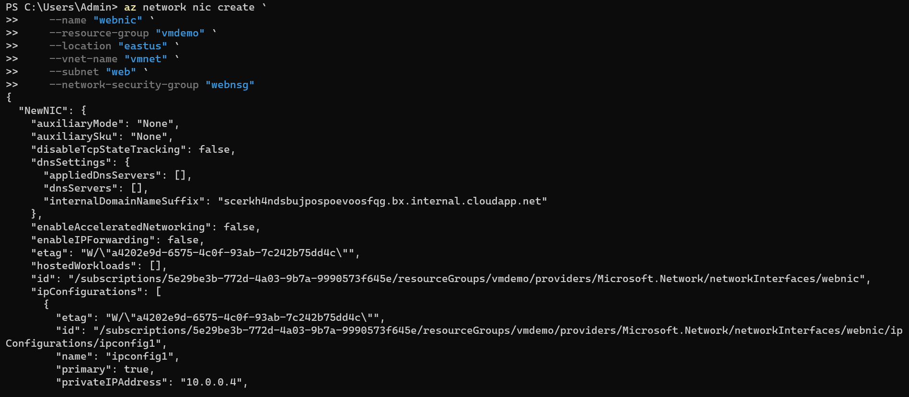

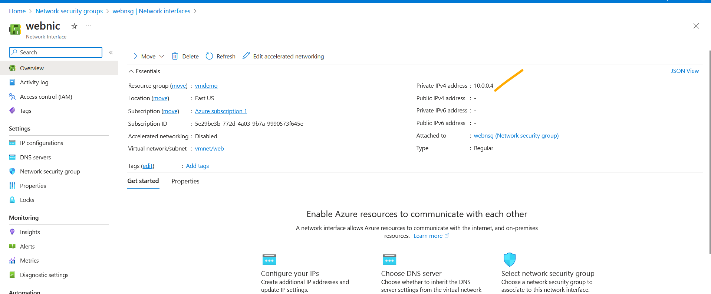

* Create a vm
```
az vm create `
    --name "webvm" `
    --resource-group "vmdemo" `
    --location "eastus" `
    --admin-password "azureuser@123" `
    --admin-username "dell" `
    --nics "webnic" `
    --image "Ubuntu2204"
```
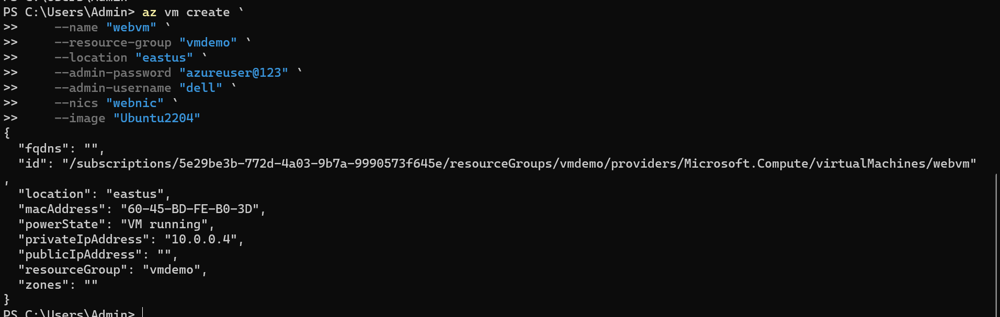


* Now over all resources is created
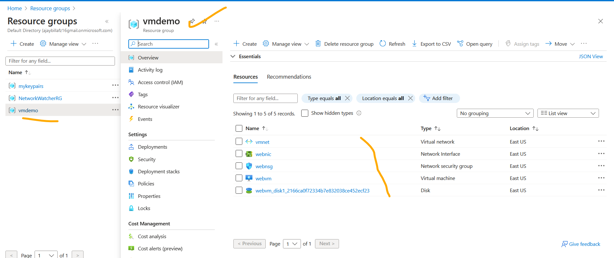
* Now after examining the created resource just delete it
* Delete all the resource by deleting resource group

  `az group delete --name "vmdemo"`


* **Create a reusable script to create:**
  * for above created resource through azure cli
* **We have create a script with variables:**
   * [Refer Here](https://github.com/codesquareZone/AzureCliZone/commit/9af4de48429c27c5108fa8adf44026ff02da31c8) for azure cli script to create resources
* Now execute this above script in the azure cloud shell
```
git clone https://github.com/codesquareZone/AzureCliZone.git
cd AzureCliZone/
chmod +x azurecli.sh
./azurecli.sh
```     
* just few lines of screen shot i have posted here for an reference 

* After executed above script in the azure cloud shell, all te resource has been created in azure cloud


* **To make this script to display the message for users:**
  * Like if resource is already `exists`, not to create the resources
  * Like if resource is `doesn't exists`, then it should create resource
* [Refer Here](https://github.com/codesquareZone/AzureCliZone/commit/f3a869e3cbff96541667695791368cecfcd2394d) for azure cli script if else 

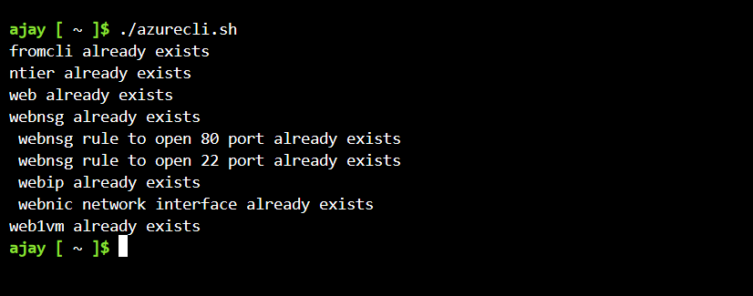

* **References:**
   * Azure CLI Bash [Refer Here](https://learn.microsoft.com/en-us/cli/azure/azure-cli-learn-bash) 
   * Bash cheatsheet [Refer Here](https://devhints.io/bash)

### Create positional parameters/arguments 
* script to create resources in azure using azure cli with positional parameters
* [Refer Here](https://github.com/codesquareZone/AzureCliZone/commit/520e76f6ab456bf1a12affc36aade4f961d02c59) for positional parameters scripts
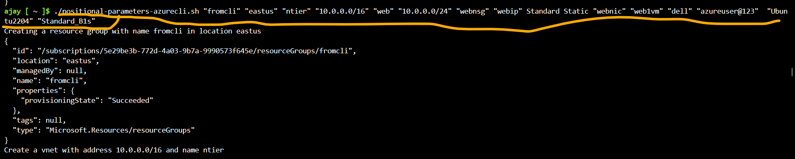


### keyword arguments scripts
* script to create resources in azure using azure cli with keywords arguments
* [Refer Here](https://github.com/codesquareZone/AzureCliZone/commit/6cfddbc89cfab2e5af05a5157b77d1e35d24ff11) for keyword arguments azurecli script

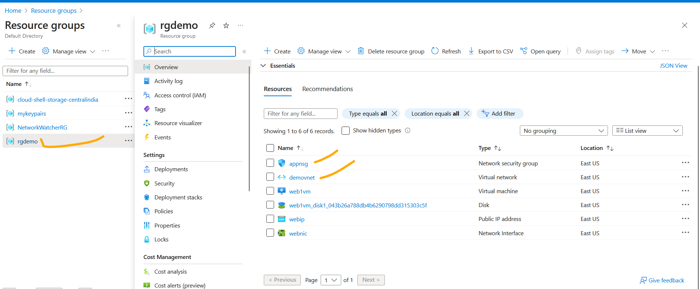


Azure Powershell
----------------
* Azure Offers command line capabilities over powershell
* Powershell will have cmdlets which will be in the form of `verb-noun` eg:- `New-Item` or `Get-Process`
* [Refer Here](https://learn.microsoft.com/en-us/powershell/azure/install-azps-windows?view=azps-11.3.0&tabs=powershell&pivots=windows-psgallery) Install Azure PowerShell on Windows
* [Refer Here](https://learn.microsoft.com/en-us/azure/virtual-machines/linux/quick-create-powershell) for powershell to create a linux vm

* Basic Commands
```
Get-Command
Get-Help
Get-Help Get-Acl -online
Get-Help Get-Process -online
Get-Process | Where ProcessName -eq Notepad
Get-Process | Where ProcessName -eq Notepad | Stop-Process
Get-AzResourceGroup | Where Location -eq eastus | Select ResourceGroupName
Get-AzResourceGroup | Where Location -eq eastus
Get-AzResourceGroup | Select ResourceGroupName
Get-Help New-AzResourceGroup -online
Get-Command '*-AzVirtualNetwork'
Get-Help New-AzVirtualNetwork -online
Get-Help New-AzVM -online
Get-Credentials
Remove-AzResourceGroup -Name myvm
```

* To Authenticate azure cloud from local powershell
```
Connect-AzAccount
```
* Then authenticate login into your azure account


### Activity:
#### Lets create linux vm in azure powershell
* [Refer Here](https://github.com/codesquareZone/AzureCliZone/commit/a3e51c445e4ced9f30bde1f053fc5f2f2b504139) for powershell commands to create resource in azure
* copy this script and paste into powershell, it will ask for credentials provide it, it will create the resources in azure
* Output in powershell after executing powershell commands

* Created resources in azure 
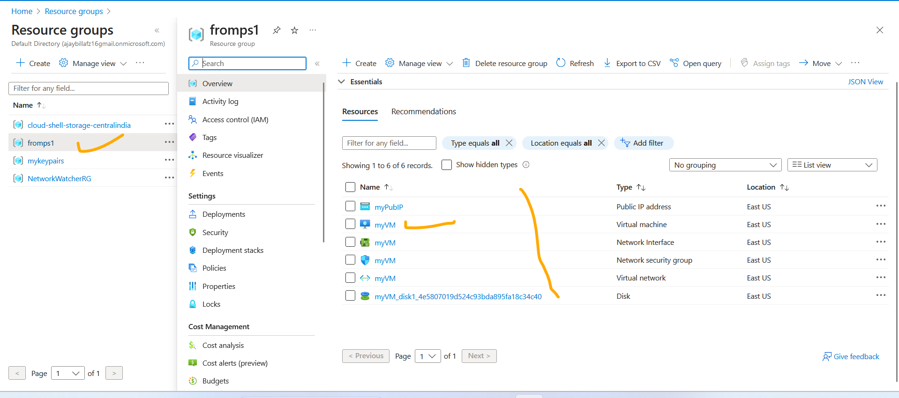

### To create virtual machine in azure using powershell
* [Refer Here](https://learn.microsoft.com/en-us/powershell/module/az.compute/new-azvm?view=azps-11.3.0) for official docs
* in above url just execute one command it will create virtual machine in azure
```PowerShell
New-AzVM -Name commandVm -Credential (Get-Credential)
         or
New-AzVM -Name MymVm -Credential (Get-Credential) -SecurityType "Standard"
```
* This example script shows how to create a virtual machine. The script will ask a user name and password for the VM. This script uses several other cmdlets.
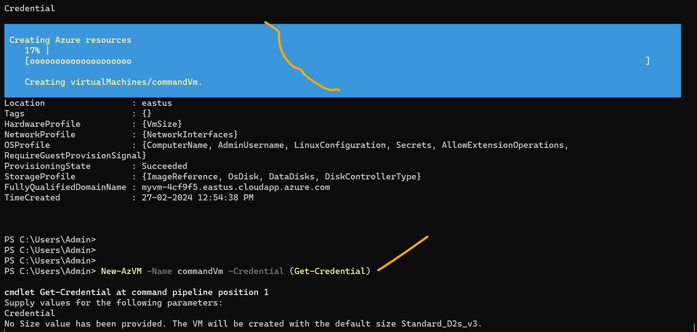
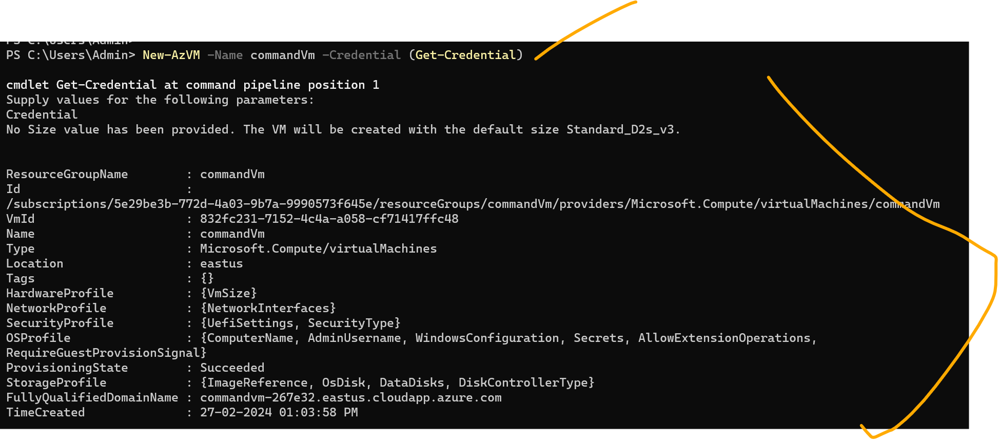


Generation I vs Generation II vms
----------------------------------
* Generation I is older version of VMS
* Generation II supports new generation with feature support such as
   * larger vm sizes
   * uefi and vTPM (Secured Boot) (Trusted => OS Secured)
   * Resizing Disks on the fly
   * Faster OS boot times

VM Image Creation
-----------------

* Azure VM Images are of two types
   * Generalized:
       * These images allows to set credentials while creating virtual machine
   * Specialized:
       * These image have a built in user and will not allow you to set credentials during creation.
* Azure VM Images can be hosted by two ways
    * Managed Image
    * Azure Compute Gallery (Supports versioning)

### Lets create our first vm image

* Create a ubuntu linux vm and install the following
```bash
sudo apt update
sudo apt install apache2 stress -y
sudo apt install php libapache2-mod-php php-mysql -y
```
* Create a file at `/var/www/html/info.php` with following content
```php
<?php
phpinfo();
?>
```
* Access the `http://publicip/info.php`
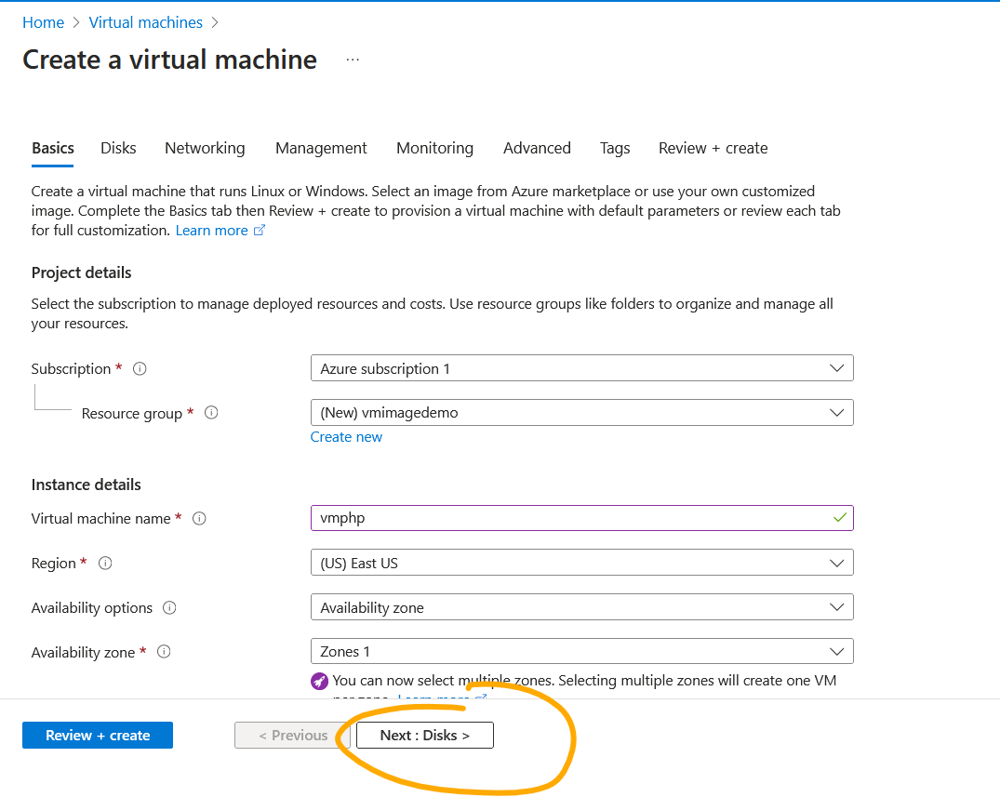
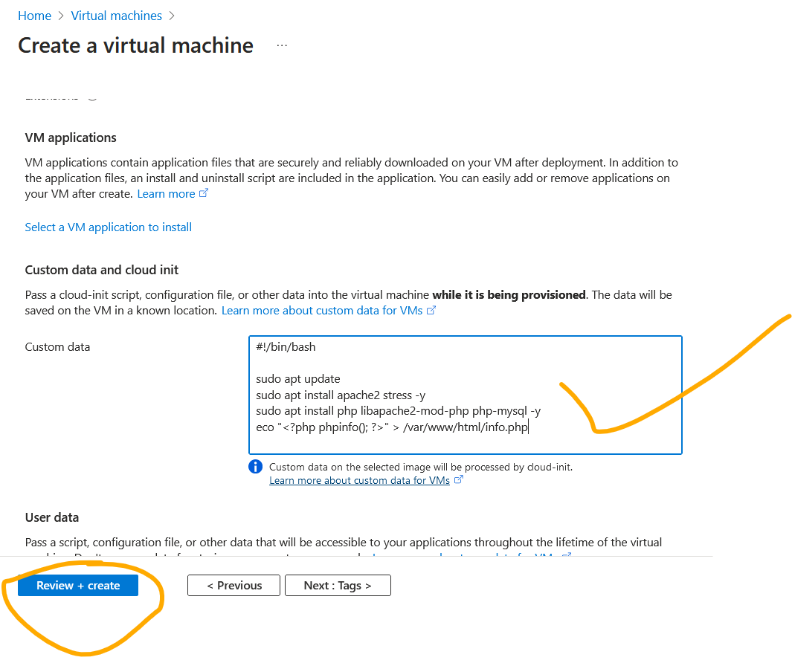
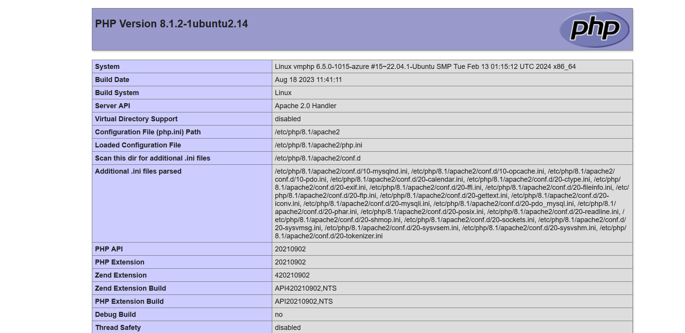

* **Lets create reusable image or capture image from vm in azure for above created vm with apache2 and php:**
* Create a resource group called as `resuableimages`
* Navigate to the vm & then click on capture button
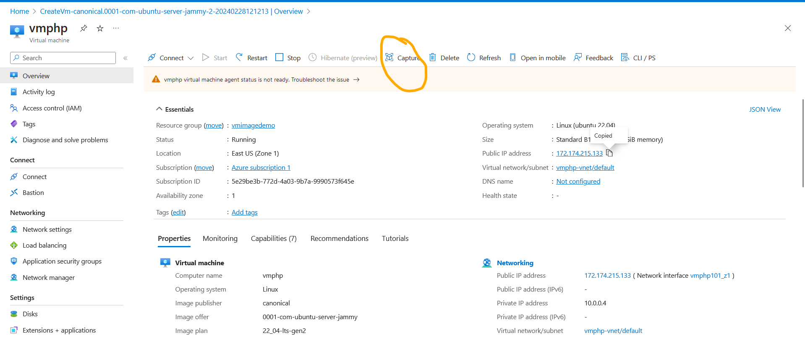
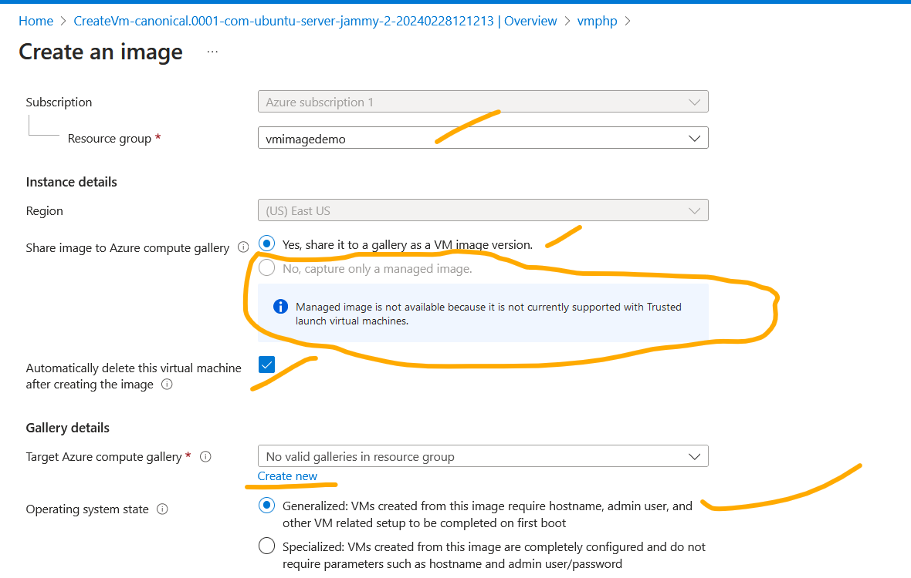
* Lets create a gallery called as `learning` to store the image
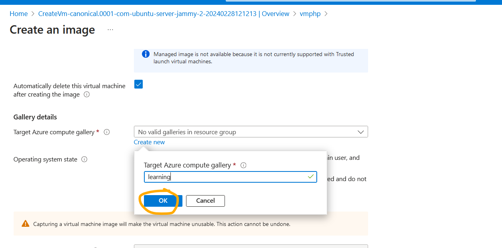
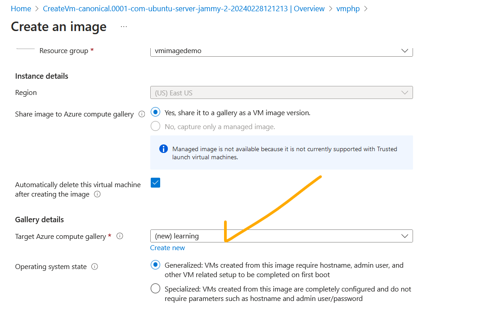
* Create vm image definition
  * Every VM Image in Azure is identified by 4 parameters
     * publisher: referes to an organization publishing images
     * offer: This is the offering from the organization
     * sku: This is store keep unit
     * version: version of the release
* lets create a vm definition with our details in publisher, offer and sku
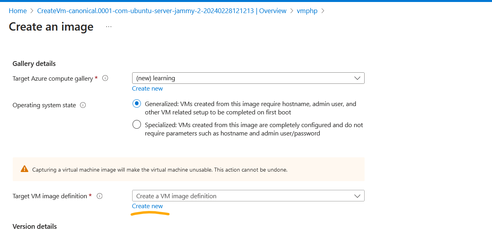
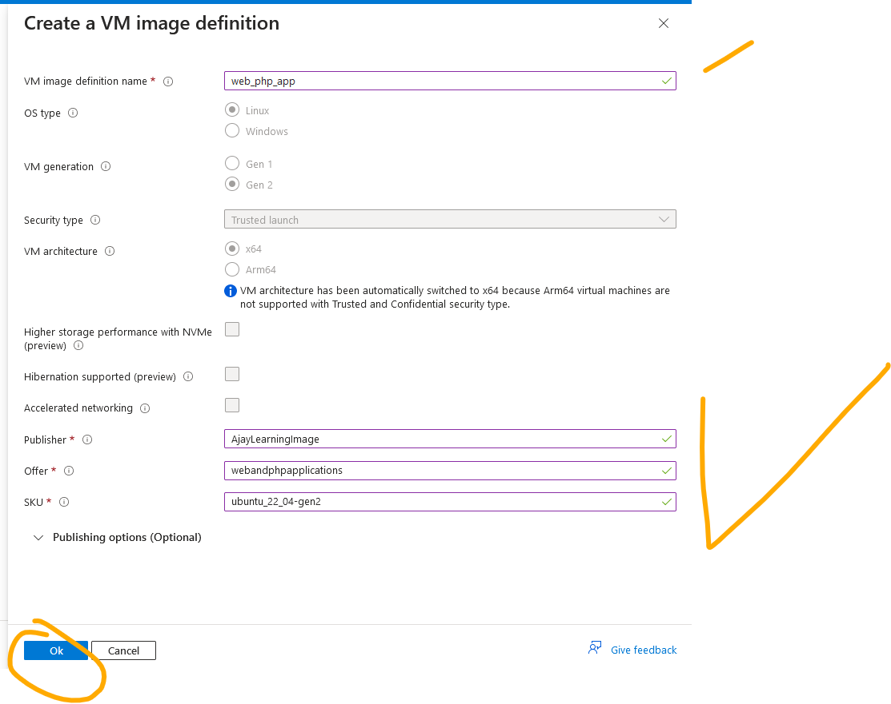
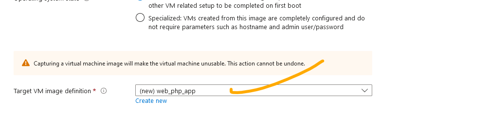
* Other details
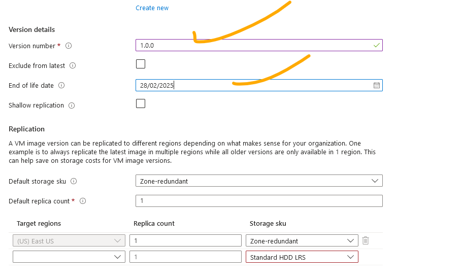
* Now Review and create
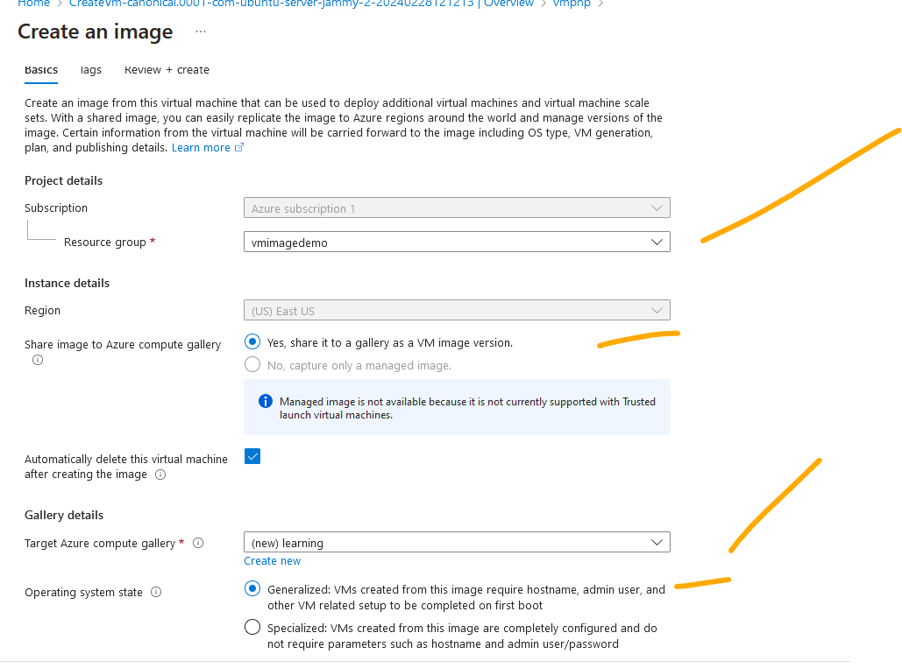

* if we want to create the same image in other region to for back up but i dont needs it since it is cost for me.

* VM Image creation happens in 4 steps
   * stop the vm
   * Generalize the vm (Remove user credentials)
   * Create a snapshot of disk with additional metadata to create a vm image
   * successfully deleted the previous vm, which we created image out of it
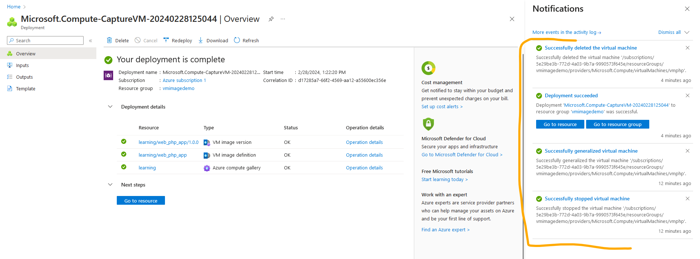
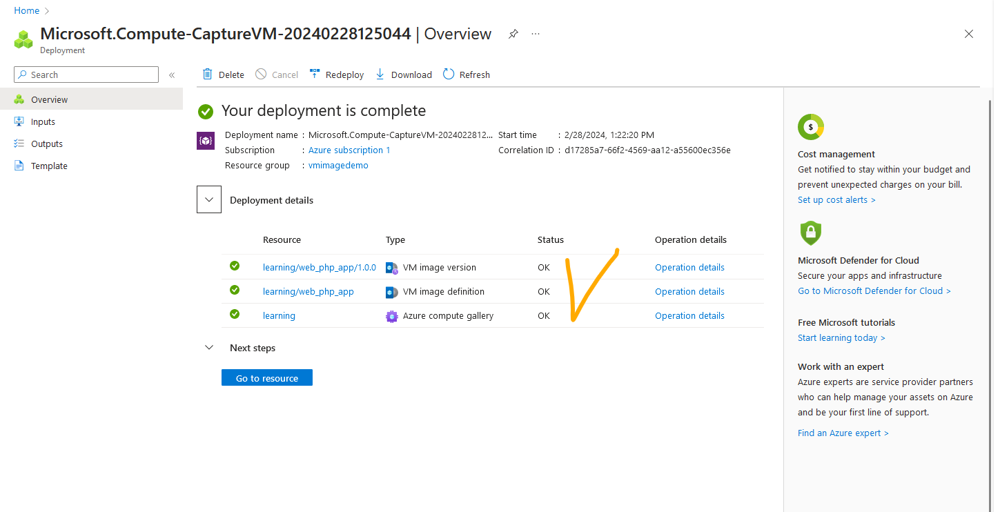
* VM image has been created
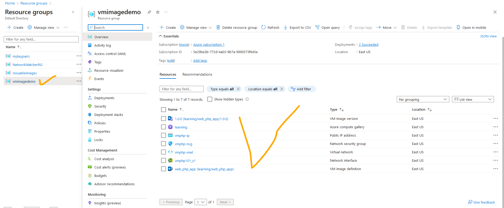

* benefit of selecting this reusable image is already we installed the required software into it, so each time when we create the vm not required to install any software.
* **Lets Create vm from vm image from gallery:**
   * To create vm from vm image there is two ways
       * Option:1  
       
       
       
       
       
       
       
       
       * Options:2
       * Navigate to resource group where vm image is created
       * Now select vm image version
        
       * Click on create vm or vmss 
       
       
       

Azure Virtual Machine Scaleset (VMSS) With Out Loadbalancer
---------------------------------------
### Activity:1
* Big Picture for Horizontal Scaling with Zero down time deployments

* Virtual machine scaleset allows to perform automatic horizontal scaling based on metrics such as cpu, network, memory or even custom metrics
* To Create a virtual machine scaleset we need a image. Here we have two choices, use
   * OS image
   * Custom image with application preinstalled
* Using Custom image is widely adopted option.
* We will be creating a VMSS using the image which we stored in compute gallery

* [Refer Here](https://learn.microsoft.com/en-us/azure/virtual-machine-scale-sets/overview) for virtual machine scale set official docs
* [Refer Here](https://learn.microsoft.com/en-us/azure/virtual-machine-scale-sets/flexible-virtual-machine-scale-sets-portal) for Create virtual machines in a scale set using Azure portal for quick start
* **Steps to Create VMSS:**


* We have create a vmss with
   * scale condition: when average `cpu utilization > 90 %` for last 5 minutes increase `1 vms` and when average `cpu utilization < 50%` for last 5 mins decrease `1 vm`
   * min vms 1
   * max vms 5
   * No loadbalancer selected 
   * Selected public ip for each vm
   
   
   
   * we asked for one vm so one vm is running
   
   * observe below screen shot, public ip and private ip are same when we access php application
   
   * To scale these machines the condition is Average cpu utilization should be greater than 90% for 5 minutes.
   * To put artificial load on cpu lets use the stress tool
   ```
   # login into vm and execute the following command
   stress --cpu 8 --io 4 --vm 2 --vm-bytes 128M --timeout 15m -v
   ```
   
   * observe below screen shot before we run above stress command cpu utilization is `0`
   
   * observe below screen shot after we run above stress command cpu utilization is `100`
   
   * observe the cpu utilization it is reaching more then 90 percentage, when we execute stress tool
   
   * we have observed the number of vms increased based on dynamic metrics.
   
   * observe the cpu utilization, when we stop stress tool executing, it will decrease to below 50 percentage
   
   
   * we have observed the number of vms decreased based on dynamic metrics.
   

### Azure Virtual Machine Scale sets More Information:
#### Orchestration Modes in Azure VMSS
   * Uniform:
      * All the vms will have same sizes
      * Supports zero down time deployments
   * Flexible
      * The sizes can be customized per vm
      * Still upgrade support is not added.
#### Deployment options/(Upgrade Policy)
   * Manual Upgrade
   * Automatic Upgrade
#### Scaling Policies
 * Manual scaling
 * Metric Based Scaling: we define some metric and control scaling
 * Predictive Scaling: Maching learning algorithm does the scaling based on historical utilization. This requires atleast 7 days of scaling information to be effective.

Azure Virtual Machine Scale sets With loadbalancer
--------------------------------------------------
### Activity:2
### Virtual Machine Image Auto Upgrade
* The goal of this activity is to check if the vm image update to the compute gallery image definition will deploy into vmss
* **Detailed Information:**
  * We have a version 1.0.0 where vmss was created
  * Now we have a new release 1.1.0. When we have a new release how will vmss handle this
* Lets have a compute gallery with some image definition at version 1.0.0.  
* Create a vmss with this image
* Now add one more version of the vm image 1.1.0 to the compute gallery and wait for the vmimage to be deployed to vmss
* ensure you are able to access application using load balancer
* Now create a new latest version and wait for web pages to be loaded. or Wait till new version is of image is deployed to vmss/generated completely
* **To update the image to latest version we have 3 options:**
* [Refer Here](https://learn.microsoft.com/en-us/azure/virtual-machine-scale-sets/virtual-machine-scale-sets-automatic-upgrade) for official docs
   * os upgrade (manual)
   
   * reimage (manual)
   
   * set auto update
     * We needs to do two things/set two ways:
       * First Way: Enable Application Health Monitoring
          * If we have loadbalancer health probe configured then we can select loadbalancer health probe or we can select Application health extension.
     * Second Way: 
         * needs to execute below command when we as soon as created VMSS, so then when ever the new image is available in the compute gallery vmss will deploy automatically and we can see the new image version
     `az vmss update --name carvilla --resource-group vmssdemo --set UpgradePolicy.AutomaticOSUpgradePolicy.EnableAutomaticOSUpgrade=true`
* **Ideal steps:**
  * Create a vm image from compute gallery
  * Create a vmss with automatic updates or rolling updates
  * Set the cli as shown above
  * From now on when the compute gallery is updated with latest image the deployment to vmss starts automatically     

#### This above said is the work flow of experiment which we are going to do now.  
### Steps:
* Create a ubuntu linux vm wit port 22 and 80 opened
install the following
```bash
sudo apt update
sudo apt install apache2 stress -y
sudo apt install php libapache2-mod-php php-mysql -y
```
* Create a file at /var/www/html/info.php with following content
```php
<?php
phpinfo();
?>
```


* Download html free template from below url
   * [Refer Here](https://www.free-css.com/free-css-templates)
   * I have downloaded `carvilla` html frontend home page
* Login into vm `twebimageversion-1` execute below commands
```
# copy the download link execute below command
wget https://www.free-css.com/assets/files/free-css-templates/download/page296/carvilla.zip
# install unzip
sudo apt install unzip
# unzip carvilla
unzip carvilla.zip
# rename the file
sudo mv carvilla-v1.0/ carvilla
# move the file to location
sudo mv carvilla /var/www/html/
```
* Access the `http://publicip/info.php`

* Access the `http://publicip/carvilla`


#### Lets create a gallery with image definition at version 1.0.0.


#### Lets Create reusable image or capture image to store in the gallery


#### Lets create VMSS with an Autoscaling group and auto upgrade policy


* Ensure Upgrade policy is automatic or rolling updates


* Review and create 


* Important Step After VMSS is created:
  * Enable Application Health Monitoring
    * If we have loadbalancer health probe configured then we can select loadbalancer health probe or we can select Application health extension.
      * In my case i am selecting loadbalancer since i do have loadbalancer health probe
          
          
          
  * Execute/Set the cli command 
     * for  auto update as soon as vmss is created. So From now on when the compute gallery is updated with latest image the deployment starts automatically and we can see the new image version

     `az vmss update --name carvilla --resource-group vmssdemo --set UpgradePolicy.AutomaticOSUpgradePolicy.EnableAutomaticOSUpgrade=true`
     
     

#### Now lets create a public load balancer
* For loadbalancer frontend will be public ip, where the user hit the loadbalancer to access our applications
* And For load balancer vmss is a backend pool, where when user hit the loadbalancer to access our application the loadbalancer will forward the request to vmss to access our application


* Loadbalancer frontend ip and VMSS Public IP address, both are same because we have configured loadbalancer with vmss

* Observe here in VMSS we can see only one instance of carvilla, because when configuring scaling we have set initial vm is only one so it is showing only one


* Now ill change the scaling initial vm to 2 observe the different it will create one more vm


* Now we can access the application using load balancer ip address


#### To Deploy new image version in compute gallery, Let us create the ubuntu machine with application installed
* Create a ubuntu linux vm wit port 22 and 80 opened
install the following
```bash
sudo apt update
sudo apt install apache2 stress -y
sudo apt install php libapache2-mod-php php-mysql -y
```
* Create a file at /var/www/html/info.php with following content
```php
<?php
phpinfo();
?>
```

* Download html free template from below url
   * [Refer Here](https://www.free-css.com/free-css-templates)
   * I have downloaded `Rent4U` html frontend home page
* Login into vm `ltwebimageversion-2` execute below commands
```
# copy the download link execute below command
wget https://www.free-css.com/assets/files/free-css-templates/download/page294/rent4u.zip
# install unzip
sudo apt install unzip -y 
# unzip rent4u
unzip rent4u.zip
# rename the file
 sudo mv rent4u-html/ carvilla
# move the file to location
sudo mv carvilla /var/www/html/
```
* Access the `http://publicip/info.php`

* Access the `http://publicip/carvilla`

#### Lets Create reusable image or capture image version to store in compute gallery


* Observe below new image version`1.1.0` has been created in the compute gallery and marked as latest version


* Now once we have deployed new image version `1.1.0` to compute gallery, VMSS has taken automatically the new/latest version `1.1.0` of an image, because we have given upgrade policy has Automatic
* And Now when we access application with loadbalancer we have to see the new version of image that is `Rent4U`, thats our `carvilla version 1.1.0`
* >> **Note:** 
It can take up to 3 hours for a scale set to trigger the first image upgrade rollout after the scale set is first configured for automatic OS upgrades due to certain factors such as Maintenance Windows or other restrictions. Customers on the latest image may not get an upgrade until a new image is available.
>>


Azure VMSS with Load balancer and DNS Zone
-------------------------------------------
### Activity:3

#### Lets create a VMSS and image from compute gallery and loadbalancer
* The image which is already stored in the compute gallery is already installed these applications `apache` `php` and `carvilla` in `Activity:2`
* Below screen shot proves it

* By accessing public ip of image `ltecommerce/ltwebfrontend/1.1.0` proves that above applications has been installed
* Access the `http://20.51.230.160/`

* Access the `http://20.51.230.160/info.php`

* Access the `http://20.51.230.160/carvilla/`

* Now Creating a VMSS and existing image from compute gallery and loadbalancer


#### Lets create a public DNS Zone
### DNS in Azure
* [Refer Here](https://learn.microsoft.com/en-us/azure/dns/dns-overview) for What is Azure DNS official docs
* [Refer Here](https://azure.microsoft.com/en-in/products/dns) for Azure DNS official docs
* [Refer Here](https://learn.microsoft.com/en-us/azure/dns/dns-delegate-domain-azure-dns) for Host your domain/create in Azure DNS official docs
* DNS record types [Refer Here](https://www.site24x7.com/learn/dns-record-types.html)
* **Steps:**
  * Needs to purchase Domain in web hosting company like `Godaddy` or `Hostinger`
  * Ill purchase in hostinger [Refer Here](https://hpanel.hostinger.com/domain/azurebyexamplecloud.cloud/domain-overview)
  
* Lets create a public DNS Zone in Azure cloud for domain `azurebyexamplecloud.cloud`  


* Now store the Nameservers's from azure dns zone  into the domain provider


* Now lets create the record set  in the DNS Zone


* Now access your application with domain name
  * `www.azurebyexamplecloud.cloud/`
  
  * `www.azurebyexamplecloud.cloud/carvilla/`
    
* **Note:** if it is not azure resource then Alias should select no and give directley ip address, but in our case it is azure resource so we have selected Alias yes and given name. 
* An ALIAS record is a type of DNS record that points your domain name to a hostname instead of an IP address.
---


Azure Savings Plan vs Azure Reservations
----------------------------------------
* [Refer Here](https://learn.microsoft.com/en-us/azure/cost-management-billing/savings-plan/decide-between-savings-plan-reservation)
* Azure Savings plan means using all the azure services day to day activities
* Azure Reservations means we fixing or reserving the particular service for, particular period or fixed period


Azure Dedicated Hosts
----------------------
* Dedicated hosts means for an example we have 10 vm which needs to run on particular server, reason been dedicated hardware resource and we will have the control on that hardware resource.
* [Refer Here](https://learn.microsoft.com/en-us/azure/virtual-machines/dedicated-hosts) for Azure Dedicated Hosts


Azure App Services - Azure PaaS
-------------------------------
* Azure App Services is known as Azure Pass, because we directley deploy our application into it, we are not worried about anything about vm or applications installing it. 
* [Refer Here](https://learn.microsoft.com/en-us/azure/app-service/overview) for App Service overview
* [Refer Here](https://learn.microsoft.com/en-us/azure/app-service/quickstart-dotnetcore?tabs=net70&pivots=development-environment-azure-portal) for a sample deployment app service\
* Note: 
  * why we have use app service because it easy way to deploy our app with code immediatley to azure and expore via domain
  * incase of virutal machine then we needs to create vm or vmss and install required platform like dotnet and applications then create service file to start application then to accces the application with dns zone and domain
### Experiment:1
* In this Example we are building the code of dotnet in the visual code locally and running locally then we will publish to Azure App Services
* **Steps:**
* To Create App Services resources in Azure and publish your project


* To Create an New Project ASP.NET web app in Visual Studio 
   * [Refer Here](https://learn.microsoft.com/en-us/azure/app-service/quickstart-dotnetcore?tabs=net70&pivots=development-environment-vs#1-create-an-aspnet-web-app)
   * Should download Visual Studio 2022 [Refer Here](https://visualstudio.microsoft.com/downloads/) and install 


* From the Visual Studio menu, select Debug > Start Without Debugging to run the web app locally. If you see a message asking you to trust a self-signed certificate, select Yes.


* Publish your web app Azure AppServices
  * [Refer Here](https://learn.microsoft.com/en-us/azure/app-service/quickstart-dotnetcore?tabs=net70&pivots=development-environment-vs#2-publish-your-web-app)


  


* What ever we builds in our local visual studio we can deploy into azure app services and we can access with domain which is avaialbe in azure app service `myfirstwebappservices.azurewebsites.net`


* Visual Studio builds, packages, and publishes the Web app to Azure, and then launches the app in the default browser.

* Update/change  the Web app and redeploy
  * [Refer Here](https://learn.microsoft.com/en-us/azure/app-service/quickstart-dotnetcore?tabs=net70&pivots=development-environment-vs#3-update-the-app-and-redeploy) 
  * In Solution Explorer, under your project, open Index.cshtml.
  
  * Added new paragraph and save changes 
  
  * Now we can run locally in visual studio then publish it or we can direcley publish it
  * I ran locally first then i am publishing it
  
  
  * In the Publish summary page, select Publish.
  
  * When publishing completes, Visual Studio launches a browser to the URL of the web app.
  

* **Note:**  
   * Even we can buy custom domain in azure but only for app services not for others

### Experiement:2
* **Option:1**
* In This Example developer will write the code for dotnet app and uploaded to github so we will configure the github app repo while creating Azure App Service, and then we will publish the web app.and then we will acces the azure app service domain url to check app status.
* Set up GitHub Actions deployment when creating the azure app service it self
* **Steps:**
* Lets create Azure App Service 


* Browse to the deployed application in your web browser at the URL `appgithubdemo.azurewebsites.net`


* **Option:2** 
  * In This Example developer will write the code for dotnet app and uploaded to github so we will configure the github app repo `After creating Azure App Service`, means we will configure github repo for our app in `Deployment Center` option, and then we will publish the web app.and then we will acces the azure app service domain url to check app status
* Set up GitHub Actions deployment from the Deployment Center
* **Steps:**
* Lets create Azure App Service


* Configure the deployment Center source


* Now access the applications with domain url `https://mydontnetappservice.azurewebsites.net/`


### Azure App Services - Azure PaaS 
* Pricing Plans in Azure App Service [Refer Here](https://learn.microsoft.com/en-us/azure/app-service/overview-hosting-plans) to know about which plan to select and what is features or hardware, this document is good
* App service with datbase: 
   * to configure database for ur application step by step procedure [Refer Here](https://learn.microsoft.com/en-us/azure/app-service/app-service-web-tutorial-dotnet-sqldatabase)
   * For example to do experiement on web app with databse go thorough this above link and we can practice

### Azure Key Vault Example
* what ever sensative information like: 
   * key
   * secreat
   * Certificate
* Should store in azure key vault
* Even when we create above app services can use the azure key for secrets so that our applications will contain only the code not the secrets
* [Refer Here](https://learn.microsoft.com/en-us/azure/app-service/app-service-key-vault-references?tabs=azure-cli) 
* [Refer Here](https://learn.microsoft.com/en-us/azure/key-vault/general/basic-concepts)

* Authentication: means user login or logout
     * From Azure AD
     * or any external Identity provider
* Database: Connection string configuration
    * Environment variable
    * settings file
* Sensitive: Information
    * Azure Key Vault

### Azure Spring Apps
* is know as same like App Services but difference is azure spring apps designed for java based or spring app or java spring frame work kind of applications
* [Refer Here](https://azure.microsoft.com/en-in/products/spring-apps) for Pricing Plans 
* [Refer Here](https://learn.microsoft.com/en-us/azure/spring-apps/enterprise/overview) for Azure Spring Apps
* For Experiment Refer Below
   * [Refer Here](https://github.com/spring-guides/gs-spring-boot-for-azure)


Azure Functions
---------------
* azure functions means we dont have to run our applications or hardware all the time or pay the bill as soon as we created azure functions, only when user use the our applications then azure functions billing will start and we needs to pay
* Azure Functions Pricing Plans[Refer Here](https://azure.microsoft.com/en-us/pricing/details/functions/)
   * Consumption
   * Premium
   * App Service Plan

* Azure Functions overview [Refer Here](https://learn.microsoft.com/en-us/azure/azure-functions/functions-overview?pivots=programming-language-csharp)
* Ensure the Azure Functions Extension is installed in vscode


* To create or work with Azure fucntions app we have two options
  * Options:1 
     * Directley create azure functions from azure portal 
        * [Refer Here](https://learn.microsoft.com/en-us/azure/azure-functions/functions-create-function-app-portal?pivots=programming-language-csharp)
   * Options:2
      * Create azure functions from others like visual code 
         * [Refer Here](https://learn.microsoft.com/en-us/azure/azure-functions/functions-overview?pivots=programming-language-python)

### Workshop Items


