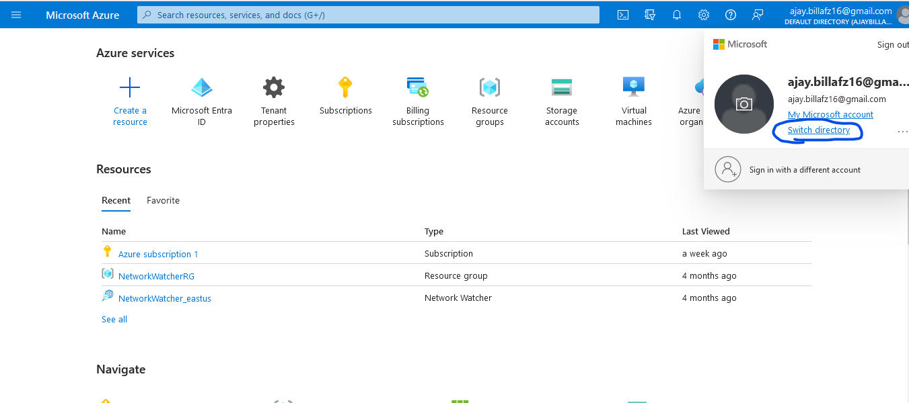
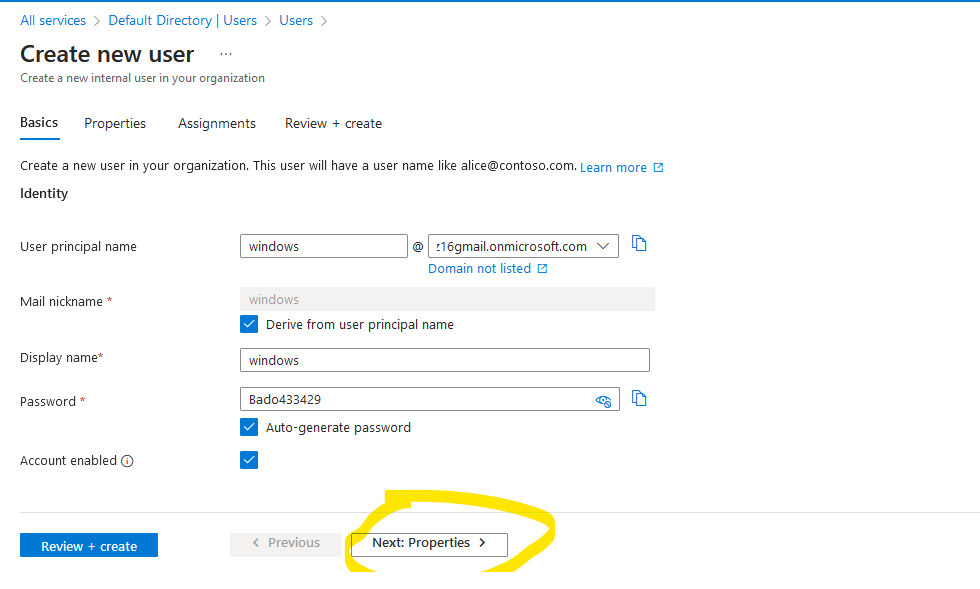
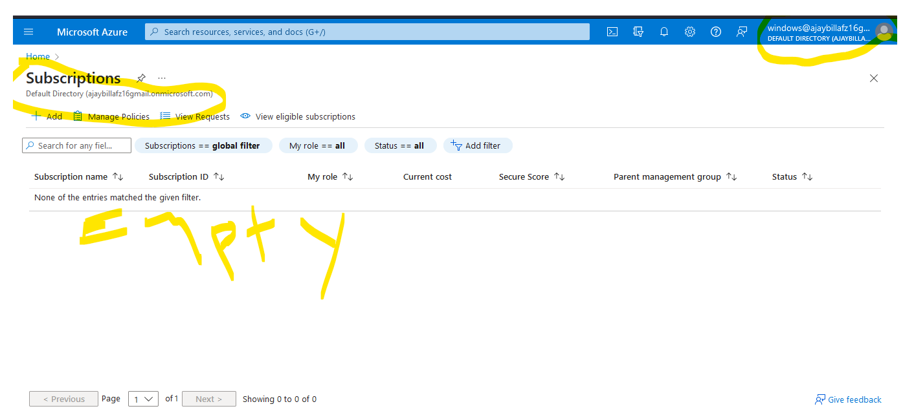
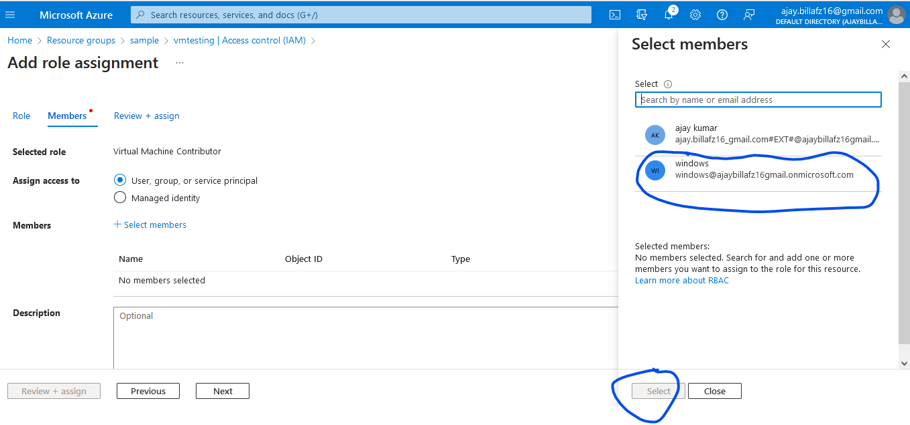
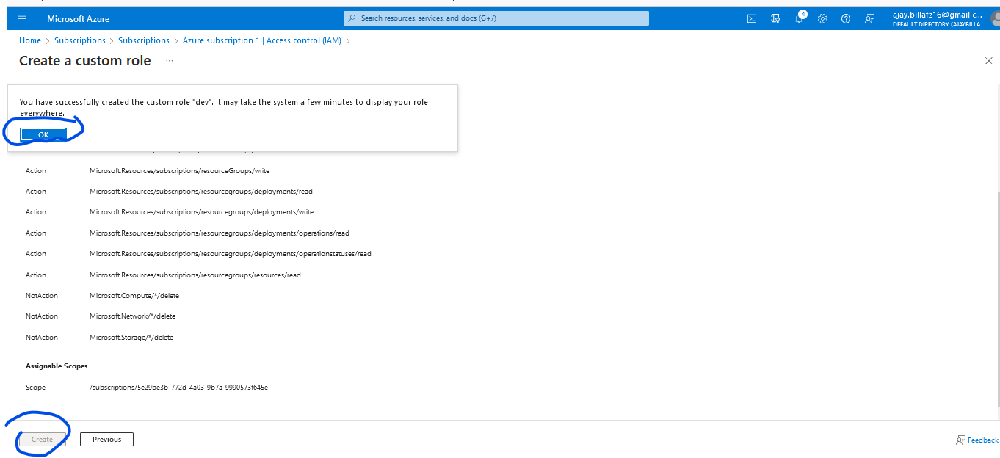
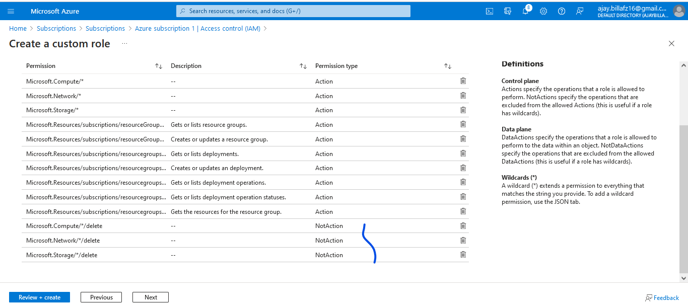
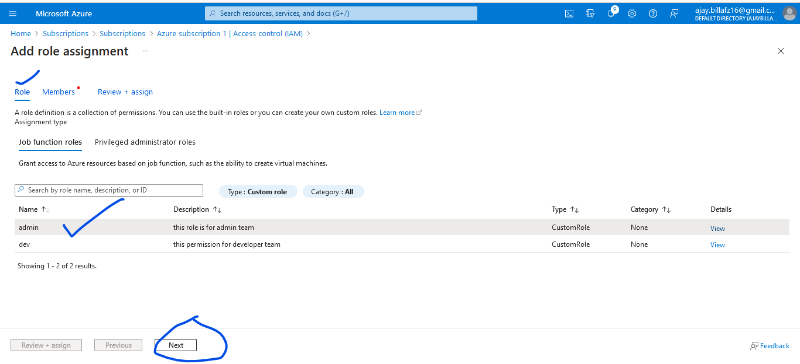
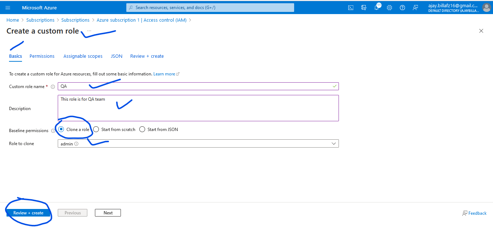

# Identity Use Cases of Azure cloud

## Authentication & Authorization:

* **Authentication:**
  
   * is basic identity information to enter into some system/account 
   * Authentication is a where we can access someone resource or service in the system or their account


* **Authorization:**

  * is about the specifics of what is allowed and what is not.
  * after accessing someone's system or account what resource or service we can access is known as Authorization
  
### Azure cloud provides Identity as a service and user categories

* Direct Azure cloud users:
  * Means (Employees) of the company who can login into azure cloud
* B2C Customers (Swiggy users):
  * Means azure cloud maintenance the users of swiggy app who logins into swiggy app for ordering 
* B2B Customer (Access to external account):
  * Means allowing the companies like deloite/kpmg to do some kind of auditing for swiggy applications 

### Azure cloud Users like (Admins/architect/developer) working for organization to use Azure cloud
* Portal Users:
   * Means login into directley azure cloud portal and use it any resources
* CLI/SDK Users:
   * Means we can access/create any resources through commandline 
* Infra Provision:
   * Means we can create any resource or application and deploy and maintain in azure cloud 

### Azure cloud offers RBAC (Role Based Access Control)    
   * to provide granular access over necessary resources and services.

Azure Free Account Opening Link:
---------------------------------
* [Refer Here](https://azure.microsoft.com/en-us/free/)
* how to check which all services free for 12months and which all services are paid, just click above link and view this page below we will come to know.


Azure cloud Authentication and Authorization Process
------------------------------------------------------
* When we create azure account, the tenant will create and subscription will create 
* so tenant will contain all the users management 
* subscription will have multiple resources groups 
* one subscription will linked to only one tenant cannot be two subscriptions linked to one tenant
* multiple tenant can have two/multiple different subscriptions 

Tenant:
-------

* when we create account tenant will create and tenant will manage the users device and groups 
* Tenant will have all the user information
* Tenant i.e. Azure Active Directory (AAD) manages users, devices and Groups

* Azure Account will have subscriptions. A subscription will be linked to a tenant during azure account creation
* Since Tenant manages user information, if we need users from different domains/company to be logged into azure cloud, then we will sync/federate Tenant to other identity system means that company active directory. The most popular system for managing users in on-premises is microsoft active directory.
* every tenant has tenant id then only azure will know which tenant will you speak about 
* every tenant id will have primary domain 

* when we create azure account default active directory/tenant will be created
* each tenant will have unique tenant id and primary domain `<name>..onmicrosoft.com`  
* every user created will have one id called `<username>@<primarydomain>` 
  * in my case below:
  ```
  admin@ajaybillafz16gmail.onmicrosoft.com
  ```
* We can map our organization domain name by doing some extra steps (will bw discussed later) like below
```
Change from => admin@ajaybillafz16gmail.onmicrosoft.com
To => admin@force1alliedservices.com
```

Subscriptions:
-------------

* Azure Account will have subscriptions and subscriptions will have resource groups and any resource which we created has to be part of some resource group
* subscriptions will have resource group
* subscriptions will be linked to tenant
* subscriptions will have only one tenant not more then that 
* different subscriptions have same tenant. but same subscriptions will not have more then one tenant it is not valid.
* one azure account can have multiple subscriptions 
* account should be fully operate means person should have tenant as well as subscriptions other unable to see resources or service to work with it or create anything 

Active Directory:
------------------

* microsoft has active directory which stores all the information about users, devices ect:-

* for an examples if i want to give access to infosys 50k employees connection to my azure account then i can have connection between azure active directory i.e(tenant) and infosys active directory so that they can login into my azure account.they can login with their user id and password.it will synchronization/federated.


Azure AD Use cases:
--------------------

* User, Group management
* Importing users from existing identities
    * Azure AD Sync/Federation
* **Managing RBAC(Roll Back Access Control) means giving what ever access to the particular groups or individual:**
  * Management Group
  * subscription
  * resource group level
  * resource level
* Other
    * pricing models of azure ad

### To check how tenants my account has
* Follow below screen shots



# Lets Create User in Azure:

* Navigate to azure active directory 
* Lets create user called as `windows`


* Select user and click on new user and create user


* Fill the details below and click on next:properties


* Not required to fill anything since it is just trial in our organization we have to fill all the details
click on next:assignment


* Not required to fill click on Review:create


* Click on create


### After created azure account above screen shots:

* The user principle name is `windows@ajaybillafz16gmail.onmicrosoft.com`
* Now open a different browser of launch inprivate/incognito and navigate to portal.azure.com
* login and check to understand better


* user is created and shaded with yellow pen
* now it is authenticate to azure account but not authorization, and there is no subscriptions it is empty
* 

* IN Azure the permission given at subscription level drills down to all resource groups and resources and the permissions given to the resource group applies to all resources in resource group

* We can apply permission as of now at
  * subscription level
  * resource group level
  * resource level

* Now lets give authorization permission for `windows` user
   * by giving read permissions at subscription level
* Now go back to `root` user means logging into my owner account 
  * By navigating to `subscription` > `Select my Subscription` `> select Access Control` > `Like below screen shot`
  *  

* `Add Role Assignments`


* `Selected members to give access`


* Now login as windows user
* windows user has subscriptions with that he has resource group but only has read/view permission but he is unable to delete anything below screen shot proves it. this is known as authorization

* As we have experimented this user has only read permissions above screen shot.
* now lets give permission to this `windows`user on resource group level `sample` 
* Login in as owner account
  * Navigate to resource group
  
  
  
  
  
  
  
  
* Now Login as windows user in private window and lets check access for windows user


* now lets give permission to this `windows` user on resource level `vmtesting`
Login in as owner account
  * Navigate to resource group inside resource `vmtesting`
  
  
  
  
  
  
  
  
* Now Login as windows user in private window and lets check access for windows user
  


### Subscription giving permission through `Resource Providers` and `Resource Types`
* [Refer Here](https://learn.microsoft.com/en-us/azure/azure-resource-manager/management/resource-providers-and-types) for Azure resource providers and types

* Authorization in Azure is achieved by Role assignment to user principal
* Exact Permissions at subscription/resource group/resource level is set by Role and Microsoft has many pre-defined roles in azure cloud 


* **Azure organizes resources in the following way:**
  * Every subscription will have resource providers which provide resource types and actions.
  * **Azure resource providers and resource types to check in portal refer below link:**
       * [Refer Here](https://learn.microsoft.com/en-us/azure/azure-resource-manager/management/resource-providers-and-types)
* To check existing resource providers


* types of resources we can create for `microsoft.compute` resource providers


* API Version of resources providers
  * New updates will lead to new API Versions
  * which means for every resources in azure will get new release, which will add more features
  

* When we want to give permissions we need to know resource type and actions.
* Match Service to resource provider [Refer Here](https://learn.microsoft.com/en-us/azure/azure-resource-manager/management/azure-services-resource-providers) 
  
* Figure out operations by resource provider [Refer Here](https://learn.microsoft.com/en-us/azure/role-based-access-control/resource-provider-operations)
 

Find operations to create, view, delete and update virtual networks:
---------------------------------------------------
* Find the `resource providers` and `Azure services` for `Microsoft.Network`
  * [Refer Here](https://learn.microsoft.com/en-us/azure/azure-resource-manager/management/azure-services-resource-providers) and search for `resource providers` and `Azure services` for `Microsoft.Network`
  

* Now Find the resource Type in the azure portal for `Microsoft.Network`
  * Navigate to azure subscriptions
  
  * click on Resource providers and search for `Microsoft.Network`
  
  * click on `Microsoft.Network`  Resource providers and search for Resource types  `VirtualNetworks`
  
  * Now my resource provider and resource type is `Microsoft.Network/virtualNetworks`
* This above search for resource provider and resource type we search in two types
  * Either search in azure portal under subscriptions
  * Nor by below azure operations search link, choice is ours

* Now search for Azure resource provider operations in the following page [Refer Here](https://learn.microsoft.com/en-us/azure/role-based-access-control/resource-provider-operations)
 * click on `Microsoft.Network`
 
 * Then search like below
 


Azure custom roles(RBAC) using the Azure portal
-------------------------------------------------

### Scenario:
* I have to create 3 types of users
   * Developers
   * QA
   * admin 
* The permission is scoped at subscription level for these above users
* **Developers:** 
    * should be able to create, modify but not delete of below resources
      * network
      * storage
      * virtual machines
* **QA:** 
   * should be able to view all, but not update of below resources
      * network
      * storage
      * virtual machine
* **Admin:** 
    * should be able to do any thing, means all the permissions 

### Solution:
* Lets Create 3 groups
   * Developer
   * Admin
   * QA    
* Steps:


* Lets Create a user called `test` to check the access for Developer


* **Lets create a custom RBAC (Role Based Access Control) from azure portal:**
* There are three ways that you can start to create a custom role (RBAC) from azure portal
  * clone an existing role
  * start from scratch
  * start with a JSON file
* [Refer Here](https://learn.microsoft.com/en-us/azure/role-based-access-control/custom-roles#custom-role-example) for Azure custom roles Examples
* [Refer Here](https://learn.microsoft.com/en-us/azure/role-based-access-control/built-in-roles?source=recommendations) for Azure built-in roles
* [Refer Here](https://learn.microsoft.com/en-us/azure/role-based-access-control/custom-roles-portal?source=recommendations) for Create or update Azure custom roles using the Azure portal
### Steps: `start from scratch` Way/Option: 
* to create custom role for  `developer` and to access `test` user for testing the access


* Now add permission to `virtual machines`


* Now exclude permission to `virtual machines`

* Now add permission is known as `Action` and exclude permission is known as `NotAction` both looks like this below screen shot

* Now adding permission and exclude permission done via portal selected option `start from scratch`,,,, `Json file looks like this` below screen shot.

* by adding permission and excluding permission choosing the `start from scratch` way/option is little bit painful because we needs to add/exlcude via azure portal.
* So ill be using another way/option called `start with Json file` which is little easy method.

### Steps: `start with a JSON file` Way/Option: 
* add permission and exclude permission on 
   * virtual machine
   * network
   * resource group
   * storage
* How it looks Json file with permissions


* How it looks permissions on azure portal UI

* Now review and Create a custom role



* Now search custom role which is created


* Now add custom role `dev` to user `test`


* Now check the access for user `test` and group `Developer`
  * Open new private windows and login with `test` user credentials
  
  * Now check resources access for user test
    * Storage
    * Virtual machine
    * Network
    
   
  
  * So Now we have given user `test` all the access except deletion permission, now we will try to delete and check 
  
  * it unable to delete the resources so as we expect custom role is working 

### Lets create custom role(RBAC) for admin group
* Admin can do anything, means create, view, update and delete
* so `NotAction` should not write anything.
* user is already there `test` user so for this same user we will add the role assignments of admin and will check the access for `test` user for `admin` role.  
#### Steps:
* clone an existing role from azure portal way/option
* we will use clone an existing role because, role for admin is same as developer which we wrote above, only thing needs to remove `NotAction` from the Json file, since admin can do anything. 
* Lets create the custom role for admin with option of clone an existing role of `dev`


* Should remove `NotAction`


* After remove the `NotActions` that becomes admin role and looks like this below


* Now review and create custom role for admin

* Remove the role assignments for user `test` with `developer`


* Now Add role assignments for user `test` with `admin`




* Open new private windows and login with `test` user credentials
* check the access for user `test` and group `admin` role
* now user `test` able to delete the resource so as we expected `admin` role is working


### Lets create custom role(RBAC) for QA group
* QA should have only read permission 
* user is already there `test` user so for this same user we will add the role assignments of QA and will check the access for `test` user for `QA` role.
#### Steps:
* clone an existing role from azure portal way/option
* we will use clone an existing role because, role for admin is little bit same as QA and also we will modify once clone is done
* Lets create the custom role for QA with option of clone an existing role of `admin`
* here i am not providing any screen shots becuase already i have given screen shots for dev and admin so only ill add the steps what should be done
* clone the admin role in azure portal
* modify the QA role which is cloned from admin role as per QA permissions



* Now remove the role assignments for test user with admin
* Now add the role assignments for test user with QA

* Open new private windows and login with `test` user credentials
* check the access for user `test` and group `QA` role
* now user `test` is unable to delete the any  resource because has only read permission so as we expected `QA` role is working


### Activity:1
* Create a custom role called as `storageadmin` who can
  * read anything (compute, network and storage)
  * on storage write,update,delete permissions

**Steps:**
* Lets create custom role called  `storageadmin` with start with Json file way/option

   

* Now add role assignments for user `test` with `storageadmin` role


* Login in private window for user `test` crendentials and check the access
* user `test` able to view or read on `compute` and `network` but not delete


* user `test` able create and read on `storage`


* user `test` able delete the  `storage`


### Activity:2
* Lets create custom role for kubernetes cluster
* terms and conditions on custom role for azure kubernetes cluster
  * user can do anything on Azure Kubernetes Service but not delete cluster 
  * user can have read permission of everything else, means on all other services in azure user can have read permissions.
* **Steps:**


```Json
{
    "properties": {
        "roleName": "experiment on k8s",
        "description": "this role is for experimenting on kubernetes services",
        "assignableScopes": [
            "/subscriptions/5e29be3b-772d-4a03-9b7a-9990573f645e"
        ],
        "permissions": [
            {
                "actions": [
                    "Microsoft.ContainerService/*",
                    "*/read",
                    "Microsoft.Resources/*"
                ],
                "notActions": [
                    "Microsoft.ContainerService/managedClusters/delete"
                ],
                "dataActions": [],
                "notDataActions": []
            }
        ]
    }
}
```

Azure Management Groups/Azure Policy
------------------------------------


