Networking for Cloud Computing
------------------------------

### Concepts required
* IPv4 ip addressing
* subnetting
* Routing
* NAT
* Gateways
* DNS
* Virtual Private Networks (VPN)
* WAN (Wide Area Networks)

### Networking Basics
* A device/system connects to the network with the help of network interface.
* Network interface gets an ip address which is allocated by DHCP (Dynamic Host Configuration Protocol)
* In our home networks, the DHCP server is inside your router
* DHCP maintains list of available ip addresses and the whole range of network
* Range of network is ip address range
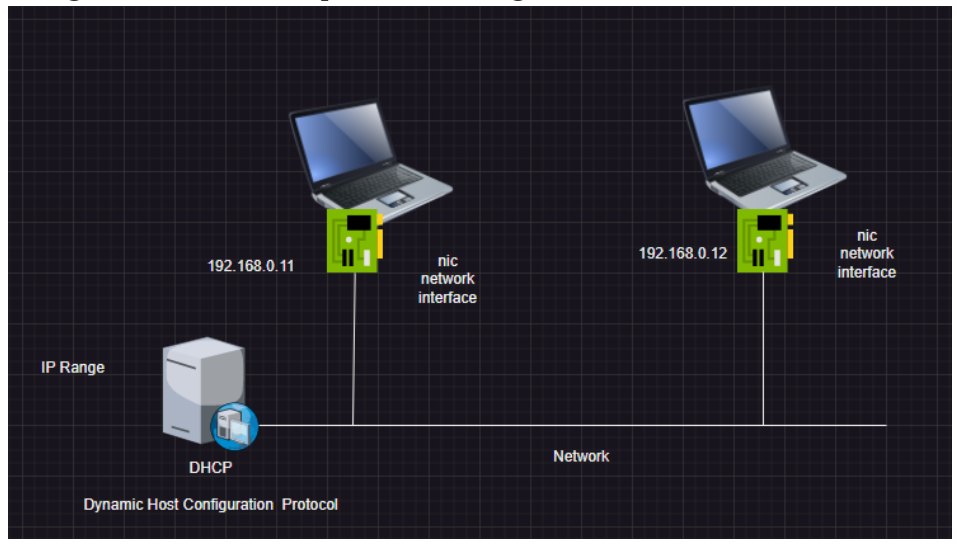
* open the command prompt or powershell
  
  `ipconfig`

* The details include in below screen shot
   * IP Address
   * Subnet Mast
   * Default Gateway
   

### Ip Address

* Ip Address = Network Id/Address + Device/Host Id/Address

  `192.168.0.198`
* subnet mask helps in separating network id and host id
* ip v4 is an ip address which is 32 bit and represented in 4 octets
 
   `X.X.X.X`

* Each position is 8 bits which is called as octet
* [Refer Here](https://www.mymathtables.com/numbers/power-exponentiation/power-of-2.html) for 2 power table
* range of total ip v4 addresses

  `0.0.0.0 to 255.255.255.255`
* Subnet mask is used to findout network id and host id
```
     1   2  3 4
ip: 192.168.0.10
sm: 255.255.255.0

octects with 255 => 1.2.3

network id: 192.168
host id: 10


ip: 10.10.0.17
sm: 255.255.0.0

network id: 10.10
host id: 0.17

ip: 101.245.1.7
sm: 255.0.0.0

nid: 101
host: 245.1.7
```
  * Two devices can communicate directly if the network id’s match
  * For connecting to device which is not part of your network then how ?
     * Router is a device in networking which can forward packet from one network to other network
  * When we try to connect to external devices router will have rules defined to forward packets.

* Example to see how networks travels

  `tracert directdevops.blog`

    * output below
    


### Size of network
   * number of devices that can be connected to the network i.e. number of hosts/devices that can be connected in a network

```
ip: 192.168.100.111
sm: 255.255.255.0

nid: 192.168.100
hid: 111

with in a network
nid = fixed = 3 octets
hid = variable = 1 octet = 8 bits => 2^8 hosts => 256
nid = 192.168.100.0
broadcast = 192.168.100.255
i.e
size of network => 2^ (host id bits) - 2
                => 2^8 -2
                => 254


ip: 10.100.102.32 
sm: 255.255.0.0
nid = 2 octets
hid = 2 octets = 16 bits
size => 2^16 - 2
     => 65536 - 2
     => 65534

```

   * In every network we can use two ip addresses
      * 0: this represents network id
      * 255: this represents broadcast address

   * To create networks of different sizes, we have two approaches
      * Classful networking
      
      * Classless interdomain routing (CIDR)
      
   * CIDR Approach  
```
ip: 192.168.100.111
sm: 11111111.11111111.11111111.00000000

nid => number of consecutive 1's = 24 (fixed)
hid => 8 (number of consecutive 0's)

for= 2^ (hid bits) - 2
   = 2^8 -2 = 254

ip: 192.168.100.111
sm: 11111111.11111111.11111110.00000000

size = 2^9 - 2 = 512 - 2 = 510
```
   
   * I have 2000 devices what should be by subnet mask
```
2^n-2 ~= 2000

2^n ~ = 2000
n = 11

sm: 11111111.11111111.11111000.00000000
    255.255.248.0
```

   * I have 12000 devices what should be my subnet mask
```

2^n - 2 ~= 1,20,000
n = 17 (number of zeros)
N = 32 - 17 = 15
sm: 11111111.11111110.00000000.00000000
    255.254.0.0
```

   * I have 27 devices what should be my subnet mask
```
2^n -2 ~= 27
n = 5
N = 32-5 = 27

sm: 11111111.11111111.11111111.11100000
    255.255.255.224
```

   * I have 2000000 devices what should be my subnet mask
```
2 ^ n -2 ~= 2000000
n = 21
N = 32 - 21 = 11
sm: 11111111.11100000.00000000.00000000
    255.224.0.0
```

   * public network: This is an ip accessible from internet
   * private network: These are reserved for private networking
   

   * CIDR Notation

    `x.x.x.x/N`      

### Expand CIDR

* Sample 1
```
192.168.0.0/24
N = 24
n = 32 -24 = 8
ip:      192.     168.       0.       0
sm: 11111111.11111111.11111111.00000000
start: 192.168.0.00000000 => 192.168.0.0
end:   192.168.0.11111111 => 192.168.0.255
```
* sample 2
```
cidr: 10.0.0.0/11
N = 11 (number of ones)
n = 32 -11 = 21
sm: 11111111.11100000.00000000.00000000

ip:       10.       0.       0.       0
sm: 11111111.11100000.00000000.00000000
range: 10.000xxxxx.xxxxxxxx.xxxxxxxx
start: 10.00000000.00000000.00000000 = 10.0.0.0
end:   10.00011111.11111111.11111111 => 10.31.255.255
```

* sample 3
```
cidr: 172.16.0.0/12
N = 12
n = 32 -12 = 20

ip:       172.      16.       0.       0
sm:  11111111.11110000.00000000.00000000
ip:        172.00010000.00000000.00000000
range: 172.0001xxxx.xxxxxxxx.xxxxxxxx
start: 172.00010000.00000000.00000000 => 172.16.0.0
end: 172.00011111.11111111.11111111 => 172.31.255.255
```

* sample 4
```
192.168.128.0/22
N = 22
n = 32 - 22 = 10
sm: 11111111.11111111.11111100.00000000
ip:      192.     168.100000xx.xxxxxxxx  
start:   192.168.128.0 
end:     192.168.131.255
```

### Observations:
* network id's all = 0's
* broadcast id's all = 1's or 255
* Capital N = all 1's 
* Small N = total number of network id bits 

* Expand CIDR
```
172.16.0.0/21
range:   172.      16.00000xxx.xxxxxxxx
start:   172.      16.00000000.00000000 = 172.16.0.0
end:     172.      16.00000111.11111111 = 172.16.7.255
SM: 11111111.11111111.11111000.00000000
```
* What is bigger network in this
   * A: 172.16.0.0/15 => 2 ^ (32-15) – 2 => 2^ 17
   * B: 192.168.0.0/17 => 2 ^ (32-17) – 2 => 2^15

### Subnetting

  * Subnet is smaller network.
  * Subnetting is an activity of creating smaller networks from large network

### Scenario – 1
* We need to create a network capable of 1000 devices and create 4 subnets with each capable of connecting 250 devices

* Network
```
2^n - 2 ~= 1000
N = 10
n = 32 - 10 = 22

cidr = 192.168.0.0/22
```

* Individual subnet
```
2^n - 2 ~= 250
N = 8
n = 32 - 8 = 24
```

* subnetting

```
SM (Network) = 11111111.11111111.11111100.00000000
SM (subnet)  = 11111111.11111111.11111111.00000000
      ---------------------------------------------
               11111111.11111111.111111xx.00000000
    Net ip          192.     168.00000000.       0 
    s1  ip          192.     168.00000000.        => 192.168.0.0/24
    s2  ip          192.     168.00000001.        => 192.168.1.0/24  
    s3  ip          192.     168.00000010.        => 192.168.2.0/24
    s4  ip          192.     168.00000011.        => 192.168.3.0/24
```


### Scenario: 2
* Create a network with 2 subnets each of 5000 devices
* Overview

* Network
```
2^n - 2 ~= 10000
N = 14
n = 32 - 14 = 18

CIDR: 172.16.0.0/18
```
* Individual subnet
```
2^n-2 ~= 5000
N = 13
n = 32 - 13 = 19

```
* Subnetting
```
Network:  172.16.0.0/18
SM: (Network) =  11111111.11111111.11000000.00000000
sm : (subnet) =  11111111.11111111.11100000.00000000
-------------------------------------------
                         00y00000.   
                         00000000      => 172.16.0.0/19
                         00100000      => 172.16.32.0/19
```
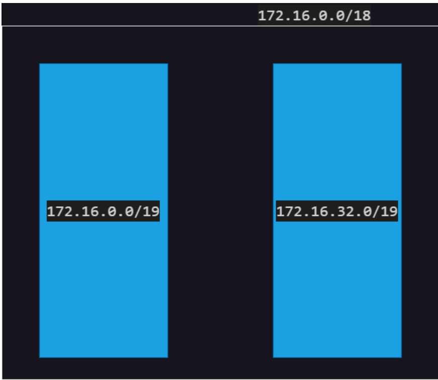

### Scenario 3: 
* Create 4 subnets with size to host 100 devices
* Problem

* Network
```
2^n ~= 400
n = 9
N = 32-9 = 23
CIDR: 10.0.0.0/23
```
* Individual subnet
```
2^n -2 ~= 100
n = 7
N = 25
```
* Subnetting
```
ip:  10.0.0.0/23
N-SM: 11111111.11111111.11111110.00000000
s-SM: 11111111.11111111.11111111.10000000
      -----------------------------------
                        0000000y.y0000000
                        00000000.00000000 = 10.0.0.0/25
                        00000000.10000000 = 10.0.0.128/25
                        00000001.00000000 = 10.0.1.0/25
                        00000001.10000000 = 10.0.1.128/25
```

### Scenario: 4 
* I need 8 subnets of 30,000 devices each i.e. total 2,40,000 devices
* Network
```
2^n -2 ~= 240000
N = 18
n = 32 -18 = 14
CIDR: 10.0.0.0/14
```
* subnet
```
2^n - 2 ~= 30000
N = 15
n = 32 -15 = 17
```
* Subnetting
```
network sm: 11111111.11111100.00000000.00000000
subnet  sm: 11111111.11111111.10000000.00000000
--------------------------------------------------
                  10.000000yy.y00000000.
                  10.00000000.000000000. => 10.0.0.0/17
                  10.00000000.100000000. => 10.0.128.0/17
                  10.00000001.000000000. => 10.1.0.0/17
                  10.00000001.100000000. => 10.1.128.0/17
                  10.00000010.000000000. => 10.2.0.0/17
                  10.00000010.100000000. => 10.2.128.0/17
                  10.00000011.000000000. => 10.3.0.0/17
                  10.00000011.100000000. => 10.3.128.0/17
```

NAT Gateway
-----------
* Network Address Translation is required to provide internet access to private networks
* Nat will transfer our request from router with public ip and takes request from destination and again forward request to router with our home private ip 


DNS
----
* Domain Naming Server/Domain Name System: The major responsibility of DNS Servers are to maintain records of Domains
* DNS Servers maintains records
   * Name to IP
   * Name to Name
* DNS Record Types: [Refer Here](https://www.site24x7.com/learn/dns-record-types.html)


Azure Global Infrastructure
---------------------------
* [Refer Here](https://datacenters.microsoft.com/globe/explore) for Azure Global infrastructure
* Top level infra
   * Region: Geographical location
       * Types:
          * Region with Zones
          * Regions without Zones
   * POP (Points of Presence)
       * Usecases:
          * Network connectivity (Express Route) leased line from internet provider
          * Caching. (Content Delivery Networks) near location copy of any data
   * 5G [Refer Here](https://azure.microsoft.com/en-in/products/private-5g-core)

* Which Region to Choose ?
  * Go closer to your customers[Refer Here](https://azurespeedtest.azurewebsites.net/)
  * Regional Features


Azure Virtual Networks (Vnet)
-----------------------------
* [Refer Here](https://learn.microsoft.com/en-us/azure/virtual-network/virtual-networks-overview) for official docs
* Azure virtual networks is a service offered by Microsoft Azure to manage networks
* Azure Virtual Network is a private network.
* If we need to connect any resources to the network, we need to have subnet.
* In the case of virtual machine, subnets and vm are connected via network interface (nic). This nic gets a private ip address from subnet range

* By default azure vnets will have internet connectivity
* If your network interface (vm) needs to be accesed directly from internet, we can create a public ip and attach to the nic,below screen shot.

* in azure subnets can belong to two zones, means we can create vm of same subnets in the different zone
* in aws and gcp subnets belongs to zones not a region so same subnets can be created in only one zones not in multiple zones
* refer below screen shots for azure subnets in zones


### Creating a VM and Impact of network, subnet and public ip
* In Azure there are no default networks, you can use what is present in your account or create a new network
* Examples below


### Terms
  * Latency
    * [Refer here](https://www.azurespeed.com/Azure/Latency) to check azure latency
     

### Lets create a virtual network in a region
* name: ntier
* cidr range is known as (address space): 192.168.0.0/22
* We will be having 4 subnets
   * web: 192.168.0.0/24
   * app: 192.168.1.0/24
   * db: 192.168.2.0/24
   * mgmt: 192.168.3.0/24
* [Refer Here](https://learn.microsoft.com/en-us/azure/virtual-network/quick-create-portal) for Azure portal to create a virtual network
* **Steps:**


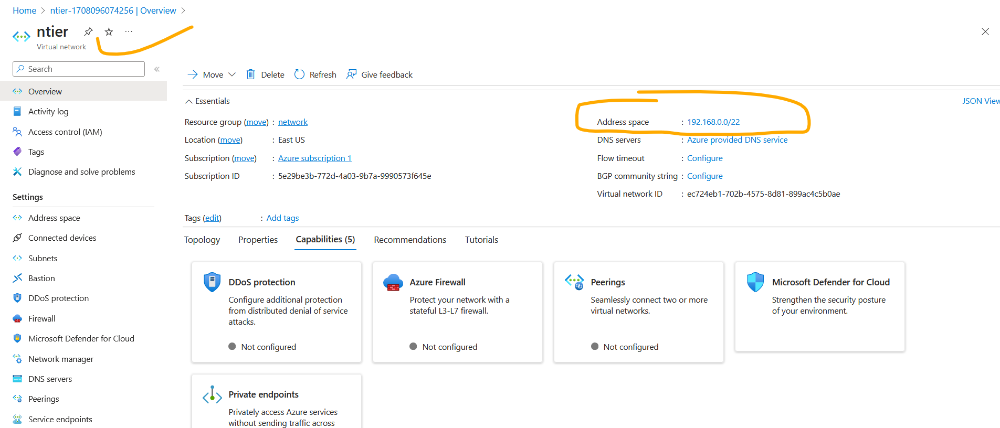

* Like below screen shot we have created the network with subnets

* When we try to create a vm in one of the subnets a nic is created. There will generally be Network Security Group attached to nic.

* If we need to access publically, then the nic will be associated with public ip address

* Lets create vm in above network with web subnet by giving public ip address


* check random public ip created but subnet has assigned the private ip for this vm for nic below screen shot

* Now Lets login into vm and cross check vm get internet or not and also we are able to login or not since we have opened port `22` and `80`

* we are able to login and vm is getting internet above screen shot proof.
* If i try to connect the vm which is created from my laptop with below command, its not connecting it, because we have opened port only `22` and `80` so apart from this two port others port will deny

* Now lets create one more vm with same network into app subnet but lets not give public ip.


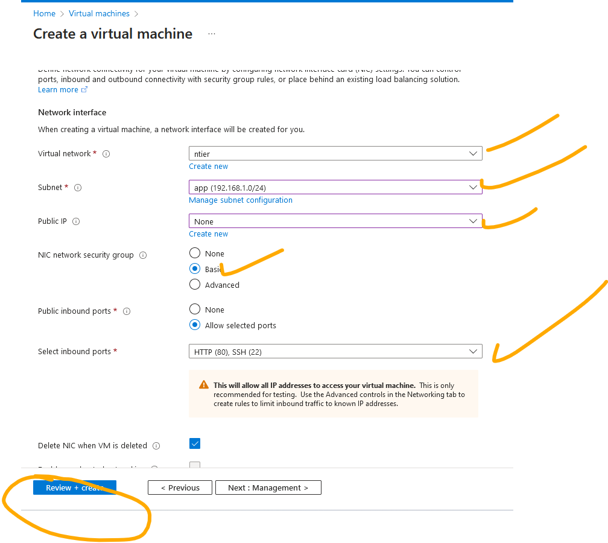


* Now observe below screen shot this vm has not created public ip, only got private ip 

*  In Azure vnets by default all internal communication is allowed by nsg

* Now with in the same network two vm's can communicate each, it is possible, by vm which has public ip from that vm we can connect to other vm which is not having public ip this process is called `jump box/host` or `bastion host`
* From webvm i am able to connect to appvm below screen shot


* In Azure when we create subnet the size of subnet is 2^n-5 [Refer Here](https://learn.microsoft.com/en-us/azure/virtual-network/virtual-networks-faq#are-there-any-restrictions-on-using-ip-addresses-within-these-subnets)

* [Refer Here](https://learn.microsoft.com/en-us/azure/virtual-network/virtual-networks-faq) for Azure Vnet faq


Network Security Groups (NSG)
-----------------------------
* NSG’s can be attached to Network Interface and also to subnets
* NSG’s have two types rules
   * incoming/inbound (ingress)
   * outgoing/outbound (egress)
* Rules have a number which defines priority. Lower the number higher the priority
* NSG’s have default rules
  * Lets create NSG and check default rules
  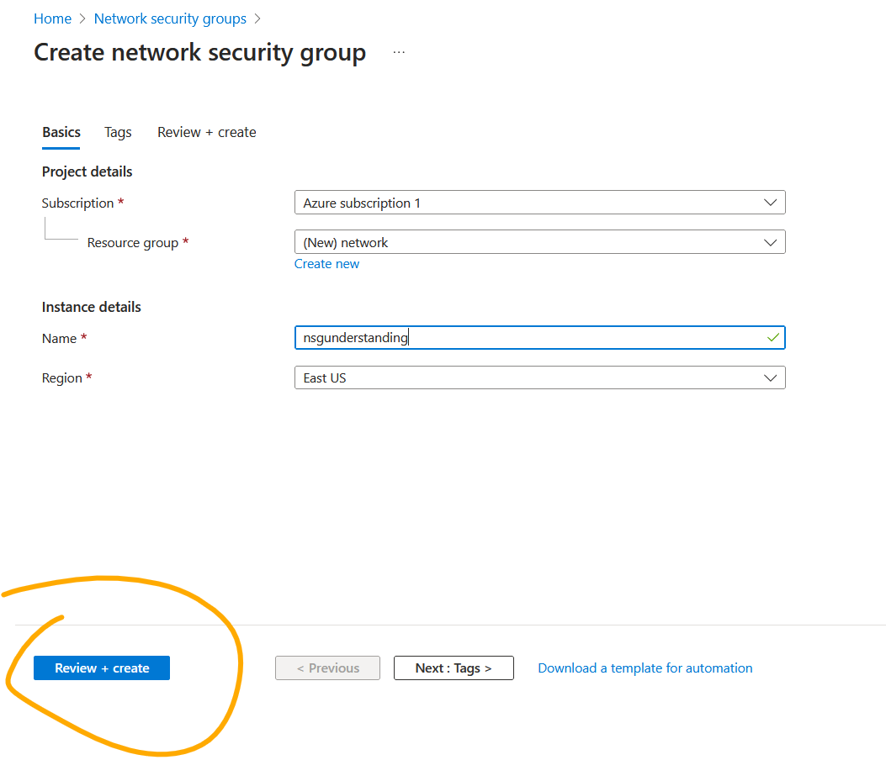
  
  
  
* NSG Each rule will have:
   * Priority:
   * Port: port no
   * Protocol:
       * TCP
       * UDP
       * ICMP
   * Source:
   
   * Destination: Will have similar options as Source
   * Action: Allow or Deny
* IpAddress in source of destination we will be giving CIDR Ranges. This works on the basis of network id
   * specific network: 10.10.0.0/16
   * specific ip address: 100.100.100.100/32
   * Any ip address: 0.0.0.0/0
* Best Practices:
   * Start NSG Rules from priority numbers such as 300 (but not 100)
   * Between rules should have some numbers left

### Scenario 1: Create NSG For the below
* Overview
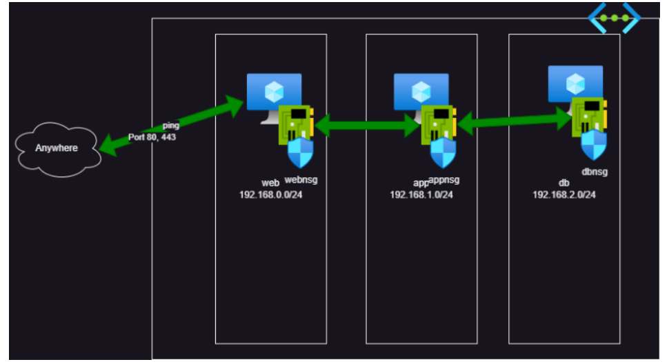
* Web NSG:


* App NSG:
  * it should allow only internal communication with in vnet & no connectivity from internet. That is what we get as default rules in NSG


* DB nsg: 
   * deny incoming from web subnet

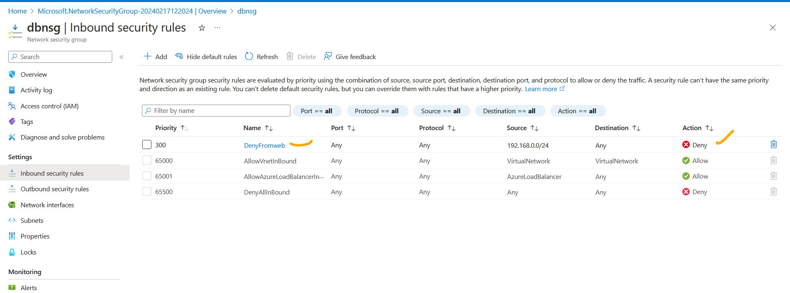

### Scenario 2: Create NSG For the the below
* Overview

* Web server runs on port 443 (TCP)
* app server runs on port 5000 (TCP)
* db server run on port 3306 (TCP)
* Allow 22 port communication from any ip with in network for web,app,db servers.

### Scenario 2: 

* Create a vnet with name ntier with cidr range of `10.10.0.0/22`
* Create 4 subnets
   * web: 10.10.0.0/24
   * app: 10.10.1.0/24
   * db: 10.10.2.0/24
   * mgmt: 10.10.3.0/24

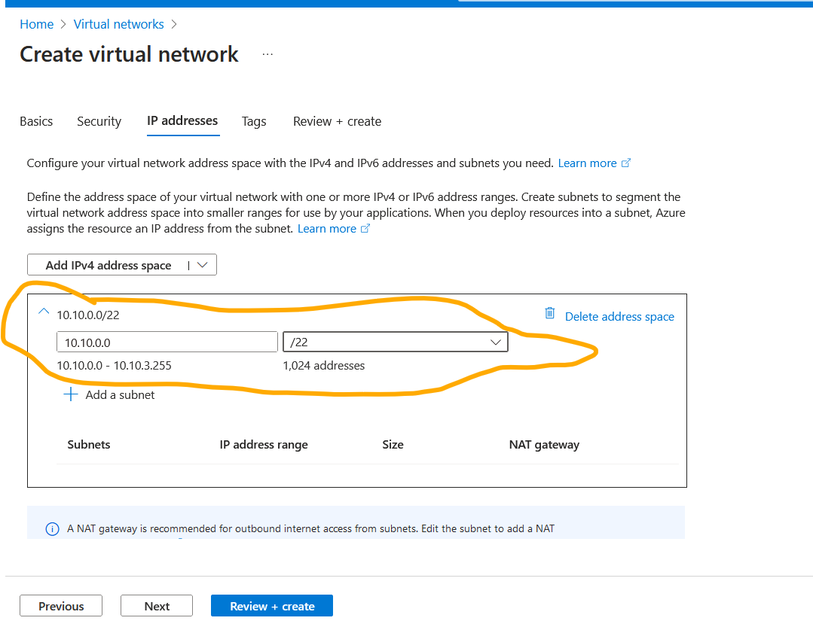


* Create a web nsg, appnsg and db nsg
   * Webnsg:
   
   
   * Appnsg:
   
   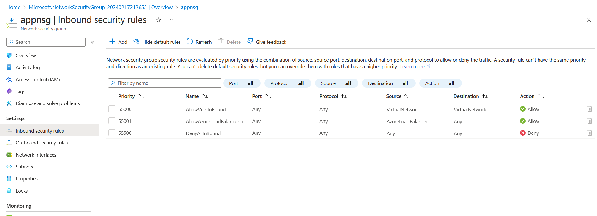
   * DBnsg:
   
   
* Create a linux vm in web subnet with public ip


* Create a linux vm in app subnet with public ip, even if we create public ip it is not useful because we have not open all the ports in security groups it will block and make as private, so jus for fun we are creating public ip. 


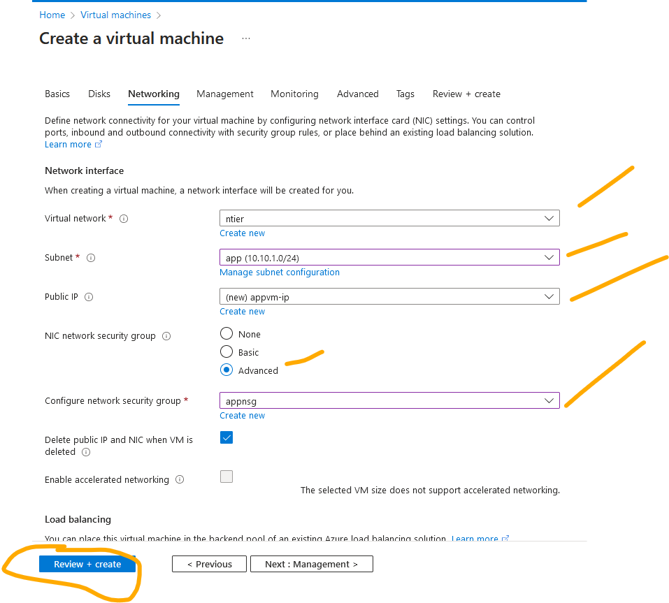


* Create a linux vm in db subnet with public ip, even if we create public ip it is not useful because we have not open all the ports in security groups it will block and make as private, so jus for fun we are creating public ip.


* Login into webvm and cross check connections

   `ssh username@ip`
   * we are able to login since ssh port 22 is open in webnsg
   
   * ping is working from webvm and also i can ping from my laptop local windows terminal to webvm it is working since we have open ping port from nay where
   
   
   * ping will work from webvm to appvm
   
* Login into appvm cross check the connections, if i ssh into it (it will not be allowed directly)

* why it is unable ssh into appvm is we have not opened any port apart from default nsg so.
* only one way to connect appvm is from webvm because we have opened AllowVnetInBound within the network and also we need use private ip to connect from webvm to appvm.


    `ssh dell@10.10.1.4`
* Now let me ping webvm, i am able to ping below screen shot proves it.
 
* from appvm i am able to connect to internet
   
* Login into dbvm and cross check the connections

* unable to ssh into dbvm because we have not opened any port apart from default above screen shot proves it.
* Let me try to ping from webvm to dbvm 

* unable to ping because we have wrote in nsg rule as deny access from webvm, above screen shot proves it.
* even cannot ssh from webvm to dbvm below screen shot proves it.

* so to connect dbvm only way is according our artitecture of overview, is connect to webvm and from webvm connect appvm and from appvm connect to dbvm. below screen shot will proves it.
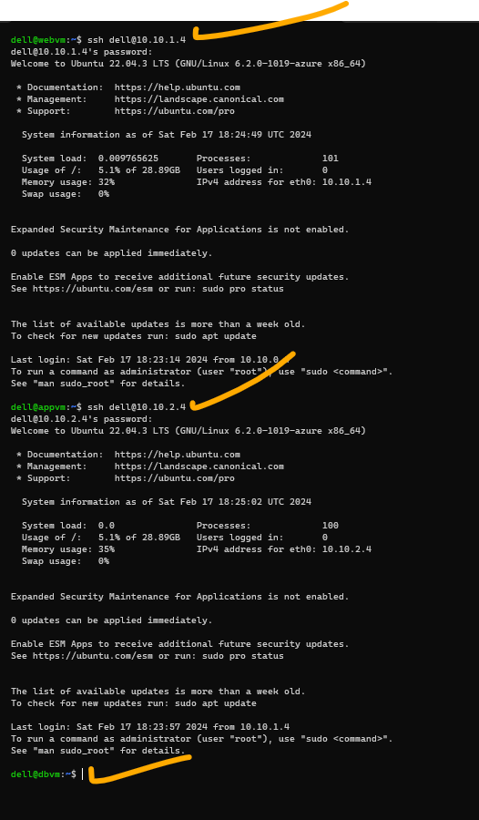
* from dbvm i am able to connect internet 

* So now really we dont need public for dbvm and appvm which is we created, it is no sense of having public ip as above test case
  * So we will remove public ip from dbvm and appvm
  
  
  
  
* So now when after removing the public ip from appvm and dbvm it is unable to get internet access because when public ip is associate to any vm they will get internet access.  


* **Testing network security groups:**
  * Testing can be done by creating NSG with vms and testing
  * The other effective way to check NSG with VM's is Network watcher => NSG Diagnostics
  * example we are checking now from my local ip can i connect to vm which created in azure appvm.?
  
  * below is the result 
  
  
  * **packet capture:**
    * with the help of packet capture we can monitor the vm's behavior or all the packets which is comes in and out and can watch the logs.
    
    
    
    
    

### Application Security Groups
* ASG is a just an labelling for nsg or vm's
* ASG can filter network traffic according to asg attached to nic’s irrespective of which subnet they belong
* if we want to restrict any NSG rule, not required to work on ip address rather we use ASG this is the benefit.
* [Refer Here](https://learn.microsoft.com/en-us/azure/virtual-network/application-security-groups) for Application security groups
* Lets create ASG for webASG and appASG


* Lets create a vm with NSG rule for webvm


* Lets create a vm withNSG rule for appvm


* Now attach APP application security groups to appvm


* Now Now attach web application security groups to webvm


* Now login into webvm and ping to appvm, able to ping

* Now from webvm ssh to appvm , able to login
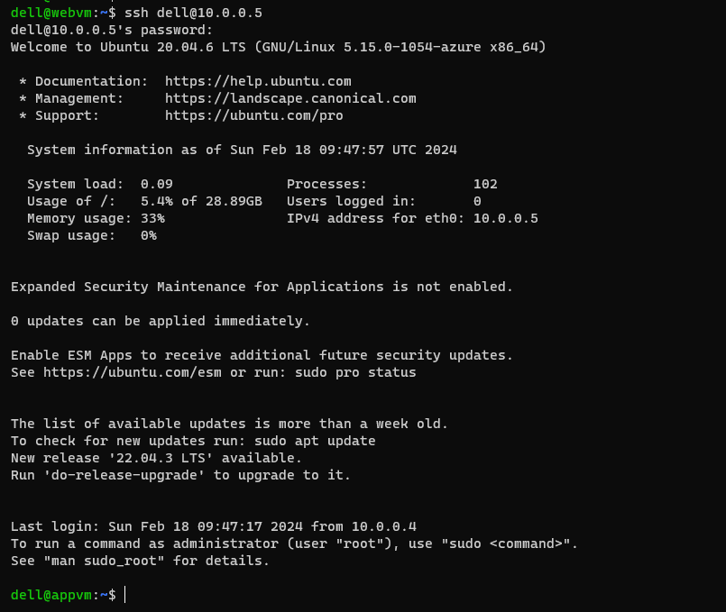
* Now do some changes in APPNSG to see result as we expect, here i am expecting two result
  * from webvm should able to ping appvm
  
  
  
  * its done result is success webvm is able to ping appvm above screen shot proves it.
  * from webvm should not ssh to appvm
  
  
  
  * above screen shot proves from webvm to appvm it is unable to ssh

### Routing in Azure vnet
* Azure routes means sending a traffic between all subnets within a virtual network
* In every Azure VNet we have a router with system default routes defined [Refer Here](https://learn.microsoft.com/en-us/azure/virtual-network/virtual-networks-udr-overview)
* In Azure Routing we have
     * System routes
     * user defined routing(Custom routes)

### Azure NAT(Network Address Translation) Gateway
* NAT Gateway means to get internet connection for our private resources
* [Refer Here](https://learn.microsoft.com/en-us/azure/nat-gateway/nat-overview)
* **Experiment:**
* **Steps:**
  * create virutal network `ntier` with 3 subnets `web`,`app` and `db`
  
  
  
  * Create NAT Gateway and attach to app and db subnet or Configure virtual network subnet to use a NAT gateway
  
  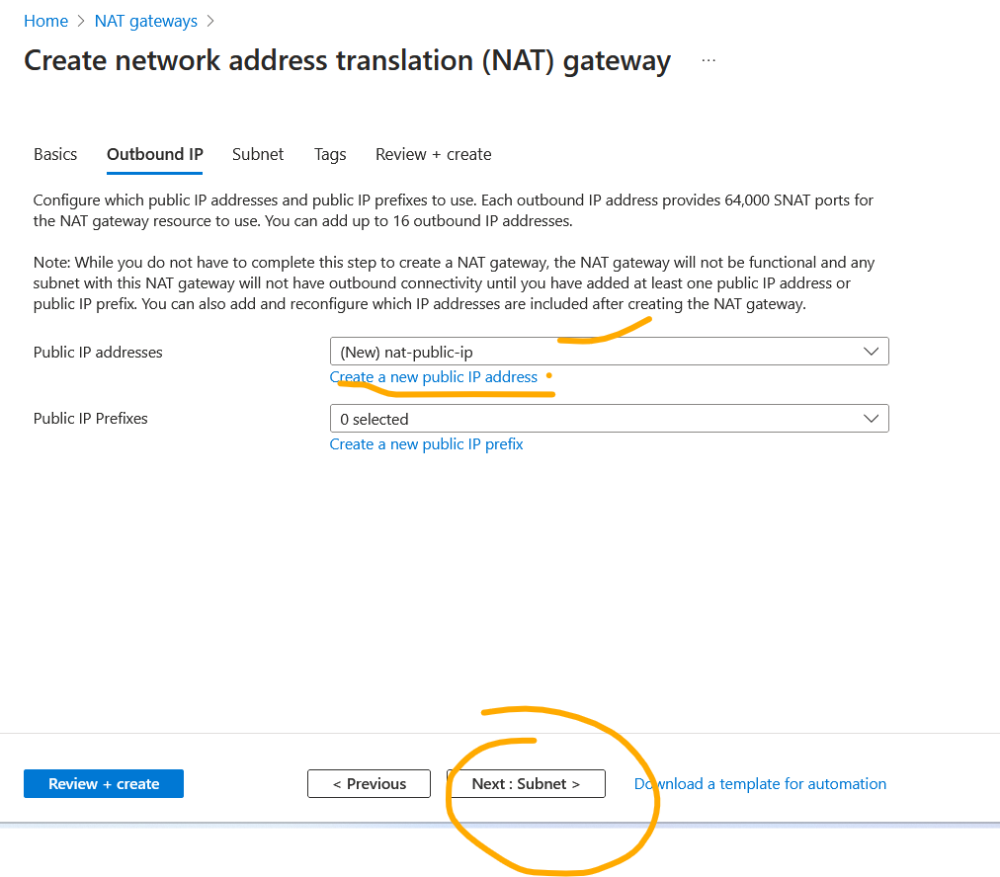
  
  
  * Create security group allow ping 
  
  
  * Lets create vm in ntier vnet with web subnet and allow ssh port 22 to it.
  
  
  
  * Lets create vm in ntier vnet with app subnet and allow ping to it, without public ip
  
  
  
  * Lets create vm in ntier vnet with db subnet and allow ping to it, with out public ip
  
  
  
  


