How to create reusable image from vm in azure
---------------------------------------------
* Lets create resource group and vm for ubuntu
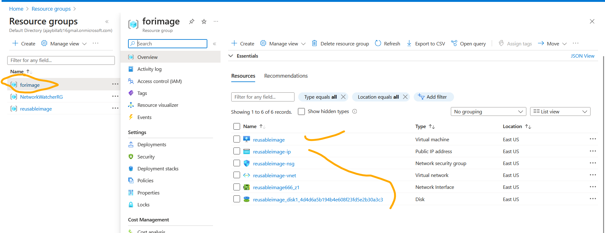
* creating a vm image in gallery
  * create resource group to store vm image gallery
  * Create a vm image captured from vm
  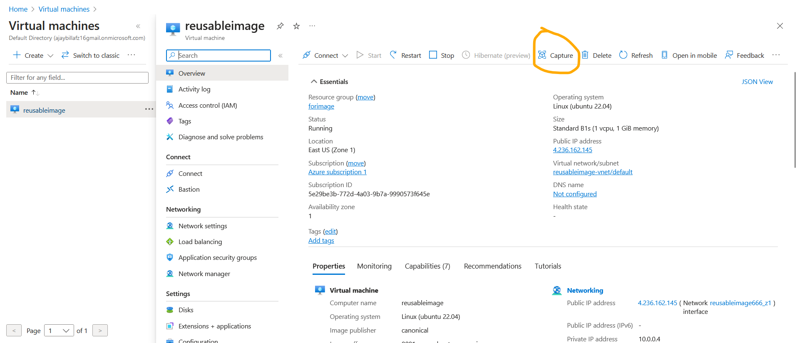
  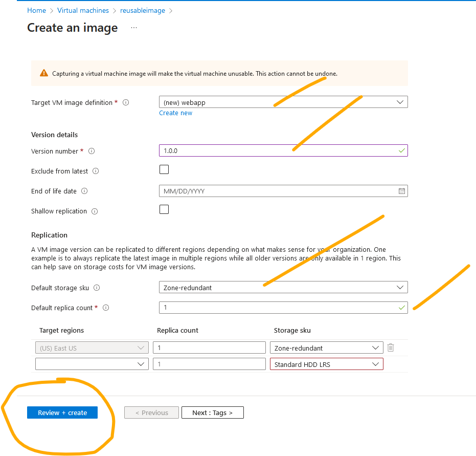
  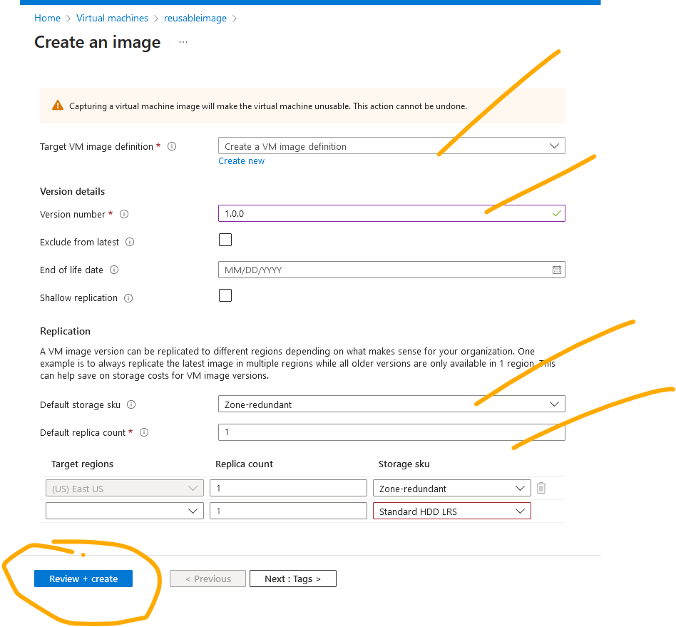
  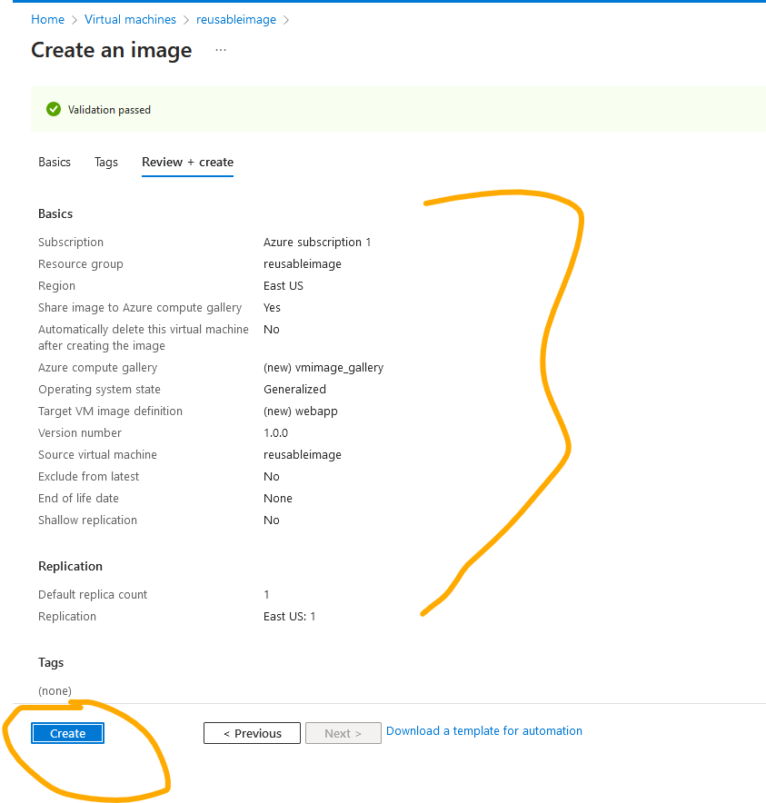
  * vm image has been created successfully so in future if we want to create a vm we can select this image
  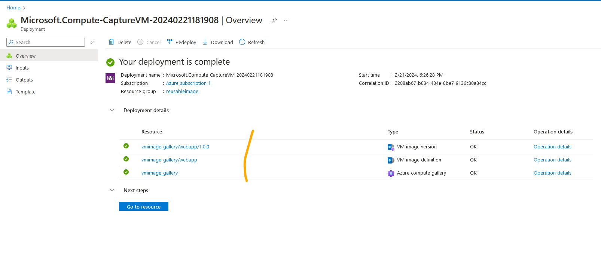
  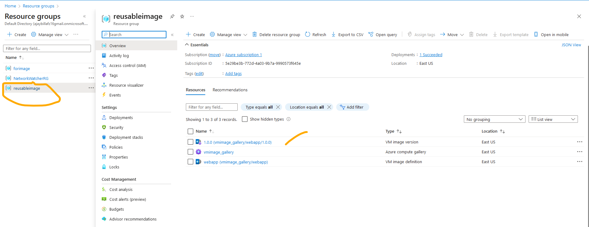
  * benefit of selecting this reusable image is already we installed the required software into it, so each time when we create the vm not required to install any software.
  * Create a vm from vm image captured(reusable)
  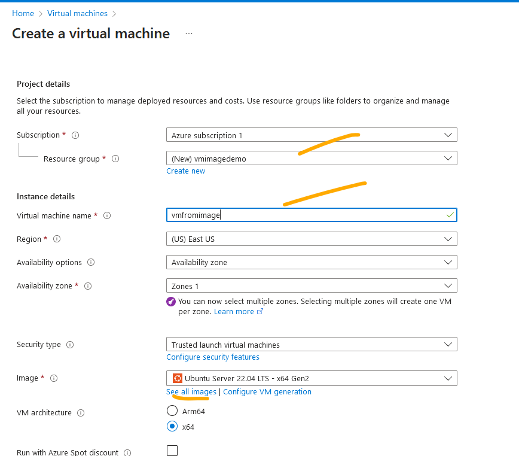
  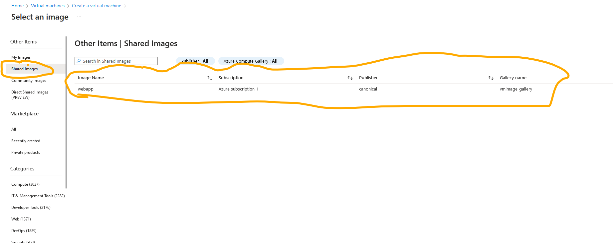
  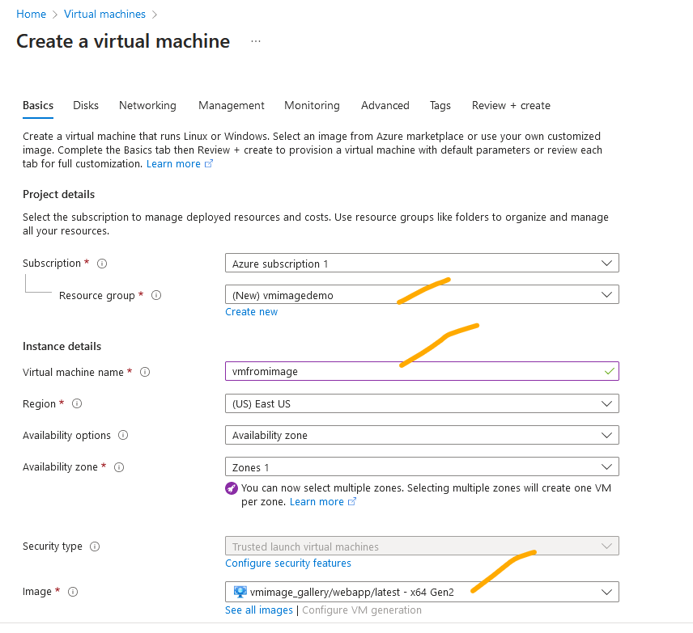
  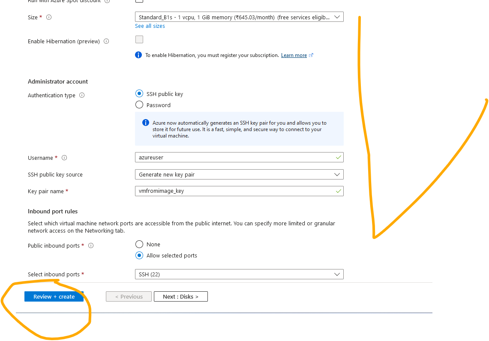
  * done this is the steps to created resuable image from vm.

  
  