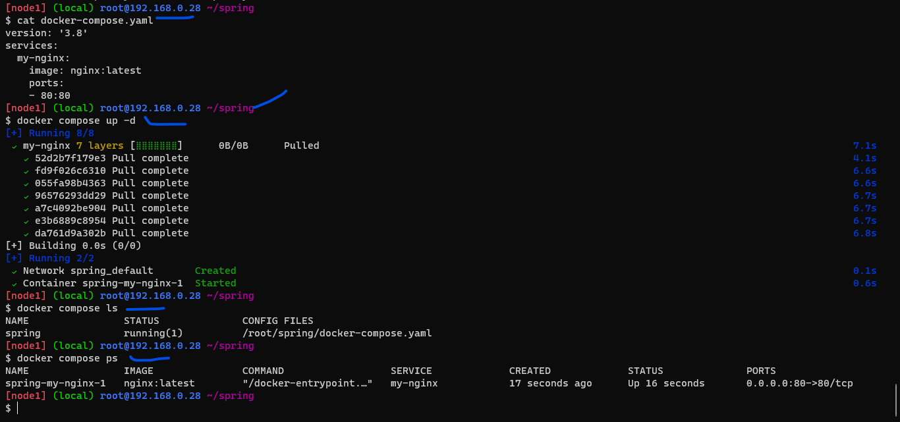
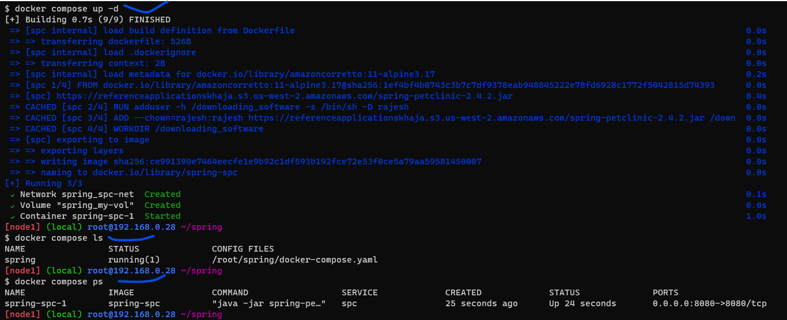
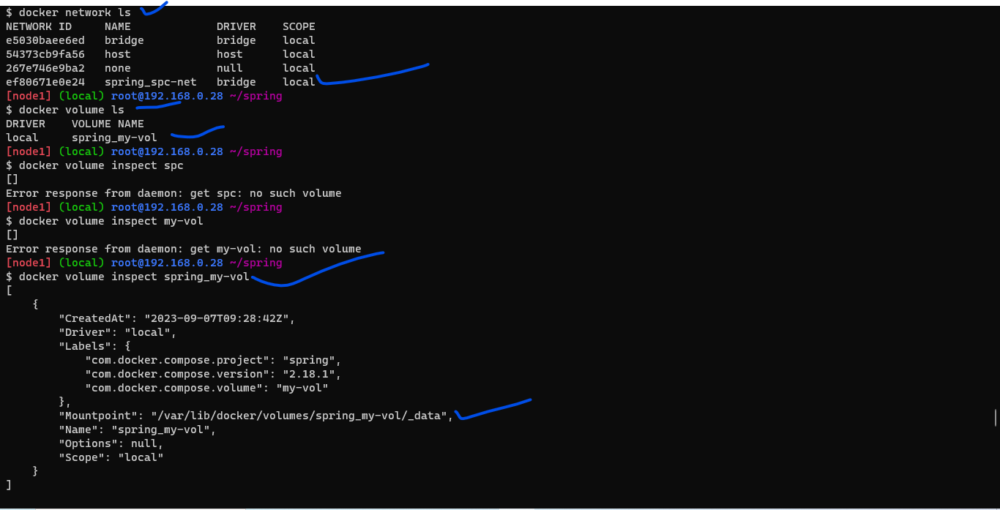
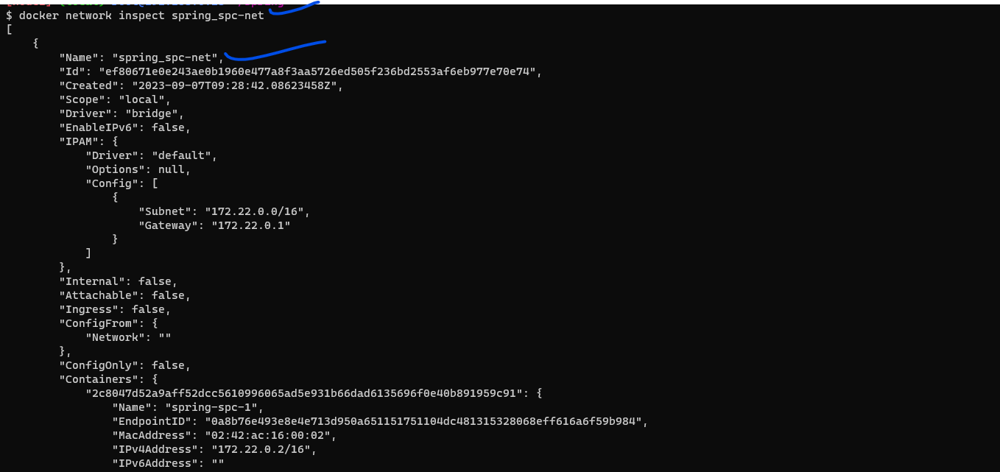
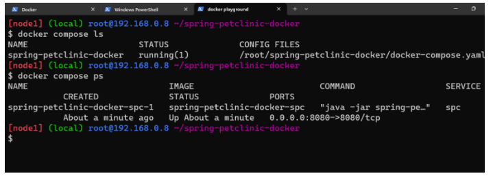
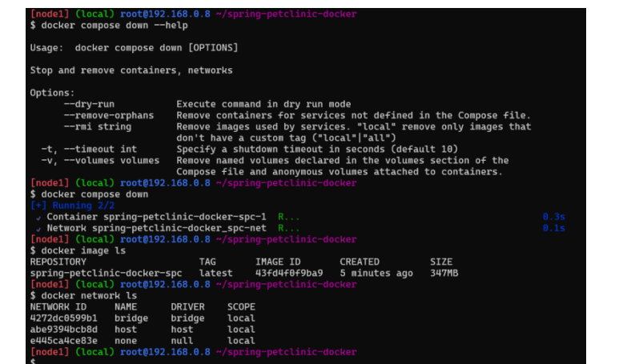
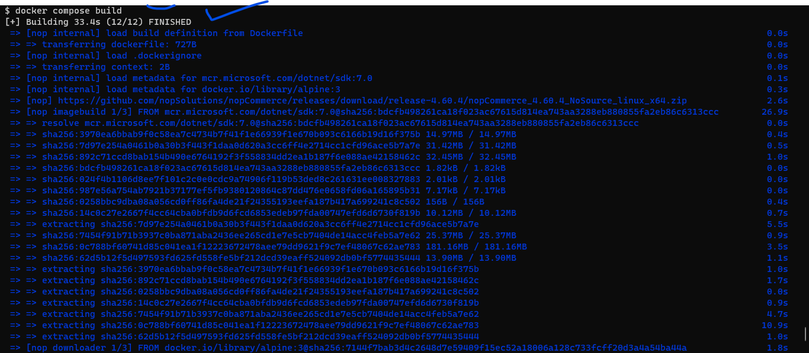
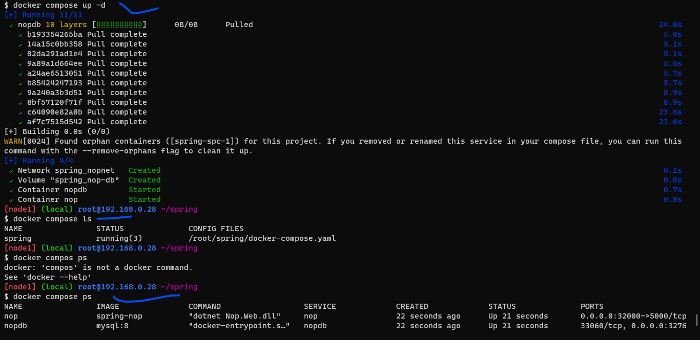
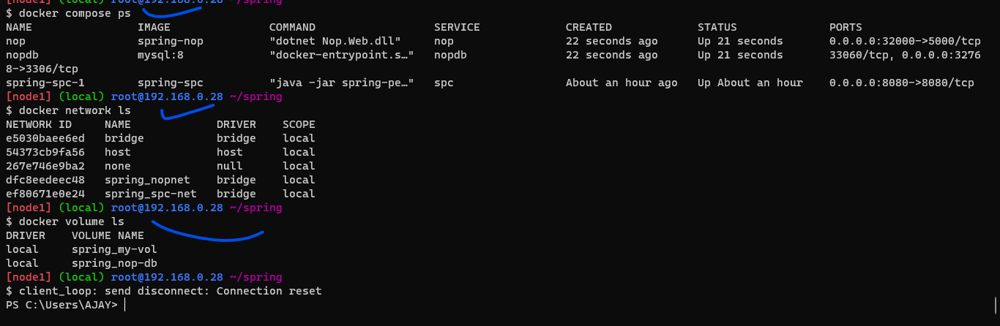

# Docker Compose

* [Refer Here](https://docs.docker.com/compose/) for docker official documents

* [Refer Here](https://github.com/compose-spec/compose-spec/blob/master/spec.md) for the specifications from docker official documents

* [Refer Here](https://docs.docker.com/compose/compose-file/compose-file-v3/) refer here to write docker compose file


#### Using docker compose created sample image called `nginx` refer below steps or screen shots:

```
install docker on your linux os
mkdir spring
cd spring
```
* then create docker-compose.yaml file
```
version: '3.8'
services:
  my-nginx:
    image: nginx:latest
    ports:
    - 80:80  
```
* Now excute with below commands:

```
docker compose up -d
docker compose ls
docker compose ps
```
* refer Below Screen shots:




#### Using docker compose build spring-petclininc in two Types refer below for steps:


### Type:1

#### Steps:

* add below contents in the dockerfile: 

```
FROM amazoncorretto:11-alpine3.17
LABEL author="ajay"
ARG DOWNLOAD_LOCATION='https://referenceapplicationskhaja.s3.us-west-2.amazonaws.com/spring-petclinic-2.4.2.jar'
ARG USERNAME='rajesh'
ARG HOMEDIR='/downloading_software'
ENV TEST=hello
RUN adduser -h ${HOMEDIR} -s /bin/sh -D ${USERNAME}
ADD --chown=${USERNAME}:${USERNAME} ${DOWNLOAD_LOCATION} ${HOMEDIR}/spring-petclinic-2.4.2.jar
USER ${USERNAME}
WORKDIR ${HOMEDIR}
EXPOSE 8080
CMD [ "java","-jar","spring-petclinic-2.4.2.jar" ]
```

* create docker compose yaml with below contents: 
```
version: '3.8'
services:
  spc:
    build:
      context: .
      dockerfile: Dockerfile
    ports:
    - 8080:8080
    networks:
    - spc-net
    volumes:
      - my-vol:/docs/data
    environment:
    - TEST=hello
networks:
  spc-net:
    driver: bridge
volumes:
  my-vol:
    driver: local
```
* Now using docker compose yaml file execute below command to build the image and start the container:

```
docker compose up -d
docker compose ls
docker compose ps
docker compose down
docker network ls
docker volume ls
docker volume inspect spring_my-vol
docker network inspect spring_spc-net
```
* Refer below screen shots:





### Type:2

#### Steps:

* Clone the repo

```
git clone https://github.com/dummyrepos/spring-petclinic-docker.git
cd spring-petclinic-docker
```
* add below contents in the dockerfile:

```
FROM maven:3-amazoncorretto-17 AS builder
COPY . /spring-petclinic
RUN  cd /spring-petclinic && mvn package


FROM amazoncorretto:17-alpine3.17 AS Imagebuild
LABEL author="ajay"
LABEL organization="learningthoughts"
ARG USERNAME='rajesh'
ARG HOMEDIR='/downloading_software'
ENV TEST=hello
RUN adduser -h ${HOMEDIR} -s /bin/sh -D ${USERNAME}
USER ${USERNAME}
WORKDIR ${HOMEDIR}
COPY --from=builder --chown=${USERNAME}:${USERNAME} /spring-petclinic/target/spring-petclinic-3.1.0-SNAPSHOT.jar "${HOMEDIR}/spring-petclinic-3.1.0-SNAPSHOT.jar"
EXPOSE 8080
CMD ["java", "-jar", "spring-petclinic-3.1.0-SNAPSHOT.jar"]
```

* create docker compose yaml with below contents: 
```
version: '3.8'
services:
  spc:
    build:
      context: .
      dockerfile: Dockerfile
    ports:
    - 8080:8080
    networks:
    - spc-net
    volumes:
      - my-vol:/docs/data
    environment:
    - TEST=hello
networks:
  spc-net:
    driver: bridge
volumes:
  my-vol:
    driver: local
```
* Now using docker compose yaml file execute below command to build the image and start the container:

```
docker compose up -d
docker compose ls
docker compose ps
docker compose down
docker network ls
docker volume ls
docker volume inspect spring_my-vol
docker network inspect spring_spc-net
```





### Write a docker compose for nop commerce:

* Add below instructions in dockerfile:

```
FROM alpine:3 AS downloader
ARG DOWNLOAD_LOCATION="https://github.com/nopSolutions/nopCommerce/releases/download/release-4.60.4/nopCommerce_4.60.4_NoSource_linux_x64.zip"
ADD ${DOWNLOAD_LOCATION} /nopCommerce/nopCommerce_4.60.4_NoSource_linux_x64.zip
RUN apk update && \
    apk add unzip && \
    cd /nopCommerce && \
    unzip nopCommerce_4.60.4_NoSource_linux_x64.zip && mkdir bin logs \
    && rm -rf nopCommerce_4.60.4_NoSource_linux_x64.zip

FROM mcr.microsoft.com/dotnet/sdk:7.0 AS imagebuild
LABEL author="ajay" 
EXPOSE 5000
COPY --from=downloader /nopCommerce /nopCommerce
ENV ASPNETCORE_URLS="http://0.0.0.0:5000"
EXPOSE 5000
WORKDIR /nopCommerce 
CMD ["dotnet", "Nop.Web.dll"]
```

* Add below contents in the docker copose yaml:

```
version: "3.8"
services:
  nop:
    build:
      context: .
      dockerfile: Dockerfile
    container_name: nop
    ports:
      - 32000:5000
    networks:
      - nopnet    
  nopdb:
    image: mysql:8
    environment:
      - MYSQL_ROOT_PASSWORD=nop123
      - MYSQL_USER=nop
      - MYSQL_PASSWORD=nop123
      - MYSQL_DATABASE=nop
    container_name: nopdb
    ports:
      - 3306
    volumes:
      - "nop-db:/var/lib/mysql"
    networks:
      - nopnet

networks:
  public:
  private:
  nopnet:
volumes:
  nop-db:
```

* Now execute below commands:

```
docker compose build
docker compose up -d
docker compose ls
docker compose ps
docker network ls
docker volume ls
docker compose start
docker compose stop
```





