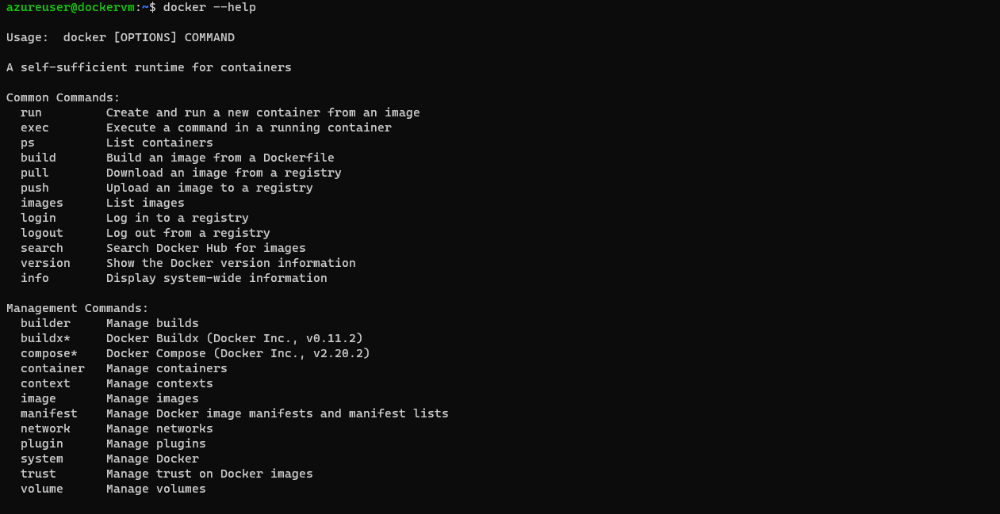
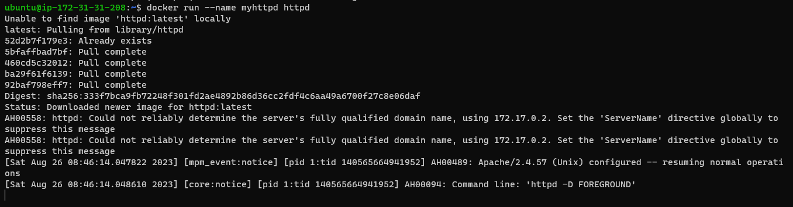

# Docker Commands:

## Docker Cheatsheet 

 * [Refer Here](https://docs.docker.com/get-started/docker_cheatsheet.pdf)

         or

### Follow below steps for Docker new commands:

* docker --help

* For new Docker Commands Follow Management Commands:
* Example how to follow docker commands:
    * docker container --help
    * docker image --help
    * docker network --help
    * docker container run --help
    * docker volume --help 
    * sooo oooooonnnnn ...

### Daemon: 
  * service or system that runs background always 
  * Run the persistent process that manages containers, it runs background always
       
       `var/log/docker.log`

* All the files will store in default location called: 

   `/var/lib/docker/`   

## Image  Commands:

* command to list the images externally means in registry/repository/docker hub

       docker search <image_name>

* command to give list of images id which is stopped
   
       docker images -q 

* Command to create image

      docker container create --name mynginx
* Command to list image

      docker image ls

* command to remove/delete image

      docker image rm

* Command to remove/delete the image forcefully

      docker image rm -f nginx
      
      docker image rm -f <image_name> or <image_id>      

* Command to get only image id's

       docker image ls -q

* Command to delete all the images 

          docker image rm -f $(docker image ls -q)

* Command to inspect image

      docker image inspect alpine

## Container Commands:

* command to list running container

       docker container ls
* command to list running and stopped container
   
      docker container ls -a

* command start/stop/restart container

      docker container start mynginx

      docker container start <container_name> or <container_id>

* Command to pause container

 docker container pause mynginx

 docker container pause <container_name> or <container_id>

* Command to unpause container

      docker container unpause mynginx

      docker container unpause <container_name> or <container_id>
* Command to remove/delete the container

      docker container rm mynginx

      docker container rm <container_name> or <container_id>

* Command to remove/delete the container forcefully

      docker container rm -f mynginx
      
      docker container rm -f <container_name> or <container_id>

* Command to get only container id's

      docker container ls -a -q

* Command to remove/delete all the container running or stopped

      docker container rm -f $(docker container ls -a -q)

* Command to check container logs

      docker container logs test

      docker container logs <container_name/id>

* command to list top process of the container
    
       docker top ContainerName/ID

* Command to inspect the container

       docker contianer inspect <contianer_name/id>

## run commands:

* Command to run the docker image

      docker container run -d --name mynginx nginx:latest

      docker container run -d --name <container_name><image_name_version>

## Port Commands:

* Command assigning/port forwarding to container by user decision

      docker run -d --name mynginx -p 44444:80 nginx:latest

* Command assigning/port forwarding to container by default by docker

      docker run -d --name myspc -P localhost/spc:1.1

* Please Note:
    * 44444 port => is known as host port left side.
    * 80 port => is known as container port right side.
* with publishing host port number to container port we are unable to access our container application

* `-p` => this means small letter giving while publish the port number for container is we are giving some known port number

* `-P` => this means we are not giving any port number as per our requirements, we are telling docker to assign random port number

* in our system/os we have ports range from `0` to `65535` so within this range of port we can give anything port number for our os host port. 

## Commit Commands:

     docker container --help
     docker container commit --help

* Command to create image out of container

      docker container commit java11 spc:manualwork

## Build Commands:

* Command to build docker file

      docker image build -t spc:1.0 .

       docker build -t localhost/spc:1.1 -f Dockerfile .

      docker build -t <username/registory/repositry_name><image-name><:tag/version> -f  <dockerfile_name><dockerfile_path>

* Command to build multi stage dockerfile

      docker image build --target imagebuild -t nop:0.0 .

      docker image build  -t nop:1.2 .

## Interactive(-it), Attached, Detached(-d) and EXEC Commands:

`-it` => means interactive with the terminal for some reason or login into running container

`exec` => means execute some commands after the running container is created 

`attach` => means execute some commands after the running container is created with out using `/ibn/bash`
also if we dint give -it or -d while run the container means that by default it will go into attached mode.
in attached mode the container will be started in foreground. and STDIN, STDOUT, STDERR of the container will be attached to your terminal. Your terminal becomes unusable.

`-d` => means our container will execute in detached mode means in background.
IN detached mode the container will be started in the background

* Command to login into container while running the container or creating

      docker run -it --name myalpine alpine /bin/bash

      docker container run -it --name myalpine alpine /bin/bash

      docker container run -it spc:1.0 /bin/sh

      docker container run -it <image_name_with_tag> /bin/sh

      docker container run -it --name <container_name><image_name_with_tag> /bin/sh

* To execute some commands inside the running container after container created

       docker exec mynginx ls/pwd/whoami

       docker container mynginx ls/pwd/whoami

       docker container mynginx ls /tmp

       docker exec <container_name> or <container_id>

       docker container exec <container_name> or <container_id>

* Command to login into container after running container created 

       docker exec -it myalpine /bin/sh

       docker container exec -it mynginx  /bin/bash

       docker exec -it <container_name> or <container_id> /bin/sh or /bin/bash

        docker container exec -it <container_name> or <container_id> /bin/sh or /bin/bash

* Command to run the container in attached mode

      docker contianer run  --name myalpine alpine

      docker run --name myhttpd httpd

      docker run  --name <container_name> or <container_id> <imageName_tag/version>

## ARG Commands:

* Command to use ARG variable while building the image

      docker image build --build-arg USERNAME=satish --build-arg HOMEDIR=/mtp -t spc:1.0 .

## ENV Commands:

* Command to use ENV variable while running the image

      docker container run -d -e TEST=devops --name using-env -P env-test:1.0

## Tag Commands:

* Command to add a tag to newly created image

      docker tag nopcommerce:2.0  localhost/nopcommerce:2.0

      docker image tag nopcommerce:2.0  localhost/nopcommerce:2.0

      docker tag <created_image_name:tag> <local_registory/repository_name>/<image_name:tag>>

* Command to rename registory/repository_image:tag_name

      docker tag localhost/nopcommerce:2.0 ajaykumarramesh/ajaykumar:nopcommerce-2.0

      docker image tag localhost/nopcommerce:2.0 ajaykumarramesh/ajaykumar:nopcommerce-2.0
      
      docker tag <local_registory/repository_name>/<image:tagname> <username>/<repository_name:tagname>

## Push Commads:

* Command to push docker image to registory/repository

    docker push ajaykumarramesh/ajaykumar:nopcommerce-2.0

    docker image push ajaykumarramesh/ajaykumar:nopcommerce-2.0

    docker push <username>/<repository_name:tagname>

## Pull Command:

* Command to pull docker image from the registory/repository

      docker pull ajaykumarramesh/ajaykumar:nopcommerce-2.0

      docker image pull ajaykumarramesh/ajaykumar:nopcommerce-2.0

      docker pull <username>/<repository_name:tagname>

## Volume Commands:

* Command to get help

      docker volume --help

* Command to create volume

      docker volume create my-vol

      docker volume create <volume_name>

* Command to list created volume 

        docker volume ls

* Command to delete volume

       docker volume rm my-vol

       dokcer volume rm <volume_name>

* Command to inspect volume

      docker volume inspect my-vol
      
      docker volume inspect <volume_name>

* Command to mount the volume with `os-host` and `container`      

      docker container run -it --name mysql-test -v my-vol:/var/lib/mysql  mysql

* command remove all unused docker volumes

        docker volume prune 

## Network Commands:

* to get help from network commands all possible

      docker network --help

* Command to create network with subnet id

      docker network create --subnet "192.168.0.0/24" testnet
      docker network create -d bridge --subnet '10.100.100.0/24' nopnet

* Command to create only network 

      docker network create testnet
      
      docker network create <network_name>

* Command to assign the network to image

      docker container run -d --name c1 --network testnet alpine

* Command to inspect netowrk

      docker network inspect spc-net

      docker network inspect <network_name>

* command to remove the network 
    
       docker network rm <network_Name>

* command to remove all unused docker network
    
       docker network prune <network name>

## Docker PlayGround Commands:

* Command to copy files 
      
      select and ctrl insert
   
* Command to paste files

      select and shift insert

* Command to make full screen 
     
      alt enter

## Docker Commands To Check Container Memory

* Command to check container memory

       docker stats

## Docker Command to create container with memory and cpu

     docker container run -d -P --name memcpu --cpus=0.5 --memory 256m jenkins/jenkins

## Docker Swarm Commands:

* Command to create service/nginx image

    docker service create --replicas 2 --name nginx-test nginx

* Command to list the service/image

     docker service ls

* Command to inspect service/image

     docker service inspect nginx-test

* Command to list the service/images running on which node

     docker service ps nginx-test

* Command to scale images 

   docker service scale nginx-test=4

