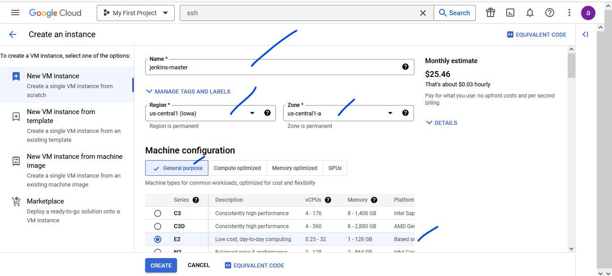
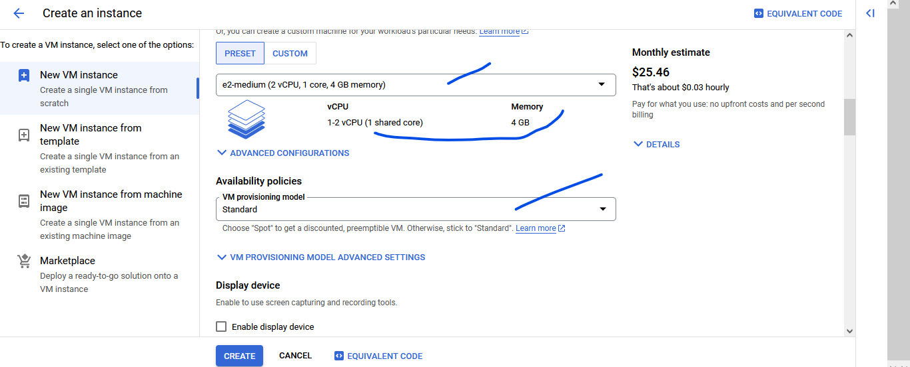
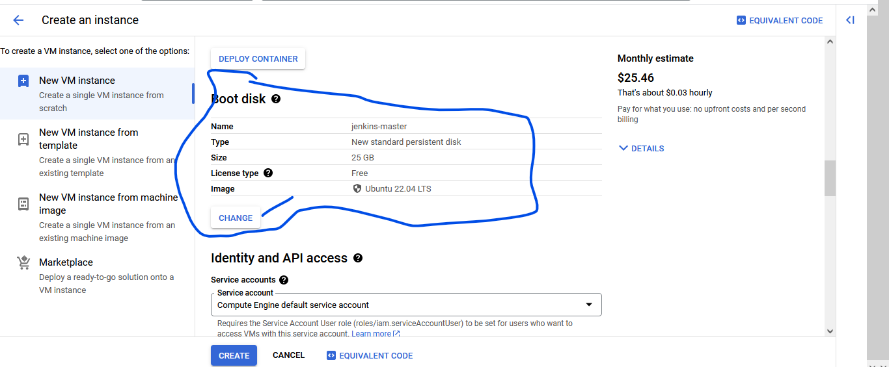
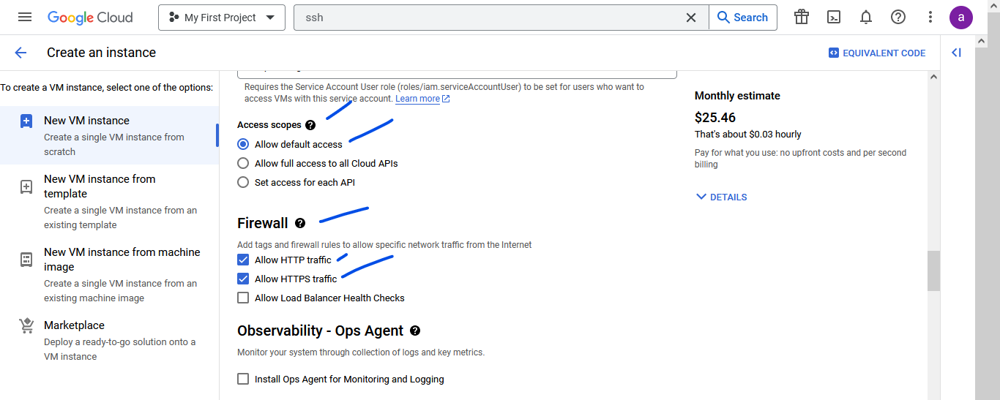
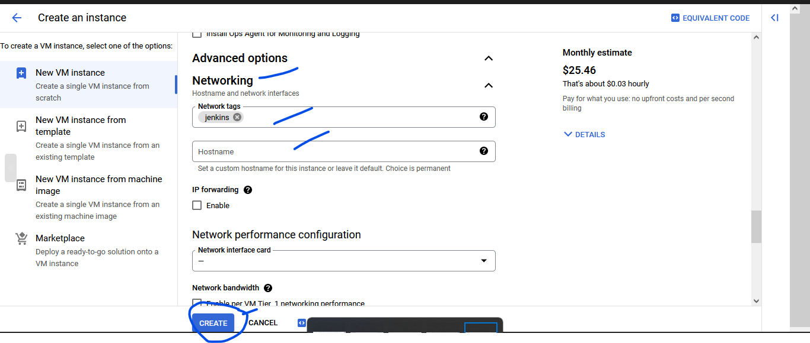
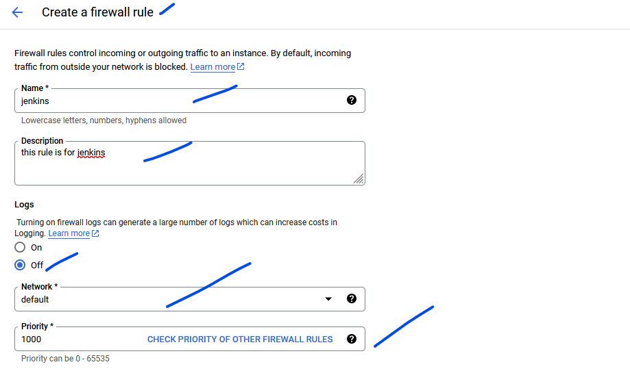
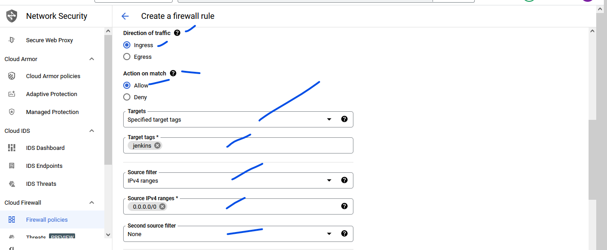
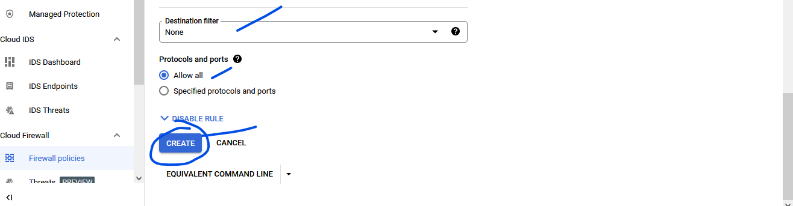

GCP Cloud
---------

### Gcp Install on Windows:
* [Refer Here](https://cloud.google.com/sdk/docs/install-sdk)
* **chocolatey:**

```bash
choco install gcloudsdk
gcloud version
```

### Steps To Create VM Instance:
* Click On Compute => select VM Instance
* Then follow below screen shots






### Steps To Create a firewall rule
* Click on VPC Network => select Firewall
* Click on create Firewall rule
* Then follow below screen shots





