Version Control Systems
-----------------------

* This is source code repository
* Software which allows us to store code along with history is called as Version Control Systems.
* **Evolution of VCS or Types:**
   * Single System VCS
   * Client Server VCS: 
      * Popular examples are Subversion, Clear Case, Visual Source Safe etc:
        * Online
        * Offline
* **Distribute Version Control Systems:** 
   * Mercurial
   * Git
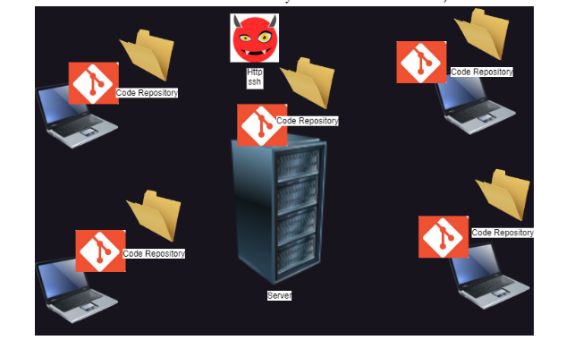

Git
---

* In Git we have 5 areas
   * Working tree/Working Area
   * Staging area/Cache area/Index Area
   * Local repository/Commit Area
   * Remote Repository
   * Stash

* Lets focus on 3 areas:


### Note:
* Command lines:
   * Cheat sheet 
     * [Refer Here](https://education.github.com/git-cheat-sheet-education.pdf)
     * [Refer Here](https://www.atlassian.com/git/tutorials/atlassian-git-cheatsheet)


* Create a local repository
* create an empty directory and execute `git init`     
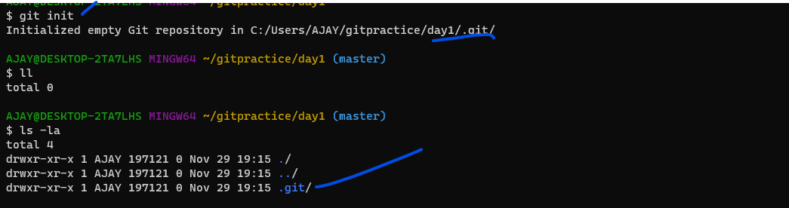


* Configure username and email id `one time job`
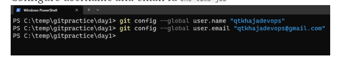

* Create one file `one.txt` and execute `git status`
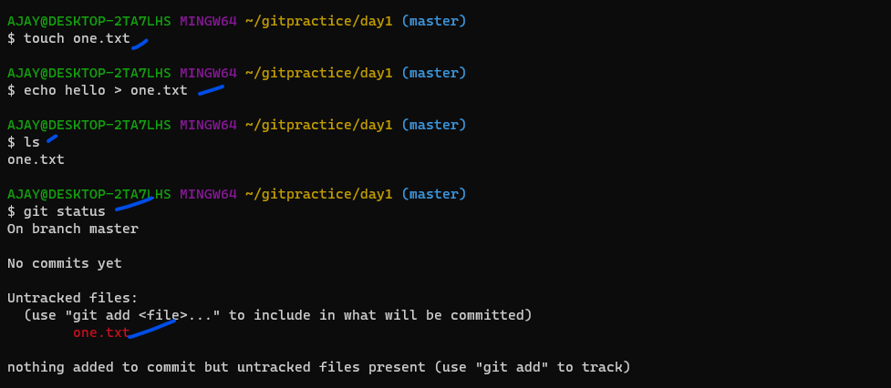

* Three areas quick revision


* Lets add this change to the staging area
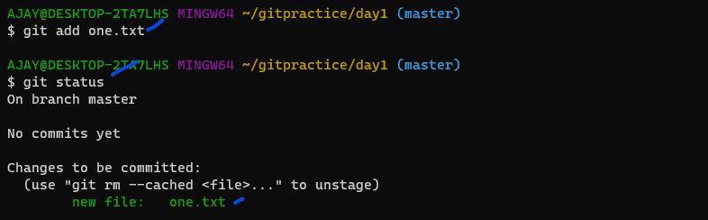

* Lets create a commit with this one change
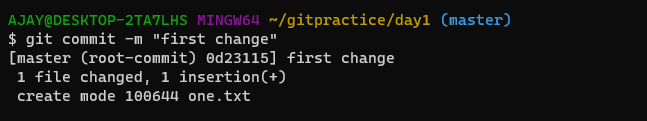

* For every commit git gives commit id with username, email, message and date time information
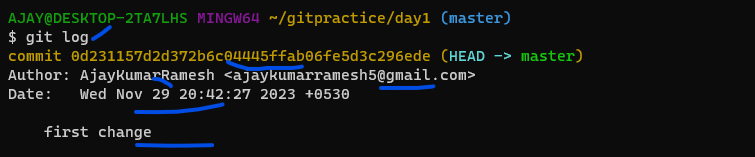

* Create a new file `two.txt` and change the contents of `one.txt`
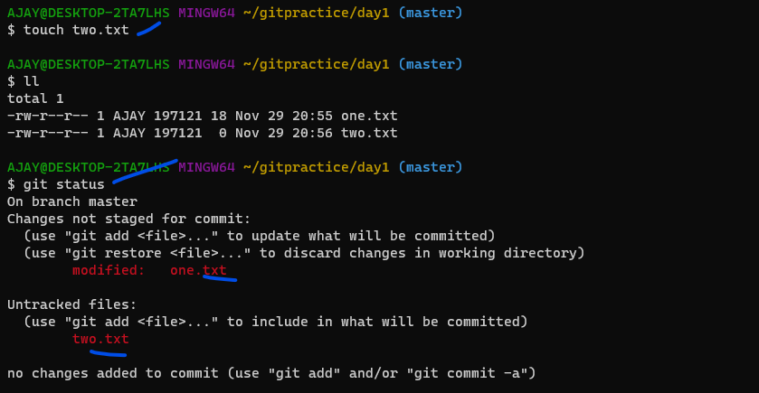

* untracked files represent the files newly created in working tree which donot have any history in local repo and for the files which are already existing in local repo we see states such as
  * modified
  * renamed
  * deleted

* Lets add both the changes to staging area

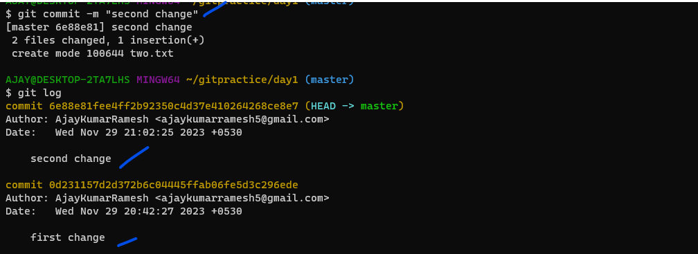

* Current workingtree. 
  * By default git always shows the content of the latest commit in working tree
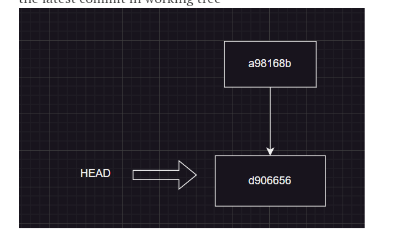

* Lets move back to history i.e first commit
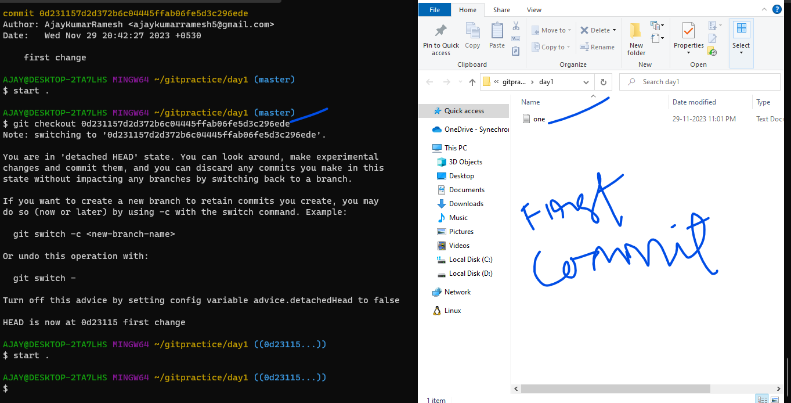
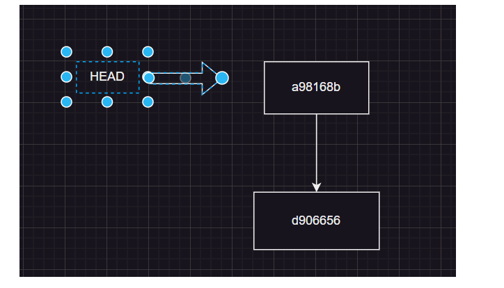

* Lets go back to latest commit `git checkout master`
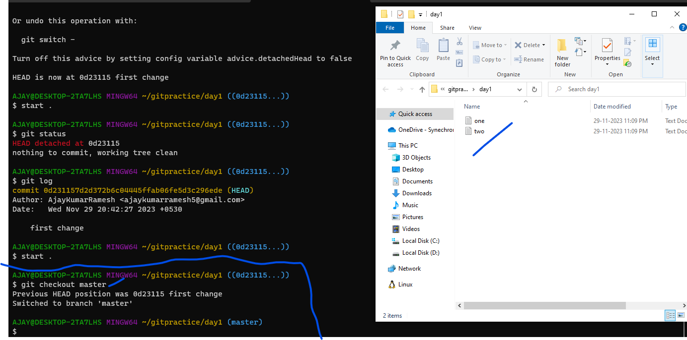
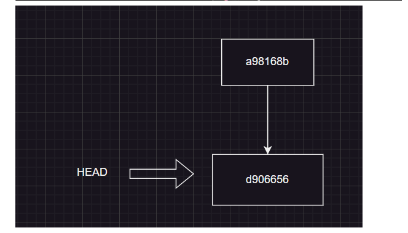

* Lets move `two.txt` and `one.txt` to a new folder called as `docs` and commit the changes
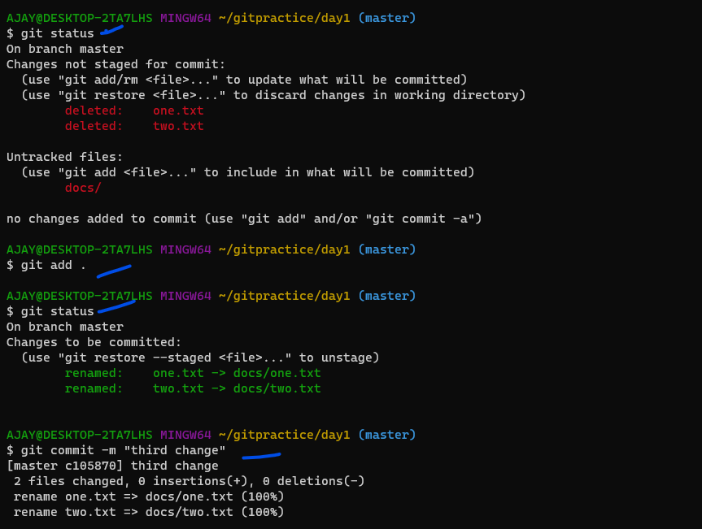

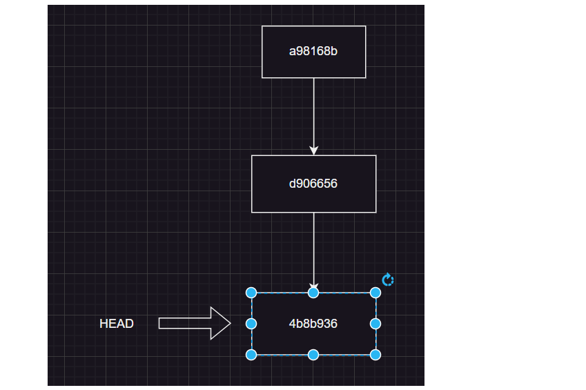

### Commands:
 * init: this initializes a new repository
 * add: adds the changes from working tree to staging area
 * status: shows the status of working tree and changes
 * commit: this command commits the changes from staging area to local repository
 * log: shows the commits done in local repo


### Lets initialize the new repo in a local system:
* Add 3 commits into the repo
* git add comes with 4 major options for adding changes
   * git add  `<fileName>`
   * git add . `adding all the changes relative to current directory`
   * git add -A `add all the changes in any directory`
   * git add -u `add only modified files`

* Add the changes to staging area try to unstage
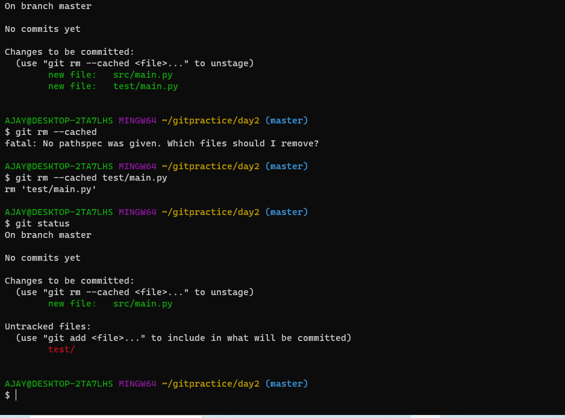

* To unstage the popular option is `git restore --staged`
* To remove the changes from working tree
  * modified: `git restore`
  * untracked:
       * delete normally
       * git clean -fd .

       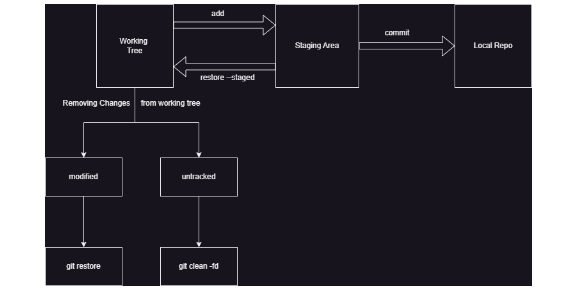


Branching:
----------

  * In Git Branches support parllel development
  * Every git repository will have a default branch called as `master`
  * Branch will always point to the latest commit
  * HEAD pointer in Git refers to what commit is working tree looking at.
  * To move the HEAD pointer we can use `checkout command`
  * Lets create one branch `apollo`

### Git Merge Terms:
  * Fast Forward Merge
  * Three way merge (merge)
  * Rebase
  * Cherry pick

### How Git Works:
* Current repository changes

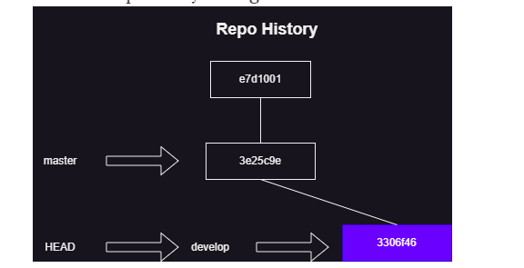

* To understand we will be using plumbing commands

```
# -t tells type of commit
git cat-file -t <commit-id>
# -p tells the content of the commit
git cat-file -p <commit-id>
```

* Commit is an SHA-1 hash of
  * parent
  * author
  * message
  * date time
  * contents

* Git reference objects
  * branch
  * tag  

* What is branch in git?
    * Branch is a reference object which points to some commit id, Branch points to a new commit id when a new commit happens  

* What is tag in git?
  * tag is a reference object which points to some commit id and doesnot move with new commits

* Lets figure from latest commit on develop branch `5fef7a9`
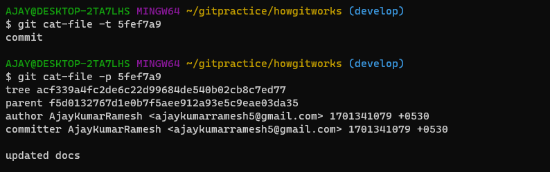

* Tree in git:
   * represents folder/directory and blob/object represents file
   * lets view contents of tree in latest commit
   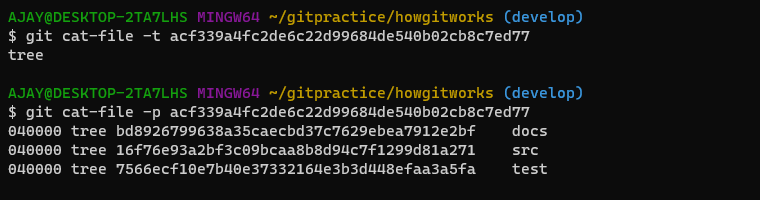

Merging Changes between Branches:
----------------------------------

* Consider the following history
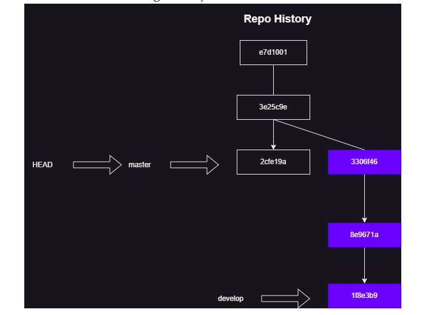
* we need changes from develop branch into master branch
* now checkout to master and then execute `merge`

```
git checkout master
git merge develop
```
* When git cannot merge changes due to different content in same lines it will raise conflicts.
 * while merging we got conflict so we needs to fix this issue then commit the changes
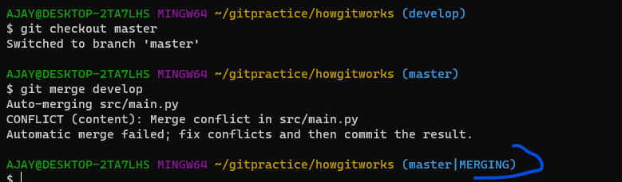
* screen shot for merge conflict 
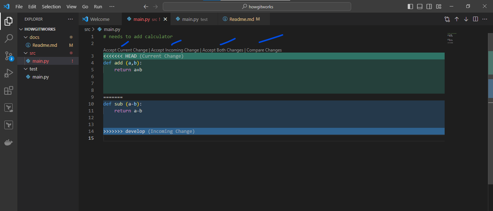
* out of these above screen shot four option needs to accept one that is `Accept Both Changes` then issue will resolve.
* now execute below commands:
```
git status
git add src/main.py
git commit
# it will open a message just save the file it will merge
:wq
# output will be below
[master 355b8a3] Merge branch 'develop'
git log --oneline
# output will be below
355b8a3 (HEAD -> master) Merge branch 'develop'
git cat-file -p 355b8a3
# output will be below, two parent
tree 1a6e1cf9f1ad2be824afb6e217e195615b52fd99
parent 50fe0217b89cea61eeac8f3701b43d2e19d92b8d
parent c60f6df3c94107d17a2fc84e0d410d1083f64595
author AjayKumarRamesh <ajaykumarramesh5@gmail.com> 1701362824 +0530
committer AjayKumarRamesh <ajaykumarramesh5@gmail.com> 1701362824 +0530
Merge branch 'develop'
```
* After fixing conflicts, add the changes and commit them which leads to creation of new commit with two parents
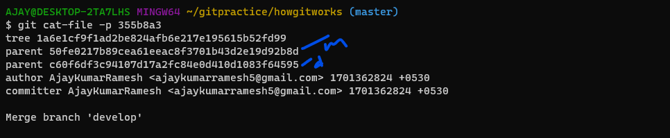
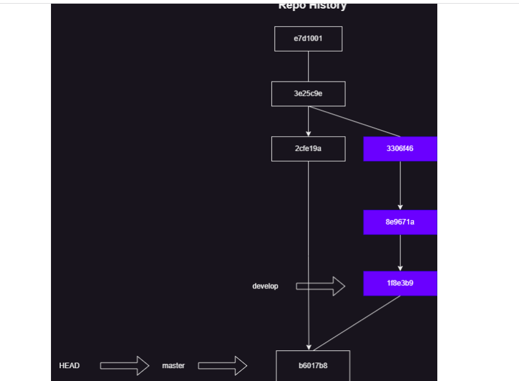
* This is called as three way merge
* so now if same file and same lines has added the content in two different branch and when we want to merge later from child branch to parent branch this is know as three way merge and we will get merge conflict 

### FastForward Merge:

* **scenario for master branch:**
  * i have created below folder and files in master branch

  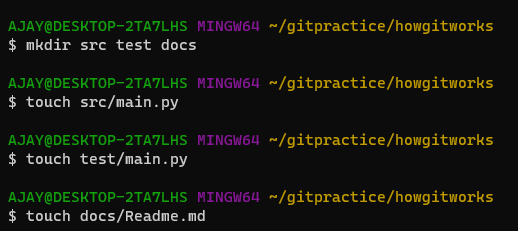
  
  * then used below command
  ```
  git add .
  git commit -m "added folder structure"
  ```
  * then add some content in the below folder inside the files
  
  ```
  git add .
  git commit -m "added changes"
  ``` 
* **scenario for develop branch:**
  * then created new branch called develop
  `git checkout -b develop`
  * then add few files under src/ folder
  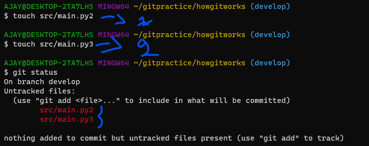
  ```
  git add .
  git commit -m "added fastforwardmerge"
  ```
  * then executed below command for merge from develop branch to master branch for `fastforwardmerge`
  ```
  git checkout master
  git merge develop
  # output below
  Updating 5cb3cfa..a95a30c
  Fast-forward
  src/main.py2 | 0
  src/main.py3 | 0
  2 files changed, 0 insertions(+), 0 deletions(-)
  create mode 100644 src/main.py2
  create mode 100644 src/main.py3
  ```

* Consider the following:

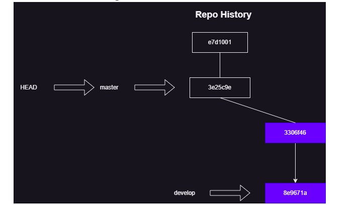
* We need to have all the changes in `develop branch` into `master branch`
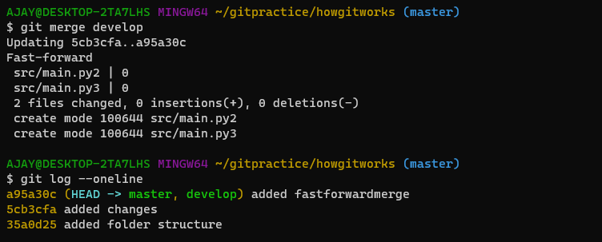
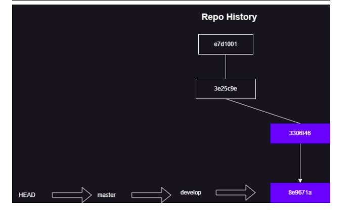
* so now as per above screen shot `master branch` and `develop branch` is Head is looking for same commit id called `fast forward merge`

Terms:
------
* Hashing
   * commit is hash of content 

Rebase:
-------
* The current state of repository


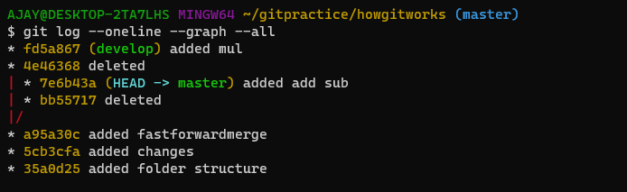
* Now we need the change done on `master branch` in `develop branch`
* So checkout to `develop branch` and execute `git rebase master`

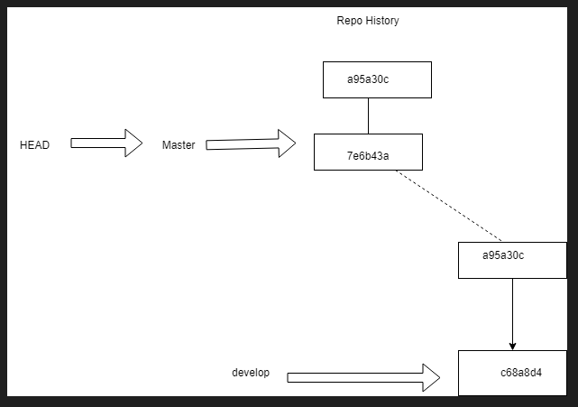
* Rebase in other scenario:

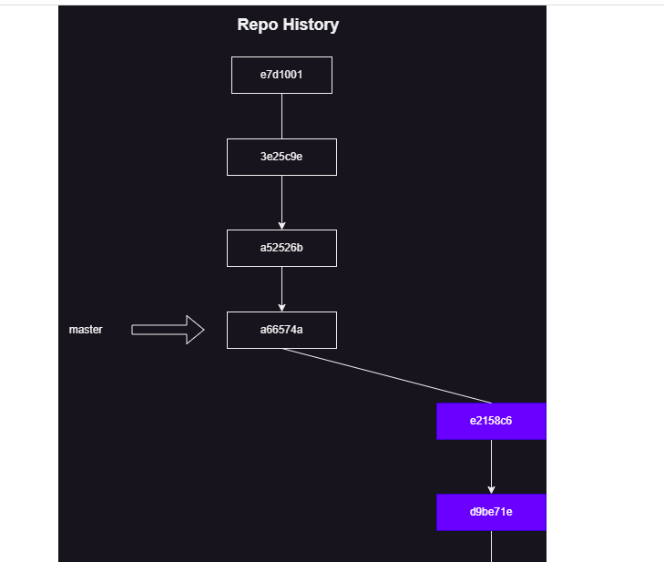
* git rebase is a way of moving the changes from one branch onto another branch
* rebasing re-writes the project history by creating brand new commits for each commit in the original branch
* The major benefit of rebasing is that you get a much cleaner project history.
* First, it eliminates the unnecessary merge commits required by git merge.
* [Refer Here](https://www.atlassian.com/git/tutorials/merging-vs-rebasing)

Cherry-pick
------------
* Cherry-picking is where you require one or sequence of commits from one branch to another
* Consider the following graph

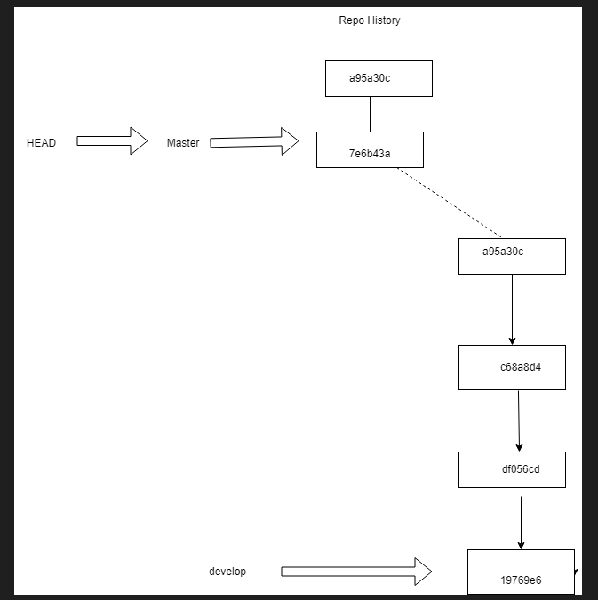
* In the master branch we need changes from develop branch commit id `9c3cc1b`
```
git checkout master
git cherry-pick df056cd
```
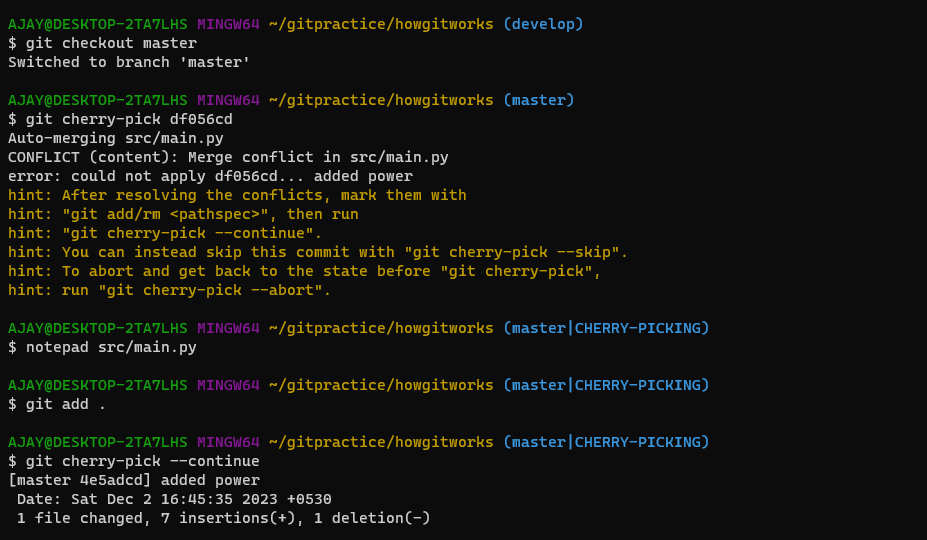
* Now the history looks as shown below
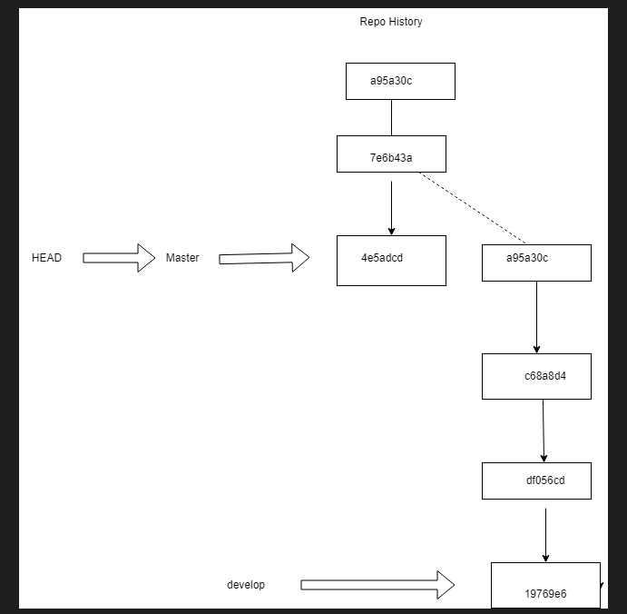

### Articles To Read
* merge:[Refer Here](https://www.atlassian.com/git/tutorials/using-branches/git-merge)
* fast forward merge:[Refer Here](https://www.atlassian.com/git/tutorials/using-branches/git-merge#:~:text=Fast%20Forward%20Merge&text=However%2C%20a%20fast%2Dforward%20merge,tie%20together%20the%20two%20histories.)
* rebase: [Refer Here](https://www.atlassian.com/git/tutorials/rewriting-history/git-rebase)
* cherry pick: [Refer Here](https://www.atlassian.com/git/tutorials/cherry-pick)
* merge vs rebase: [Refer Here](https://www.atlassian.com/git/tutorials/merging-vs-rebasing)


Rewriting History
------------------
* [Refer Here](https://git-scm.com/book/en/v2/Git-Tools-Rewriting-History) for re writing history

* We have used interactive rebasing to
  * change commit messages
   
       ` git rebase -i HEAD~3` 
    * select option `reword`     
  * Squash: combining  two commits into one using squash

    ` git rebase -i HEAD~3`
    * select option `squash` 

  * remove commit 
    * select option `drop`
     
       `git rebase -i HEAD~2`
      
  * edit commits
     *  select option `edit`   

Fourth area of Git – Remote Repo
--------------------------------
* Remote-Repo: This represents git repository some where else
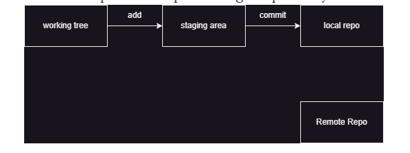
* Any software which hosts git-repo is called as `git servers` or `git hosted repositories`
* Git Remote Repositories can be hosted by many platforms/servers
  * Self-Hosted:
     * Gitolite
     * Git-lab
  * Cloud-Hosted or Git as Service
     * GitHub
     * BitBucket
     * Azure Source Repos
     * AWS Code Commit 

* Git repository will have connection to remote-repo and a name to it.Default remote conections name is `origin`
* Cases
   * if you have local repo and then if you have created remote repo
     * `remote add` to add connection 
     * `push` to send your git objects
     * `pull` to get git objects
* you have remote repo already and you need local repo in your system.
    * clone
* When a remote repo is connected `git branch -r`will show remote branches                

* Git pull has two variants:
   * **pull:** this might lead to extra merge commits
       
       `git pull origin master`
   * **pull with rebase:** this will not lead to extra merge commits 
        
        `git pull origin master --rebase `

* Pull operation is fetch + merge
* pull or push command require name of remote and branch names

```
git pull origin master
git push origin master
```

* if you want to set default remote and branch then we can set upstream branch

```
# while first creation of branch and pushing

git push  -u origin master
git push --set-upstream master
```

Tags
-----
* Tag is reference object like `refspec`
* Tag points to specific commit and it doesn’t move/change like branch
* Tags will apply to commit and it will not change until unless if we want to change, till then it will be fixed 
* There are two types of Git reference objects `refspec`
   * Branches
   * Tags
* We have two types of tags
* [Refer Here](https://www.atlassian.com/git/tutorials/inspecting-a-repository/git-tag#:~:text=Annotated%20tags%20store%20extra%20meta,quick%20links%20to%20relevant%20commits.) 
   * lightweight tags:
      * means name of the tag and what what commit id it points
      * EX: `git tag intel_rel_1.0`
   * annonated tags:
      * Annotated tags store extra meta data such as: the tagger name, email, and date. This is important data for a public release. 
      * Annotated tags have a tagging message.
      * Ex: ` git tag -a int_dev_1.0 -m "this is development release"` 

Detached HEAD
-------------
* detached HEAD means Our Head is looking at commit id not ref objects like branch or tags
* we can go in detached mode but nerver make any commits or changes there it will be tricky or difficult to come back
* detached mode is just to check older commits for any information to get it.

```
git checkout 6c4c435
git checkout master
```

RefLog
------
* Reflog means it is a permanent log for our system, it contains all the history of commits, so when ever by mistake if we delete the any commit, by using reflog we can recover the deleted commit  
* [Refer Here](https://rewind.com/blog/how-to-restore-deleted-branch-commit-git-reflog/) for reflog

* **Steps:**

```
git rebase -i HEAD~3
# Select `drop` to delete the commit
git add .
git rebase --continue
# to check deleted commit checking log below
git log --oneline
# to recover will check reflog
git reflog
# pick the commit id from reflog and execute below command
git reset --hard 834f1d7
git log --oneline
```

Git Alias
----------
* [Refer Here](https://www.atlassian.com/git/tutorials/git-alias) For Git Alias
* Git allows to create alias for existing commands
* Alias are stored in config files
* Samples Git Alias below
```bash
alias.pushsub=push origin HEAD:master
alias.rspush=push --recurse-submodules=check
alias.history=log --graph --decorate --pretty=oneline --abbrev-commit
alias.pushmain=push origin HEAD:main
alias.s=status
alias.pr=pull
```
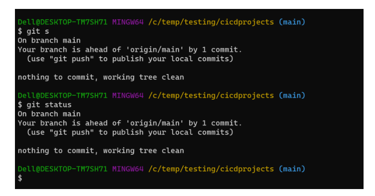


Branching Strategy
------------------
* Git Flow we follow as branching strategy
### What is Git Flow??
Git Flow is the successful branching suggested by [Vincent Driessen](https://nvie.com/posts/a-successful-git-branching-model/) 

This model can be acheived by using git commands any way, but to simplify git-flow toolset has been introduced which is extension to git installation

#### Installing git-flow
For installation [Refer Here](https://github.com/nvie/gitflow/wiki/Installation)

#### Cheat Sheet of git-flow toolset
[This](https://danielkummer.github.io/git-flow-cheatsheet/) cheatsheet seems to be very useful
#### My take on this
The git flow branching strategy is very effective branching strategy for the projects. If the project under development needs to support the older releases made then the git flow can be extended with support branches For the support branches i have found useful resource over [Here](https://github.com/petervanderdoes/gitflow-avh/wiki/Reference:-git-flow-support)

#### Also refer the following branching strategy:
 * **Gitlab:**
   * every environment as each branch as shown in the image below
   
   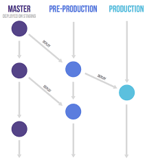 

 * **GitHub:**
    * github is also known or same as git flow branching strategy 

GitHub Pull Request/Pull-request
--------------------------------
* Pull-Request is repository feature so it is present in all source code management 
* To make contributions to the repositories where we dont have direct permissions
* We fork the repository
* We make changes
* To get our changes published We create pull requests to the original repo
* The author/owner of original repo reviews the changes and merges the pull request if he wants or reject the pull request
* [Refer Here](https://docs.github.com/en/pull-requests/collaborating-with-pull-requests/proposing-changes-to-your-work-with-pull-requests/about-pull-requests) for official docs pull request 
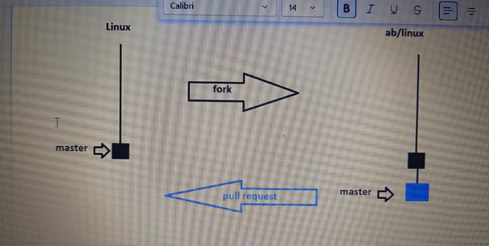
this above image scenario we want to do add some changes/features in the linux but we will not have access to linux  so what we will do is, we will fork the linux repo into our github and we will add the changes/features then we will do pull request to the owner of original linux repo in this case if he likes the changes/features he will accept the pull request if not he will reject the pull request

#### Example of pull request:
* **Steps:**
* create repository in different organization 
  * Consider this original repository [Refer Here](https://github.com/GitPracticeRepositroy/pullrequest-demo-july23)
 

* Now go to private window and login into github as different organization with same github account

* Now Fork the original owner repo into ur repo
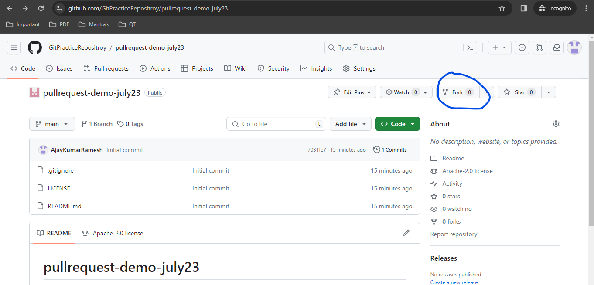
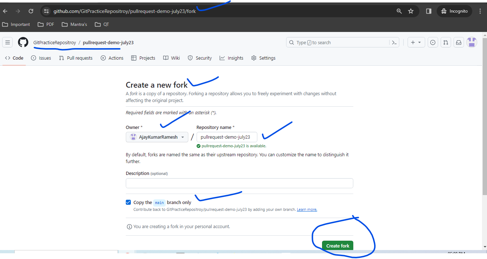
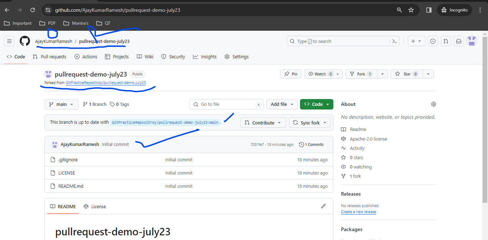
* Now execute below commands
```bash
git clone https://github.com/AjayKumarRamesh/pullrequest-demo-july23.git
cd pullrequest-demo-july23/
vi main.py
# add below itmes into main.py
def main():
    pass
# :wq save the file    
git status
git add .
git commit -m "added as this is requirements"
git push origin main
```
* Now check the repo new file and message as arrived
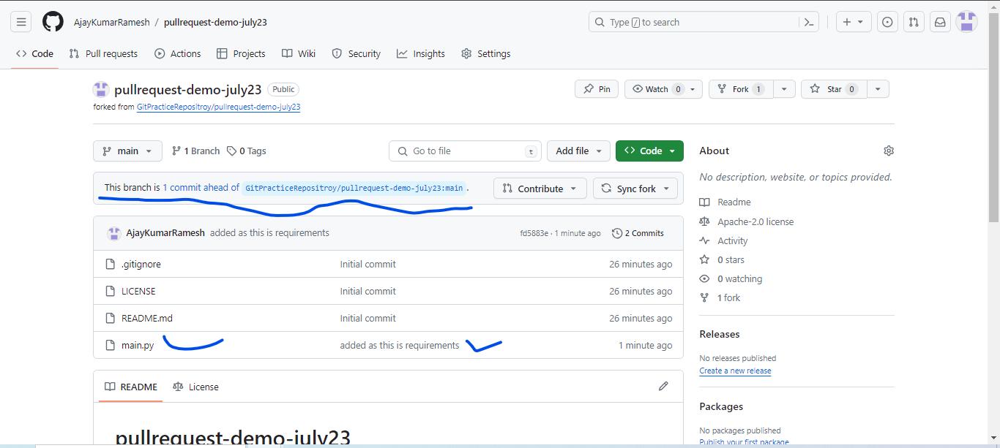
* Now we have to send changes that i had made into my repo to original owner by creating pull request
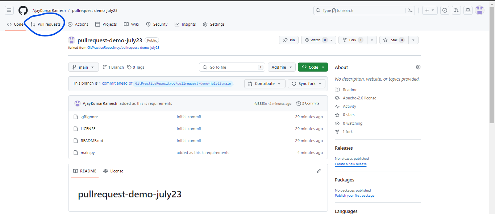
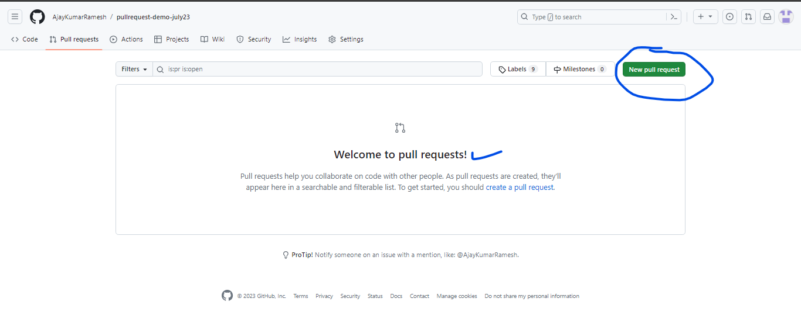
* now creating pull to original owner 
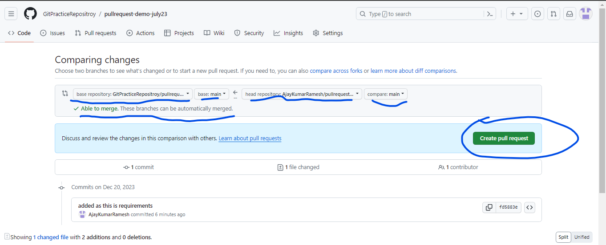
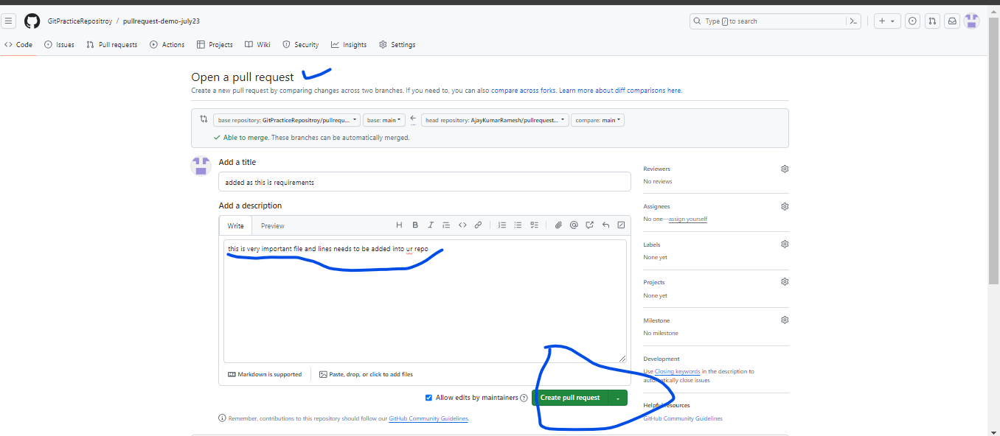
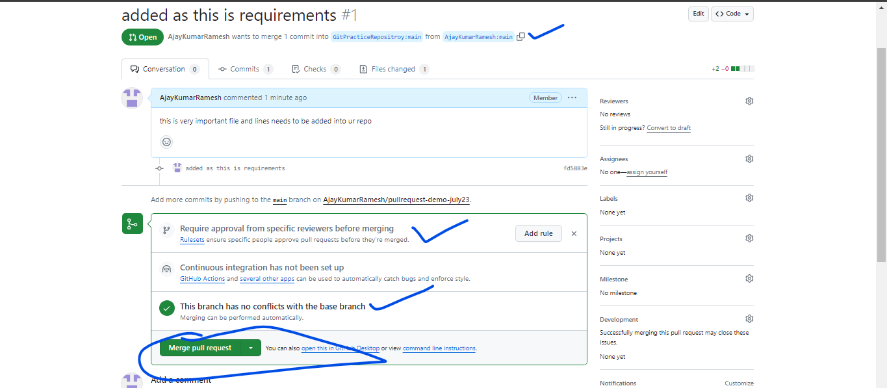
* Now original owner will refresh his repo then he will be able to see one pull request
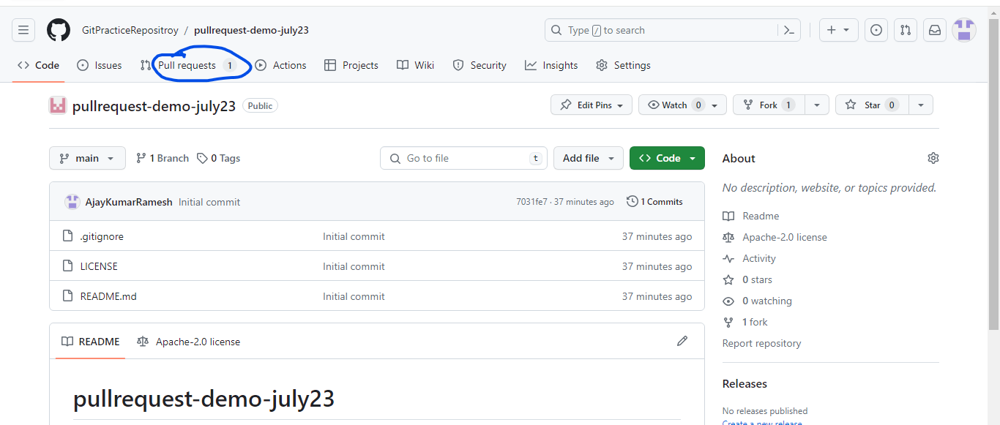
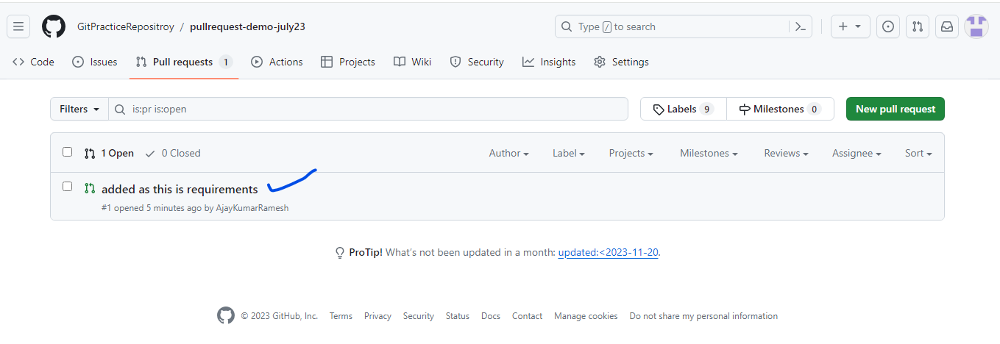
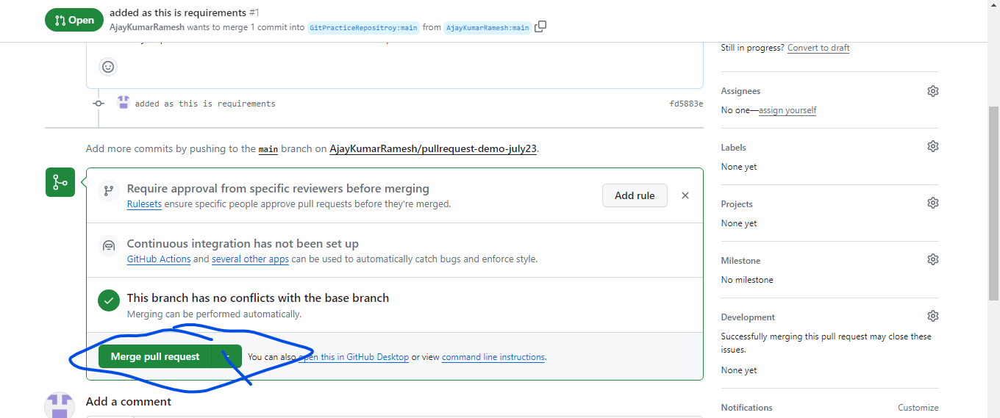
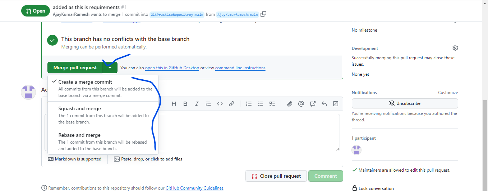
* selected rebase and merge
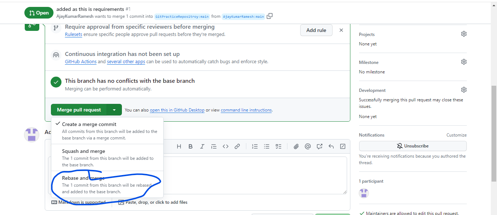
* Add a comment
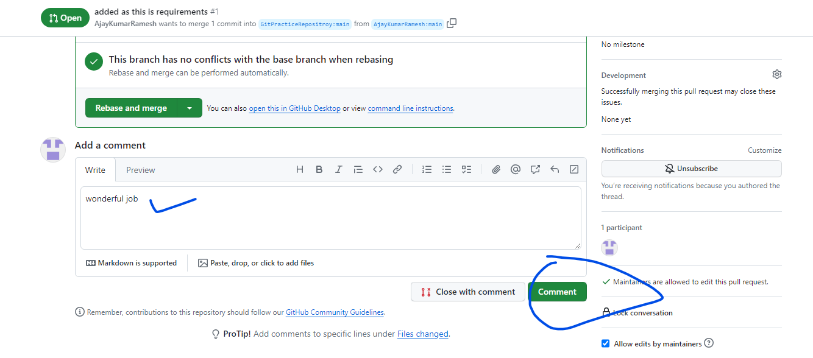
* Confirm the rebase and merge
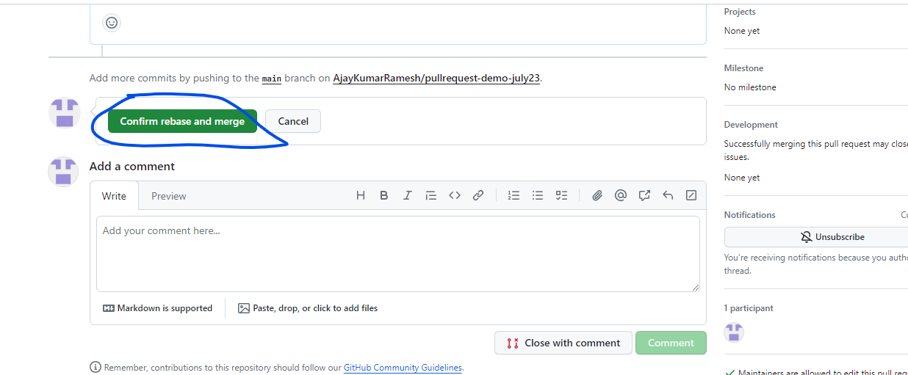
* now pull request has been accepted and it has merged to original owner repo
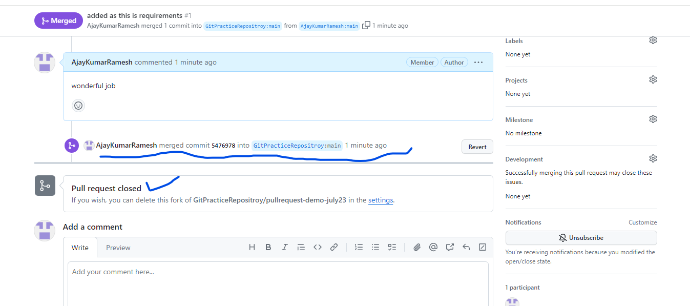
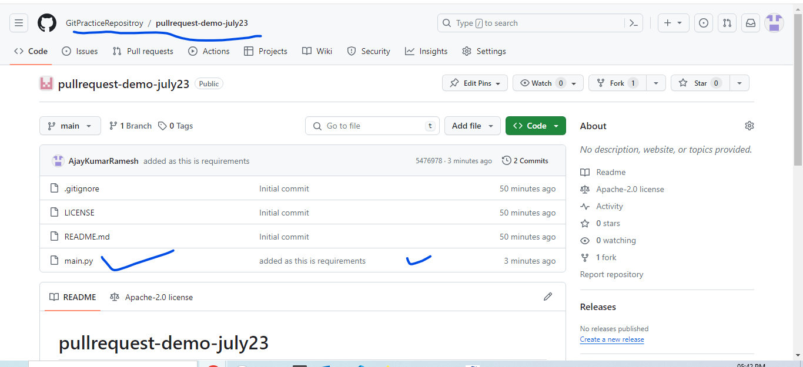


