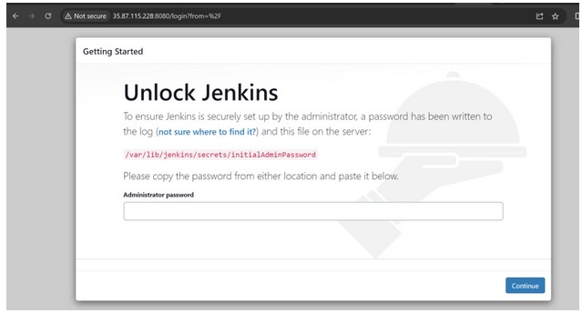
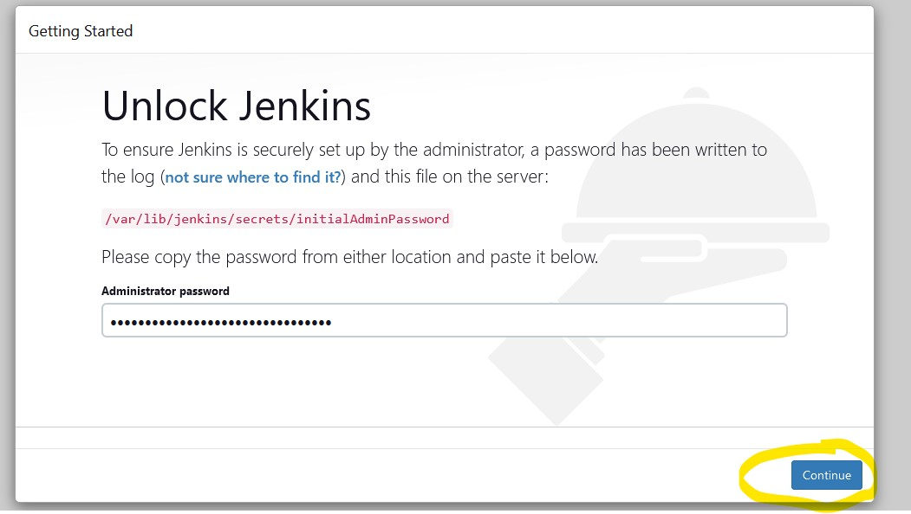
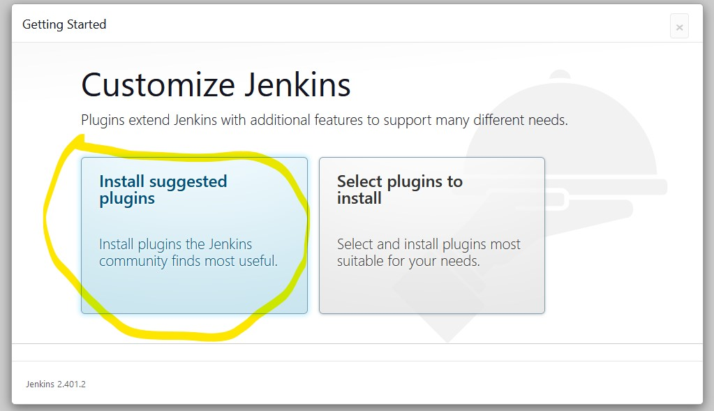
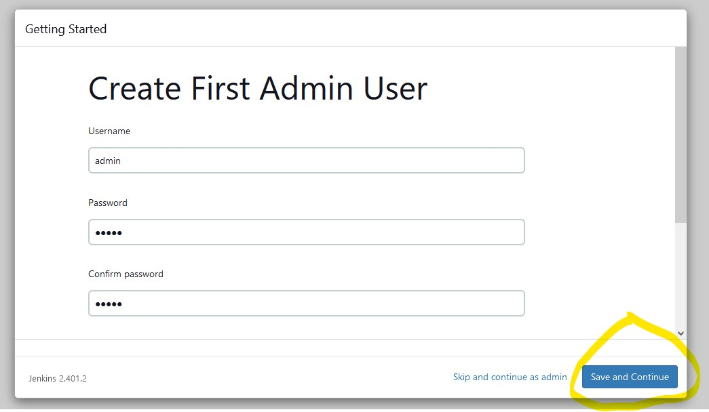
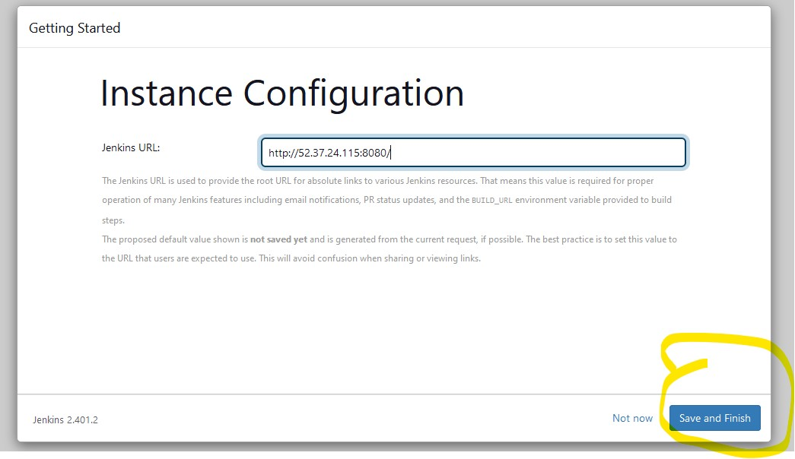
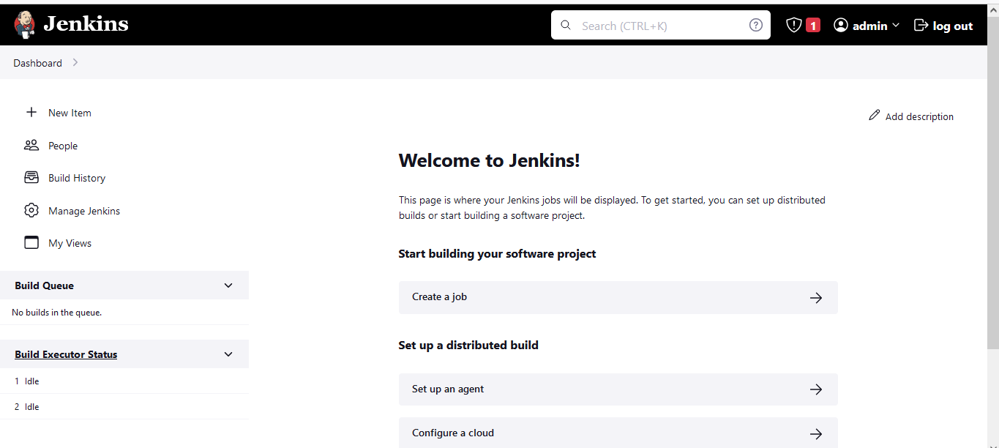

# Jenkins and Java Installation On Centos,Ubuntu and Linux 

## Install Jenkins On Centos

**Intall Java On Centos**

* yum update

* yum list java*

***From the above list needs to choose below package***

* java-11-openjdk.x86_64

* java-11-openjdk-devel.x86_64

* sudo alternatives --config java  => `to check java version and change it` 

* Note:- java version should be -11

  * yum install java-11-openjdk.x86_64      
  
  * java-11-openjdk-devel.x86_64

   * java , javac
   * java --version

* **Centos Steps :** [Refer Here](https://www.jenkins.io/download/)

---

## Install Jenkins On Linux

* [Refer Here](https://www.jenkins.io/doc/book/installing/linux/)

---

## Install Jenkins On Ubuntu 

**Intall Java On Ubuntu**

* sudo apt-cache search openjdk
* Select openjdk-17-jdk
* sudo apt install openjdk-17-jdk
* To check specific version installation below command
  * sudo apt-cache madison openjdk-17-jdk
* sudo apt install openjdk-17-jdk -y 
  
* **Ubuntu Steps :** [Refer Here](https://www.jenkins.io/doc/book/installing/linux/#debianubuntu)

---

## Commands To Check Jenkins Status

* service jenkins status
* service jenkins start
* service jenkins stop

        Or 

* systemctl status jenkins
* systemctl start jenkins
* systemctl stop jenkins
---

## Final Task After Installation Is Successful

* Navigate to `http://<public-ip>:8080`

  

* find out the initial Admin password
``` 
sudo cat /var/lib/jenkins/secrets/initialAdminPassword
```


* Now Select install suggested plugins


* Create a new admin user





---

