Workshop – Project - Assumption
------------------
* Its a predefined, means just an assumption how we are going to do the workshop, just setting up predefined all the steps.

* Project which will be doing in workshop [Refer Here](https://github.com/nopSolutions/nopCommerce)
* We will create a pull request based on workflow
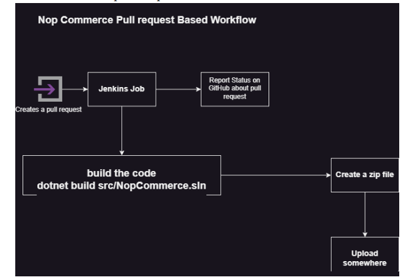

#### Two Types of workflow:
* In Release Branch (Night build)
* will be doing two workflow
  * Docker/Container based workflow: 
     * In Terraform we will be doing following workflow is (DevSecOps)
     * here when ever developer pushes the code build the code and package over here is `docker image`
     * we will also discuss about 
        * Security Scans
           * SCA
           * SAST
           * DAST
     * After doing scan we will be using terraform to  create 
        * Kubernetes cluster and Deploy application into it.      
* Another workflow is:
   * VM based Workflow
     * From Terraform we will create below resources may be aws/azure and will be deploying nop commerce application into VM. 
       * VM
       * Database

---

Actual Workshop Steps:
----------------------
* CI/CD Pipeline Based on Jenkins

### Virtual Machine or Cloud Based Deployment
 * We will be building a CI/CD Pipeline of a .net platform based application

### Steps:
   1. Jenkins Master and Node setup with OS Ubuntu
      * Jenkins Master
         * software requirements:
            * openjdk-17
            * jenkins
      * Node:      
         * software requirements:
            * openjdk-17
            * .net 7 sdk
            * git
            * zip 
   2. Build steps: Manual
   ```bash
   git clone https://github.com/dummyreposito/nopCommerceJuly23.git
   dotnet restore src/NopCommerce.sln
   dotnet build -c Release src/NopCommerce.sln
   dotnet publish -c Release src/Presentation/Nop.Web/Nop.Web.csproj -o publish
   mkdir publish/bin publish/logs
   zip -r nopCommerce.zip publish
   ```            
### Jenkins file
* To build the NopCommerce and zip the file created jenkinsfile

```Jenkinsfile
pipeline {
   agent any
  
    stages {
        stage('vcs') {
            steps {
                git branch: 'develop', 
                    url: ' https://github.com/dummyreposito/nopCommerceJuly23.git'    
            }
            
        }
        stage('package') {
            steps {
                sh 'dotnet restore src/NopCommerce.sln'
                sh 'dotnet build -c Release src/NopCommerce.sln'
                sh 'dotnet publish -c Release src/Presentation/Nop.Web/Nop.Web.csproj -o publish'
                sh 'mkdir publish/bin publish/logs && zip -r nopCommerce.zip publish'
                archive '**/nopCommerce.zip'
            }
            
        }
    }
}
``` 

```
git add .
git commit -m .
git push origin develop
```
* Lets Build NOPCommerce for above steps:
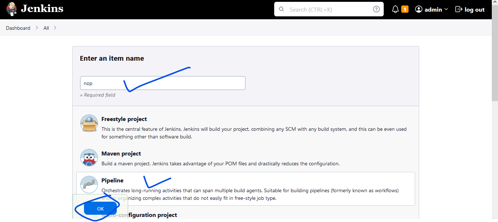
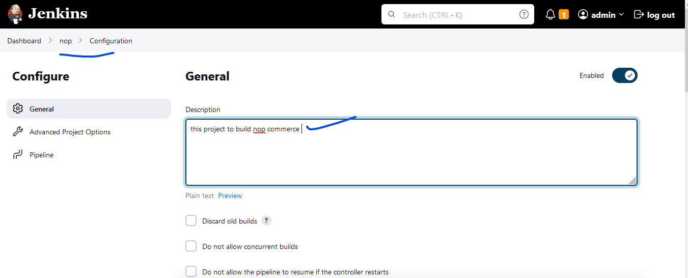
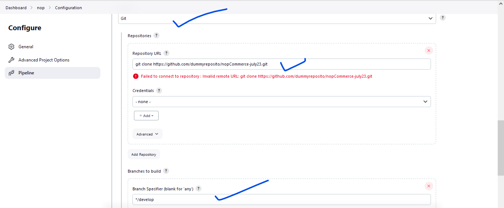
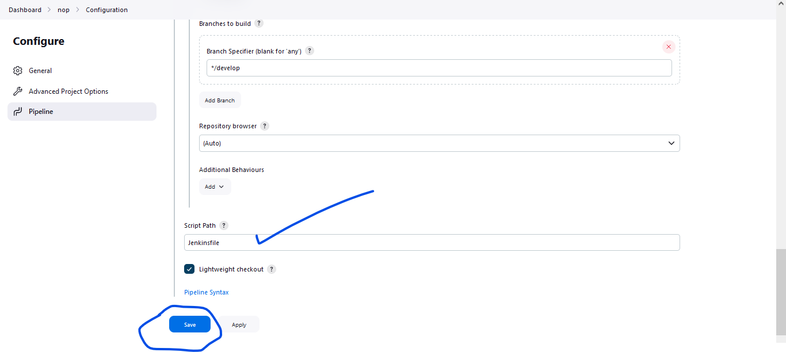
* Build Result Success
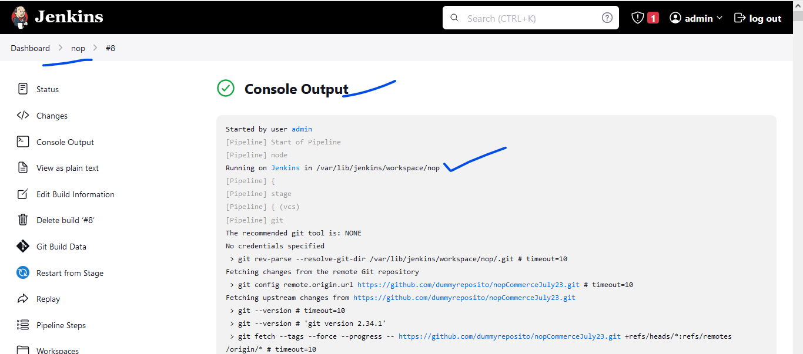
* build is success and created archieve the nopcommerce.zip click to download it.
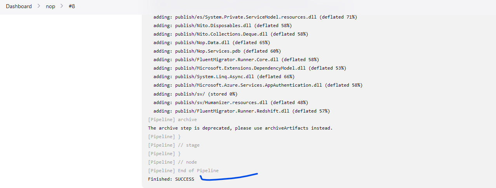
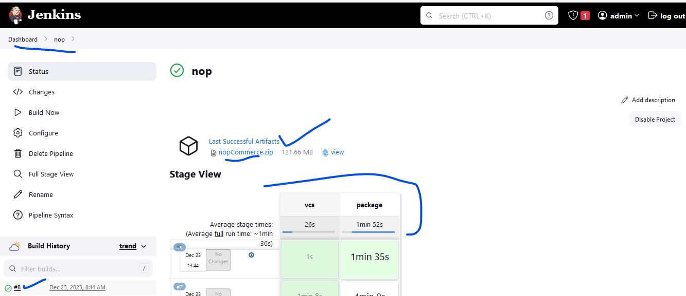 

### Container Based Deployment:
#### Steps:
   1. Jenkins Master and Node setup with OS Ubuntu
       * Jenkins Master
         * software requirements:
            * openjdk-17
            * jenkins
      * Node:      
         * software requirements:
            * openjdk-17
            * git
            * zip 
            * Docker
            * Terraform
            * azure cli
            * kubectl 
* Needs to authenticate azure-cli with az login and docker with docker login

```
# For Azure
az login
# Docker 
docker login
```

   2. build steps: Manual
   ```
   git clone https://github.com/dummyreposito/nopCommerceJuly23.git
   # create a new branch 
   git checkout -b dev-container
   code .
   # replace latest with Git Commit id or build id
   docker image build -t nopcommerce:latest .
   docker container run -d --name noptest -P nopcommerce:latest
   docker image tag nopcommerce:latest ajaykumarramesh/nopcommerce:latest
   docker image push ajaykumarramesh/nopcommerce:latest
   ```

### Creating kubernetes cluster from terraform:
#### Workflow:   
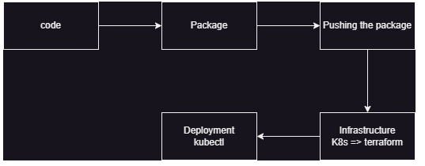

* Create manually Resources for backend in azure cloud UI.
```
backend "azurerm" {
    resource_group_name  = "terraform"
    storage_account_name = "qttfstate"
    container_name       = "tfstates"
    key                  = "nopcommerce.tfstate"
  }
```
* [Refer Here](https://github.com/dummyreposito/nopCommerceJuly23/tree/dev-container/deploy_Infrastructure) for terraform code to create infrastructure

* [Refer Here](https://github.com/dummyreposito/nopCommerceJuly23/tree/dev-container/k8s) for for the k8s manifest

#### Manual deployment steps for terraform and k8s 
```
cd deploy_Infrastructure
terraform init
terraform fmt 
terraform apply -auto-approve
az aks get-credentials --resource-group rg-mutual-hare --name cluster-logical-heron
kubectl get nodes
kubectl apply -f ./k8s/nop-deploy.yaml
```
### Jenkinsfile:
* for above steps
```Jenkinsfile
pipeline {
    agent {label 'Node_Docker'}
    stages {
        stage('vcs') {
            steps {
                git branch: 'dev-container', 
                    url: 'https://github.com/dummyreposito/nopCommerceJuly23.git'    
            }
            
        }
        stage('package') {
            steps {
                sh 'docker image build -t nopcommerce:latest .'
                sh 'docker image tag nopcommerce:latest ajaykumarramesh/nopcommerce:latest'
                sh 'docker image push ajaykumarramesh/nopcommerce:latest'
                
            }            
        }
        stage('terraform') {
            steps {
                sh 'cd deploy_Infrastructure && terraform init && terraform apply -auto-approve' 
                //sh 'echo "$(terraform output kube_config)" > ./azurek8s && export KUBECONFIG=./azurek8s && kubectl apply -f ../k8s/nop-deploy.yaml'
            }
        }
        stage('k8s_deploy'){
            steps{
            sh 'az aks get-credentials --resource-group rg-mutual-sheepdog --name cluster-adjusted-glowworm && kubectl apply -f ./k8s/nop-deploy.yaml' 
            }

        }

    }
}
```
* Lets Build NopCommerce pipeline projects
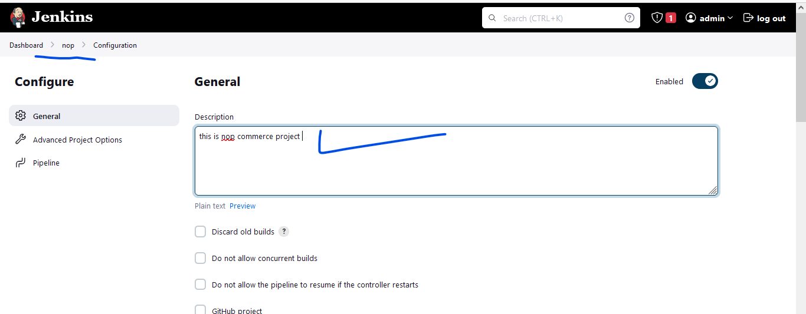
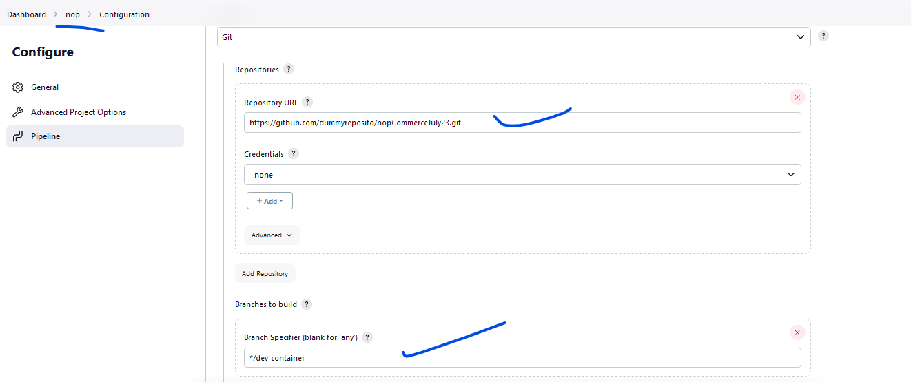
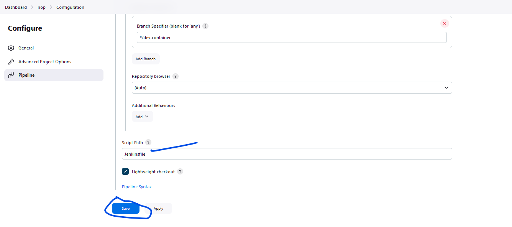
* Build now

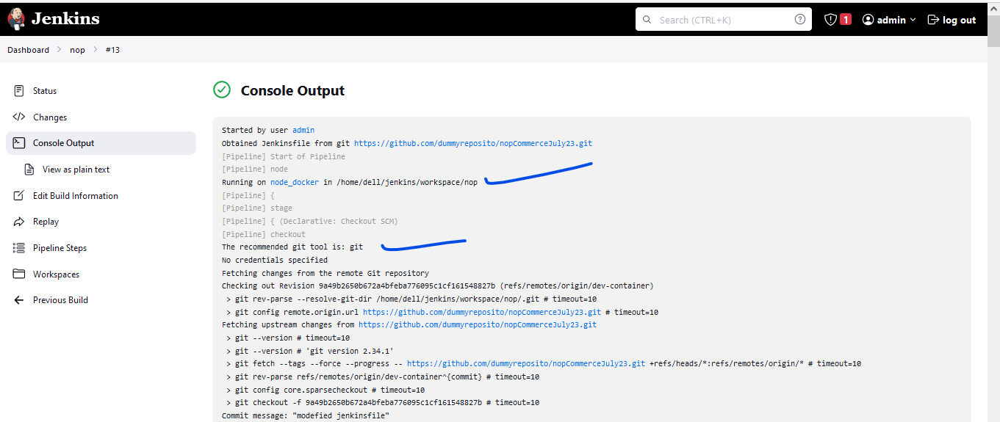
* now acces the application 

`http://20.253.20.251:3000`

`http://external ip:svc-portn-o`

---

Flow of CI/CD Pipeline
------------------------

* Developer completes Code and pushes to git
           or 
   * When ever Developer commits the code to git
      * build the code
      * run unit tests
      * Perform Scans
        * SAST (Static Application Security Test)
           * SonarQube
           * Checkmarx
           * Jfrog
           * Veracode(here we will use)
           * Fortify
        * SCA (Software Composition Analysis) 
           * Black Duck
           * Jfrog
           * checkmarx
           * SonarQube(here we will use)
        * DAST (Dynamic Application Security Test)
           * OWASP ZAP   
        * Perform Quality Gate of Static Code Analysis    
        * Finally Execute Penetration Tests
        * Then push the artifact to 
           * Jfrog
        * Incase container based then
           * docker image push to (jfrog)(ACR)(ECR)
              * scan the image for vulnerability
                * Deploy to k8s cluster
        * Continue to Deployment  

### Flow of CI/CD Pipeline in Jenkinsfile:
```Jenkinsfile
pipeline {
    agent { label 'build' }
    stages {
        stage('vcs') {
            steps {
                git branch: 'develop',
                    url: ''
            }
        }
        stage('build and package') {
            steps {
                sh 'mvn clean package'
            }
        }
        stage('perform scans') {
            steps {
                sh ' SAST (Static Application Security Test)'
                sh 'SCA (Software Composition Analysis)'
                sh 'DAST (Dynamic Application Security Test)'
                sh 'Quality Gate of Static Code Analysis'
            }
        }
        stage('Test Result'){
            agent { label 'test result' }
            steps{
                sh 'publish the results'
            }
        }
        stage('artifactory') {
            steps {
                sh 'push to jfrog'
            }
        }
        stage('deploy to Env') {
            agent { label 'env' }
            steps {
                sh 'terraform apply'
                sh 'ansible-playbook' # virtual machines
                or
                sh 'kubectl apply -f <>' # container

            }
        }
      

    }
    post {
        failed {
            # send mail to author in to and rest in CC
        }
    }

}

```

-------------------------------------------------------

Flow of CI/CD Pipeline Brief Descriptions
-------------------------------------------
#### Adding security:
* First thing we will do is:
  * Get the Code + Scan the code for security vulnerabilities (Veracode) or (Black Duck) tools
* Second thing we will do is:
  * Build the docker image + Scan the docker image, tools are (jfrog-XRAY)(ACR)(ECR)(docker registory)
* Third thing we will do is:
  * Executing the Penetration tests
* Fourth thing we will do is:
  * Software composition analysis(SCA) tools are (sonar qube)
    * means scanning our dependencies is known as SCA
    * by the way this is done by our sonar qube
    * Examples we will run docker image, so we will use `From image` rite if that image has any vulnerability then our applications also will get rite, this is known as software composition analysis
    * For SCA refer [Refer Here](https://www.synopsys.com/glossary/what-is-software-composition-analysis.html#:~:text=Definition,source%20license%20limitations%20and%20obligations.) and [Refer Here](https://snyk.io/series/open-source-security/software-composition-analysis-sca/)
      
#### This is not part of CI/CD pipeline, it is out of that: 
* Fifth thing we will do is:
  * scan the kubernetes cluster tools are (kube bench) 
  * So Please Note: kube bench mark will not be doing in the as part of pipeline that should be done out side the pipeline as part of k8s scan.

### Flow of Security or DevSecOps:
#### What is DevSecOps.? or They Do.?
  * DevSecOps teams will scan everything for security issues, that is what DevSecOps team cam into picture
  and also known.

#### SAST:
* SAST is stands for Static application security testing, 
* SAST scans security test without running the applications or do not read a running system to perform a scan or in a nonrunning state.
* That means for an example: 
  * code scans and container scan is known as SAST testing because without running the code we are scanning.
* SAST [Refer Here](https://www.microfocus.com/en-us/what-is/sast)

#### DAST: 
* DAST is stands for Dynamic application security testing
* will perform testing while application is running 
* That means for an example:
  * penetration testing and k8s cluster for vulnerability (kube/kubernetes bench mark) 
* DAST [Refer Here](https://www.microfocus.com/en-us/what-is/dast)


### Penetrate Testing:
* automate the testing is called as penetrate testing
* If security test is automated that is called penetrate testing. 
* our job do penetration testing and share the test result thats it. 
* So what is that test result, it will show some CVE numbers.


### Security Drives two types:
#### Attack Surface:
* Attack Surface means where our system got attack, in my case my system was attack because my application is running in k8s as a root user so that is the attack surface. 

#### Attack Vector:
* Attack Vector means how did they reached there/attack done.? scenario assume that we have created public endpoint in `AKS` `EKS` or `on premises`, then that is not good idea, so attackers will hack our k8s cluster and enter inside. and k8s api server got attack.

### Two types of Security Teams:
* Red security team for attack
* Blue security team for defend

### Vulnerability:
* Vulnerability means there is a chance of your system getting attack due to this vulnerability.
* [Refer Here](https://cve.mitre.org/cve/search_cve_list.html) To check CVE
* `CVE` abbreviation is `Common Vulnerability and Exposure` 

### OWASP:
* OWASP is a community which speaks top 10 risk in applications
* For example in 2023 these are the top risk in applications [Refer Here](https://owasp.org/www-project-api-security/) For OWASP
* So ensure that your applications doesn't have these risks.

### Veracode Scan Procedure:
* [Refer Here](https://kavindra-lunuwilage.medium.com/integrating-veracode-for-static-security-scanning-with-jenkins-e9a2958c9abe) integrate with jenkins pipeline
* [Refer Here](https://docs.veracode.com/r/request_main) official docs
* veracode will scan the code when ever developer writes the code and push to git hub, jenkins trigger will start and work on it. 

### Black Duck scan image and procedure:
* [Refer](https://colab.research.google.com/drive/1ZngGaKRHPD_D6x1NzSxX_E1qgUJzn96N) for scan report images
* black duck will scan the code when ever developer writes the code and push to git hub, jenkins trigger will start and work on it. 

---

### Jenkinsfile Skeletons for Reference:
* Develop ENV:
```Jenkinsfile
pipeline {
    agent { label 'build' }
    stages {
        stage('vcs') {
            steps {
                git branch: 'develop',
                    url: ''
            }
        }
        stage('build and package') {
            steps {
                sh 'mvn clean package'
            }
        }
        stage('scans') {
            steps {
                sh 'Software Component Analysis'
                sh 'Static Code Analysis'
                sh 'quality gate'
            }
        }
    }
    post {
        failed {
            # send mail to author in to and rest in CC
        }
    }

}
```

* Release ENV:

```Jenkinsfile
pipeline {
    agent { label 'build' }
    stages {
        stage('vcs') {
            steps {
                git branch: 'develop',
                    url: ''
            }
        }
        stage('build and package') {
            steps {
                sh 'mvn clean package'
            }
        }
        stage('scans') {
            steps {
                sh 'Software Component Analysis'
                sh 'Static Code Analysis'
                sh 'quality gate'
            }
        }
        stage('artifactory') {
            steps {
                sh 'push to jfrog'
            }
        }
        stage('deploy to System Test Env') {
            agent { label 'terraform' }
            steps {
                sh 'terraform apply'
                sh 'ansible-playbook' # virtual machines
                or
                sh 'kubectl apply -f <>' # container

            }
        }
        stage ('test System Test Env') {
            agent { label 'selenium test' }
            steps {
                sh 'selenium tests and publish results'

            }
        }
        stage('deploy to Performance Test Env') {
            agent { label 'terraform' }
            steps {
                sh 'terraform apply'
                sh 'ansible-playbook' # virtual machines
                or
                sh 'kubectl apply -f <>' # container

            }
        }
        stage ('test Performance Test Env') {
            agent { label 'performance test' }
            steps {
                sh 'jmeter tests and publish results'

            }
        }
        stage('deploy to Security Test Env') {
            agent { label 'terraform' }
            steps {
                sh 'terraform apply'
                sh 'ansible-playbook' # virtual machines
                or
                sh 'kubectl apply -f <>' # container

            }
        }
        stage ('test Security Test Env') {
            agent { label 'security test' }
            steps {
                sh 'burpsuite tests and publish results'

            }
        }

    }
    post {
        failed {
            # send mail to author in to and rest in CC
        }
    }

}
Share this:
```
---


     
    


