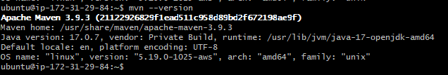
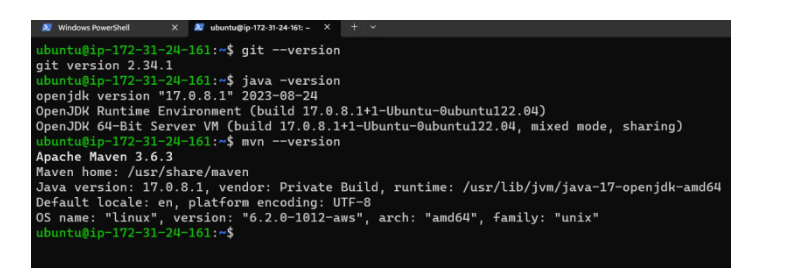
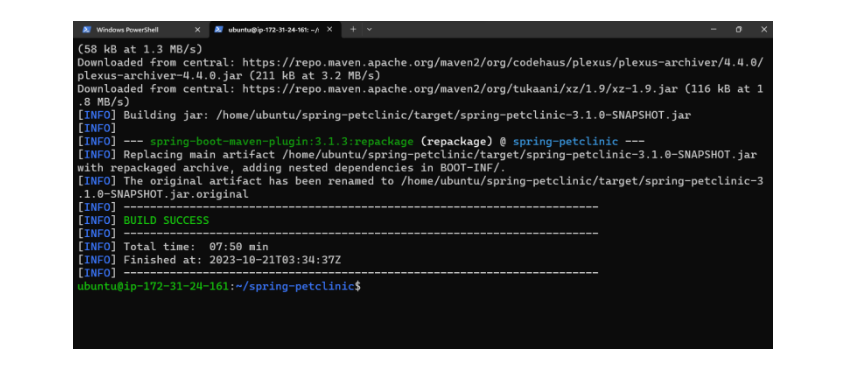

# Maven

* Maven is a tool which can be use to build the code, package, distribute, test and generate documentation for java and java based languages
* The maven uses a file called as pom.xml
  pom (Project object model)

# Maven Goals:

* [Refer Here](https://www.baeldung.com/maven-goals-phases)

* **To execute any lifecycle goal `mvn <goal>`**

* **Validate:** validates the pom and its project
* **Compile:** this converts the java code into byte code (.java to .class). It stores the class files in `target/classes`
* **Test:** it will run the unit tests written and generates test results in xml format in text format. folder will be /target/surefire-reports/TEST-*.xml
* **Package:** This creates the packaging format (jar/war/ear). will be <artifact-id>-<version>.<packaging-format>
* **Install:** This copies the package and its definition into `M2_HOME or ~/.m2/repository`
* **Deploy:** copying package and its definition to remote repository for other users in other systems to use what you have built
* **Clean:** clean removes target folder

# Maven Lifecycle:

* [Refer Here](https://maven.apache.org/guides/introduction/introduction-to-the-lifecycle.html#Lifecycle_Reference)


# Maven Installation On Ubuntu/Centos/RedHat Linux:

Default version available in the apt/yum packages:
  ----------------------------------------------
* sudo apt update
* sudo apt-cache search maven
* sudo apt-cache madison maven
* sudo apt install maven
*  mvn --version

* To Install Customized version of Maven:
  ----------------------------------------
```
cd /opt/tmp
wget https://dlcdn.apache.org/maven/maven-3/3.9.3/binaries/apache-maven-3.9.3-bin.tar.gz

Same folder extract then below follow:
---------------------------------------
tar -xvzf apache-maven-3.9.3-bin.tar.gz
cd /apache-maven-3.9.3/bin
./mvn --version    
Different folder extract follow below:
--------------------------------------    
tar -xvzf apache-maven-3.9.3-bin.tar.gz -C /usr/share/maven
cd /usr/share/maven/apache-maven-3.9.3/bin
./mvn --version 

Adding to Path Variable:
--------------------------
sudo vi /etc/environment
/usr/share/maven/apache-maven-3.9.3/bin => add this path into above path variable
source /etc/environment

Finally check:
----------------
cd enter
mvn --version
```



# Sample/Simple POM.xml file

```
<project>
  <modelVersion>4.0.0</modelVersion>
  <groupId>io.learningthoughts.samples</groupId>
  <artifactId>hello-maven</artifactId>
  <version>1.0.0-SNAPSHOT</version>
  <properties>
     <maven.compiler.source>11</maven.compiler.source>
     <maven.compiler.target>11</maven.compiler.target>
  </properties>
  <dependencies>
    <dependency>
    <groupId>junit</groupId>
    <artifactId>junit</artifactId>
    <version>4.13.2</version>
    <scope>test</scope>
   </dependency>
  </dependencies>
</project>
```

# Maven packaging formats:

* [Refer Here](https://www.baeldung.com/maven-packaging-types#:~:text=Maven%20offers%20many%20default%20packaging%20types%20that%20include%20a%20jar,and%20performs%20a%20specific%20task.)

* When we execute the maven goals then it downloads all its dependencies and stores in maven home directory called `M2_HOME` where ever this environment variable points to.and if not found it does in `<home-dir>/.m2` in our operating system
* if we want to change this default storing dependencies then needs to define in environmental variable.  


Building and Packaging Java Projects using a Maven:
---------------------------------------------------
* Compilation: Process of
   * checks for errors in code
   * converts to desired language (Byte code/machine code)

* Packaging:
   * Combining compiled code into some packaging format
   * java: jar/war/ear
   * dotnet: dll/exe

* Dependencies: will be downloaded
   * java: maven/gradle
   * dotnet: nuget
   * python: pip
   * nodejs: npm   

* Maven: combines dependency resolution, compilation, unit test executions, packaging
* Maven expects a file called as pom.xml
* Steps:
   * Get the latest code
   * Pre-requisites:
      * jdk version
      * maven

* Execute `mvn <goal>`
    * compile
    * test
    * package

* In our case we will be using `mvn package`

### Setup a linux vm for building and packaging spring-petclinic:
* pre-req’s
   * git
   * maven
   * jdk 17

* SSH into the vm & execute the following

```bash
sudo apt update
sudo apt install openjdk-17-jdk -y
sudo apt install maven -y
git --version
java -version
mvn --version
```

* Build steps

```bash
cd ~
git clone https://github.com/spring-projects/spring-petclinic.git
cd spring-petclinic
mvn package
```



