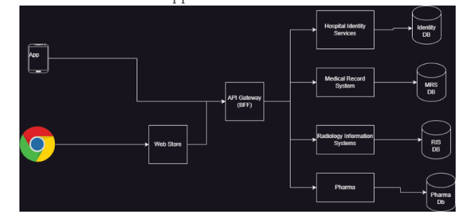

*  This file or notes consists just for an update how the git and jenkins flow will work based on some organization examples given.

## Story of an Organization LT:
* LT is an organization who is developing an application for health care. Big Hospital chains are their customers
   * Appolo
   * Fortis
   * AIG

* Architecture of their application

* To develop this application we have one team per service
* To test this application we have
   * automated testers
   * manual testers

* Goals: LT want to implement DevOps Practices
  * Check the code quality and regressions whenever developer commits the code.
  * Manual testers will test all the work done by developers previous day in todays work
  * Code Quality has to be tested by Static Code Analysis tools
  * We need to store the build artifacts of night build in artifact repository
* During nightly build three test environments have to be updated and automated test results have to shared
   * System Test
   * Performance Test
   * Security Test
* We need to create a weekly build at friday night where long duration tests run.
* For every two weeks we give an internal release which will bring up the UAT (User Acceptance Test)/Pre-Prod Environment (Sprint builds)

### Terms:
* **Regression:** New changes impacting working features and tests to identify this are called as Regression tests
* API Testing:
* Rest API
* **unit testing:** testing smaller units of code by writing code
* **Day build:** Every change submitted by developer during active work hours
  * We do minimal test executions
  * This should finish quickly

* **night build:** This build is done to consolidate all the work done by your dev team for the whole day
   * We do execute all the automated tests
   * This might take hours and gives confidence to manual testing team so that they can consider this build
* **Quality Gate:** If we fail the build when code quality issues exist this is called as Quality Gate
* **Artifact:** Artifact is what build/package generates
* **Repository:** This is a storage location which maintains history

### Concpets/tools To learn to achieve the above goals:

* git
* jenkins
* Sonar Qube (Static Code Analysis)
* Jfrog (Package Repository/artifact repository)
* Branching strategies
* Integration with
    * Ansible
    * Terraform
    * Docker
    * Kubernetes
    * Build tools:
    * maven
    * msbuild

    