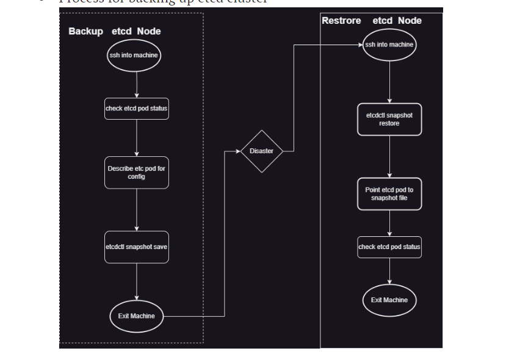
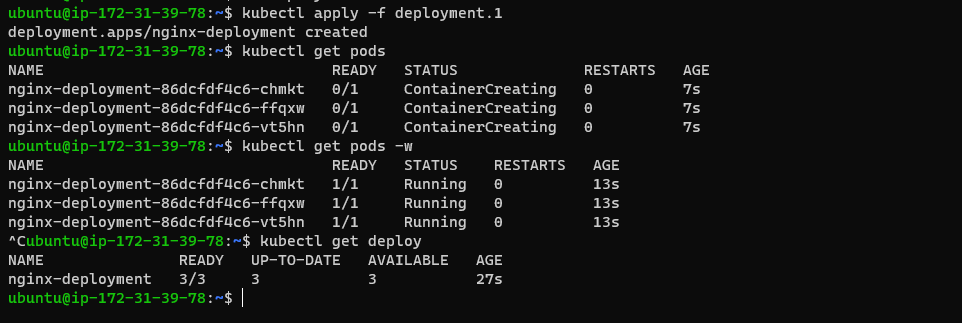
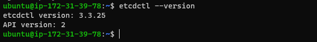
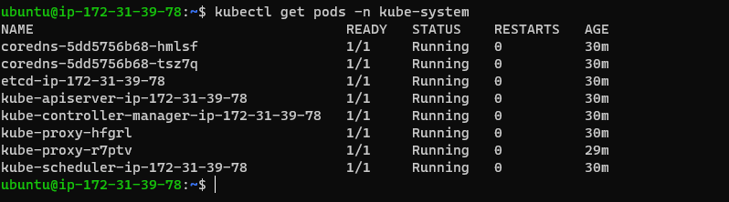
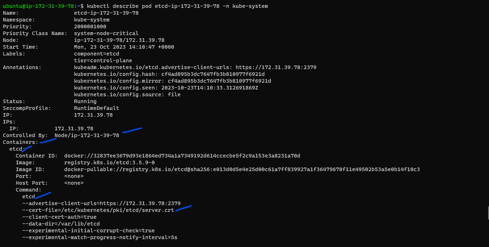
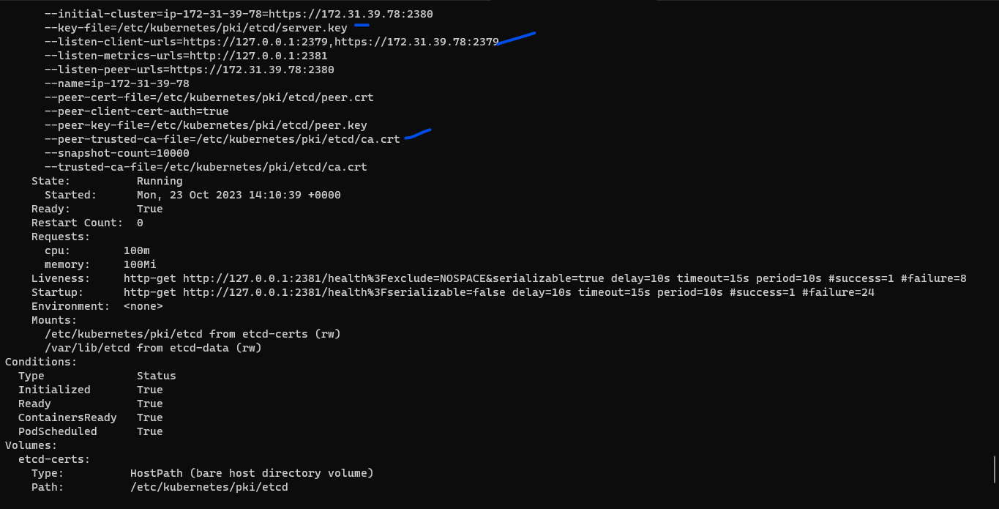
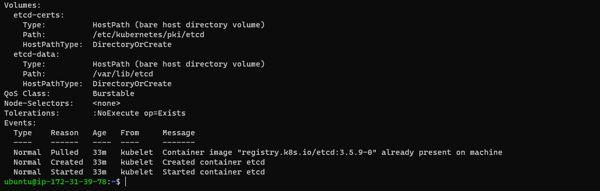
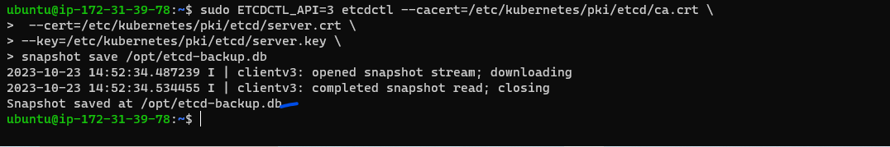
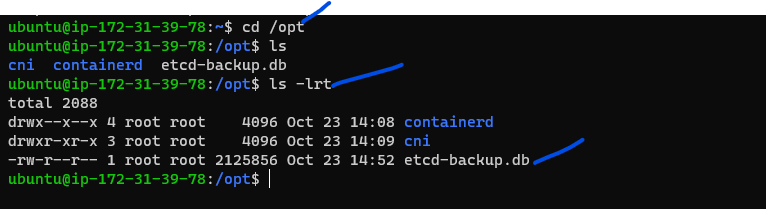
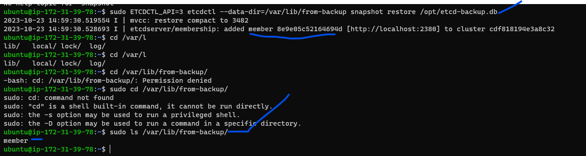

# ETCD Backup and Restore:
* [Refer Here](https://kubernetes.io/docs/tasks/administer-cluster/configure-upgrade-etcd/#backing-up-an-etcd-cluster) for official docs

* Process for backing up and restore etcd cluster



* Create some k8s deployment

```yaml
---
apiVersion: apps/v1
kind: Deployment
metadata:
  name: nginx-deployment
  labels:
    app: nginx
spec:
  replicas: 3
  selector:
    matchLabels:
      app: nginx
  template:
    metadata:
      labels:
        app: nginx
    spec:
      containers:
      - name: nginx
        image: nginx:1.14.2
        ports:
        - containerPort: 80
```


* check etcdctl version
```bash
etcdctl --help
etcdctl --version
```


* Etcd pod is deployed as a Pod in kube-system namespace

`kubectl get pods -n kube-system`


*  Lets describe pod 

`kubectl describe pod etcd-ip-172-31-39-78 -n kube-system`




* Lets create a snapshot/backup `ETCD` using below command:

```bash
sudo ETCDCTL_API=3 etcdctl --cacert=/etc/kubernetes/pki/etcd/ca.crt \
    --cert=/etc/kubernetes/pki/etcd/server.crt \
    --key=/etc/kubernetes/pki/etcd/server.key \
    snapshot save /opt/etcd-backup.db
ETCDCTL_API=3 etcdctl --write-out=table snapshot status snapshot.db    
```



* Restore etcd:
 * command to restore the snapshot/backup

 `sudo ETCDCTL_API=3 etcdctl --data-dir=/var/lib/from-backup snapshot restore /opt/etcd-backup.db`


* Change the `manifest etcd.yaml` file in the loaction of `/etc/kubernetes/manifests` to point to new location
[Refer Here](https://medium.com/@mehmetodabashi/backup-and-restore-etcd-cluster-on-kubernetes-93c19b1c070) for changind the etcd.yaml files steps are there.


