Helm In Kubernetes:
--------------------
* [Refer Here](https://helm.sh/docs/) for official docs
* [Refer Here](https://helm.sh/docs/intro/install/) helm installation
* [Refer Here](https://helm.sh/docs/intro/cheatsheet/) for helm Cheat Sheet and [Refer Here](https://helm.sh/docs/helm/helm/) Helm commands in detail
* [Refer Here](https://helm.sh/docs/topics/charts/) details of helm charts all the files
* Helm is a package manager in kubernetes
* by creating helm charts we get all manifest/yml files by pre-defined, so that we dont have to create each and every manifest/yml files for each resources
* also with single command we can deploy our object/resources to kubernetes cluster
* Helm calls each package as chart.
* Helm uses a packaging format called charts. A chart is a collection of files that describe a related set of Kubernetes resources.

  `helm install my-charts`
values.yml files is variable for templates in manifest files
* Manifests/yml files are static in nature, to add reusability and dynamic nature to manifests/yml we use helm
* helm charts we convert into package like archive
* helm charts has a repository, so that even our own repo we can store it in the repository and later we can pull using helm command and use it. 
*  the Artifact Hub is the popular helm charts repository. Once you have Helm chart ready, you can add a chart to repository. Check Artifact Hub for available Helm chart repositories.
  * [Refer Here](https://artifacthub.io/packages/search?kind=0) Artifact Hub


#### Helm Artitecture:
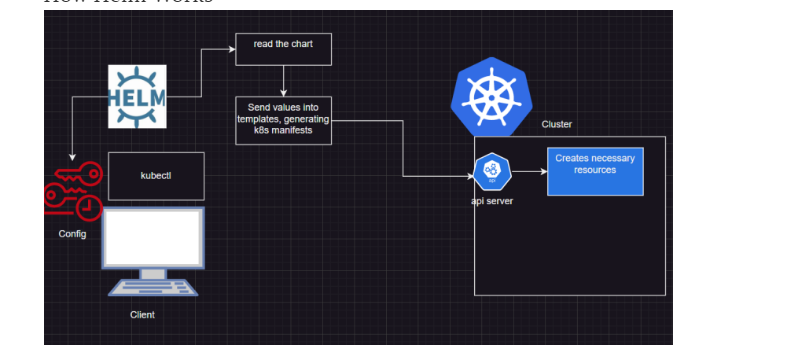

* When we create helm chart with below command

`helm create  my-charts`

`helm create <chart_name>`

* the directories and files which will be created below.
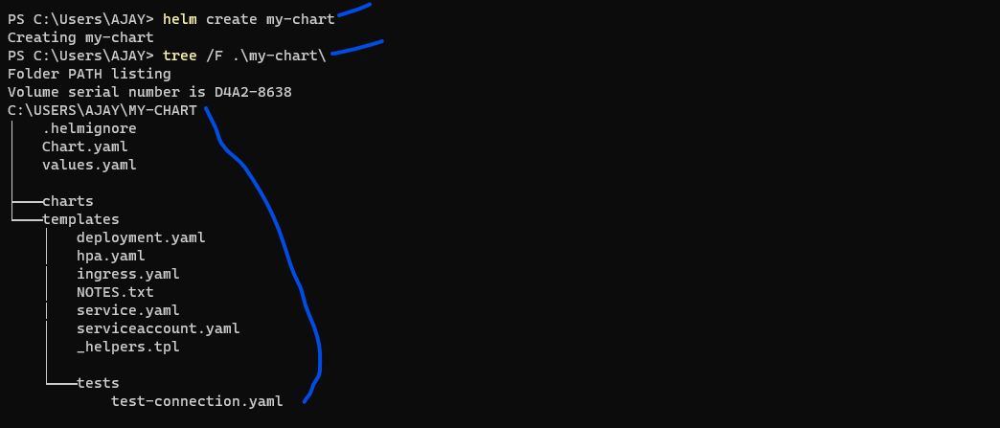

* Below explains about directories and files structure
  * For example, 'helm create foo' will create a directory structure that looks something like this:

```
├── .helmignore  # Contains patterns/files to ignore when packaging Helm charts/when building packages.
├── Chart.yaml    # Information/description about your chart like version, name etc:
├── values.yaml   # The default values for your templates, alos it is variable for your template manifest files
├── charts/       # Charts that this chart depends on/ consists of dependencies for our chart 
└── templates/    # The template files/manifest files
    └── tests/    # The test files    
```
* Some more explaination about directories and files for above structure:
  * The `templates/` directory is for template files. When Helm evaluates a chart, it will send all of the files in the `templates/` directory through the template rendering engine. It then collects the results of those templates and sends them on to Kubernetes.
  * The `values.yaml` file is also important to templates. This file contains the default values for a chart. These values may be overridden by users during `helm install` or `helm upgrade.`
  * The `Chart.yaml` file contains a description of the chart. You can access it from within a template.
  * The `charts/` directory may contain other charts (which we call subcharts). Later in this guide we will see how those work when it comes to template rendering.
* If you take a look at the `mychart/templates/` directory, you'll notice a few files there.  
  * `NOTES.txt:` The "help text" for your chart. This will be displayed to your users when they run `helm install.`
  * `deployment.yaml:` A basic manifest for creating a Kubernetes deployment
  * `service.yaml:` A basic manifest for creating a service endpoint for your `deployment`
  * `_helpers.tpl:` A place to put template helpers that you can re-use throughout the chart

### Helm Templates Developing Method:
* Helm uses Go text template engine
* `{{ }}` these are referred as actions. Anything outside these actions is copied to output
* Inside actions there are variety of features 
  * including
  * ipelines
  * if/else statements
  * loops
  * variables
  * functions etc: 

### Helm chart components at a high level:
Create a helm chart `helm create hello-world`
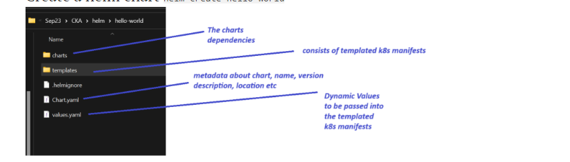
* [Refer Here](https://github.com/AjayKumarRamesh/QT-DevOps-AzureCloud-Trainings-Ajay/tree/master/Kubernetes/Helm) for chart directories and files structures 

### Example Demonstration:1 AWS
* Create a helm chart

 `helm create my-chart`

* After creating helm chart the files looks like below
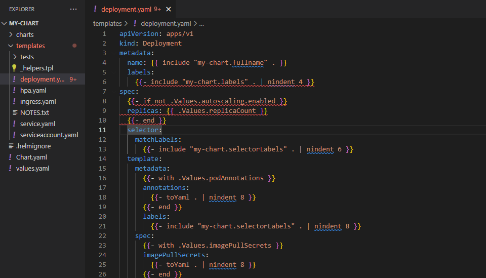

* So now we want to convert helm chart into normal manifest file which every one can understand it.
```
helm template --help
helm template [NAME] [CHART] [flags]
```
* So execute below commands to covert helm chart into normal file called check

`helm template attempt1 .\my-chart\ --output-dir .\check`
* after we execute above command files looks like below which is normal 
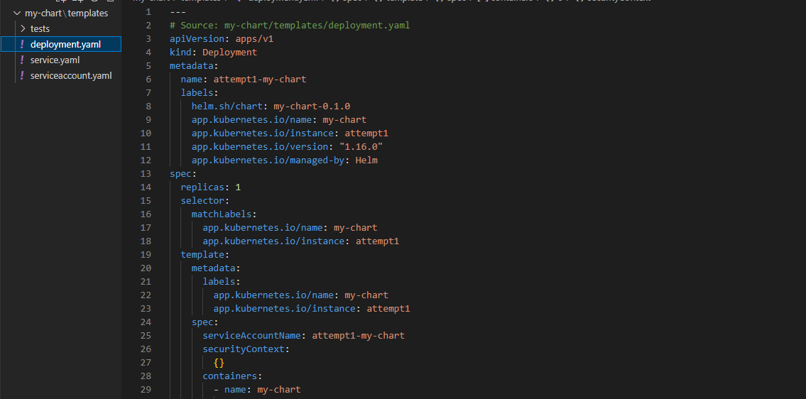
* Now if we change the values.yml file of each resources mentioned in the values.yml, while created at time of my-chart, when value.yml file is generated. what will happen is we can see the changes takes place in normal converted file too, so this demonstration is just for our understanding. 

* Now after changning some values in the value.yml file run the same below command so that we can see the observation of values change in the normal manifest files 
* before change 
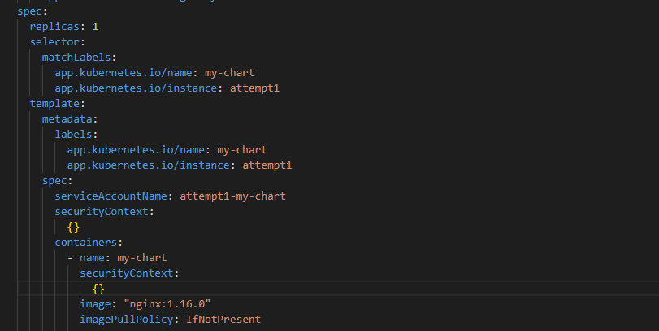
* after execute command and change it values

``helm template attempt1 .\my-chart\ --output-dir .\check`

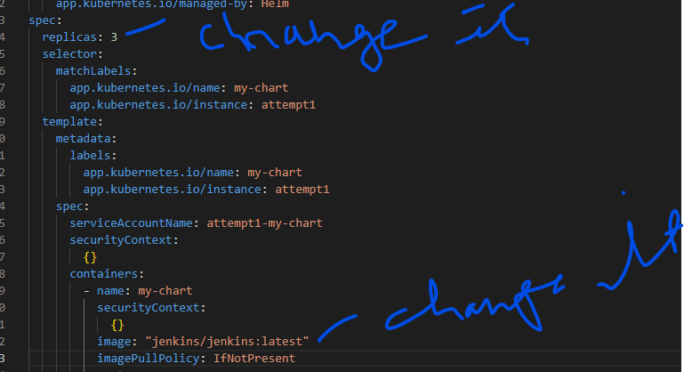

#### Refer below manifest file for demonstration
 * [Refer Here](https://github.com/AjayKumarRamesh/QT-DevOps-AzureCloud-Trainings-Ajay/tree/master/Kubernetes/Helm/Helm_Chart_Examples/my-chart) 

 * execute below commands:
```
helm install myfirst-test my-chart/
helm list
kubectl get deploy
kubectl get pods
kubectl get svc
helm uninstall myfirst-test
```
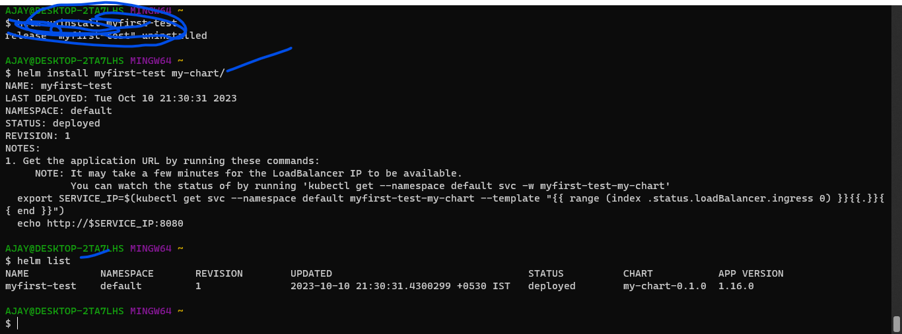
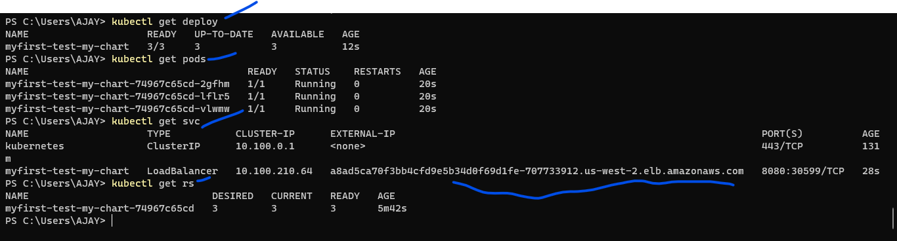

* Now access the applications:
`lb:portno`
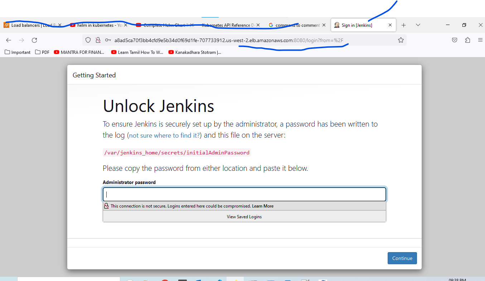

---

### Example Demonstration:2 AWS

* Create helm chart

`helm chart helloworld`

* install/deploy helm chart into k8s cluster

` helm install myhelloworld-release hello-world`

* output is below
```
NAME: myhelloworld-release
LAST DEPLOYED: Wed Oct 11 00:44:22 2023
NAMESPACE: default
STATUS: deployed
REVISION: 1
NOTES:
1. Get the application URL by running these commands:
  export POD_NAME=$(kubectl get pods --namespace default -l "app.kubernetes.io/name=hello-world,app.kubernetes.io/instance=myhelloworld-release" -o jsonpath="{.items[0].metadata.name}")
  export CONTAINER_PORT=$(kubectl get pod --namespace default $POD_NAME -o jsonpath="{.spec.containers[0].ports[0].containerPort}")
  echo "Visit http://127.0.0.1:8080 to use your application"
  kubectl --namespace default port-forward $POD_NAME 8080:$CONTAINER_PORT
```
* List the service which is running
 
  `helm list`
* Output is below
```
NAME                    NAMESPACE       REVISION        UPDATED                                 STATUS          CHART                   APP VERSION
myhelloworld-release    default         1               2023-10-11 00:44:22.8316678 +0530 IST   deployed        hello-world-0.1.0       1.16.0
```
* To get service 

`kubectl get service/svc`
* Access the applications

  `http://ip-address:portno`

* If we do any changes to our helm chart means if changes the values.yml or any files templates resources file then we needs to run upgrade command
* before changes screenshot

```
vi hello-world
cd hello-world/
vi values.yaml
```
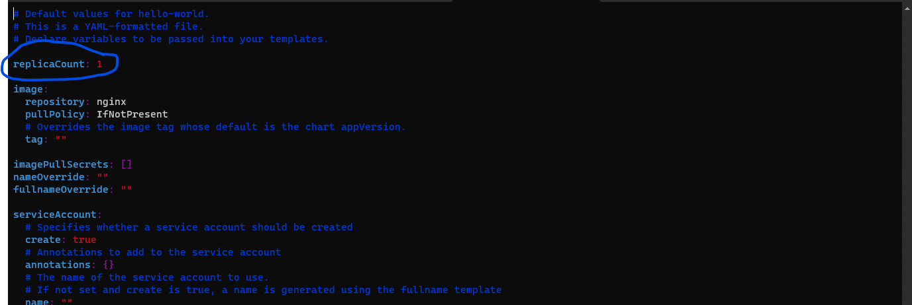
* Before change below screen shot
`helm list`
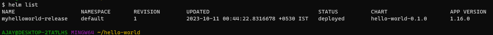
* After changes below screen shot
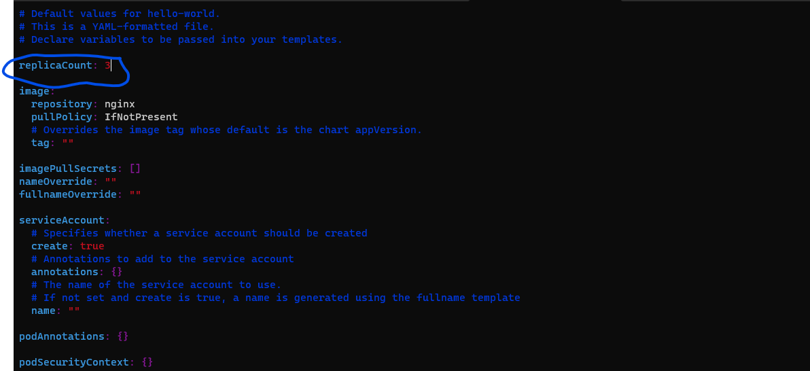
* Execute below command

 `helm upgrade myhelloworld-release hello-world`
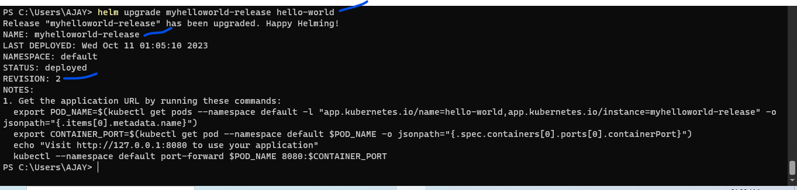
* To check upgrade done or not

 `helm list`
 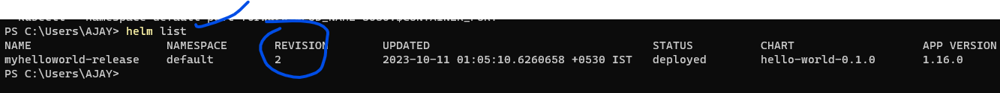
* Now we are rolling back to previous version of helm 
` helm rollback myhelloworld-release 1`
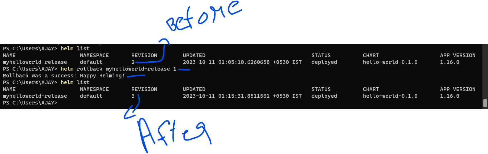
* To debug and dry run the helm chart to check any errors or issues arise before we deploy

` helm install helloworld-release --debug --dry-run hello-world`
* It gives full manifest files output


#### sample helm template for nopCommerce with changes in dynamic values:
* [Refer Here](https://github.com/AjayKumarRamesh/QT-DevOps-AzureCloud-Trainings-Ajay/tree/master/Kubernetes/Helm/Helm_Chart_Examples/nopcommerce) for manifest of dynamic values changed

## HelmFile:
* helmfile is to manage the helm charts in single command 
* [Refer Here](https://helmfile.readthedocs.io/en/latest/) for kind of official docs
* [Refer Here](https://jhooq.com/helmfile-manage-helmchart/) basic steps to know helmfile

#### Installing helmfile in windows:

```
choco install kubernetes-helmfile
helmfile version
```

### Example demonstration aws eks

* Steps:
```
# create helm chart
helm create helloworld
# create helm file
vi helmfile.yml
# copy below content into helmfile.yml file
---
releases:
- name: myhellorelease
  chart: ./helloworld
  installed: true
# save the file
# Now execute the helmfile
helmfile sync
# to check service is running 
helm list
```
* Output Below screen shot:
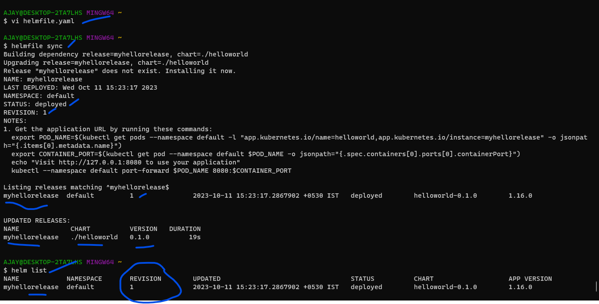
! [Preview](./Images/helm19.png)

* To uninstall the release/chart which we deployed

```
# change installed value to false
---
releases:
- name: myhellorelease
  chart: ./helloworld
  installed: false
# execute below command
helmfile sync
helm list  
```
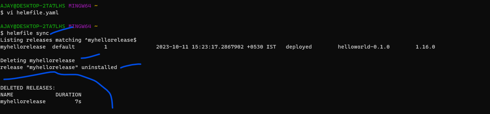
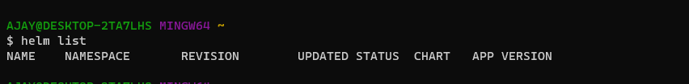

* Another way of install helmfile:

`helmfile --help`

```
# install plugins
helm init
helmfile apply
helm list
```
* Another way to uninstall helfile:

```
helmfile delete
helmfile list
```

#### Deploying helm chart from github repository to k8s cluster:


