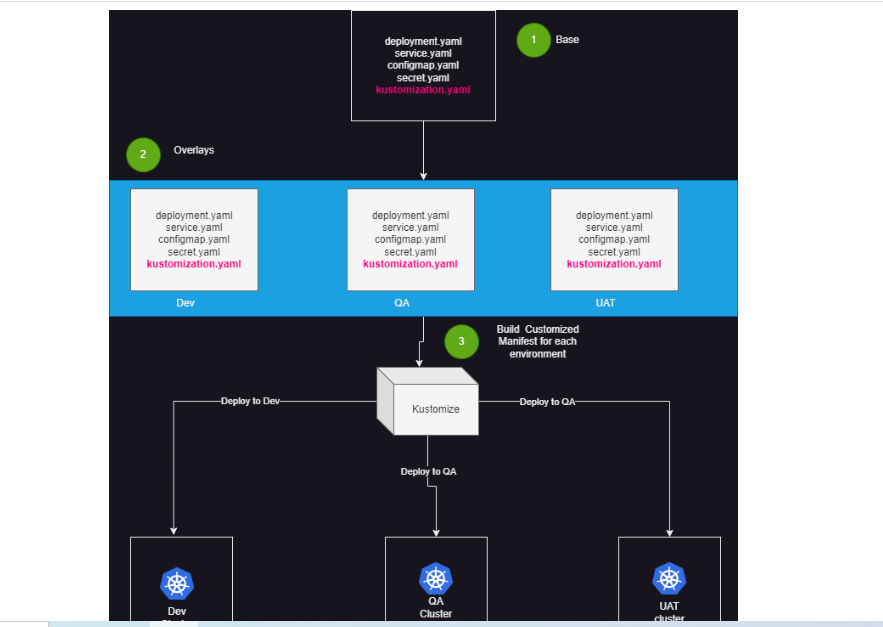
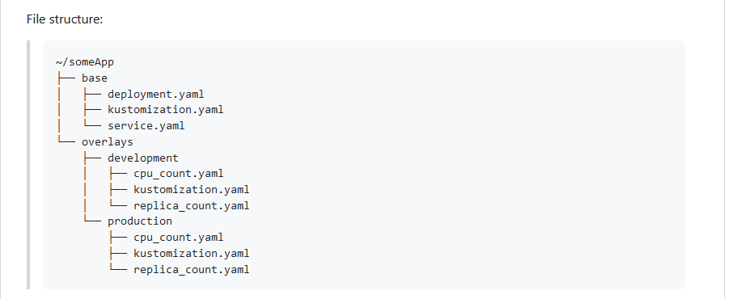
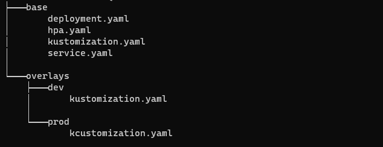
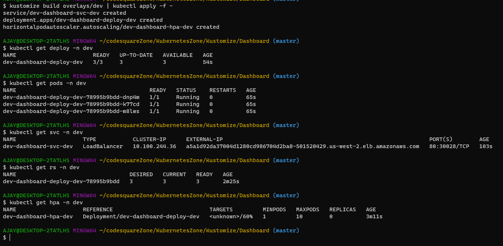

# Kustomization:

Artitecture:


* [Refer Here](https://kubectl.docs.kubernetes.io/guides/introduction/kustomize/) official docs for kustomization
* [Refer Here](https://kubernetes.io/docs/tasks/manage-kubernetes-objects/kustomization/) kustomization official docs for k8s 
* [Refer Here](https://kubectl.docs.kubernetes.io/references/kustomize/kustomization/labels/) API Reference for Kustomization
* This is main kustomization official docs with this we can learn all the topics or subtopics of kustomization [Refer Here](https://kustomize.io/) 
* [Refer Here](https://www.vultr.com/docs/how-to-configure-kubernetes-resources-with-kustomize/) tutorial from vultr to use kustomize
* [Refer Here](https://github.com/kubernetes-sigs/kustomize) github repo for kustomization
* [Refer Here](https://www.youtube.com/watch?v=ASK6p2r-Yrk) for kustomization youtube

* kustomization is to manage the k8s resource
* Kustomize lets you customize raw, template-free YAML files for multiple purposes, leaving the original YAML untouched and usable as is.
* kustomization will use generate method for configmap and secrets which can be mount in the  in the deployment
* configmap and secrets can be files, env and litrals 
by using kustomization we can deploy all the k8s resource in the cluster at same time or different time also.

### base:
* [Refer Here](https://kubectl.docs.kubernetes.io/references/kustomize/glossary/#base) Refer for base functionality


### overlay:
* [Refer Here](https://kubectl.docs.kubernetes.io/references/kustomize/glossary/#overlay) Refer for overlay functionality

### Work Flow Of Kustomization:




## Examples or Demonstration of kustomization:

* Refer below for kustomization folder structure
* base:
  * [Refer Here](https://github.com/codesquareZone/KubernetesZone/commit/2b26e3df257c015db43fdbef708f0227f18b524d)

* Now check the preview with kustomize before deploy the resource in k8 cluster  and then deploy with apply command

```
kustomize build Dashboard/base/

       or 
kubectl kustomize Dashboard/base/

kubectl apply -k Dashboard/base/

kustomize build  | kubectl apply -f - 
```

* Incase we want to deploy resource in multiple envirnoment in k8 cluster then we needs to create overlay, refer below the folder structure
* also adding namesapce, nameprefix,namesuffix, labels and common labels done refer below.
* overlay:
 * [Refer Here](https://github.com/codesquareZone/KubernetesZone/commit/11e7bc75c5391c14edb5495c2447327ed9c45458)

* File Structure for `base` and `overlays`



* Now Deploy the resources of base and overlays in k8s cluster using kustomization:

```
# deploy resource in k8s cluster
kustomize build overlays/dev | kubectl apply -f -
kubectl apply -k overlays/dev
# delete resource in k8s cluster
kustomize build overlays/dev | kubectl delete -f -
kubectl delete -k overlays/dev
```
* Final deploy resource in the k8s cluster oberve the screen shots



* access the application

`<lb><port_no>`


