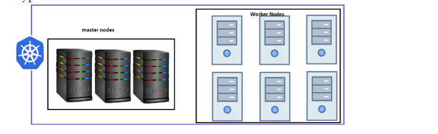
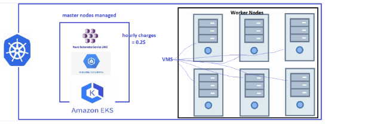
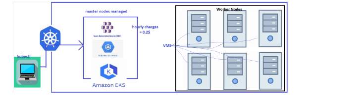
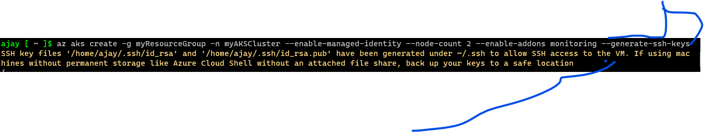
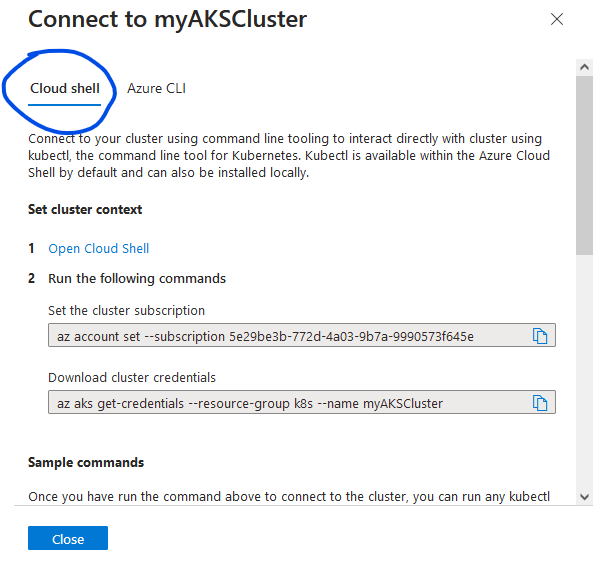
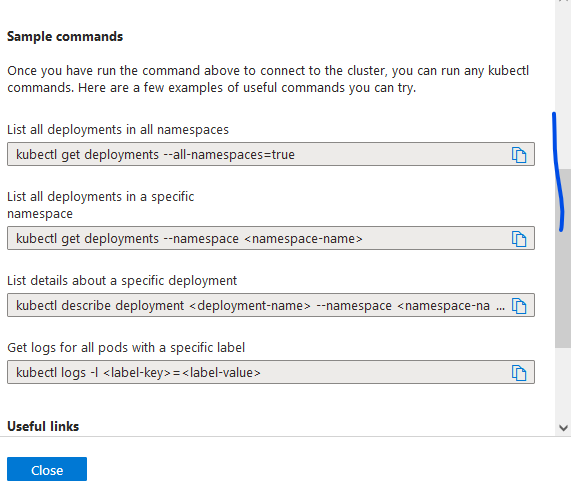
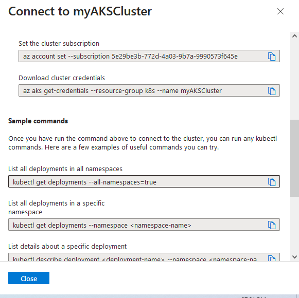

Managed Kubernetes or Kubernetes as a Service:
----------------------------------------------

* Managed Kubernetes (Kubernetes as a Service) is the offerings from various cloud providers.
* In these Control-Plane is managed by Cloud Service Providers and they charge you hourly for that
* For worker nodes, storage and other resources charges are as usual.
* Popular Kubernetes offerings:
   * AKS (Azure Kubernetes Services)
   * EKS (Elastic Kubernetes Services)
   * GKE (Google Kubernetes Engine)
* Apart from normal kubernetes components in master node one extra component is added that is called `cloud-controller-manager` this component to speak with cloud providers means control plane behalf of k8s.

* Typical k8s cluster:


* K8s as a Service(Cloud):


* Advantages k8s as service:
   * less administration
   * nodes can be scaled
   * inbuilt support for cloud integrations

---

Setting up basic k8s cluster in Azure (AKS):
--------------------------------------------
* Refer this below document there full commands to create AKS cluster in cli
  * [Refer Here](https://learn.microsoft.com/en-us/cli/azure/aks?view=azure-cli-latest#az_aks_upgrade)



### AKS cluster can be created in many ways:
* AKS console
* AKS cli
* terraform


### We can setup `AKS` cluster on all below `OS`:
  * windows 
  * Linux
  * Mac
### To install `kubectl` on all above `OS`
  * [Refer Here](https://kubernetes.io/docs/tasks/tools/)
### To install `Azure Cli` on all above `OS` 
   * [Refer Here](https://learn.microsoft.com/en-us/cli/azure/install-azure-cli)


## (AKS) cluster creation using Azure CLI:
  
### Windows Machine:
  * Install kubectl
  * Install Azure cli
  * az login

```
Run powershell as administration
# install kubectl
choco search kubectl
choco install kubernetes-cli 
kubectl version

# install azure cli
choco search azure-cli
choco install azure-cli
az version
# Authenticate azure cloud from our local terminal
az login 
```

* **Then follow below azure document link:**
  * [Refer Here](https://learn.microsoft.com/en-us/azure/aks/learn/quick-kubernetes-deploy-cli)
  * following this above document will create aks cluster all default values taken by azure and also default network resources
  * in case we want our customized values means then we needs to add the parameter in commandline while executing, then we can change to our own values and also our own network resources.
* **Examples of network resources like:**
    * Virtual network
    * subnet
    * Virtual machine
    * network security group
    * Route table
    * Public IP address
    * Load balancer
    * Managed Identity
    * Internet gateways
    * Network ACLs **etc:**
* **Examples of values:**
    * name of cluster
    * number of nodes to create
    * name of node groups 
    * enable ssh keys **etc:** 
* Finally verify AKS cluster is ready and nodes up and running by executing below command:

```
kubectl get nodes
kubectl get svc
```
* **Warning:**
  * **Please Note:**
    * we should not create `AKS` cluster in our local terminal since it will override our ssh-key
    * but we can create `AKS` cluster in `cloud-shell` and then import .kube/config file in our local terminal then we are able to connect to `AKS` cluster, then we can use it.
    * Refer below screen shot
    


## (AKS) cluster creation using Azure CLI:

### Linux/Ubuntu:
  * Install kubectl
    * [Refer Here](https://kubernetes.io/docs/tasks/tools/install-kubectl-linux/#install-using-native-package-management)
  * Install Azure cli
    * [Refer Here](https://learn.microsoft.com/en-us/cli/azure/install-azure-cli)
    * az login

* **Then follow below azure document link:**
  * [Refer Here](https://learn.microsoft.com/en-us/azure/aks/learn/quick-kubernetes-deploy-cli)
  * following this above document will create aks cluster all default values taken by azure and also default network resources
  * in case we want our customized values means then we needs to add the parameter in commandline while executing, then we can change to our own values and also our own network resources.
* **Examples of network resources like:**
    * Virtual network
    * subnet
    * Virtual machine
    * network security group
    * Route table
    * Public IP address
    * Load balancer
    * Managed Identity
    * Internet gateways
    * Network ACLs **etc:**
* **Examples of values:**
    * name of cluster
    * number of nodes to create
    * name of node groups 
    * enable ssh keys **etc:** 
* Finally verify AKS cluster is ready and nodes up and running by executing below command:

    ```
    kubectl get nodes
    kubectl get svc
    ```
* In this linux and ubuntu `AKS` cluster creation warning is not applicable since it is not our local terminal we will be using `vm` from azure cloud.


## (AKS) cluster creation using Azure CLI:

### Azure Cloud Shell:
  * kubectl and azure cli is already installed it is like pre-defined
  * no need to install any software/dependencies
  * Open azure cloud shell on azure portal
    * will see pop up to create storage account, create it.
    * after creating storage account, check in resource group, new resource group has been created for storage account so once we have done with using AKS cluster needs to delete it.   

* **Then follow below azure document link:**
  * [Refer Here](https://learn.microsoft.com/en-us/azure/aks/learn/quick-kubernetes-deploy-cli)
  * following this above document will create aks cluster all default values taken by azure and also default network resources
  * in case we want our customized values means then we needs to add the parameter in commandline while executing, then we can change to our own values and also our own network resources.
* **Examples of network resources like:**
    * Virtual network
    * subnet
    * Virtual machine
    * network security group
    * Route table
    * Public IP address
    * Load balancer
    * Managed Identity
    * Internet gateways
    * Network ACLs **etc:**
* **Examples of values:**
    * name of cluster
    * number of nodes to create
    * name of node groups 
    * enable ssh keys **etc:**  
* Finally verify AKS cluster is ready and nodes up and running by executing below command:

  ```
  kubectl get nodes
  kubectl get svc
  ```
* In this azure cloud shell creating aks cluster there is no warning since we are not creating in our local terminal.

## Another option is:
* even in our local terminal we have option to use azure cloud shell.
* once we open azure cloud shell in our local terminal please follow authentication
* there also we can create aks cluster.
* if create aks cluster in in azure portal cloud shell then needs to import .kube/config file in the local terminal azure cloud shell, then we connect to our aks cluster.
* Incase we have create aks cluster in the local terminal azure cloud shell then just import .kube/config file in the azure portal cloud shell so that we connect to our aks cluster and start using it.
* in another case is we can create aks cluster in either azure cloud shell or in azure portal cloud shell, just needs to import .kube/config file in the local terminal so then we can connect our aks cluster and start using it.  


## (AKS) cluster creation using the Azure portal:
* **Then follow below azure document link:**
   * [Refer Here](https://learn.microsoft.com/en-us/azure/aks/learn/quick-kubernetes-deploy-portal?tabs=azure-cli)  
   * following the above document we can create with default network resources with default values nor we can create our own customized network resource with that network we create our own customized `EKS Cluster` with values.
* **Examples of network resources like:**
    * Virtual network
    * subnet
    * Virtual machine
    * network security group
    * Route table
    * Public IP address
    * Load balancer
    * Managed Identity
    * Internet gateways
    * Network ACLs **etc:**
* **Examples of values:**
    * name of cluster
    * number of nodes to create
    * name of node groups 
    * enable ssh keys **etc:**   
   * After creating AKS cluster through portal follow the below steps:
   * To Connect AKS Cluster:
     * **Azure Cloud Shell:**
     
     
        * After executing second command in the screen shot below process will take place 
        * it will create .kube/config file into our local system/terminal with `cluster certificate and client certificate and also cluster information` it will have all credentials information to connect k8s cluster
       * Finally execute below command to check aks cluster is connected and nodes are up and running

         ```
         kubectl get nodes
         kubectl get svc
         ```

     * **Azure Cli:**
     
     
     * After executing third command in the screen shot below process will take place 
     * it will create .kube/config file into our local system/terminal with `cluster certificate and client certificate and also cluster information` it will have all credentials information to connect k8s cluster
     * Finally execute below command to check aks cluster is connected and nodes are up and running

         
         ```
         kubectl get nodes
         kubectl get svc
         ```

---


Setting up basic k8s cluster in AWS (EKS):
---------------------------------------------
### EKS cluster can be created in many ways:
* aws console
* aws cli
* terraform
* eksctl

### We can setup `EKS` cluster on all below `OS`:
  * windows 
  * Linux
  * Mac

#### To install `kubectl` on all above `OS`:
  * [Refer Here](https://kubernetes.io/docs/tasks/tools/)

#### To install `kubectl` from `AWS` docs on all above `OS`:
  * [refer here](https://docs.aws.amazon.com/eks/latest/userguide/install-kubectl.html)

#### To install `aws cli` on all above `OS`:
  * [refer here](https://docs.aws.amazon.com/cli/latest/userguide/getting-started-install.html)

#### To install `eksctl` on all above `OS`:
  * [Refer Here](https://eksctl.io/introduction/) for official docs
  * [Refer Here](https://blog.knoldus.com/how-to-install-eksctl-the-official-cli-for-amazon-eks/) other author

## (EKS) cluster creation using AWS CLI:

### Windows:
* install kubectl
* install awscli

```
Run powershell as administration
# for install kubectl
choco search kubectl
choco install kubernetes-cli 
kubectl version

# for install awscli
choco search awscli
choco install awscli
aws --version
aws configure
```

### Linux/ubuntu:
* install kubectl
* install awscli

```
# for ubuntu install kubectl
sudo apt-get update
sudo apt-get install -y apt-transport-https ca-certificates curl
curl -fsSL https://pkgs.k8s.io/core:/stable:/v1.28/deb/Release.key | sudo gpg --dearmor -o /etc/apt/keyrings/kubernetes-apt-keyring.gpg
echo 'deb [signed-by=/etc/apt/keyrings/kubernetes-apt-keyring.gpg] https://pkgs.k8s.io/core:/stable:/v1.28/deb/ /' | sudo tee /etc/apt/sources.list.d/kubernetes.list
sudo apt-get update
sudo apt-get install -y kubectl
kubectl version

# for ubuntu install awscli
sudo apt-get update
sudo apt-get install awscli -y
aws --version
aws configure 

# for linux install kubectl 
cat <<EOF | sudo tee /etc/yum.repos.d/kubernetes.repo
[kubernetes]
name=Kubernetes
baseurl=https://pkgs.k8s.io/core:/stable:/v1.28/rpm/
enabled=1
gpgcheck=1
gpgkey=https://pkgs.k8s.io/core:/stable:/v1.28/rpm/repodata/repomd.xml.key
EOF
sudo yum update -y 
sudo yum install -y kubectl
kubectl version 

# for linux install awscli
curl "https://awscli.amazonaws.com/awscli-exe-linux-x86_64.zip" -o "awscliv2.zip"
unzip awscliv2.zip 
sudo ./aws/install
aws --version
aws configure
```
* Follow below aws official docs links:
  * [Refer Here](https://docs.aws.amazon.com/eks/latest/userguide/create-cluster.html)
  * [Refer Here](https://docs.aws.amazon.com/cli/latest/reference/eks/create-cluster.html)
  * [Refer Here](https://docs.aws.amazon.com/eks/latest/userguide/getting-started-console.html) 
  * [Refer Here](https://mycloudjourney.medium.com/provision-aws-eks-from-the-aws-console-8c253595a546) other author docs
  * following above documents we can create `EKS Cluster` with default network resources and default values
  * nor we can create `EKS Cluster` with our own customized network resources and with our own customized values
* **Examples of network resources:**
  * VPC
  * subnets
  * Route tables (private and public)
  * Internet gateways
  * NAT gateways
  * Security groups
  * Network ACLs **etc:**

* **Examples of values:**
  * cluster name
  * region
  * type of ec2
  * node group name
  * ssh access
  * numbers of node to create **etc:**

## (EKS) cluster creation using the AWS portal:  
* [Refer Here](https://docs.aws.amazon.com/eks/latest/userguide/create-cluster.html) for official docs
* [Refer Here](https://docs.aws.amazon.com/eks/latest/userguide/getting-started-console.html) for official docs
  * after creation of EKS cluster should get/download the .kube/config file to which ever terminal we want to work.
  * so follow the documents to get the .kube/config file into our terminal with the command mentioned in the documents
  * following above documents we can create `EKS Cluster` with default network resources and default values
  * nor we can create `EKS Cluster` with our own customized network resources and with our own customized values
* **Examples of network resources:**
  * VPC
  * subnets
  * Route tables (private and public)
  * Internet gateways
  * NAT gateways
  * Security groups
  * Network ACLs **etc:**

* **Examples of values:**
  * cluster name
  * region
  * type of ec2
  * node group name
  * ssh access
  * numbers of node to create **etc:**  
* Finally execute below command to check aks cluster is connected and nodes are up and running

         ```
         kubectl get nodes
         kubectl get svc

## (EKS) cluster creation using the AWS `eksctl`:

### Windows:
* install kubectl
* install awscli
* install eksctl

```
Run powershell as administration
# for install kubectl
choco search kubectl
choco install kubernetes-cli 
kubectl version

# for install awscli
choco search awscli
choco install awscli
aws --version
aws configure

# for install eksctl
choco search eksctl
choco install eksctl
eksctl version 
```

### We Can install `EKS` through `eksctl` in `Commandline` for `windows`:
* Follow this below link official documents:
  * [Refer Here](https://docs.aws.amazon.com/eks/latest/userguide/create-cluster.html)
  * [Refere Here](https://docs.aws.amazon.com/eks/latest/userguide/getting-started-eksctl.html)
  * [Refer Here](https://eksctl.io/introduction/) this is very important official docs
  * following above documents we can create `EKS Cluster` with default network resources and default values
  * nor we can create `EKS Cluster` with our own customized network resources and with our own customized values
* **Examples of network resources:**
  * VPC
  * subnets
  * Route tables (private and public)
  * Internet gateways
  * NAT gateways
  * Security groups
  * Network ACLs **etc:**

* **Examples of values:**
  * cluster name
  * region
  * type of ec2
  * node group name
  * ssh access
  * numbers of node to create **etc:**

### We Can install `EKS` through `eksctl` in `manifest/yml` file for `windows`:
* **Follow this below link official documents:**
  * [Refer Here](https://eksctl.io/introduction/) official docs
  * following above documents we can create `EKS Cluster` with default network resources and default values
  * nor we can create `EKS Cluster` with our own customized network resources and with our own customized values
* **Examples of network resources:**
  * VPC
  * subnets
  * Route tables (private and public)
  * Internet gateways
  * NAT gateways
  * Security groups
  * Network ACLs **etc:**

* **Examples of values:**
  * cluster name
  * region
  * type of ec2
  * node group name
  * ssh access
  * numbers of node to create **etc:**

* This below manifest/yml files will create EKS cluster using all default values
* only we have mentioned below resources to create as per our customization:
  * cluster=> name
  * region=> name of region
  * node group=> name of node group
  * instance type =>which type
  * desired capacity=> number of nodes to create
  * so here below manifest/yml file we have not mentioned ssh allow true, so we will not have access to connect our nodes/vm/ec2. 
  * in case if we needs ssh access then needs to dd the steps in the below manifest/yml file

#### Command to execute below manifest/yml file:

`eksctl create cluster -f eks cluster.yaml`

#### Command to delete created eks cluster:

`eksctl delete cluster -f .\eks-cluster.yml`

```
apiVersion: eksctl.io/v1alpha5
kind: ClusterConfig
metadata:
  name: my-sample-cluster
  region: us-east-1
nodeGroups:
  - name: ng-1
    instanceType: t2.medium
    desiredCapacity: 2
```
* Execute below command to check cluster is created properly and accessible:

```
kubectl get nodes
kubectl get svc
```

### Linux/ubuntu:
* install kubectl
* install awscli
* install eksctl

```
# for ubuntu install kubectl
sudo apt-get update
sudo apt-get install -y apt-transport-https ca-certificates curl
curl -fsSL https://pkgs.k8s.io/core:/stable:/v1.28/deb/Release.key | sudo gpg --dearmor -o /etc/apt/keyrings/kubernetes-apt-keyring.gpg
echo 'deb [signed-by=/etc/apt/keyrings/kubernetes-apt-keyring.gpg] https://pkgs.k8s.io/core:/stable:/v1.28/deb/ /' | sudo tee /etc/apt/sources.list.d/kubernetes.list
sudo apt-get update
sudo apt-get install -y kubectl
kubectl version

# for ubuntu install awscli
sudo apt-get update
sudo apt-get install awscli -y
aws --version
aws configure

# for ubuntu install eksctl
curl --silent --location "https://github.com/weaveworks/eksctl/releases/latest/download/eksctl_$(uname -s)_amd64.tar.gz" | tar xz -C /tmp
sudo mv /tmp/eksctl /usr/local/bin
eksctl version

# for linux install kubectl 
cat <<EOF | sudo tee /etc/yum.repos.d/kubernetes.repo
[kubernetes]
name=Kubernetes
baseurl=https://pkgs.k8s.io/core:/stable:/v1.28/rpm/
enabled=1
gpgcheck=1
gpgkey=https://pkgs.k8s.io/core:/stable:/v1.28/rpm/repodata/repomd.xml.key
EOF
sudo yum update -y 
sudo yum install -y kubectl
kubectl version 

# for linux install awscli
curl "https://awscli.amazonaws.com/awscli-exe-linux-x86_64.zip" -o "awscliv2.zip"
unzip awscliv2.zip 
sudo ./aws/install
aws --version
aws configure

# for linux install eksctl
# for ARM systems, set ARCH to: `arm64`, `armv6` or `armv7`
ARCH=amd64
PLATFORM=$(uname -s)_$ARCH
curl -sLO "https://github.com/weaveworks/eksctl/releases/latest/download/eksctl_$PLATFORM.tar.gz"
# (Optional) Verify checksum
curl -sL "https://github.com/weaveworks/eksctl/releases/latest/download/eksctl_checksums.txt" | grep $PLATFORM | sha256sum --check
tar -xzf eksctl_$PLATFORM.tar.gz -C /tmp && rm eksctl_$PLATFORM.tar.gz
sudo mv /tmp/eksctl /usr/local/bin
eksctl version
```

### We Can install `EKS` through `eksctl` in `Commandline` for `Linux/ubuntu`:
* **Follow this below link official documents:**
  * [Refer Here](https://docs.aws.amazon.com/eks/latest/userguide/create-cluster.html)
  * [Refere Here](https://docs.aws.amazon.com/eks/latest/userguide/getting-started-eksctl.html)
  * [Refer Here](https://eksctl.io/introduction/) this is very important official docs
  * following above documents we can create `EKS Cluster` with default network resources and default values
  * nor we can create `EKS Cluster` with our own customized network resources and with our own customized values
* **Examples of network resources:**
  * VPC
  * subnets
  * Route tables (private and public)
  * Internet gateways
  * NAT gateways
  * Security groups
  * Network ACLs **etc:**

* **Examples of values:**
  * cluster name
  * region
  * type of ec2
  * node group name
  * ssh access
  * numbers of node to create **etc:**

### We Can install `EKS` through `eksctl` in `manifest/yml` file for `Linux/Ubuntu`:
* Follow this below link official documents:
  * [Refer Here](https://eksctl.io/introduction/) official docs
  * following above documents we can create `EKS Cluster` with default network resources and default values
  * nor we can create `EKS Cluster` with our own customized network resources and with our own customized values
* **Examples of network resources:**
  * VPC
  * subnets
  * Route tables (private and public)
  * Internet gateways
  * NAT gateways
  * Security groups
  * Network ACLs **etc:**

* **Examples of values:**
  * cluster name
  * region
  * type of ec2
  * node group name
  * ssh access
  * numbers of node to create **etc:**  

* This below manifest/yml files will create EKS cluster using all default values
* only we have mentioned below resources to create as per our customization:
  * cluster=> name
  * region=> name of region
  * node group=> name of node group
  * instance type =>which type
  * desired capacity=> number of nodes to create
  * ssh access=> allow true to connect nodes ip
  * so here below manifest/yml file we have mentioned ssh allow is true so it will copy our id_rsa.pub file to nodes which is created in the cloud so we can access nodes ip easily, for this we should generate the ssh-keygen manually in the server then mentioning ssh allow true will work if not no.
  * SSH key files '/home/ajay/.ssh/id_rsa' and '/home/ajay/.ssh/id_rsa.pub' have been generated under ~/.ssh to allow SSH access to the VM/ec2/nodes
  * Execute `ssh-keygen`
  * after creating ssh-keygen then execute the command below 

    `eksctl create cluster -f cluster.yaml`

#### Command to execute below manifest/yml file:

`eksctl create cluster -f eks cluster.yaml`

#### Command to delete created eks cluster:

`eksctl delete cluster -f .\eks-cluster.yml`


```
apiVersion: eksctl.io/v1alpha5
kind: ClusterConfig
metadata:
  name: my-cluster 
  region: us-west-2
nodeGroups:
  - name: sample
    instanceType: t2.large
    desiredCapacity: 2
    ssh:
      allow: true # will use ~/.ssh/id_rsa.pub as the default ssh key in the nodes, it will copy id_rsa.pub file to nodes
```
* Execute below command to check cluster is created properly and accessible:

```
kubectl get nodes
kubectl get svc
```
---


```yaml
---
apiVersion: eksctl.io/v1alpha5
kind: ClusterConfig

metadata:
  name: myekscluster
  region: us-west-2
  version: "1.27"
  tags:
    purpose: learning

nodeGroups:
  - name: nodegroup1
    amiFamily: "AmazonLinux2"
    instanceType: t3.large
    desiredCapacity: 1
    minSize: 1
    maxSize: 1

managedNodeGroups:
  - name: m-ng-1
    minSize: 1
    maxSize: 2
    desiredCapacity: 1
    instanceType: t3.large

fargateProfiles:
  - name: fp-dev
    selectors:
      - namespace: dev
        labels:
          env: dev
```
