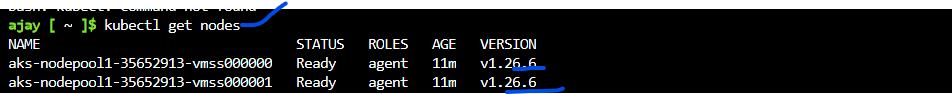
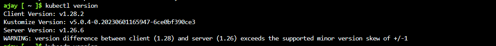
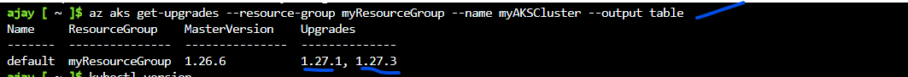
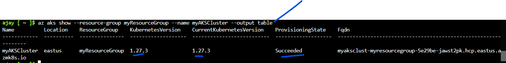

# AKS Cluster Upgrade:

* Important Notes:
  * Needs to know few things before AKS cluster upgrade:
* Read Kubernetes version upgrades, there some important
* [Refer Here](https://learn.microsoft.com/en-us/azure/aks/upgrade-cluster?tabs=azure-cli) for official docs


### Steps:
* First we needs to have AKS cluster avaiable or we can create new cluster.
* check existing AKS cluster version

  `kubectl get nodes`


* verify kubectl version ensure client and server should be same version, but in my it is difference but thats ok its just for demonstration purpose.

   `kubectl version`


* Check which Kubernetes releases are available for our cluster using below command, based on that we can select it.

  `az aks get-upgrades --resource-group myResourceGroup --name myAKSCluster --output table`
* The following example output shows that the cluster can be upgraded to versions 1.27.1 and 1.27.3, out of these two versions i can choose any and upgrade the cluster


* Upgrade your cluster using below command

`az aks upgrade --resource-group myResourceGroup --name myAKSCluster --kubernetes-version 1.27.3`
```
Kubernetes may be unavailable during cluster upgrades.
 Are you sure you want to perform this operation? (y/N): y
Since control-plane-only argument is not specified, this will upgrade the control plane AND all nodepools to version 1.27.3. Continue? (y/N): y
{
  "aadProfile": null,
  "addonProfiles": {
    "omsagent": {
      "config": {
        "logAnalyticsWorkspaceResourceID": "/subscriptions/5e29be3b-772d-4a03-9b7a-9990573f645e/resourceGroups/DefaultResourceGroup-EUS/providers/Microsoft.OperationalInsights/workspaces/DefaultWorkspace-5e29be3b-772d-4a03-9b7a-9990573f645e-EUS",
        "useAADAuth": "true"
      },
      "enabled": true,
      "identity": null
    }
  },
  "agentPoolProfiles": [
    {
      "availabilityZones": null,
      "count": 2,
      "creationData": null,
      "currentOrchestratorVersion": "1.27.3",
      "enableAutoScaling": false,
      "enableEncryptionAtHost": false,
      "enableFips": false,
      "enableNodePublicIp": false,
      "enableUltraSsd": false,
      "gpuInstanceProfile": null,
      "hostGroupId": null,
      "kubeletConfig": null,
      "kubeletDiskType": "OS",
      "linuxOsConfig": null,
      "maxCount": null,
      "maxPods": 110,
      "minCount": null,
      "mode": "System",
      "name": "nodepool1",
      "nodeImageVersion": "AKSUbuntu-2204gen2containerd-202310.04.0",
      "nodeLabels": null,
      "nodePublicIpPrefixId": null,
      "nodeTaints": null,
      "orchestratorVersion": "1.27.3",
      "osDiskSizeGb": 128,
      "osDiskType": "Managed",
      "osSku": "Ubuntu",
      "osType": "Linux",
      "podSubnetId": null,
      "powerState": {
        "code": "Running"
      },
      "provisioningState": "Succeeded",
      "proximityPlacementGroupId": null,
      "scaleDownMode": null,
      "scaleSetEvictionPolicy": null,
      "scaleSetPriority": null,
      "spotMaxPrice": null,
      "tags": null,
      "type": "VirtualMachineScaleSets",
      "upgradeSettings": {
        "drainTimeoutInMinutes": null,
        "maxSurge": null
      },
      "vmSize": "Standard_DS2_v2",
      "vnetSubnetId": null,
      "workloadRuntime": null
    }
  ],
  "apiServerAccessProfile": null,
  "autoScalerProfile": null,
  "autoUpgradeProfile": {
    "nodeOsUpgradeChannel": "NodeImage",
    "upgradeChannel": null
  },
  "azureMonitorProfile": null,
  "azurePortalFqdn": "myaksclust-myresourcegroup-5e29be-jawst2pk.portal.hcp.eastus.azmk8s.io",
  "currentKubernetesVersion": "1.27.3",
  "disableLocalAccounts": false,
  "diskEncryptionSetId": null,
  "dnsPrefix": "myAKSClust-myResourceGroup-5e29be",
  "enablePodSecurityPolicy": null,
  "enableRbac": true,
  "extendedLocation": null,
  "fqdn": "myaksclust-myresourcegroup-5e29be-jawst2pk.hcp.eastus.azmk8s.io",
  "fqdnSubdomain": null,
  "httpProxyConfig": null,
  "id": "/subscriptions/5e29be3b-772d-4a03-9b7a-9990573f645e/resourcegroups/myResourceGroup/providers/Microsoft.ContainerService/managedClusters/myAKSCluster",
  "identity": {
    "delegatedResources": null,
    "principalId": "74da258d-2608-41ef-acdb-a01f2a6accf0",
    "tenantId": "d3283a09-d0ee-413b-acb4-2f1da18158bc",
    "type": "SystemAssigned",
    "userAssignedIdentities": null
  },
  "identityProfile": {
    "kubeletidentity": {
      "clientId": "b34d7b45-90d4-4007-97cb-f03664bd6abf",
      "objectId": "cc160524-3309-4900-914c-5d3515540707",
      "resourceId": "/subscriptions/5e29be3b-772d-4a03-9b7a-9990573f645e/resourcegroups/MC_myResourceGroup_myAKSCluster_eastus/providers/Microsoft.ManagedIdentity/userAssignedIdentities/myAKSCluster-agentpool"
    }
  },
  "kubernetesVersion": "1.27.3",
  "linuxProfile": {
    "adminUsername": "azureuser",
    "ssh": {
      "publicKeys": [
        {
          "keyData": "ssh-rsa AAAAB3NzaC1yc2EAAAADAQABAAABAQChhEATe6kTGuIfBuvBRx5PZsCAFyr1QA+0P0EwqXPUuZcV33O46pW79hI0MaecpQRhXTLYo4Wtfr7a3WCB5qa94rbzVGZBc3Moth4gctFpBWN6P6+9qCOkEHI+EDG2CD4A1ZfP3bcSRVtc0LdtMD0f7f9c4N1a9SrIoa7B95sr6sJNJ82NKjKJqH4SvMQ4kigKbu6Ipkm867H9KTL5eNWO6iYJ4L5Y2mGL96YbkAVlDlnK9JjYoOOHquJ4OIbTlUAfz9EDRREKNBoX3lxJMjlkyMsyoj0YKj6VyJIVblhSINDsL1jQ9TFfiNLDM66p1ZCvvHVkagrRoY14P/1NhEoP"
        }
      ]
    }
  },
  "location": "eastus",
  "maxAgentPools": 100,
  "name": "myAKSCluster",
  "networkProfile": {
    "dnsServiceIp": "10.0.0.10",
    "ipFamilies": [
      "IPv4"
    ],
    "loadBalancerProfile": {
      "allocatedOutboundPorts": null,
      "effectiveOutboundIPs": [
        {
          "id": "/subscriptions/5e29be3b-772d-4a03-9b7a-9990573f645e/resourceGroups/MC_myResourceGroup_myAKSCluster_eastus/providers/Microsoft.Network/publicIPAddresses/93d92b22-7344-485a-be35-081af13895f6",
          "resourceGroup": "MC_myResourceGroup_myAKSCluster_eastus"
        }
      ],
      "enableMultipleStandardLoadBalancers": null,
      "idleTimeoutInMinutes": null,
      "managedOutboundIPs": {
        "count": 1,
        "countIpv6": null
      },
      "outboundIPs": null,
      "outboundIpPrefixes": null
    },
    "loadBalancerSku": "Standard",
    "natGatewayProfile": null,
    "networkDataplane": null,
    "networkMode": null,
    "networkPlugin": "kubenet",
    "networkPluginMode": null,
    "networkPolicy": null,
    "outboundType": "loadBalancer",
    "podCidr": "10.244.0.0/16",
    "podCidrs": [
      "10.244.0.0/16"
    ],
    "serviceCidr": "10.0.0.0/16",
    "serviceCidrs": [
      "10.0.0.0/16"
    ]
  },
  "nodeResourceGroup": "MC_myResourceGroup_myAKSCluster_eastus",
  "oidcIssuerProfile": {
    "enabled": false,
    "issuerUrl": null
  },
  "podIdentityProfile": null,
  "powerState": {
    "code": "Running"
  },
  "privateFqdn": null,
  "privateLinkResources": null,
  "provisioningState": "Succeeded",
  "publicNetworkAccess": null,
  "resourceGroup": "myResourceGroup",
  "securityProfile": {
    "azureKeyVaultKms": null,
    "defender": null,
    "imageCleaner": null,
    "workloadIdentity": null
  },
  "servicePrincipalProfile": {
    "clientId": "msi",
    "secret": null
  },
  "sku": {
    "name": "Base",
    "tier": "Free"
  },
  "storageProfile": {
    "blobCsiDriver": null,
    "diskCsiDriver": {
      "enabled": true
    },
    "fileCsiDriver": {
      "enabled": true
    },
    "snapshotController": {
      "enabled": true
    }
  },
  "supportPlan": "KubernetesOfficial",
  "systemData": null,
  "tags": null,
  "type": "Microsoft.ContainerService/ManagedClusters",
  "upgradeSettings": null,
  "windowsProfile": null,
  "workloadAutoScalerProfile": {
    "keda": null,
    "verticalPodAutoscaler": null
  }
}
```
* Confirm the AKS cluster upgraded was successful using below command

`az aks show --resource-group myResourceGroup --name myAKSCluster --output table`
* The following example output shows that the cluster now runs `1.27.3 ` hence AKS cluster is upgraded successfully 


* check the events while running AKS cluster upgrade using below command

  `kubectl get events`
* The following example output shows some of the above events listed during an upgrade

```
ajay [ ~ ]$ kubectl get events
LAST SEEN   TYPE      REASON                    OBJECT                                   MESSAGE
18m         Normal    NodeHasSufficientMemory   node/aks-nodepool1-35652913-vmss000000   Node aks-nodepool1-35652913-vmss000000 status is now: NodeHasSufficientMemory
18m         Normal    NodeHasNoDiskPressure     node/aks-nodepool1-35652913-vmss000000   Node aks-nodepool1-35652913-vmss000000 status is now: NodeHasNoDiskPressure
18m         Normal    NodeHasSufficientPID      node/aks-nodepool1-35652913-vmss000000   Node aks-nodepool1-35652913-vmss000000 status is now: NodeHasSufficientPID
53m         Normal    NodeReady                 node/aks-nodepool1-35652913-vmss000000   Node aks-nodepool1-35652913-vmss000000 status is now: NodeReady
53m         Normal    RegisteredNode            node/aks-nodepool1-35652913-vmss000000   Node aks-nodepool1-35652913-vmss000000 event: Registered Node aks-nodepool1-35652913-vmss000000 in Controller
52m         Normal    Starting                  node/aks-nodepool1-35652913-vmss000000   
50m         Warning   ContainerdStart           node/aks-nodepool1-35652913-vmss000000   Starting containerd container runtime...
49m         Warning   PreemptScheduled          node/aks-nodepool1-35652913-vmss000000   IMDS query failed, exit code: 28...
49m         Normal    NoVMEventScheduled        node/aks-nodepool1-35652913-vmss000000   Node condition VMEventScheduled is now: Unknown, reason: NoVMEventScheduled, message: "Timeout when running plugin \"/etc/node-problem-detector.d/plugin/check_scheduledevent_consolidated.sh\": state - signal: killed. output - \"\""
49m         Normal    NoVMEventScheduled        node/aks-nodepool1-35652913-vmss000000   Node condition VMEventScheduled is now: False, reason: NoVMEventScheduled, message: "VM has no scheduled event"
20m         Normal    Starting                  node/aks-nodepool1-35652913-vmss000000   
20m         Normal    RegisteredNode            node/aks-nodepool1-35652913-vmss000000   Node aks-nodepool1-35652913-vmss000000 event: Registered Node aks-nodepool1-35652913-vmss000000 in Controller
19m         Normal    Drain                     node/aks-nodepool1-35652913-vmss000000   Draining node: aks-nodepool1-35652913-vmss000000
19m         Normal    NodeNotSchedulable        node/aks-nodepool1-35652913-vmss000000   Node aks-nodepool1-35652913-vmss000000 status is now: NodeNotSchedulable
18m         Normal    Upgrade                   node/aks-nodepool1-35652913-vmss000000   Deleting node aks-nodepool1-35652913-vmss000000 from API server
18m         Normal    NodeSchedulable           node/aks-nodepool1-35652913-vmss000000   Node aks-nodepool1-35652913-vmss000000 status is now: NodeSchedulable
18m         Normal    RemovingNode              node/aks-nodepool1-35652913-vmss000000   Node aks-nodepool1-35652913-vmss000000 event: Removing Node aks-nodepool1-35652913-vmss000000 from Controller
17m         Normal    Starting                  node/aks-nodepool1-35652913-vmss000000   Starting kubelet.
17m         Warning   InvalidDiskCapacity       node/aks-nodepool1-35652913-vmss000000   invalid capacity 0 on image filesystem
17m         Normal    NodeHasSufficientMemory   node/aks-nodepool1-35652913-vmss000000   Node aks-nodepool1-35652913-vmss000000 status is now: NodeHasSufficientMemory
17m         Normal    NodeHasNoDiskPressure     node/aks-nodepool1-35652913-vmss000000   Node aks-nodepool1-35652913-vmss000000 status is now: NodeHasNoDiskPressure
17m         Normal    NodeHasSufficientPID      node/aks-nodepool1-35652913-vmss000000   Node aks-nodepool1-35652913-vmss000000 status is now: NodeHasSufficientPID
17m         Normal    NodeAllocatableEnforced   node/aks-nodepool1-35652913-vmss000000   Updated Node Allocatable limit across pods
17m         Normal    NodeReady                 node/aks-nodepool1-35652913-vmss000000   Node aks-nodepool1-35652913-vmss000000 status is now: NodeReady
17m         Normal    RegisteredNode            node/aks-nodepool1-35652913-vmss000000   Node aks-nodepool1-35652913-vmss000000 event: Registered Node aks-nodepool1-35652913-vmss000000 in Controller
17m         Warning   ContainerdStart           node/aks-nodepool1-35652913-vmss000000   Starting containerd container runtime...
17m         Normal    Starting                  node/aks-nodepool1-35652913-vmss000000   
17m         Normal    Upgrade                   node/aks-nodepool1-35652913-vmss000000   Successfully reimaged node: aks-nodepool1-35652913-vmss000000
17m         Normal    Upgrade                   node/aks-nodepool1-35652913-vmss000000   Successfully upgraded node: aks-nodepool1-35652913-vmss000000
17m         Normal    Drain                     node/aks-nodepool1-35652913-vmss000000   Draining node: aks-nodepool1-35652913-vmss000000
15m         Normal    NodeHasSufficientMemory   node/aks-nodepool1-35652913-vmss000001   Node aks-nodepool1-35652913-vmss000001 status is now: NodeHasSufficientMemory
15m         Normal    NodeHasNoDiskPressure     node/aks-nodepool1-35652913-vmss000001   Node aks-nodepool1-35652913-vmss000001 status is now: NodeHasNoDiskPressure
16m         Normal    NodeHasSufficientPID      node/aks-nodepool1-35652913-vmss000001   Node aks-nodepool1-35652913-vmss000001 status is now: NodeHasSufficientPID
53m         Normal    NodeReady                 node/aks-nodepool1-35652913-vmss000001   Node aks-nodepool1-35652913-vmss000001 status is now: NodeReady
53m         Normal    RegisteredNode            node/aks-nodepool1-35652913-vmss000001   Node aks-nodepool1-35652913-vmss000001 event: Registered Node aks-nodepool1-35652913-vmss000001 in Controller
52m         Normal    Starting                  node/aks-nodepool1-35652913-vmss000001   
50m         Warning   ContainerdStart           node/aks-nodepool1-35652913-vmss000001   Starting containerd container runtime...
50m         Warning   PreemptScheduled          node/aks-nodepool1-35652913-vmss000001   IMDS query failed, exit code: 28...
50m         Normal    NoVMEventScheduled        node/aks-nodepool1-35652913-vmss000001   Node condition VMEventScheduled is now: Unknown, reason: NoVMEventScheduled, message: "Timeout when running plugin \"/etc/node-problem-detector.d/plugin/check_scheduledevent_consolidated.sh\": state - signal: killed. output - \"\""
50m         Normal    NoVMEventScheduled        node/aks-nodepool1-35652913-vmss000001   Node condition VMEventScheduled is now: False, reason: NoVMEventScheduled, message: "VM has no scheduled event"
20m         Normal    RegisteredNode            node/aks-nodepool1-35652913-vmss000001   Node aks-nodepool1-35652913-vmss000001 event: Registered Node aks-nodepool1-35652913-vmss000001 in Controller
20m         Normal    Starting                  node/aks-nodepool1-35652913-vmss000001   
17m         Normal    Drain                     node/aks-nodepool1-35652913-vmss000001   Draining node: aks-nodepool1-35652913-vmss000001
17m         Normal    NodeNotSchedulable        node/aks-nodepool1-35652913-vmss000001   Node aks-nodepool1-35652913-vmss000001 status is now: NodeNotSchedulable
16m         Warning   Drain                     node/aks-nodepool1-35652913-vmss000001   Eviction blocked by Too many Requests (usually a pdb): metrics-server-5467676b76-94mmr
17m         Warning   Drain                     node/aks-nodepool1-35652913-vmss000001   Eviction blocked by Too many Requests (usually a pdb): konnectivity-agent-68cb7c4cff-8jlww
17m         Warning   Drain                     node/aks-nodepool1-35652913-vmss000001   Eviction blocked by Too many Requests (usually a pdb): coredns-76b9877f49-p768t
16m         Normal    Upgrade                   node/aks-nodepool1-35652913-vmss000001   Deleting node aks-nodepool1-35652913-vmss000001 from API server
16m         Normal    NodeSchedulable           node/aks-nodepool1-35652913-vmss000001   Node aks-nodepool1-35652913-vmss000001 status is now: NodeSchedulable
16m         Normal    RemovingNode              node/aks-nodepool1-35652913-vmss000001   Node aks-nodepool1-35652913-vmss000001 event: Removing Node aks-nodepool1-35652913-vmss000001 from Controller
15m         Normal    Starting                  node/aks-nodepool1-35652913-vmss000001   Starting kubelet.
15m         Warning   InvalidDiskCapacity       node/aks-nodepool1-35652913-vmss000001   invalid capacity 0 on image filesystem
15m         Normal    NodeHasSufficientMemory   node/aks-nodepool1-35652913-vmss000001   Node aks-nodepool1-35652913-vmss000001 status is now: NodeHasSufficientMemory
15m         Normal    NodeHasNoDiskPressure     node/aks-nodepool1-35652913-vmss000001   Node aks-nodepool1-35652913-vmss000001 status is now: NodeHasNoDiskPressure
15m         Normal    NodeHasSufficientPID      node/aks-nodepool1-35652913-vmss000001   Node aks-nodepool1-35652913-vmss000001 status is now: NodeHasSufficientPID
15m         Normal    RegisteredNode            node/aks-nodepool1-35652913-vmss000001   Node aks-nodepool1-35652913-vmss000001 event: Registered Node aks-nodepool1-35652913-vmss000001 in Controller
15m         Normal    NodeAllocatableEnforced   node/aks-nodepool1-35652913-vmss000001   Updated Node Allocatable limit across pods
15m         Normal    NodeReady                 node/aks-nodepool1-35652913-vmss000001   Node aks-nodepool1-35652913-vmss000001 status is now: NodeReady
14m         Warning   ContainerdStart           node/aks-nodepool1-35652913-vmss000001   Starting containerd container runtime...
14m         Normal    Starting                  node/aks-nodepool1-35652913-vmss000001   
14m         Normal    Upgrade                   node/aks-nodepool1-35652913-vmss000001   Successfully reimaged node: aks-nodepool1-35652913-vmss000001
14m         Normal    Upgrade                   node/aks-nodepool1-35652913-vmss000001   Successfully upgraded node: aks-nodepool1-35652913-vmss000001
14m         Normal    Drain                     node/aks-nodepool1-35652913-vmss000001   Draining node: aks-nodepool1-35652913-vmss000001
19m         Normal    Starting                  node/aks-nodepool1-35652913-vmss000002   Starting kubelet.
19m         Warning   InvalidDiskCapacity       node/aks-nodepool1-35652913-vmss000002   invalid capacity 0 on image filesystem
19m         Normal    NodeHasSufficientMemory   node/aks-nodepool1-35652913-vmss000002   Node aks-nodepool1-35652913-vmss000002 status is now: NodeHasSufficientMemory
19m         Normal    NodeHasNoDiskPressure     node/aks-nodepool1-35652913-vmss000002   Node aks-nodepool1-35652913-vmss000002 status is now: NodeHasNoDiskPressure
19m         Normal    NodeHasSufficientPID      node/aks-nodepool1-35652913-vmss000002   Node aks-nodepool1-35652913-vmss000002 status is now: NodeHasSufficientPID
19m         Normal    NodeAllocatableEnforced   node/aks-nodepool1-35652913-vmss000002   Updated Node Allocatable limit across pods
19m         Normal    NodeReady                 node/aks-nodepool1-35652913-vmss000002   Node aks-nodepool1-35652913-vmss000002 status is now: NodeReady
19m         Normal    RegisteredNode            node/aks-nodepool1-35652913-vmss000002   Node aks-nodepool1-35652913-vmss000002 event: Registered Node aks-nodepool1-35652913-vmss000002 in Controller
19m         Warning   ContainerdStart           node/aks-nodepool1-35652913-vmss000002   Starting containerd container runtime...
19m         Normal    Surge                     node/aks-nodepool1-35652913-vmss000002   Created a surge node aks-nodepool1-35652913-vmss000002 for agentpool nodepool1
14m         Normal    Drain                     node/aks-nodepool1-35652913-vmss000002   Draining node: aks-nodepool1-35652913-vmss000002
17m         Warning   PreemptScheduled          node/aks-nodepool1-35652913-vmss000002   IMDS query failed, exit code: 28...
17m         Normal    NoVMEventScheduled        node/aks-nodepool1-35652913-vmss000002   Node condition VMEventScheduled is now: Unknown, reason: NoVMEventScheduled, message: "Timeout when running plugin \"/etc/node-problem-detector.d/plugin/check_scheduledevent_consolidated.sh\": state - signal: killed. output - \"\""
18m         Normal    Starting                  node/aks-nodepool1-35652913-vmss000002   
17m         Normal    NoVMEventScheduled        node/aks-nodepool1-35652913-vmss000002   Node condition VMEventScheduled is now: False, reason: NoVMEventScheduled, message: "VM has no scheduled event"
14m         Normal    Surge                     node/aks-nodepool1-35652913-vmss000002   Removing surge node: aks-nodepool1-35652913-vmss000002
13m         Warning   Drain                     node/aks-nodepool1-35652913-vmss000002   Eviction blocked by Too many Requests (usually a pdb): metrics-server-5467676b76-6ndcp
14m         Warning   Drain                     node/aks-nodepool1-35652913-vmss000002   Eviction blocked by Too many Requests (usually a pdb): konnectivity-agent-68cb7c4cff-4gs6t
14m         Warning   Drain                     node/aks-nodepool1-35652913-vmss000002   Eviction blocked by Too many Requests (usually a pdb): coredns-76b9877f49-pdblg
14m         Normal    NodeNotSchedulable        node/aks-nodepool1-35652913-vmss000002   Node aks-nodepool1-35652913-vmss000002 status is now: NodeNotSchedulable
13m         Normal    RemovingNode              node/aks-nodepool1-35652913-vmss000002   Node aks-nodepool1-35652913-vmss000002 event: Removing Node aks-nodepool1-35652913-vmss000002 from Controller
```

