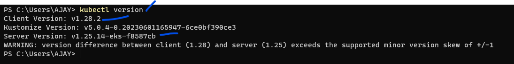
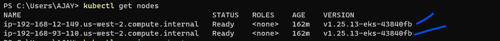
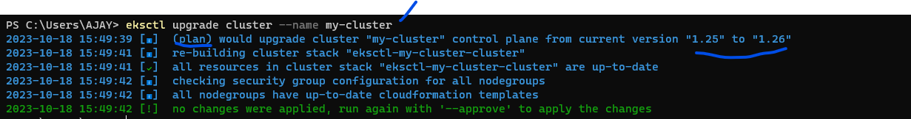
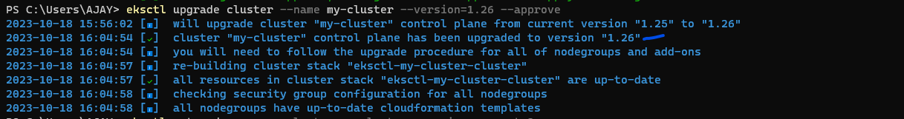
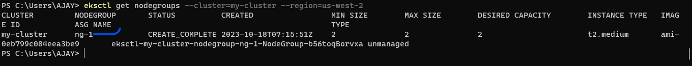
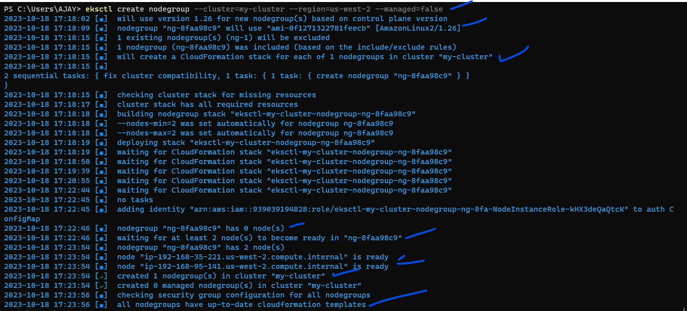
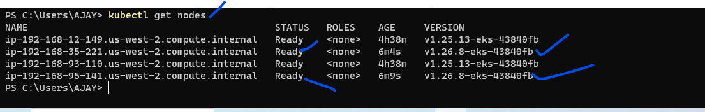
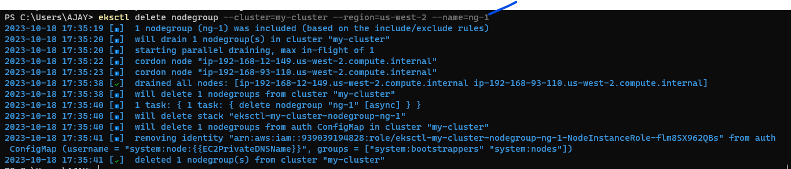
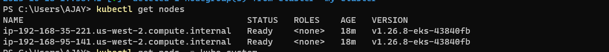
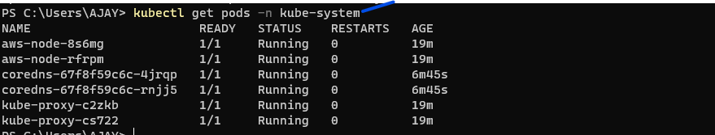

# EKS Cluster Upgrade:

* EKS cluster can be upgrade with three types:
  * AWS CLI
  * AWS PORTAL
  * EKSCTL 
* For all this three ways of upgrading EKS cluster refer below documents
  * [Refer Here](https://docs.aws.amazon.com/eks/latest/userguide/update-cluster.html#w665aac14c15b5c17)  official docs

* Upgrading EKS cluster only through EKSCTL refer below document
  * [Refer Here](https://eksctl.io/usage/cluster-upgrade/)  for official docs

* Third party documents to refer below:
  * [Refer Here](https://ngoyal16.medium.com/upgrade-eks-1-16-cluster-to-eks-1-17-using-eksctl-ef6f16b0af07)


### Methods to upgrade EKS cluster:

* **Procedure:**
* first upgrade eks cluster means control plane
* second upgrade self managed(unmanaged) node group or managed node group
  * There are two ways to upgrade the self managed/unmnaged node group:
    * **Migrating to a new node group:**
      * create new nodegroup 
      * then delete the old node group
      * Please Note: when you delete old nodegroup what happens below refer:
      * This will drain all pods from that nodegroup before the instances are deleted.
      * All nodes are cordoned and all pods are evicted from a nodegroup on deletion
    * **Updating an existing self-managed/unmanaged node group:**
      * this method will not support for EKS cluster created with `EKSCTL`
      * If EKS cluster created with `AWS CLI` then [Refer Here](https://docs.aws.amazon.com/eks/latest/userguide/update-stack.html)
  * **managed node group:**
     * upgrade using `eksctl upgrade` command
     * [Refer Here](https://docs.aws.amazon.com/eks/latest/userguide/update-managed-node-group.html)  

* third upgrade the default addons if it is enabled, when creating EKS cluster default addons will created 
  * kubeproxy
  * CoreDNS
  * aws-node (AWS CNI or Network Plugin)
* fourth verify our EKS cluster has been upgraded as we expected version control plane as well as nodes should be same version.
  * Once upgraded done you have to check whether all components/all addon pods are running state or not, by running following command

    `kubectl get pods -n kube-system`

### EKS cluster upgradation Demonstration:
* in our demonstration we upgrading eks cluster for control plane and self managed/unmanaged node group
* and also we have not enabled default addon so we are not going to upgrade any addon too.

* **Steps:**
* check control plane and kubectl version:
  
  `kubectl version`


* check worker nodes version:

  `kubectl get nodes`


* **Please Note:**
  * here control plane and nodes version should be same then only we perform cluster upgradation.
  * in any case if it different version then first get/upgrade both to same version then start the upgrading eks cluster.

* **In Our Scenario:**
   * we have nodes and control plane with different version, in this nodes have the lower version so i needs to update the nodes to control plane version then i needs to upgrade the eks cluster
   * but i am not going to do that since it just for an experiment. but in real time we should not cross the rules/not to do that.

* To upgrade control plane to the next available version run: it will show the plan based on that we can choose the version to upgrade it.

   `eksctl upgrade cluster --name my-cluster`


* Now Apply the change to upgrade the cluster

  `eksctl upgrade cluster --name my-cluster --version=1.26 --approve`


* now check api server/control plane version has been changed by following command

   `kubectl get nodes`
   

* Get/Retrieve the name of old nodegroup

  `eksctl get nodegroups --cluster=my-cluster --region=us-west-2`


* Create new nodegroup
 * **Please Note:**
   * please mention all values when creating new node group by referring second command because it will take all default values.

  `eksctl create nodegroup --cluster=my-cluster --region=us-west-2 --managed=false`

          or

```
eksctl create nodegroup \
  --cluster my-cluster \
  --version 1.26 \
  --name nsg-1-new \
  --node-type t2.medium \
  --nodes 2 \
  --nodes-min 1 \
  --nodes-max 4 \
  --managed=false
```          


* When the previous command completes, verify that all of your nodes have reached the `Ready` state and `nodes version` has been changed with the following command

   `kubectl get nodes`



* Delete the original/old node group 
  * This will drain all pods from that nodegroup before the instances are deleted.
  * it will cordon nodes
  * it will drain all the nodes
  * it will delete the node group 
`eksctl delete nodegroup --cluster=my-cluster --region=us-west-2 --name=nsg-1`


* now check the nodes version has been updated as per control plane 

   `kubectl get nodes`


* In our case below step not required because we have not upgraded default addons.


* if we are updating default addons means then needs to check all the related to addons components are running or not by following command

   `kubectl get pods -n kube-system`


