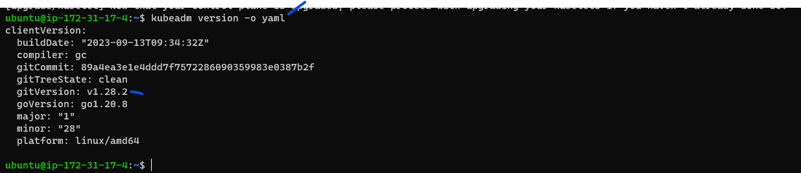
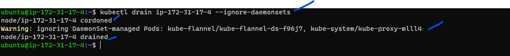
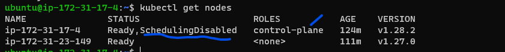
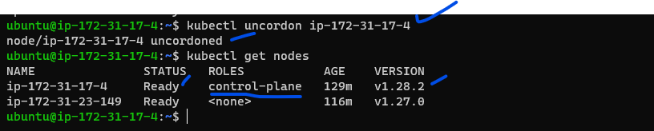
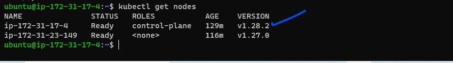
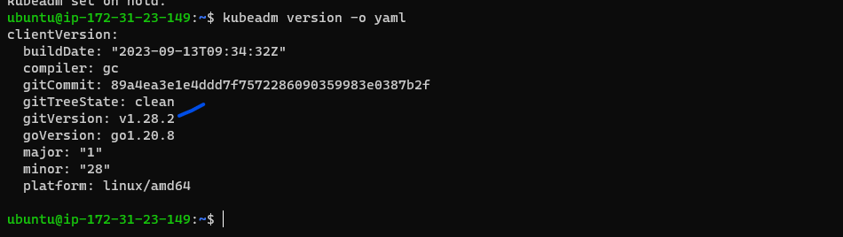
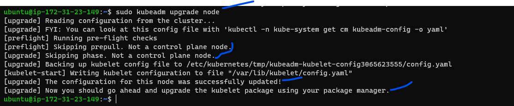
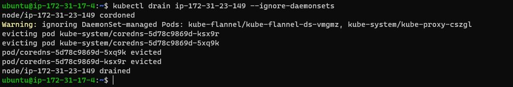
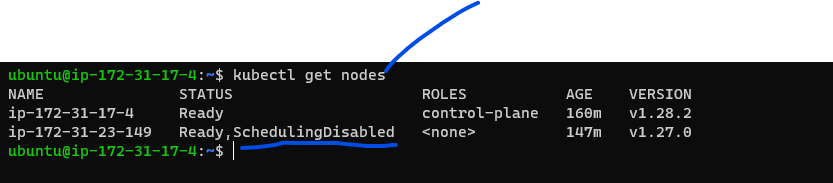
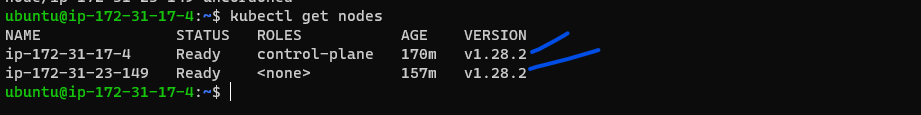

# Kubernetes Upgrade Using Kubeadm:
* [Refer Here](https://kubernetes.io/docs/tasks/administer-cluster/kubeadm/kubeadm-upgrade/) for official docs
* [Refer](https://kubernetes.io/docs/tasks/administer-cluster/kubeadm/change-package-repository/) Changing The Kubernetes Package Repository
* [Refer Here](https://devopscube.com/upgrade-kubernetes-cluster-kubeadm/) for third party 
* [Refer Here](https://iamunnip.medium.com/upgrading-a-kubernetes-cluster-using-kubeadm-8dfa5f21711b) for third party 

#### Prerequisite is already should have installed k8s cluster with lower version or we should install k8s cluster with lower version
* Please follow below command to install specific version of kubernetes so that we can experiment on upgrading

```
curl -s https://packages.cloud.google.com/apt/doc/apt-key.gpg | sudo apt-key add - && \
  echo "deb http://apt.kubernetes.io/ kubernetes-xenial main" | sudo tee /etc/apt/sources.list.d/kubernetes.list && \
  sudo apt-get update -q && \
  sudo apt-get install -qy kubelet=1.27.0-00 kubectl=1.27.0-00 kubeadm=1.27.0-00
```
* Or either using above command, we have one more option to upgrade k8 cluster even though in our package it is not showing version to upgrade, follow below link docs procedure.
  * [Refer Here](https://kubernetes.io/docs/tasks/administer-cluster/kubeadm/change-package-repository/)

### Steps:
* **Control Plane:**
* verify the existing version of k8s cluster master and nodes

   `kubectl get nodes`


* verify existing kubectl client and server version

`kubectl version --short`


* verify existing kubeadm version

`kubeadm version or kubeadm version -o yaml/json`


* By executing the below command kubeadm will show list of versions can be upgraded so based on that decide which version to upgrade

```
sudo apt update
sudo apt-cache madison kubeadm
```

* So we are selecting from above screen shot version 
 
    `1.28.2`
* Also you can run a kubeadm upgrade plan to get upgrade suggestions

  `sudo kubeadm upgrade plan`


* unhold kubeadm and Install the required version which means 
* During the Kubeadm cluster installation process, we would have hold the kubeadm installation to prevent upgrades.
* Now we need to unhold kubeadm and install  `1.28.2` using the following command.

```
sudo apt-mark unhold kubeadm && \
sudo apt-get update && sudo apt-get install -y kubeadm=1.28.2 && \
sudo apt-mark hold kubeadm
```
* Verify that the download works and has the expected version / Check the upgraded kubeadm version

   `kubeadm version`


* Verify the upgrade plan:
  * This command checks that your cluster can be upgraded, and fetches the versions you can upgrade to it. 
  * Also we can run a kubeadm upgrade plan to get upgrade suggestions.

   `sudo kubeadm upgrade plan`


* Once our plan is verified, we can upgrade the [control-plane] by executing the below command
  * Choose a version to upgrade and run the appropriate command. 

     `sudo kubeadm upgrade apply 1.28.2`
 * Once the above command finishes you should see output below:

 ```
 [upgrade/successful] SUCCESS! Your cluster was upgraded to "v1.28.2". Enjoy!

[upgrade/kubelet] Now that your control plane is upgraded, please proceed with upgrading your kubelets if you haven't already done so.
```

* Optional to check:

  `kubeadm version -o yaml`


* Drain the master node:
  * Prepare the master node for maintenance by marking it unschedulable and evicting the workloads:
  * To apply the upgrade we need to evict all the workloads except daemonsets using the following command.

    `kubectl drain ip-172-31-17-4 --ignore-daemonsets` 



* Unhold the kubelet and kubectl for upgrade using the following commands.

   ```
   sudo apt-mark unhold kubelet kubectl && \
   sudo apt-get update && sudo apt-get install -y kubelet=1.28.2 kubectl=1.28.2 && \
   sudo apt-mark hold kubelet kubectl
   ```

* Restart the kubelet on master

   ```
   sudo systemctl daemon-reload
   sudo systemctl restart kubelet
   ```
* Uncordon the master node
  * Bring the node back online by marking it schedulable

    `kubectl uncordon ip-172-31-17-4`


* Verify the nodes, now we can see master is upgraded to `v1.28.2`

   `kubectl get nodes`


### Upgrade worker nodes:
 * Worker node upgrade steps are similar to control plane upgrade. However the internal upgrade process differ from control plane.
 * All the following steps should be executed on the Worker node. If you have multiple worker nodes, upgrade one at a time.

* unhold kubeadm and Install the required version which means 
* During the Kubeadm cluster installation process, we would have hold the kubeadm installation to prevent upgrades.
* Now we need to unhold kubeadm and install  `1.28.2` using the following command.

   ```
   sudo apt-mark unhold kubeadm && \
   sudo apt-get update && sudo apt-get install -y kubeadm=1.28.2-00 && \
   sudo apt-mark hold kubeadm
   ```


* Upgrde Kubeadm:

  * As you are running the following command on a worker node, it skips all the steps required for the control plane and update only kubelet configuration required for a worker node.

    `sudo kubeadm upgrade node`


* Drain the worker node 
  * Prepare the node for maintenance by marking it unschedulable and evicting the workloads
* Execute the below drain command on master 

  `kubectl drain ip-172-31-23-149 --ignore-daemonsets`




* Unhold the kubelet and kubectl for upgrade using the following commands.

```
sudo apt-mark unhold kubelet kubectl && \
sudo apt-get update && sudo apt-get install -y kubelet=1.28.2-00 kubectl=1.28.2-00 && \
sudo apt-mark hold kubelet kubectl
```

* Restart the kubelet on worker node

```
sudo systemctl daemon-reload
sudo systemctl restart kubelet
```

* Uncordon worker node
  * Bring the worker node back online by marking it schedulable
  * Execute the below uncordon command on master

    `kubectl uncordon ip-172-31-23-149`

* Verify Cluster Upgrade:
  * Now that we have upgraded the control plane node and the worker nodes, lets verify if the cluster is upgraded and working as expected.

    `kubectl get nodes`



---

### Kubernetes clusters Terms:

#### cordon:
 * Prepare the node for maintenance by marking it unschedulable
 * means dont schedule anything on this node since it is going down or its in maintenance 
 
 `kubectl cordon <node_name>`

#### Drain:
  * Drain node means it evict all the workloads
  * what ever is running on this node just move to another node=> how it will move, by it self will evict
**evict:** means pods will kill by itself or die and what happen when pods die, incase of we have 3 replicas so scheduler wil schedule the pods on another node which is running.. 

  `kubectl drain <node>`

#### uncordon
  * Bring the node back online by marking it schedulable
  * which means so now this node is ready to schedule
  `kubectl uncordon <node_name>`

---


