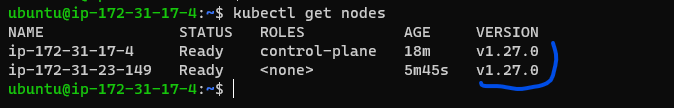
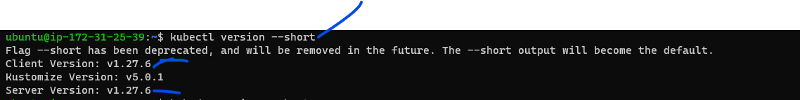
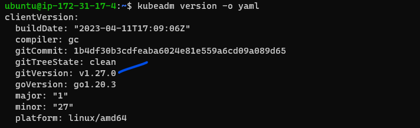
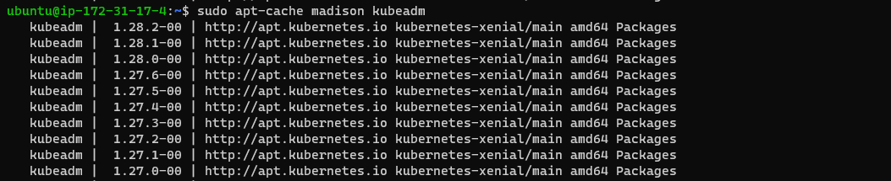
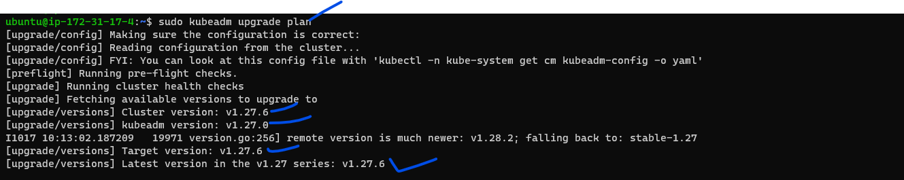
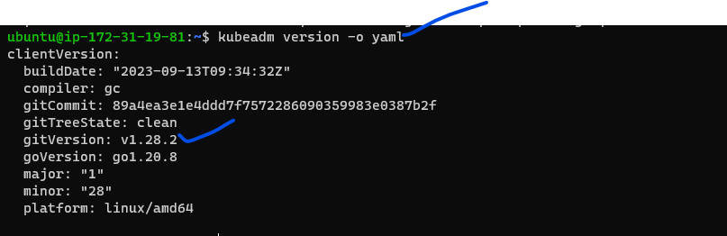
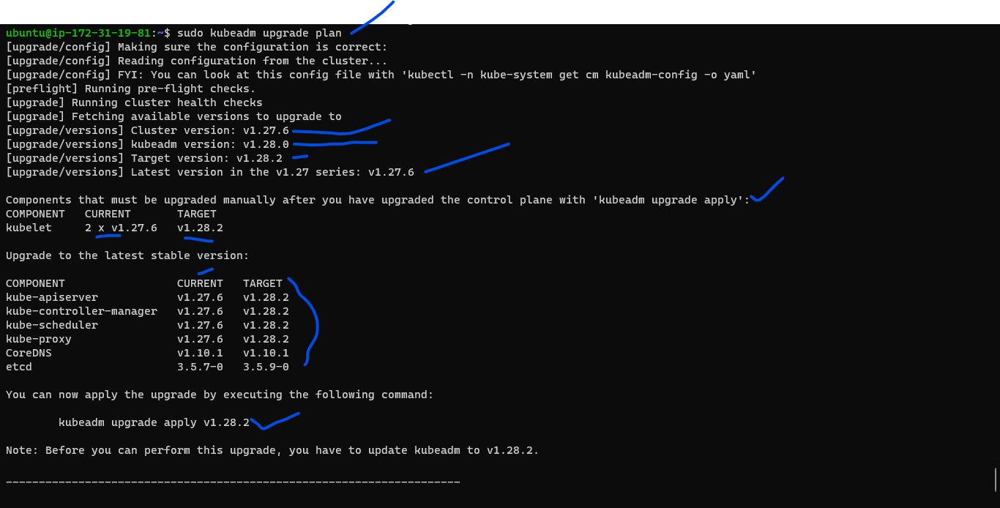
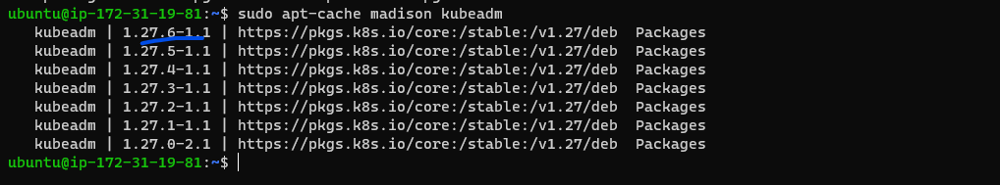

# Kubernetes Upgrade Using Kubeadm:

#### Prerequistice is already should have installed k8s cluster with lower version or we should install k8s cluster with lower version

### Steps:
* **Control Plane:**
* verify the existing version of k8s cluster master and nodes

   `kubectl get nodes`


* verify existing kubectl client and server version

`kubectl version --short`


* verify existing kubeadm version

`kubeadm version or kubeadm version -o yaml/json`


* By executing the below command kubeadm will show list of versions can be upgraded so based on that decide which version to upgrade

```
sudo apt update
sudo apt-cache madison kubeadm
```

* So we are selecting from above screen shot version `v1.28.0-1.1`
* Also you can run a kubeadm upgrde plan to get upgrade suggestions

`sudo kubeadm upgrade plan`

* **Please Note:** here above screen shot showing current version is latest and target version also latest so we dont have upgrade but even i am upgrading it. for i have explained at last point please refer it for understanding purpose.

* unhold kubeadm and Install the required version
* During the Kubeadm cluster installation process, we would have hold the kubeadm installation to prevent upgrades.
* Now we need to unhold kubeadm and install  `1.28.2-1.1` using the following command.

```
sudo apt-mark unhold kubeadm && \
sudo apt-get update && sudo apt-get install -y kubeadm=1.28.2-1.1 && \
sudo apt-mark hold kubeadm
```
* Verify that the download works and has the expected version / Check the upgraded kubeadm version

   `kubeadm version`


* Verify the upgrade plan:
```
This command checks that your cluster can be upgraded, and fetches the versions you can upgrade to. It also shows a table with the component config version states.
```

   `sudo kubeadm upgrade plan`



* Once our plan is verified, we can upgrade the [control-plane] by executing the below command
  * Choose a version to upgrade and run the appropriate command. 

   `sudo kubeadm upgrade apply 1.28.2-1.1`


* The list of kubeadm version of after executing the above command we needs to choose it refer below screen shot

* but here there is one problem, means already we installed latest version, so in kubeadm list of version, what we installed and what it is showing latest version both are same so we cannot upgrade the version to higher, for this there is one procedure follow that below link to do it.
  * [Refer Here](https://kubernetes.io/docs/tasks/administer-cluster/kubeadm/change-package-repository/)


