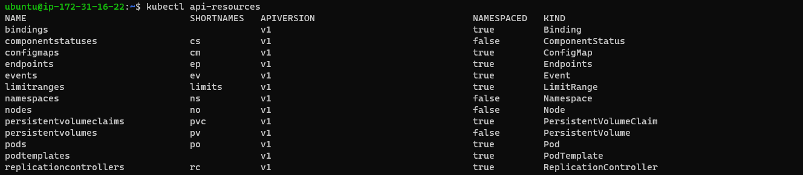

# Kubernetes Commands:

### k8s cheat sheet:
  * [Refer Here](https://kubernetes.io/docs/reference/kubectl/cheatsheet/)


## Pod Commands:

* Command to list pods

      kubectl get pods

* Command to list detailed information of pod      

        kubectl get pods -o wide

* Command to delete the pod

      kubectl delete pod nginx
      
      kubectl delete pod <pod_name>

* Command to create pod in commandline/imperatively

        kubectl run nginx --image nginx

* Command to get a pod's yaml file output

      kubectl get pod hello-pod -o yaml

      kubectl get pod <filename.yaml> -o yaml

* Command to delete entire file from current directory

        kubectl delete -f .
* Command to delete all the pods from a filename.yml

       kubectl delete -f nginx-pod-labels.yml

       kubectl delete -f <filename.yml>

* Command to get pod with list its label

     kubectl get pod --show-labels

* Command to get particular pod with its label

       kubectl get pod -l app=nginx-pod
       
       kubectl get pod -l <label_name>/<key:value pair>

* Command to Describe pod with verbose output/more detailed

      kubectl describe pods nginx-pod

       kubectl describe pods <pod_name>

* Command to watch the pod

      kubectl get pods -w

* Command to list custom columns only pod IP's

      kubectl get pods -o=custom-columns=IP:status.podIP

* Command to list pods in current namespace

       kubectl get pods -n prod
* Command to list resource cpu and memory used of pod

    kubectl top pods 

## Nodes Commands:

*  Command to list nodes 

      kubectl get nodes

* Command to list nodes and watch for state change 

      kubectl get nodes -w

* Command to Describe nodes with verbose output/more detailed

      kubectl describe nodes ip-172-31-29-163

      kubectl describe nodes <node_name>

* Command to show nodes labels

      kubectl get nodes --show-labels

* Command to list resource cpu and memory used of nodes

    kubectl top nodes 

* [Refer Here](https://signoz.io/blog/kubectl-top/)  for more information on top command 

* Command to list more details of nodes

   kubectl get nodw -o wide

* Command to list nodes information output in yaml file

    kubectl get nodes -o yaml


## Creating objects/Resource Commands:
### apply or create command:


* Command to create resources
 
      kubectl apply -f <filename.yaml>
      
      kubectl create -f <filename.yaml>

* Command to create pod

      kubectl apply -f hello-pod.yml

       kubectl apply -f <filename.yml>

## Deployment Commands:

* Command to list deployment

      kubectl get deployment

* Command to list particular deployment

      kubectl get deployment nginx
      
      kubectl get deployment <deployment_name>

* Command to create/run imperatively/command line deployment and pod creation

      kubectl create deployment nginx --image=nginx

* Command to delete deployment

      kubectl delete deployment nginx

      kubectl delete deployment <deployment_name>

* Command list particular namespace in deployment

      kubectl get deploy -n prod
      
      kubectl get deployment -n <Namespace_Name>

* Command List all deployment in current namespace, with more details
     
       kubectl get deploy -n prod -o wide

       kubectl get deployment -n <Namespace_Name> -o wide

* Command watch the running deployment status

       kubectl get deployment -w

* Command to describe more information of deployment

      kubectl describe deployment 

* Command to rollout/update image version 

         kubectl set image deployment/deploy-nginx webserver=nginx:1.16.1

         kubectl set image deployment/<deployment_name> <container_name> = <image_name:tag>

* Command to update image version via manifest/yml file

         kubectl edit deployment/deploy-nginx

         kubectl edit deployment/<deployment_name> 

* command to check deployment rollout status 

        kubectl rollout status deployment/deploy-nginx

* Command Check Rollout History of  Deployment

        kubectl rollout history deployment/deploy-nginx

* Command to check rollout specific version history of deployment 

        kubectl rollout history deployment/ds-deploy --revision=5

* Command to rollout/rollback to previous version of deployment

         kubectl rollout undo deployment/deploy-nginx

* Command to rollout/rollback to specific revision of deployment

         kubectl rollout undo deployment/deploy-nginx --to-revision=5

* Command to to scale deployment replicas 

         kubectl scale deployment/deploy-nginx --replicas=6

* Command to pause the rollout/rollback of deployment

           kubectl rollout pause deployment/deploy-nginx 

* Command to unpause/resume the rollout/rollback deployment

           kubectl rollout resume deployment/deploy-nginx

* Command to list deployment file output in yml formate

         kubectl get deployment nginx-deployment -o yaml


## Types of Resource in k8s `API-Server``

* Command to check types of resource in k8s

      kubectl api-resource


* Command to check particular type of resource in k8s

      kubectl api-resources | grep pod/po
     
      kubectl api-resources | grep service/svc

      kubectl api-resources | grep deployment/deploy
  

## Delete yaml files Commands:

* Command to delete yaml files

      kubectl delete -f nginx.yaml

      kubectl delete -f <filename.yaml>

* Command to particular resource/object      
      
      kubectl delete pods nginx

      kubectl delete pods <pod_name>

* if namespace is created then mention -n <namespace_name>      

## Namespace Commands:

* Command to get namespaces

      kubectl get namespaces

* Command to get all namespaces

       kubectl get pods --all-namespaces


## Version Commands:

* Command to check k8s version

       kubectl version
```
ubuntu@ip-172-31-16-22:~$ kubectl version
Client Version: v1.28.1
Kustomize Version: v5.0.4-0.20230601165947-6ce0bf390ce3
Server Version: v1.28.1
```       
* Server Version above means it is `APISERVER:Version`

## Interacting with running Pods/containers:

* Command to get help

      kubectl exec --help

* To execute some commands on running pods (1 container case)

       kubectl exec nginx-pod -- ls
       
       kubectl exec <pod_name> -- ls

* To login and execute some commands inside the running pods (1 container case)

       kubectl exec -it java-pod -- /bin/bash

       kubectl exec -it <pod_name> -- /bin/bash

* To execute some commands on running pod (multi-container case)

      kubectl exec nginx-pod -c logagent -- ls
      
      kubectl exec <pod_name> -c <container_name> -- ls

* To login and execute some commands inside the running pods (multi-container case)

      kubectl exec -it nginx-pod -c webserver -- /bin/bash
      
      kubectl exec -it <pod_name> -c <container_name -- /bin/bash

## ReplicationSet Commands:

* Command to list RS

       kubectl get rs

* Command to get RS with list its label

      kubectl get rs --show-labels

* Command to get particular RS with its label

      kubectl get rs -l purpose=rs-demo

* Command to Describe Rs with verbose output/more detailed

      kubectl describe rs

* Command to list detailed information about RS

       kubectl get rs -o wide

* Command to watch RS 

      kubectl get rs -w

* Command to list rs in particular namespace

       kubectl get rs -n prod


## Service(svc) Commands:

* Command to list svc

      kubectl get svc

* Command to list svc more detailed

      kubectl get svc -o wide

* Command to list all the endpoints of svc

      kubectl describe endpoints svc

      kubectl describe endpoints <service_name>

* Command to describe detailed of service (svc)

      kubectl describe service nginx-svc

      kubectl describe service <service_name>

* Command to list only endpoints(here will get even k8s default endpoints also)

      kubectl get endpoints

* Command to list only svc endpoints

      kubectl get endpoints nginx-svc

      kubectl get endpoints <svc_name>

* Command get svc file in output yml formate


       kubectl get svc nginx-svc-lb -o yaml

       kubectl get svc <svc_name> -o yaml

* Command to list svc endpointslice
 
      kubectl get endpointslices

* Command to list particular svc using label

      kubectl get svc -l app=nginx-svc

      kubectl get svc -l <svc_label_name>

* Command to list svc in current namespace

      kubectl get svc -n prod


## Context or Switching to cluster or namespaces Commands:

* kubectl config get-contexts --help 
   
   More details
   
* Command to display list of contexts

       kubectl config get-contexts

* Command to display the current-context

       kubectl config current-context 

* Command to set the default context 

      kubectl config use-context <my-cluster-name> 

      kubectl config set-context <cluster_name>

* Command to set/switch  current/particular namespaces

          kubectl config set-context --current --namespace=prod
          
          kubectl config set-context --current --namespace= <namespace_name>

## ConfigMap(cm) Commands:

* Command to list configmap

         kubectl get configmap

* Command to describe configmap 

       kubectl describe configmap env-cm

       kubectl describe configmap <configmap_name>

* Command to display configmap output file yaml

     kubectl get configmap env-cm -o yaml

     kubectl get configmap <configmap_name> -o yaml

## Secrets Commands:

* Command to list secrets

     kubectl get secrets

* Command to describe secrets

     kubectl describe secrets sc-vol

     kubectl describe secrets <secrets_name>

* Command to get secrets in yaml output file

      kubectl get secrets sc-vol -o yaml

       kubectl get secrets <secrets_name> -o yaml

## PersistentVolume(PV) Commands:

* Command to list pv

      kubectl get pv 
      
* Command to list particular pv

     kubectl get pv efs-pv
      
     kubectl get pv <pv_name>

* Command to describe pv

    kubectl describe pv efs-pv
    
    kubectl describe pv <pv_name>


## PersistentVolumeClaim(PVC) Commands:

* Command to list pvc

    kubectl get pvc

    kubectl get pvc 

* Command to list particular pvc

     kubectl get pvc efs-claim

     kubectl get pvc <pvc_name>

* Command to describe pvc

    kubectl describe pvc azure-managed-disk
    
    kubectl describe pvc <pvc_name>

## StorageClass(SC) Commands:

* Command to list sc

    kubectl get sc

* Command to list particular sc

    kubectl get sc managed
    
    kubectl get sc <sc_name>

* Command to describe sc

    kubectl describe sc azurefile

    kubectl describe sc <sc_name>

## K8s PlayGround Commands:

* Command to copy files 
      
      select and ctrl insert
   
* Command to paste files

      select and shift insert

* Command to make full screen 
     
      alt enter

## DaemonSet Commands:

* Command to list the ds

    kubectl get ds

* Command to list more details of ds

     kubectl get ds fluentd-elasticsearch -o wide

* Command to list ds information in yaml file     

      kubectl get ds fluentd-elasticsearch -o yaml

* Command to rollout/update image version

     kubectl set image ds/fluentd-elasticsearch fluentd-elasticsearch=fluentd:v1.16.0-debian-1.0

* Command to get rollout history status

        kubectl rollout history ds/fluentd-elasticsearch


## Stateful Set(sts) Commands:

* Command to list sts
  
  kubectl get sts

* Command to get sts in yaml output 

    kubectl get sts exp-sts-nginx -o yaml

    kubectl get sts <sts_name> -o yaml

* Command to describe sts

    kubectl describe  sts exp-sts-nginx

    kubectl describe  sts <sts_name>

## Nginx-Controller Commands:

* Command to list all resources created in the  ingress-nginx namespaces

      kubectl get all --namespace ingress-nginx

* Command to watch the external ip and nginx ingress controller service

       kubectl --namespace ingress-nginx get services -o wide -w ingress-nginx-controller

* Command to list ingress class

   kubectl get ingressclasses.networking.k8s.io

## Ingress Commands:

* Command to list ingress
 
    kubectl get ing

* Command to get ingress output in yaml file

    kubectl get ing -o yaml

* Command to get more information about ingress

      kubectl describe ing

      
   