Kubernetes:
-----------

* Kubernetes (k8s) is an open source orchestrator for deploying containerized applications.
* Kubernetes, also known as K8s, is an open-source system for automating deployment, scaling, and management of containerized applications.
* [Refer Here](https://kubernetes.io/docs/concepts/overview/) For Official Documents

#### Let's take a look at why Kubernetes is so useful by going back in time:

### Overview of Containers Going back in time:

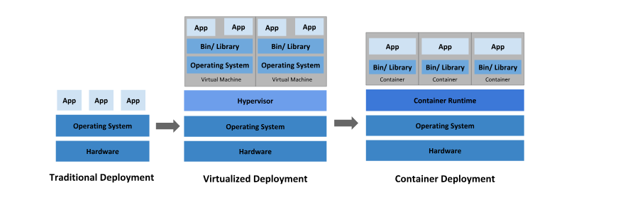

### K8s provides the following features:

* **Service Discovery & Load Balancing:**
  * Kubernetes can expose a container using the DNS name or using their own IP address.
  * If traffic to a container is high, Kubernetes is able to load balance and distribute the network traffic so that the deployment is stable.

* **Storage Orchestration:**
  * Kubernetes allows you to automatically mount a storage system of your choice, such as local storages, public cloud providers, and more.


* **Automated rollouts and rollbacks:**
   * Kubernetes automated rollouts work by deploying new versions of an application without any downtime for your applications
   * if after a change to your application something goes wrong, Kubernetes will rollback for you previous version

* **Automated bin packing**
  * You provide Kubernetes with a cluster of nodes that it can use to run containerized tasks.
  * You tell Kubernetes how much CPU and memory (RAM) each container needs. Kubernetes can fit containers onto your nodes to make the best use of your resources.

* **Self-Healing:**
  * Kubernetes restarts containers that fail, replaces containers, kills containers that don't respond to your user-defined health check, and doesn't advertise them to clients until they are ready to serve.

* **Secret & Configuration Management:**
  * Kubernetes lets you store and manage sensitive information, such as passwords, OAuth tokens, and SSH keys.
  * You can deploy and update secrets and application configuration without rebuilding your container images, and without exposing secrets in your stack configuration

* **Declarative Model/Approach:**
  * Declare the desired state, and K8s works in the background to maintain that state and recover from any failures

* **Horizontal Scaling:**
   * when demand/workload is high automatically k8s up or down your application.
   * it is based on  CPU utilisation or memory utilisation or according to users aim. 
 

### Why do we need Kubernetes:

#### Question or Concerns about containers:

* Containers are wonderful way of bundling and running your applications, But are they production ready?
* What would happen if container or the Docker Host goes down?
* How to make containers available 24*7 ?
* How to handle loads during peak time for the applications ?
* How to replace containers without having downtime with new Docker Image based containers ?
* How to monitor containers?

#### Solution to above Questions or Concerns

#### What it can do Below:

* Wouldn’t it be good if there is some system which can help for handling all the questions/concerns raised in above section. That exactly what Kubernetes does.

* **Kubernetes takes care of**

* Scaling requirements
* failover
* deployment patterns

### Kubernetes even supports cloud providers:

* Amazon Web Service offers **Elastic Kubernetes Services(EKS)**
Google Cloud platform offers **Google Kubernetes Engine(GKE)**
Microsoft Azure offers **Azure Kubernetes Services(AKS)**

### What is Kubernetes:
* Kubernetes is a platform that manages container-based applications, their networking and storage components.
* In Kubernetes, we focus on the application workloads rather than the underlying infrastructure.
* Kubernetes provides a declarative approach to deployments, backed by a rich set of APIs for management operations.
* Cluster: Cluster is collection of compute, storage and networking resources that Kubernetes uses to run workloads.
* Node: It is a single host. Now we can put the cluster as collection of nodes.
* Kubernetes has two kinds of Nodes
    * Master:
       * Provides core Kubernetes Services and orchestration to application workloads
    * Node:
       * run your application workloads

### Kubernetes Cluster Architecture
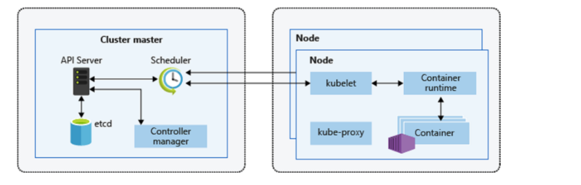

### What would be our approach with workloads in Kubernetes?

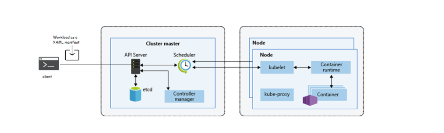

* We would be describing our application as YAML manifest and pass it to Kubernetes master from some client, and Cluster Master does the rest.

### Pets Vs Cattle

* I have found a interesting image in cloudrumblings.io, See the reference below

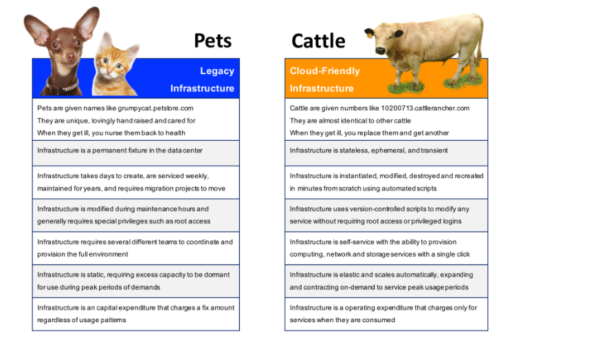

* In Kubernetes we follow cattle analogy and we would be discussing more in next series of articles

### Kubernetes Architecture:

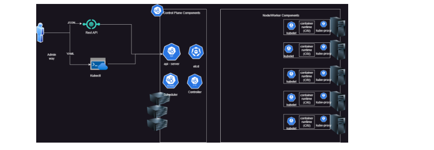

### Pod: 
* Pod is atomic unit of creation in k8s and it contains container(s). Each Pod has unique ip address
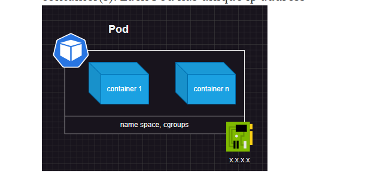
* [Refer Here](https://kubernetes.io/docs/concepts/workloads/pods/) for official documents

* Pod is collection of Containers.
   * Container in which we have application running is referred as main car and other are referred as side cars
   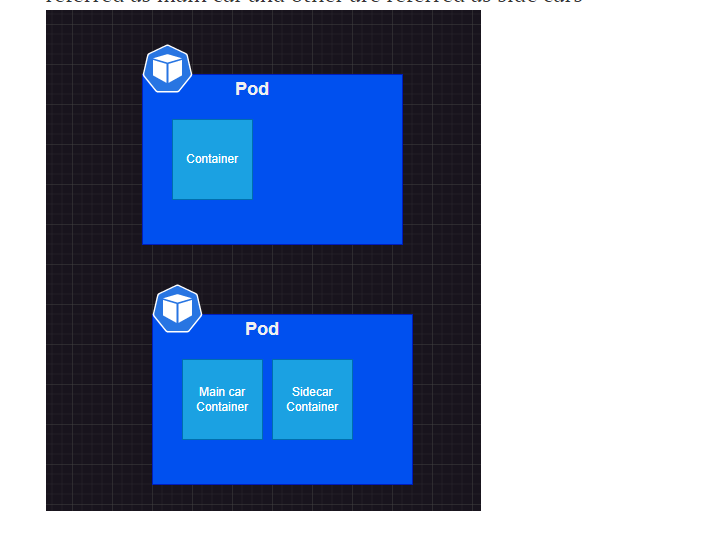

### Writing Pod Manifests/yaml files:
   * The basic skeleton of manifest/yaml files which is suitable for majority of resources

```
---
apiserver:
kind:
metadata:
spec
```

* This when executed becomes 5 as k8s will add status

```
---
apiserver:
kind:
metadata:
spec:
status:
```

* **API Versioning** in k8s:
  * API Versioning: [Refer Here](https://kubernetes.io/docs/reference/using-api/)
* **API Group** in k8s:
  * API Group: [Refer Here](https://kubernetes.io/docs/reference/using-api/#api-groups)
  * API Group has even version:


### To fill **apiVersion:** below examples:

```
# if the apiGroup is not core
apiVersion: <apiGroup>/<version>


# if the apiGroup is core
apiVersion: <version>
```

### To fill the rest lets use api reference
* [Refer Here](https://kubernetes.io/docs/concepts/overview/working-with-objects/labels) for v1.28
* in future any new version of k8s means just click above url and we will see `API Reference` there click on `One-page API Reference for Kubernetes:newer version ` then it will take new page if anything added newly refer that page only.
* Refer below screen shot for future:
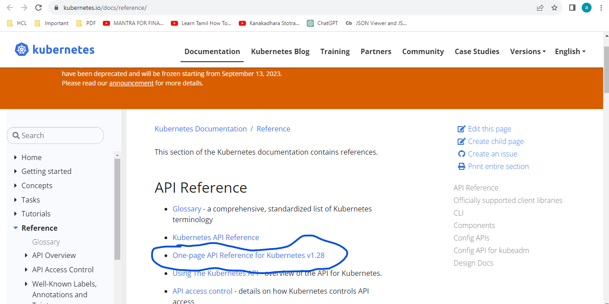

* The url will be `https://kubernetes.io/docs/reference/generated/kubernetes-api/v1.28/ `
* in future if we get k8s new version means we can just use this above url and only change last two digit that is `v1.28`

### Metdata: 
* This helps in naming and labelling resources in k8s
* means what ever resource we are creating k8s under `metadata` which we will provide `name` that name will identified by the resources, examples `pod,deployment,ingress,service,configmap and secret` etc:

### Label: 
### How k8s identifies objects: using Labels:
* Label is a key pair examples are:
    * app: nginx
    * version: v1.0
* Labels are used to select/query kubernetes objects/resource
* [Refer Here](https://kubernetes.io/docs/concepts/overview/working-with-objects/labels/) for offcial documents 

### Selectors in k8s help in querying objects using labels:
* **Selectors are of two types:**
   * Equality Based Selectors [Refer Here](https://kubernetes.io/docs/concepts/overview/working-with-objects/labels/#equality-based-requirement)

   * Set based selectors [Refer Here](https://kubernetes.io/docs/concepts/overview/working-with-objects/labels/#set-based-requirement)

* Example for Equality based selectors below screenshot
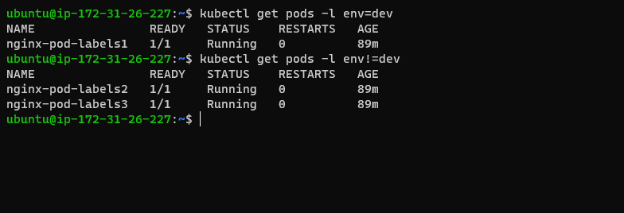
* here `env=dev` is only one pod that is `nginx-pod-labels1` we can query or select that one using this Equality based selectors

* here `env!=dev` is not equal is another two pod `nginx-pod-labels2 and nginx-pod-labels3` so we can query or select that one using this Equality based selectors
* Example of set based selectors:
 ```
    selector:
    matchExpressions:
    - key: app
      operator: In
      values:
      - jenkins
      - docker 
    - key: release
      operator: Exists
   ``` 


### Pod with Labels:
* Overview:

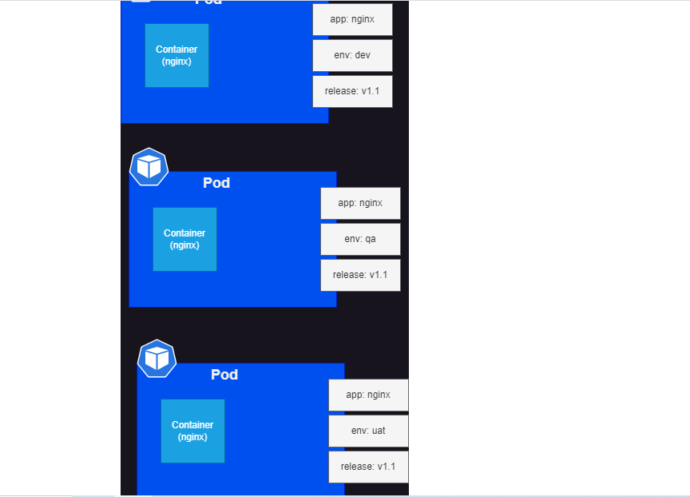

* [Refer Here](https://github.com/AjayKumarRamesh/QT-DevOps-AzureCloud-Trainings-Ajay/blob/master/Kubernetes/Examples_Yaml/Pods/nginx-pod-labels.yml) for manifests/yml files added for multi labels

* Created pods refer below:

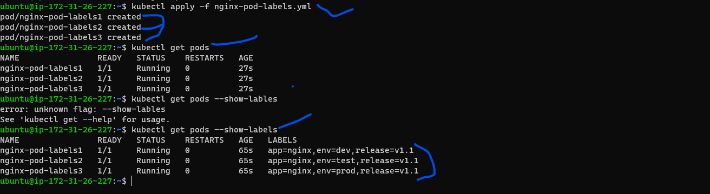
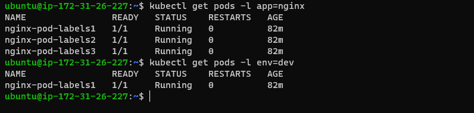

* see this above screen shot there is 3 pods running with `app=ngnix` labels.
* but when query it using `env=dev` there is only one `env=dev` i have given this what use for label to query ot select the resource/object which we created 

* This is name/value pair used to query resources in k8s. 
* means what ever resource/object we are creating for that we adding the labels refer below examples and screen shot

* Example: 1
```
apiVersion: v1
kind: Pod
metadata:
  name: nginx-pod
  labels:
    app: my-label
spec:
  containers:
  - name: nginx-pod
    image: nginx:1.25
    ports:
    - containerPort: 80
      protocol: TCP
```
* Example: 2

```
apiVersion: v1
kind: Pod
metadata:
  name: java-pod
  labels:
    app: royal
spec:
  containers:
  - name: nginx-pod
    image: nginx:1.25
    ports:
    - containerPort: 80
      protocol: TCP
```
* as per above two examples i have created the two labels observe the below screen shot.

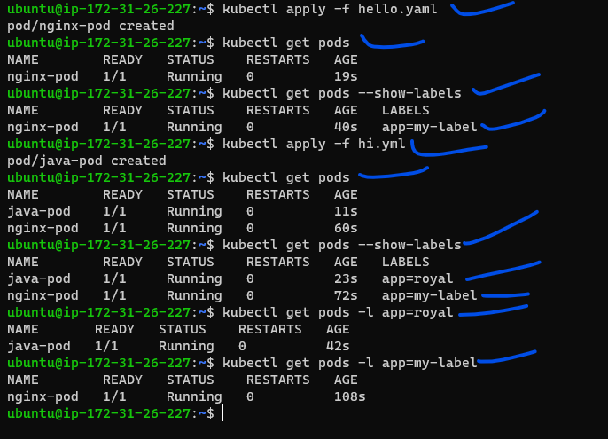

* as we observed the above screen shot using this two labels we get/list the pod as per the labels which we mentioned it. 
* so this is called key:value pair is `label` so keeping this we can query the resource/object in k8s.


### Pod with container with additional commands `ARGS`

* using `args` will override the `cmd` command in  k8s like a argument which we are using, how see in similar in docker.
* Arguments `args` will override the `cmd` in container of pod same like docker container like below example to override `cmd` in docker passing the arguments .

`docker container run -d alpine sleep 1d`

* [Refer Here](https://kubernetes.io/docs/tasks/inject-data-application/define-command-argument-container/#running-a-) for official documents
* [Refer Here](https://github.com/AjayKumarRamesh/QT-DevOps-AzureCloud-Trainings-Ajay/blob/master/Kubernetes/Examples_Yaml/Pods/cmddemo.yml) for manifest/yml file for `args` 

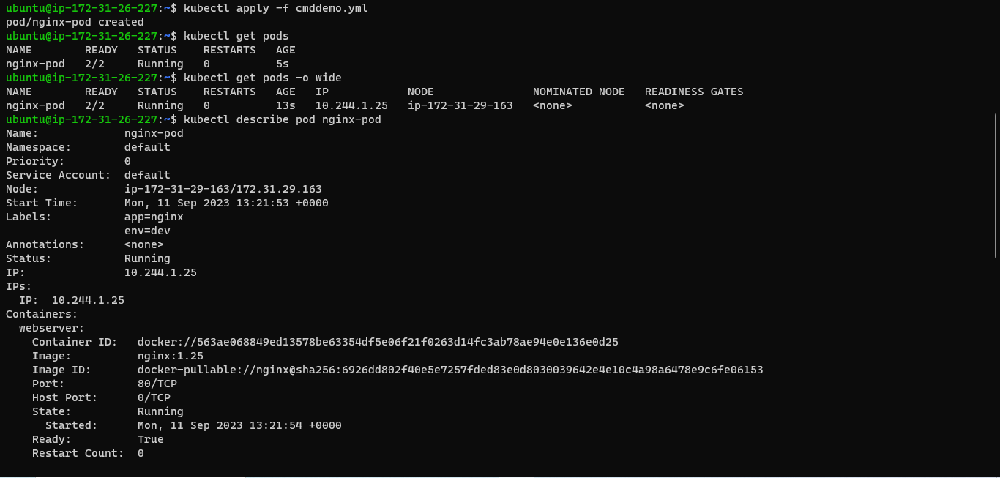

* after executing below command we can see the `args` command has been overridden the `cmd` below screen shot and also alpine will not run since it has overriden `cmd` it is running.

```
kubectl describe pod nginx-pod
```
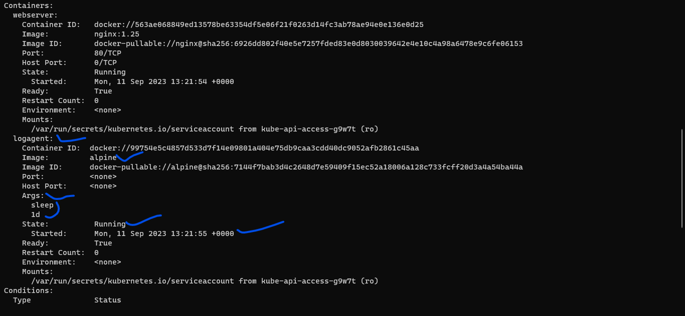

### Interacting with containers:
* In k8s we have commands like below.
`kubectl exec --help`

* This below command is to Run in existing pod (1 container case)

```
kubectl exec java-pod -- pwd
kubectl exec java-pod -- ls
 kubectl exec java-pod -- whoami
```
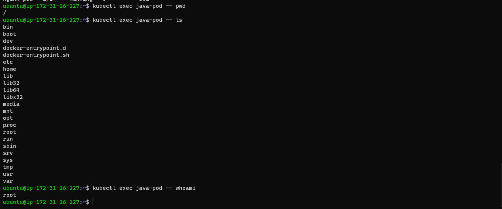

```
kubectl exec -it java-pod -- /bin/bash
root@java-pod:/# pwd
root@java-pod:/# ls
root@java-pod:/# whoami
```


* This above command doesn't not work in multi container below example for confusion, the above command is running on which container 
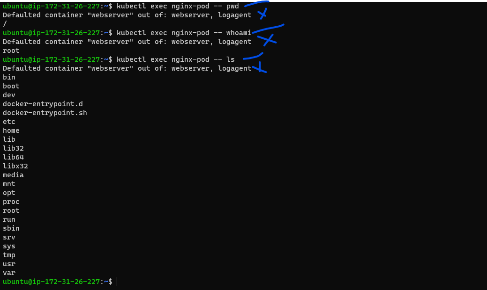
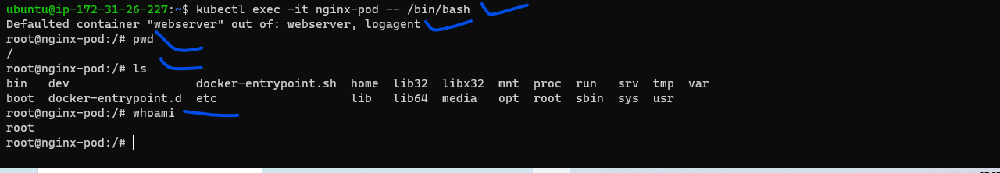

* This below command is to Run in existing pod (multi-container case).

```
kubectl exec nginx-pod -c logagent -- ls
kubectl exec nginx-pod -c logagent -- pwd
kubectl exec nginx-pod -c logagent -- whoami
```
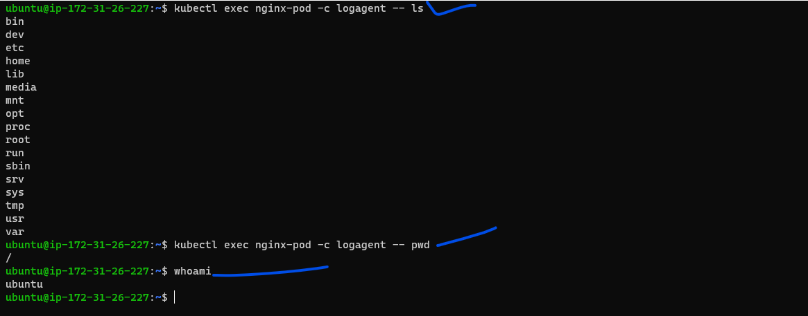

```
 kubectl exec -it nginx-pod -c webserver -- /bin/bash
 root@nginx-pod:/# pwd
 root@nginx-pod:/# ls
 root@nginx-pod:/# whoami
```
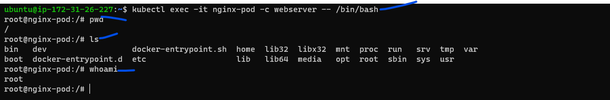


### What happens when container goes into exited state in k8s:
* Lets create a pod with alpine container which exits always
* Lets observe what k8s does when container went on exit state.
* [Refer Here](https://github.com/AjayKumarRamesh/QT-DevOps-AzureCloud-Trainings-Ajay/blob/master/Kubernetes/Examples_Yaml/Pods/patient-container.yml) for alpine container exits state 
* kubernetes will continuously tries to restart when container goes on exit state. keeps trying and gives the status as CrashLoopBackoff. 

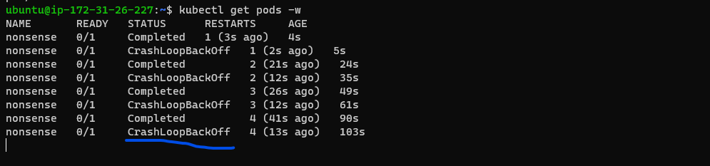
* [Refer Here](https://kubernetes.io/docs/concepts/workloads/pods/pod-lifecycle/#restart-policy) official documents

* Kuberentes restarts the containers always as the `restartPolicy` Default value is `Always`.
* [Refer Here]() for chaning the restart policy default value `always` to `never` 

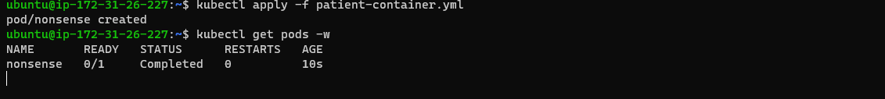

### Container types in Pod:

#### init containers:
* These containers are created prior to actual/main containers
* These init containers are used for do some activity before ur actual applications starts 
   * like execute some scripts 
   * like download some file or show some log or copy some files etc:
* ideally these containers should be short lived and majorly for meeting preconditions to run your application
* in case we write multiple init containers means it will start sequence or one after one order way it will execute
* [Refer Here](https://kubernetes.io/docs/concepts/workloads/pods/init-containers/)  for official docs

#### App Containers: 
 * This is where we run actual applications and they are expected to be living forever (continuously)

#### Demonstration Init Containers:
* [Refer Here](https://github.com/AjayKumarRamesh/QT-DevOps-AzureCloud-Trainings-Ajay/blob/master/Kubernetes/Examples_Yaml/Pods/initcontainerdemo.yml) for initcontianers manifest/yml files

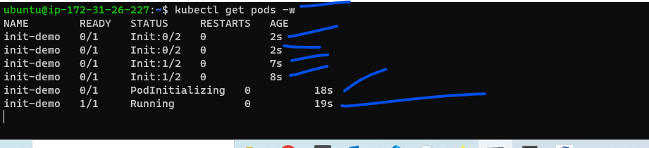

### Pod Lifecycle:

* [Refer Here](https://kubernetes.io/docs/concepts/workloads/pods/pod-lifecycle/) for the Pod lifecycle

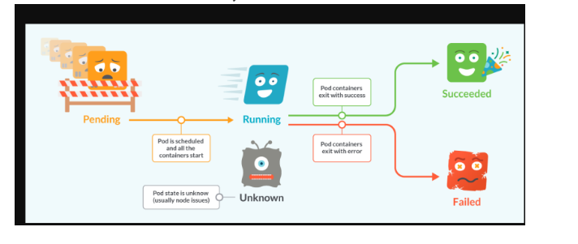

### Resource Restrictions in Pods:
* [Refer Here](https://kubernetes.io/docs/concepts/configuration/manage-resources-containers/) for official documents
* **Resource Request:**
   * means we are requesting minimum resources for our container
* **Resource Limit:**
   *  means we setting up resource to maximum for our container, it should not go behind that.
* [Refer Here](https://github.com/AjayKumarRamesh/QT-DevOps-AzureCloud-Trainings-Ajay/blob/master/Kubernetes/Examples_Yaml/Pods/resource-request.yml) for manifest/yml of resource request and limits

```
ubuntu@ip-172-31-24-237:~$ kubectl apply -f ram.yml
pod/nginx-pod unchanged
ubuntu@ip-172-31-24-237:~$ kubectl get pods
NAME        READY   STATUS    RESTARTS   AGE
nginx-pod   1/1     Running   0          88s
ubuntu@ip-172-31-24-237:~$ cat ram.yml
apiVersion: v1
kind: Pod
metadata:
  name: nginx-pod
  labels:
    app: nginx
spec:
  containers:
  - name: webserver
    image: nginx:1.25
    resources:
      requests:
        memory: "64Mi"
        cpu: "250m"
      limits:
        memory: "128Mi"
        cpu: "500m"
ubuntu@ip-172-31-24-237:~$
```

### Lets create a manifest/yaml file to run nginx pod

```
apiVersion: v1
kind: Pod
metadata:
  name: nginx-pod
spec:
  containers:
  - name: nginx-pod
    image: nginx:1.25
```
* apply and execute the following commands
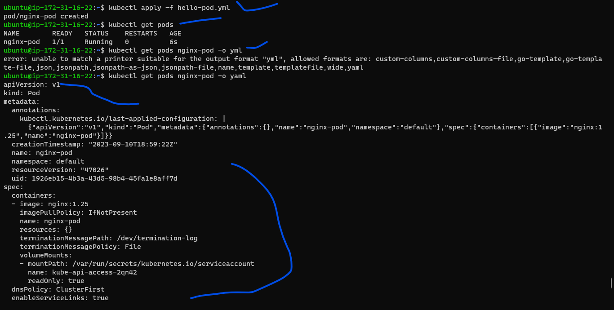

* When we execute below command we get our yaml file created out in yaml formate

`kubectl get pod hello-pod -o yaml`

```
apiVersion: v1
kind: Pod
metadata:
  annotations:
    kubectl.kubernetes.io/last-applied-configuration: |
      {"apiVersion":"v1","kind":"Pod","metadata":{"annotations":{},"name":"nginx-pod","namespace":"default"},"spec":{"containers":[{"image":"nginx:1.25","name":"nginx-pod"}]}}
  creationTimestamp: "2023-09-10T18:59:22Z"
  name: nginx-pod
  namespace: default
  resourceVersion: "47026"
  uid: 1926eb15-4b3a-43d5-98b4-45fa1e8aff7d
spec:
  containers:
  - image: nginx:1.25
    imagePullPolicy: IfNotPresent
    name: nginx-pod
    resources: {}
    terminationMessagePath: /dev/termination-log
    terminationMessagePolicy: File
    volumeMounts:
    - mountPath: /var/run/secrets/kubernetes.io/serviceaccount
      name: kube-api-access-2qn42
      readOnly: true
  dnsPolicy: ClusterFirst
  enableServiceLinks: true
  nodeName: ip-172-31-27-34
  preemptionPolicy: PreemptLowerPriority
  priority: 0
  restartPolicy: Always
  schedulerName: default-scheduler
  securityContext: {}
  serviceAccount: default
  serviceAccountName: default
  terminationGracePeriodSeconds: 30
  tolerations:
  - effect: NoExecute
    key: node.kubernetes.io/not-ready
    operator: Exists
    tolerationSeconds: 300
  - effect: NoExecute
    key: node.kubernetes.io/unreachable
    operator: Exists
    tolerationSeconds: 300
  volumes:
  - name: kube-api-access-2qn42
    projected:
      defaultMode: 420
      sources:
      - serviceAccountToken:
          expirationSeconds: 3607
          path: token
      - configMap:
          items:
          - key: ca.crt
            path: ca.crt
          name: kube-root-ca.crt
      - downwardAPI:
          items:
          - fieldRef:
              apiVersion: v1
              fieldPath: metadata.namespace
            path: namespace
status:
  conditions:
  - lastProbeTime: null
    lastTransitionTime: "2023-09-10T18:59:22Z"
    status: "True"
    type: Initialized
  - lastProbeTime: null
    lastTransitionTime: "2023-09-10T18:59:24Z"
    status: "True"
    type: Ready
  - lastProbeTime: null
    lastTransitionTime: "2023-09-10T18:59:24Z"
    status: "True"
    type: ContainersReady
  - lastProbeTime: null
    lastTransitionTime: "2023-09-10T18:59:22Z"
    status: "True"
    type: PodScheduled
  containerStatuses:
  - containerID: docker://f7023a4e61c1e73867fc5251d1ff5aba1481cfc6414c8f8c9ffffadb1c2fd1e3
    image: nginx:1.25
    imageID: docker-pullable://nginx@sha256:6926dd802f40e5e7257fded83e0d8030039642e4e10c4a98a6478e9c6fe06153
    lastState: {}
    name: nginx-pod
    ready: true
    restartCount: 0
    started: true
    state:
      running:
        startedAt: "2023-09-10T18:59:23Z"
  hostIP: 172.31.27.34
  phase: Running
  podIP: 10.244.1.10
  podIPs:
  - ip: 10.244.1.10
  qosClass: BestEffort
  startTime: "2023-09-10T18:59:22Z"
```

### Scaling:
   * Scaling in k8s means increasing number of Pods not containers inside Pod.
   * For Scaling pods we would learn Replica set/Replication Controller etcs.. 

### Autoscaling:
  * Containers don’t scale on their own.
  * **Scaling is of two types:**
    * Vertical Scaling
       * means to modify the attributed resources (like CPU or RAM) of each node in the cluster. In most cases, this means creating an entirely new node pool using machines that have different hardware configurations. Vertical scaling on pods means dynamically adjusting the resource requests and limits based on the current application requirements 

    * Horizontal Scaling
       * means modifying the compute resources of an existing cluster, for example, by adding new nodes to it or by adding new pods by increasing the replica count of pods

### Horizontal Pod AutoScaler: 
* Allows us to auto-scale pods based on some metrics like cpu, network,memory etc.

### Vertical Pod AutoScaler:
* can allocate more (or less) CPU and memory resources to existing pods to modify the available compute resources for an application. 
* This feature can be useful to monitor and adjust the allocated resources of each pod over its lifetime
* The Vertical Pod Autoscaler does not update resource configurations for existing pods.
* It checks which pods have the correct resource configuration and kills the ones that are not having the recommended configuration so that their controllers can recreate them with the updated configuration.

### Node/Cluster Autoscaler:

#### About the cluster autoscaler:
* AKS clusters can scale in one of two ways:
   * The **cluster autoscaler** watches for pods that can't be scheduled on nodes because of resource constraints. The cluster then automatically increases the number of nodes
   * The **horizontal pod autoscaler** uses the Metrics Server in a Kubernetes cluster to monitor the resource demand of pods. If an application needs more resources, the number of pods is automatically increased to meet the demand

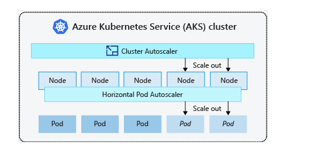

* [Refer Here](https://learn.microsoft.com/en-us/azure/aks/cluster-autoscaler) for aks cluster autoscaler

* [Refer Here](https://docs.aws.amazon.com/eks/latest/userguide/autoscaling.html) for eks cluster autoscaler


### To check all the api-server resource in k8s

* Kubernetes allows us to view all the resources using

`kubectl api-server`

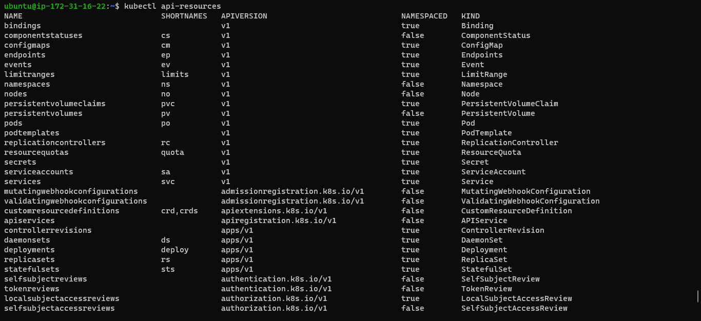

* Each Name refers a resource that can be manipulated by api-server
* Each resource has `NAME`,`SHORTNAMES`,`APIVERSION`,`NAMESPACED` and `KIND`
* In kubernetes there are two ways of creating resources: `imperatively` as well `declaratively`

* **Imperative:** means constructing a command
  * imperatively: Type commands
  * This is good for one time jobs as we create a command
`kubectl run nginx --image nginx`

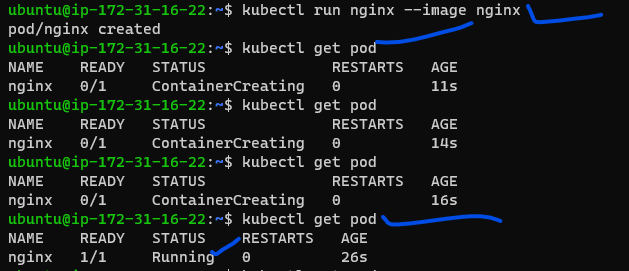

`kubectl create deployment nginx --image=nginx`

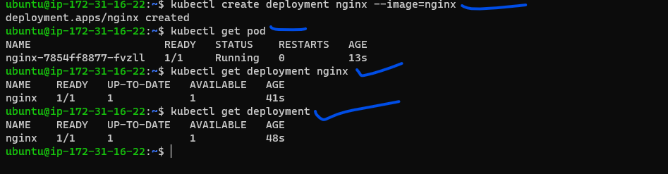

* **Declartive:** Create a yaml file with below content and execute below command:
* declartively: Write manifests (YAML files)
* This is good for repetitive tasks as we create a manifest
we create a desired state by expressing in a yaml file called as manifest
  * to create 

`kubectl apply -f <filename.yaml>`

* and to delete 

`kubectl delete -f <filename.yaml>`

```
apiVersion: v1
kind: Pod
metadata:
  name: nginx
spec:
  containers:
  - name: nginx
    image: nginx:1.14.2
    ports:
    - containerPort: 80
```

### Controllers: 
  * Replication Controller or Replica Set: They maintain a state of number of replicas of pods
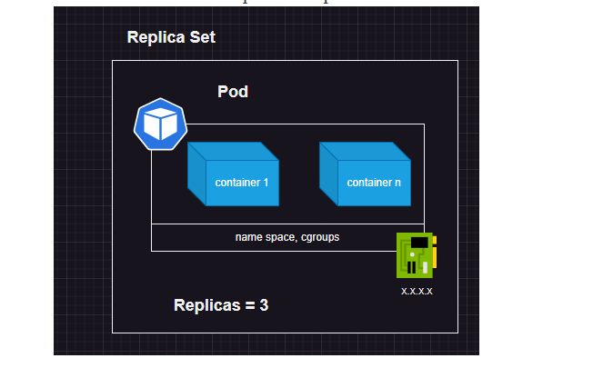

* Pod tries to keep containers running, but for us we need to keep Pods running according to some state.
* Lets understand first two categories

* **Replicas:**
   * Here we have two resources
   
     ReplicationController, ReplicaSet
  * Here our desired state (spec) will be

     * number of replicas
     * pod spec
     * label selector  

* These objects try maintain the desired

### ReplicaSet:
* This Resource is responsible for maintaning the desired state of number of replicaset of pod
*  ReplicaSet supports set based selectors and equality based selectors

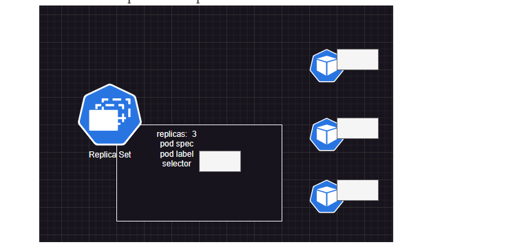

* [Refer Here](https://kubernetes.io/docs/concepts/workloads/controllers/replicaset/) for official documents

#### Activity:

* Create a replica set with 3 replicas of jenkins/jenkins
* this below all example is equality base labels selector.
* [Refer Here](https://github.com/AjayKumarRamesh/QT-DevOps-AzureCloud-Trainings-Ajay/blob/master/Kubernetes/Examples_Yaml/ReplicaSet/jenkins-rs.yml) for the manifests/yml of RS and Selector labels
* this above manifest/yml written for equality base labels. and replicas also..

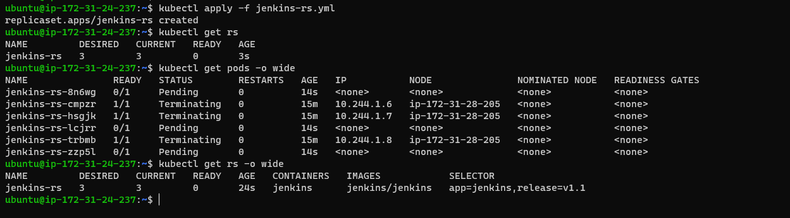

* So here is below small demonstration.
  * one pod has been deleted, the moment the pod has been deleted, controller manager will check the replicas state is lesser then desired state so, scheduler started created the pod and ensure it maintain the desired state `replicas=3` 

  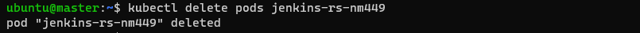
  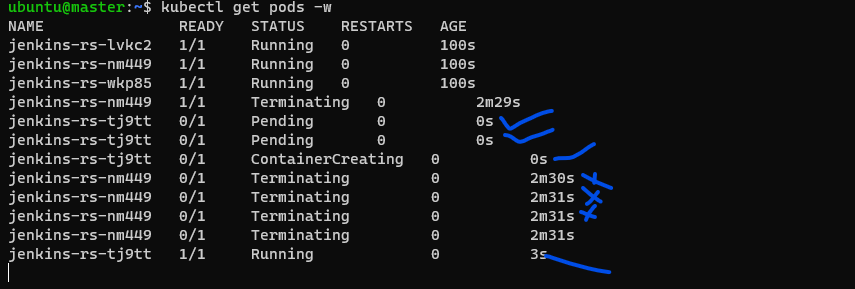
  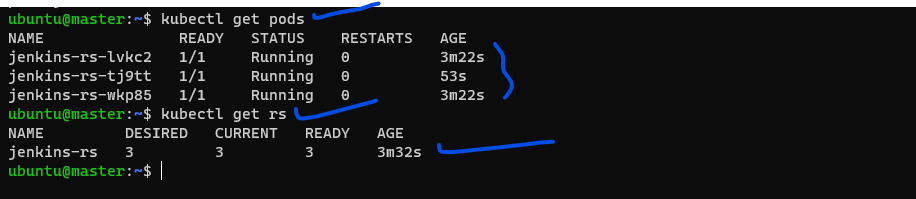

* Another demonstration below.
   * here we are creating two different pods.
     * one is nginx-pod and another one is jenkins-rs pod but both label will same so what k8s will is already we create two nginx-pod which is running and again we creating the jenkins-rs pod with mention in the yml file `replicas=3` so k8s will check same label pod is already running two so only another one pod it will create because k8s doesn't worry about what is inside the pod or yml it is worry only about labels matching.
     * so in this case two different pod but labels matching is same observe the below screen shot of demonstration.

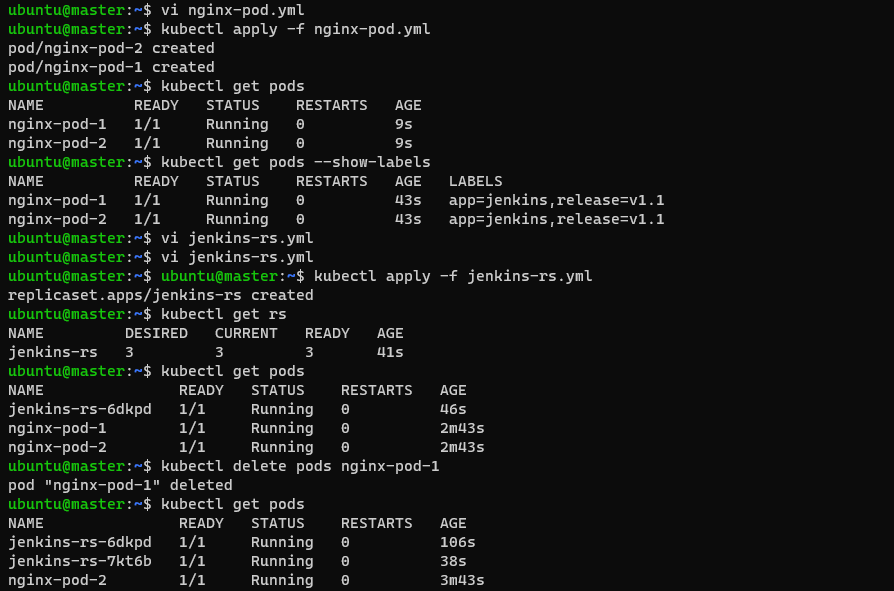
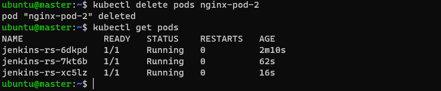
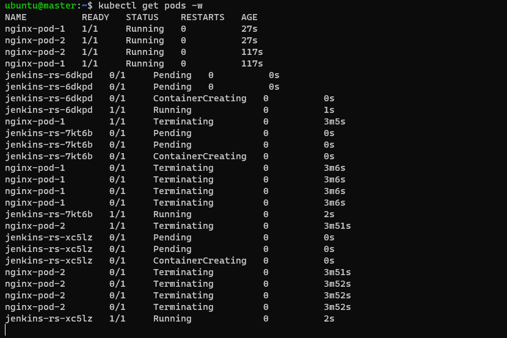
* observe this screen shot above we will understand everything.
* [Refer Here](https://github.com/AjayKumarRamesh/QT-DevOps-AzureCloud-Trainings-Ajay/blob/master/Kubernetes/Examples_Yaml/ReplicaSet/rs-demonstration.yml) for rs-demonstration.yml

* These below example for set base labels selector in Replication Set.
* [Refer Here](https://github.com/AjayKumarRamesh/QT-DevOps-AzureCloud-Trainings-Ajay/blob/master/Kubernetes/Examples_Yaml/ReplicaSet/matchexpression.yml) for rs manifest/yml for match expression label

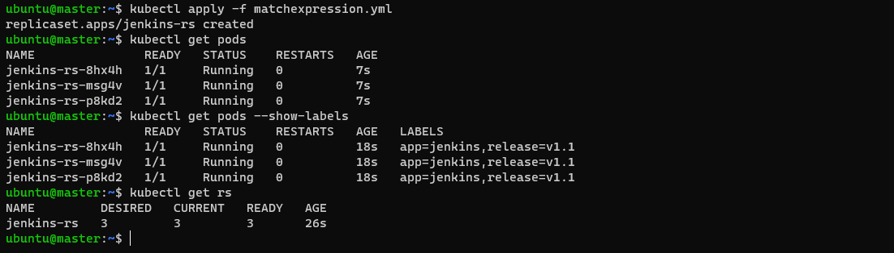


### Replication Controller:
* here rc is a selector only one labels so below 
screen shot proves it.
* ReplicationController only allows equality based selectors

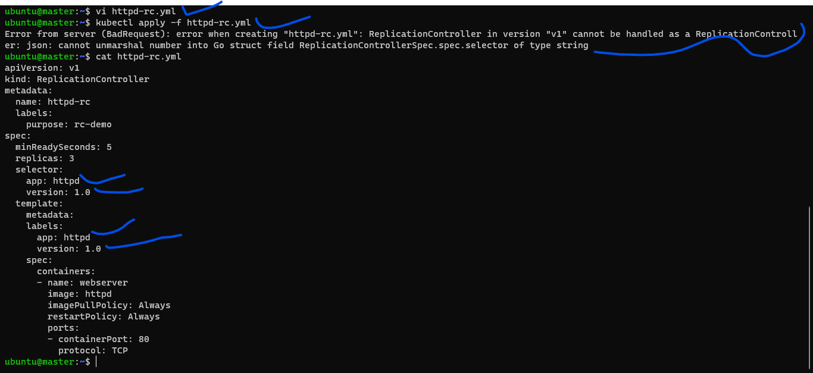

* [Refer Here](https://github.com/AjayKumarRamesh/QT-DevOps-AzureCloud-Trainings-Ajay/blob/master/Kubernetes/Examples_Yaml/ReplicationController/httpd-rc.yml) for RC manifest/yml file 


### Jobs:
* These will run the Pods which have finite/sometime/only certain time execution time period. for running some script etc:
* Here we have two resources
    * Job
    * CronJob
* to write run some cripts or write some commands if it is one time then `jobs`
* to write run some scripts or write some commands if it is multiple time then `cronjobs`

* [Refer Here](https://kubernetes.io/docs/concepts/workloads/controllers/job/) for Offical jobs documentation
* [Refer Here](https://kubernetes.io/docs/concepts/workloads/controllers/cron-jobs/) for Official CronJob Documentation

#### Jobs Example:
* * Lets write a Job which runs alpine pod with some script for every 5 mins
* [Refer Here](https://github.com/AjayKumarRamesh/QT-DevOps-AzureCloud-Trainings-Ajay/blob/master/Kubernetes/Examples_Yaml/Jobs/CronJobs/jobs-demo.yml) for jobs manifest/yml files
* refer bleow screen shots to understand the work flow of jobs.
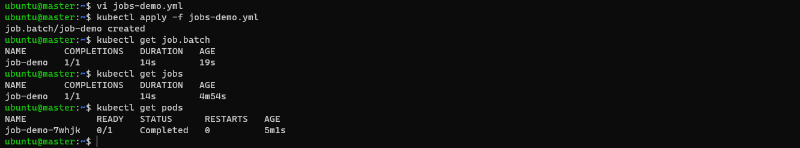
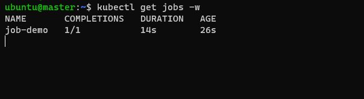
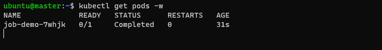

#### CronJobs Example:
* Lets write a Cron Job which runs alpine pod with some script for every 5 mins
* [Refer Here](https://github.com/AjayKumarRamesh/QT-DevOps-AzureCloud-Trainings-Ajay/blob/master/Kubernetes/Examples_Yaml/Jobs/CronJobs/cronjobs-demo.yml) for cronjobs manifest/yaml files

* refer below screen shots to understand the work flow cronjobs.
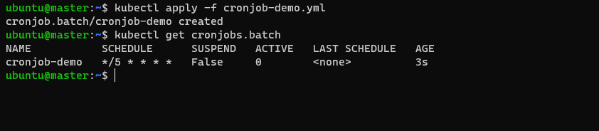
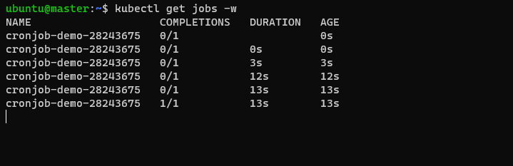
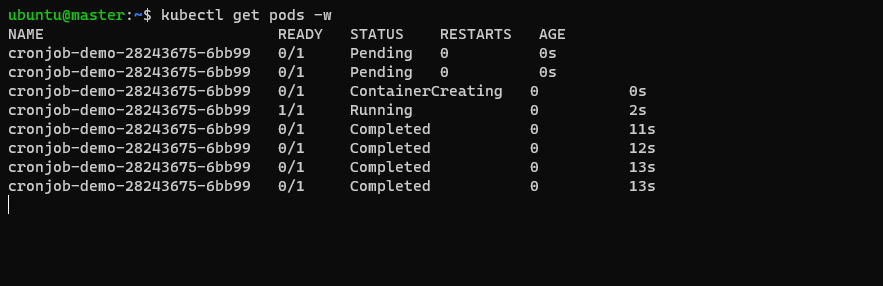
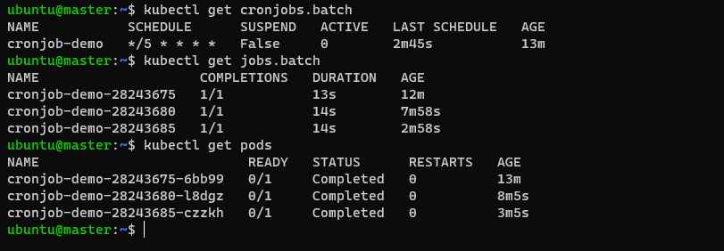


### Namespaces:
* Namespace in k8s is a logical space or logical cluster in which resources will be created
* Any resource which has a value of `Namespace = true` belongs in a namespace, means resources which `Namespace = true` that kind of resource can we put inside the namespace and while identifying or getting that resource we call by particular namespace resource needs to get it. 
* **Examples below:**

`kubectl get pods -namespaces dev or test or prod`

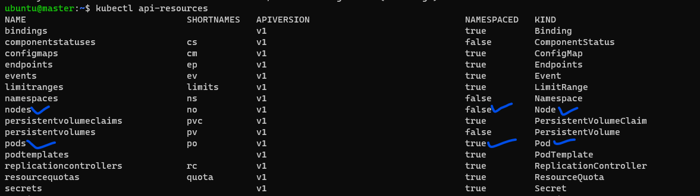
* In above examples we can observe that `pod` is belong to namespaces since the `value=true` so we can create namespaces and put that pod inside the namespaces.
* Where as `nodes` we observed it is not belongs to any namespaces since the `value=false` so we cannot create any namespaces for node nor we can put them inside that .
* some resources is part of namespace and some do not belongs to namespaces
* namespaces which values are true can use same namespaces but some resources value are false can we use in any namespaces or all example - `node` we can use it in all namespaces  
* [Refer Here](https://kubernetes.io/docs/concepts/overview/working-with-objects/namespaces/) for official documents


### Service:
* Every Pod when created gives a unique ip address and Name and also when pods are scaled again it will give new unique ip address and name.
* service is responsible to expose our application to outside the world means it will allow our pods to access from internet or out side of our cluster environment.
* service ip address which will never change and also it is stored in etcd, still control plane is up service will not go down
* service is layer 4 load balancer it knows only about ip address or node ports
*  When pod dead and recreated another pod then that ip address will be changed so for that reason we will create one service to use with in the cluster to communicate each other.
* A Service that identifies a set of Pods by using label selectors. 
* to over come Node port and load balancer issue in the service yml file we can use something called ingress without charging for Load balancer or without any issue of ip address and node port


   
* Experiment:
* Lets create a replicaset with 3 nginx pods with label `app:nginx`
* [Refer Here](https://github.com/AjayKumarRamesh/QT-DevOps-AzureCloud-Trainings-Ajay/blob/master/Kubernetes/Examples_Yaml/service/Cluster-IP/nginx-rs.yml) for replicaset manifest/yml files

* Here below example shown:
   * we can ping/communicate using pods ip with in the another pods inside the container but unable to ping using pods name.
   * [Refer Here](https://github.com/AjayKumarRamesh/QT-DevOps-AzureCloud-Trainings-Ajay/blob/master/Kubernetes/Examples_Yaml/service/exp-ping.yml) for ping manifest/yml files

   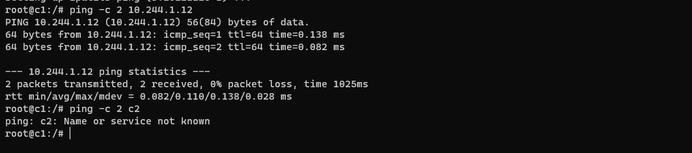


* We need to access nginx with in cluster, but pod ips are not reliable, because when ever a nodes goes down or any issues pods will die and re-create so in that case pods will get new ipaddress
* so as shown in the below image, lets create a k8s service resource which gives a consistent ip and name to access all the pods matching labels (equality based selection)

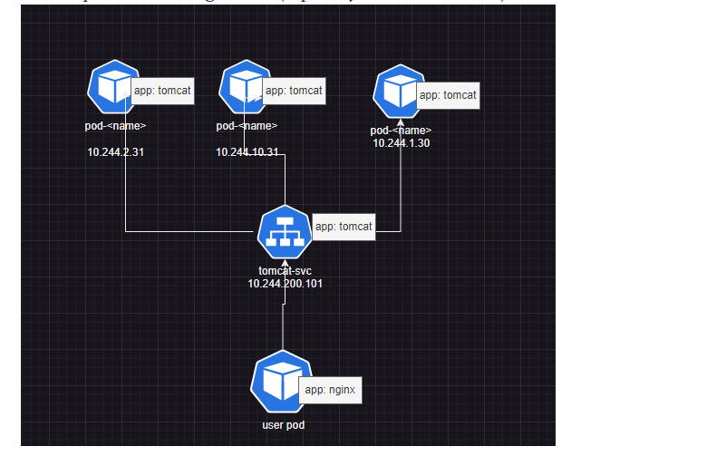

#### Types of service in k8s:

* **Cluster IP:**  
   * This gives an ipaddress or name which can be accessed with in cluster
   * It is very important since if pod want to communicate each other then will use this service cluster ip address it is only for internal communication purpose.
   * ClusterIP Exposes the Service on a cluster-internal IP. Choosing this value makes the Service only reachable from within the cluster. This is the default ServiceType. 
   * cluster ip is accessible only withing in the cluster.
   * Refer Here for service manifest/yml file

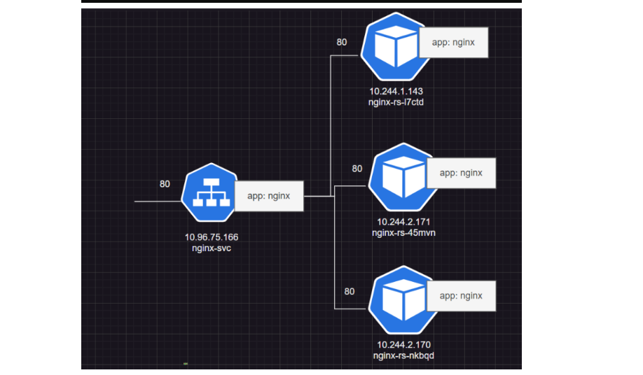

* [Refer Here](https://github.com/AjayKumarRamesh/QT-DevOps-AzureCloud-Trainings-Ajay/blob/master/Kubernetes/Examples_Yaml/service/Cluster-IP/nginx-rs.yml) for replicaset manifest/yml files

* [Refer Here](https://github.com/AjayKumarRamesh/QT-DevOps-AzureCloud-Trainings-Ajay/blob/master/Kubernetes/Examples_Yaml/service/Cluster-IP/nginx-svc.yml) for nginx-svc manifest/yml files

* Refer below screen shot after we created the `service` manifest then we are able to access our pods within the cluster, that is inside the node nor container with ip address as well as name

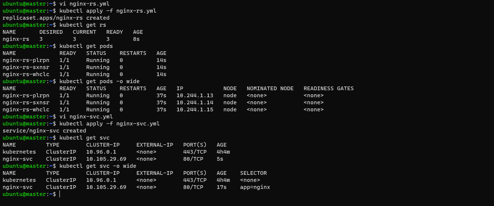
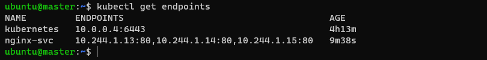   
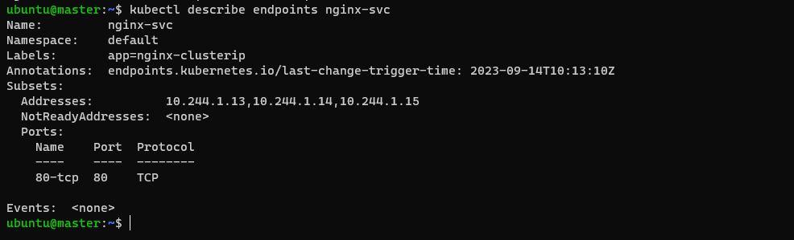

* see the above screen shot there is endpoints of pods, when we delete the pods and rs will create new pods with new ip address all the new ip address will be collect from service. and shown as endpoints. 
* when pods get update the endpoints are reflected. Service will forward the requests to endpoints

* **endpoints:**

    * endpoints is collection of pods ip address

* **service:**

    * service is collection of endpoints

#### above experiment section:
* We have create an nginx-replica set with 3 pods and a service manifest/yml 

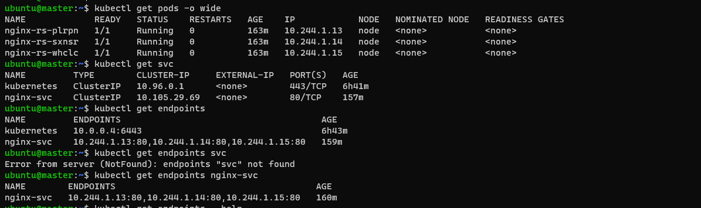
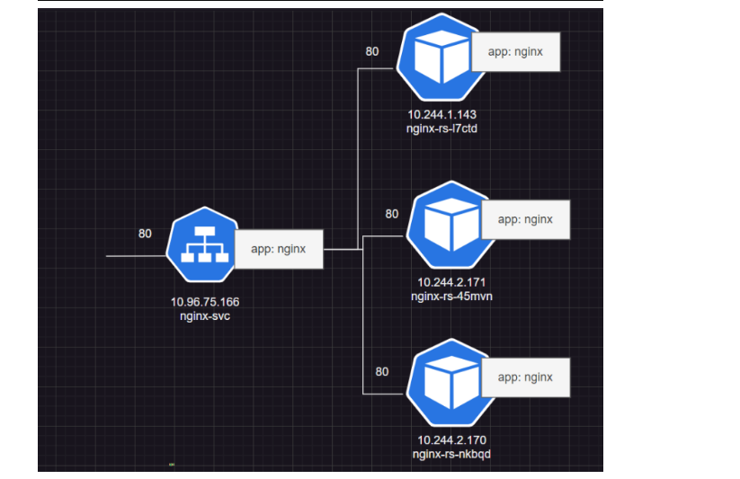

* The endpoints are update to kube-proxy
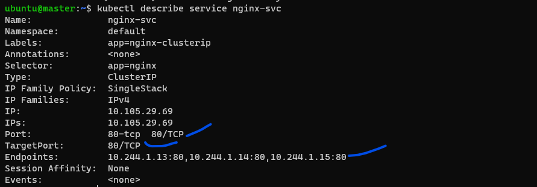

* Now we can access our pods with in the cluster means from the node, node is also part of cluster, below screen shots:
* Please Note: we needs to open all port in our security groups nor as per k8s document we needs to open ports.

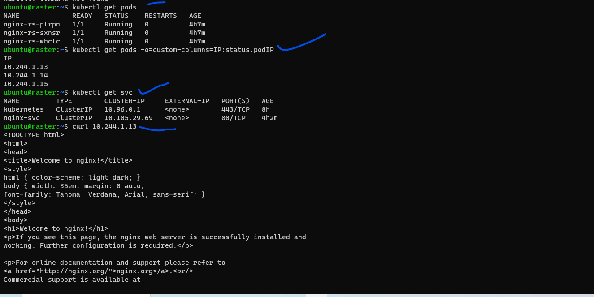
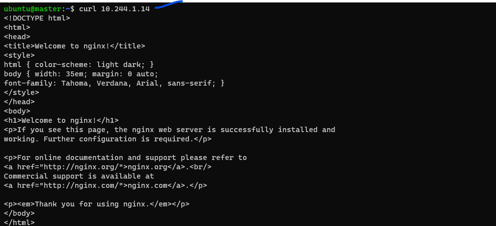
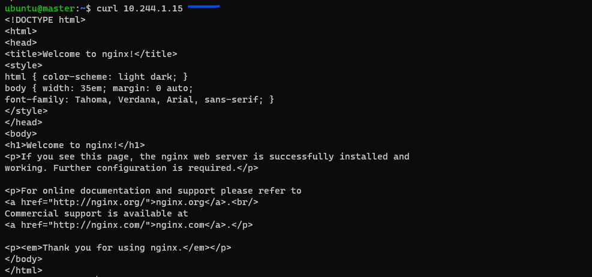

* kubernetes allows service to be accessed  by name or by ip address from containers.

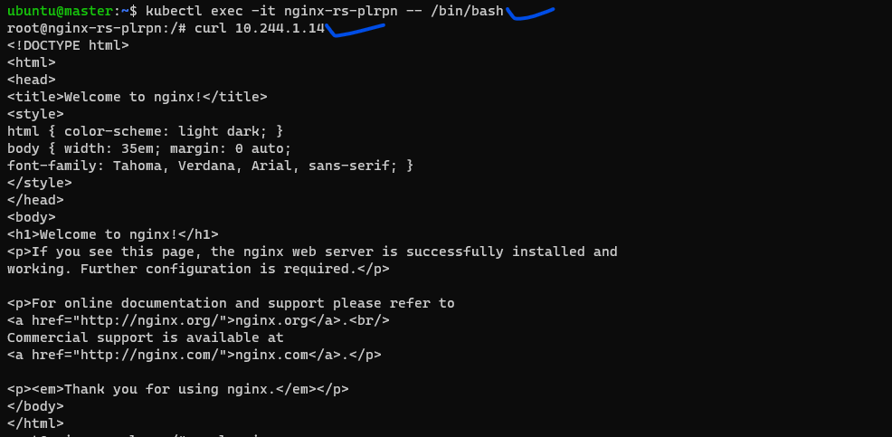
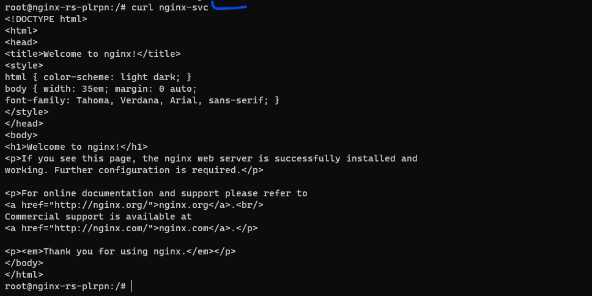

* The fully qualified domain name(fqdn) for service is `<service-name>.<namespace>.svc.cluster.local` = `nginx-svc.default.svc.cluster.local`

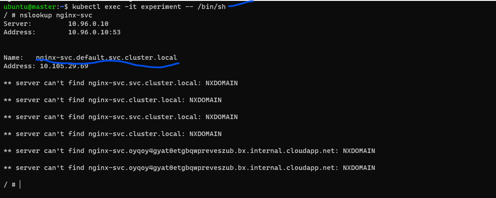

* To access any pod when logging inside into pod.
just give `curl nginx-svc.default` `curl <service_name.namespace` if we are on default namespace means even not requirement mention namespace.
* [Refer Here](https://github.com/AjayKumarRamesh/QT-DevOps-AzureCloud-Trainings-Ajay/blob/master/Kubernetes/Examples_Yaml/service/Cluster-IP/experiment-alpine.yml) for experiment-alpine manifest/yml files

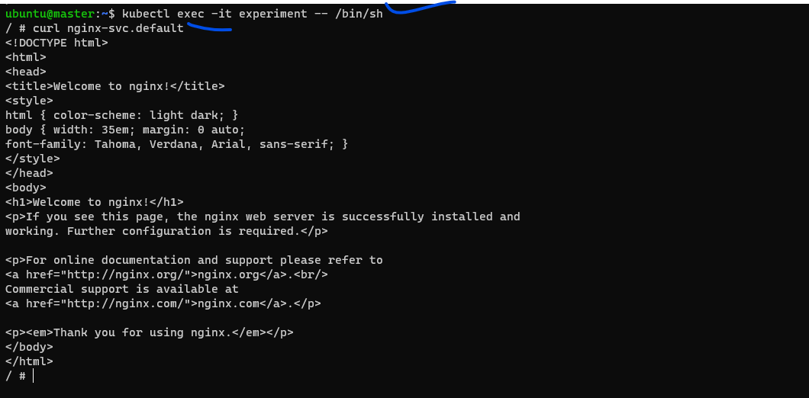


* **Node Port:**
  * `Node port` => for external communication 
  * `Node port` is to expose our application from  internet, outside communication
  * Here problem is we needs to remember or give our end users `http://<NodeIP>:<NodePort>` which is not good idea or concept.
  * NodePort Exposes the Service on each Node's IP at a static port. 
  * Node Port type of service, to exposes the kubernetes services over Port as shown below:

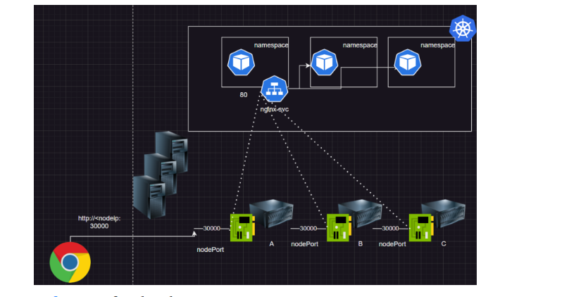

* **Example:**

   ``` 
   So I have mentioned in the service yml file type as node port so when ever I want to access the pod which is running in my worker node or cluster  I need to hit that public ip address with node port number, but this is disadvantage since I cannot issue different public ip address to users to access the pod always since public ip address 
	will be changing it frequently.
  ```

* [Refer Here](https://github.com/AjayKumarRamesh/QT-DevOps-AzureCloud-Trainings-Ajay/tree/master/Kubernetes/Examples_Yaml/service/Node-Port) for Replicaset nginx pods and nginx-svc manifest/yml files

* after using `Apply` command below screen shot:

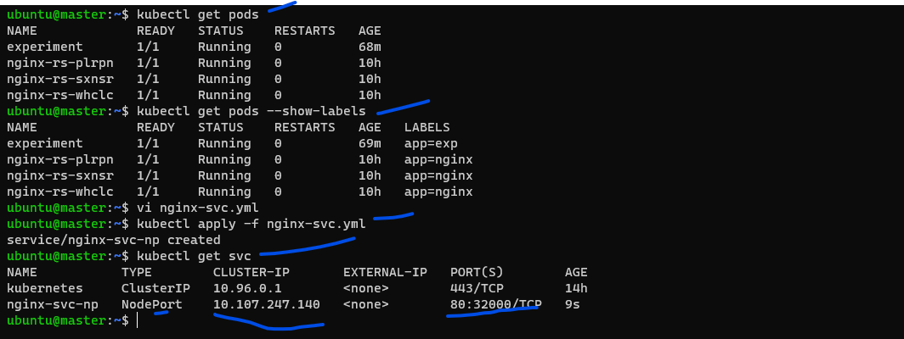

* As per above `Example` written access the pod inside that your applications using below:

`http://<NodeIP>:<NodePort>`

`http://52.226.215.202:32000`

* Refer below screen shot:

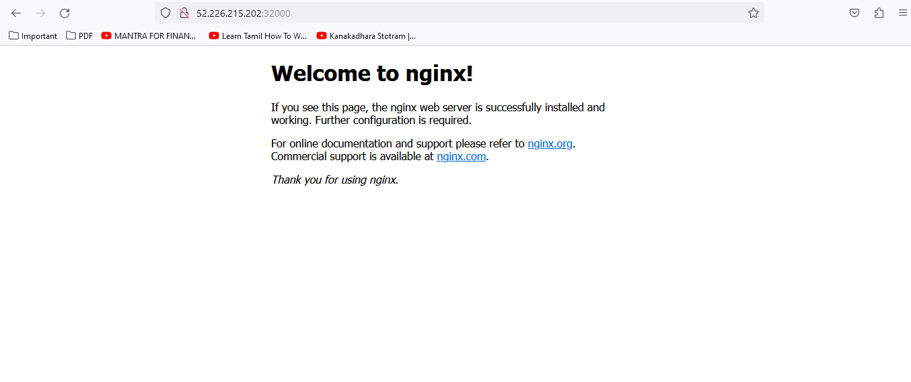


* **LoadBalancer:** 
* LoadBalancer Exposes the Service through external IP using a cloud provider's load balancer. and also its too costly. 
* Here the problem is if we have one service then we can give our load balancer or dns name created with route 53
* but if we 10 service then we needs to create 10 load balancer and 10 route 53 dns and then we needs to give to our end users which is not possible and also it not good idea/concept. 

* any cloud providers internally takes request from cloud controller manager and creates a Load Balancer and all the necessary rules to expose the service on any cloud providers Load Balancer
* after creating service using type as loadbalancer then We get the external ip which represents the ip address of the loadbalancer. 
* Now access by using 

`http://<lb-ip>:<svc-port>`

`http://20.246.194.82:32000` 


#### Lets create the nginx-rs and service and expose it using the LoadBalancer.

* [Refer Here](https://github.com/AjayKumarRamesh/QT-DevOps-AzureCloud-Trainings-Ajay/tree/master/Kubernetes/Examples_Yaml/service/Loadbalancer) for manifest/yml file of loadbalancer

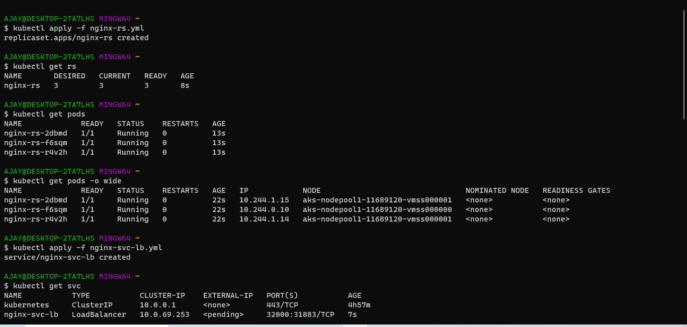

* observer below screen shot k8s has created internally call `node-port` and request forwards from `loadbalancer` to `node-port` and from there it will forwards to `svc-port` and from it will reach to pods to access our applications
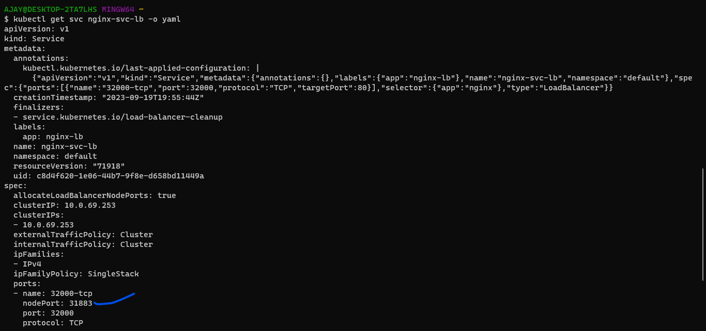
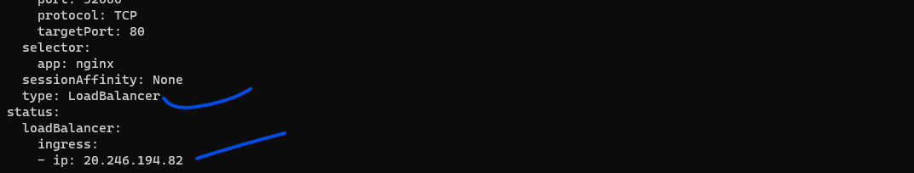
* Now access by using  `http://<lb-ip>:<svc-port>`
`http://20.246.194.82:32000/` 

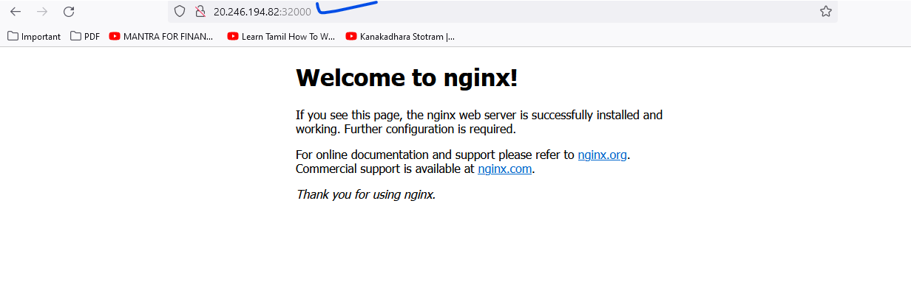

* **External Name:** 

* The ExternalName service type is a special kind of service that doesn’t have selectors and doesn’t define any endpoints, and doesn't have ip address Instead, it serves as an alias for an external service. 
* An ExternalName Service in Kubernetes is useful when you have a service that is running outside your Kubernetes cluster, such as a database, and you want to access it from within your cluster.
* Type external name creates a CNAME DNS entry to point to an external DNS service
* A record: means a record will create to connect a external service name to ip addres
* CName record: means it will create alias to connect external service eg:- nginx-example.com  
* when ever we use service type is external name means a cname record will create and that request  will forward to service and if we want such kind of service then needs to add our alias in the dns server. 

* **This serves two purposes:**
  * It creates a single endpoint for all communications to that element/external service.
  * In case that element/external service needs to be replaced, it’s easier to switch by just modifying the ExternalName, in service manifest instead of changing all connections.

### Lets create pod manifest and service manifest using service type as `ExternalName`

* [Refer Here](https://github.com/AjayKumarRamesh/QT-DevOps-AzureCloud-Trainings-Ajay/tree/master/Kubernetes/Examples_Yaml/service/ExternalName) for external name service manifest/yml files 

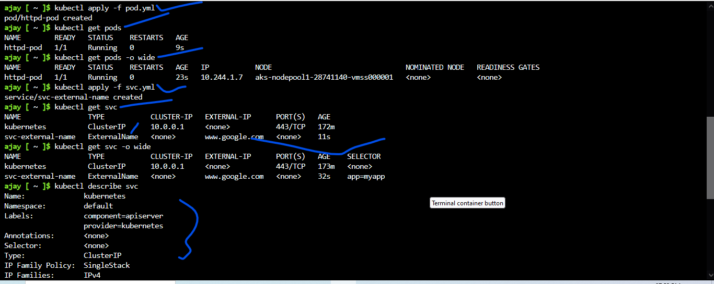
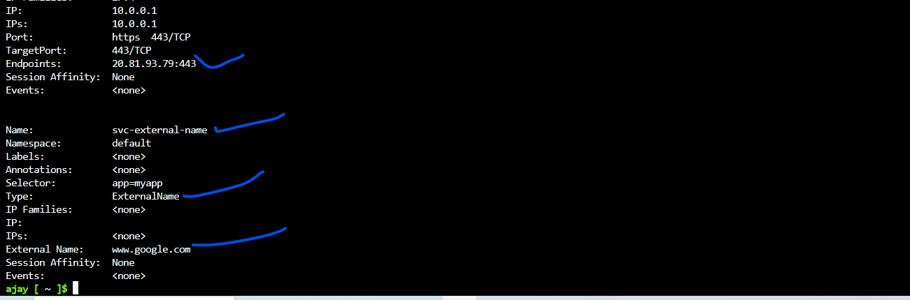
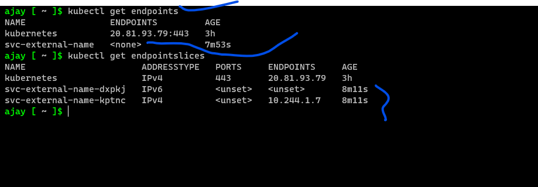

#### Service with external name
```
---
apiVersion: v1
kind: Service
metadata:
  name: nginx-svc-external
  labels:
    app: nginx
    purpose: svcdemo
spec:
  type: ExternalName
  externalName: nginx.qt.com
  selector:
    app: nginx
```

* **None/HeadLess Service:** 
* [Refer Here](https://kubernetes.io/docs/concepts/services-networking/service/#headless-services)
* What is service type none, means it is nothing
* Headless service is know as service type none, means in service meanifest file we will mention service type is cluster ip and cluster ip is none that means for this service there is no cluster ip address, this is know as headless service. 
* headless service or service type none is useful in stateful set application to access by its naming.
* * what is headless service.? 
  * headless service means in  k8s service which does not have cluster ip address means none is known as headless service
* what is the advantage of headless service or service type is none.?
  *  using headless service i can access the particular/individual  pods by its naming `<pod_name.<svc_name>` 

#### Example of Headless Service/None:
* [Refer Here](https://github.com/AjayKumarRamesh/QT-DevOps-AzureCloud-Trainings-Ajay/tree/master/Kubernetes/Examples_Yaml/service/Headless-None) for headless/none manifest/yml files
* Headless service will not have cluster ip:
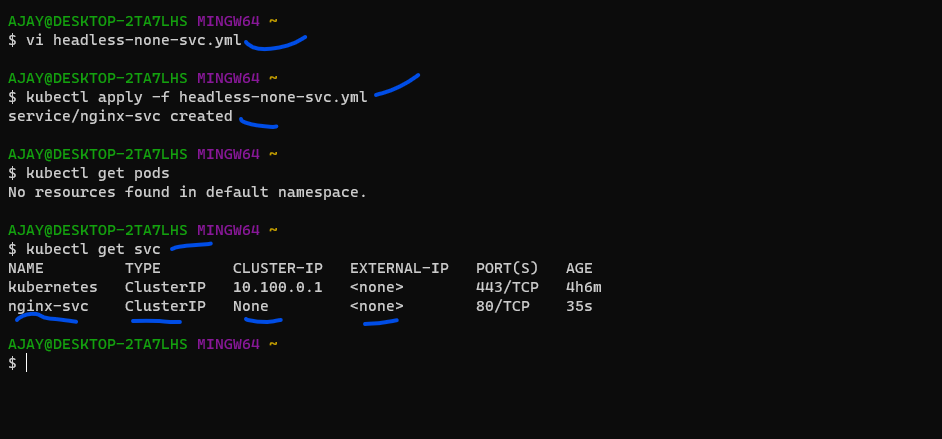
* Headless service returns the ips of the pods returned by selector.
* This is used in stateful sets


## Adding Environment variable to Pod(spec):
* writing a ReplicaSet for pod which is having environment variable inside the container
* [Refer Here](https://github.com/AjayKumarRamesh/QT-DevOps-AzureCloud-Trainings-Ajay/blob/master/Kubernetes/Examples_Yaml/Env-variables/env-vari-rs.yml) for env manifest/yml file

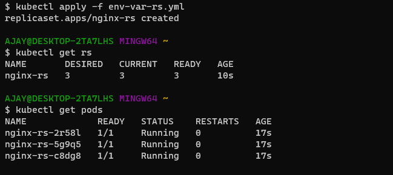
* we can see env define in the pod spec inside the container below screen shot.
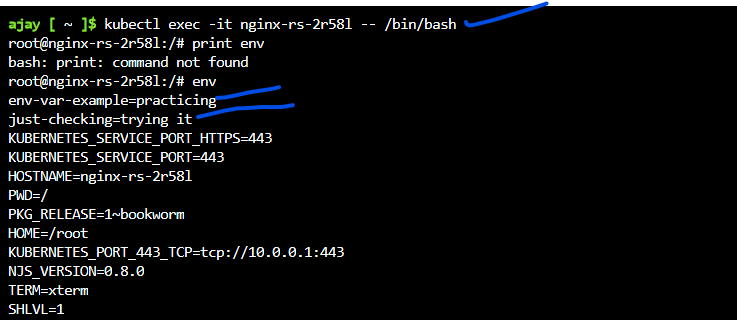


### Deployment: 
  * This enables performing zero downtime deployments with features to rollout a new version and undo rollout old version.
  * A Deployment provides declarative updates for Pods and ReplicaSets
  * It allows users to declare the desired state and the controller will change the desired state to the actual state.
  * it gives options to rollout to new version of applications and undo rollout to previous versions of applications with zero downtime
  * it gives options to scale up or scale down the replicas of pod
  * In deployment default strategy is Rolling Update

  * [Refer Here](https://kubernetes.io/docs/concepts/workloads/controllers/deployment/) for official documents

#### Overview  
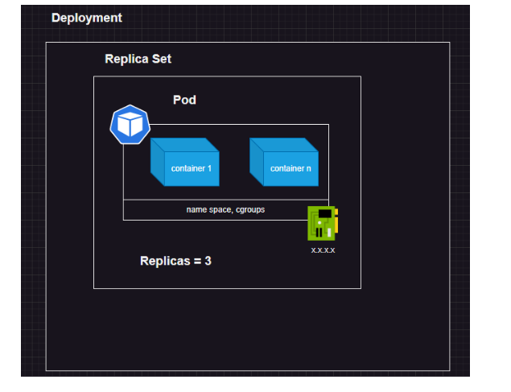
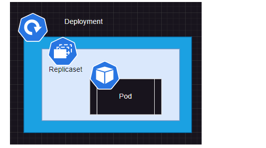
* Deployment is a workload which creates
  * Replica Sets: These create
     * Pods: Which inturn creates
        * Containers: This is where the application runs
        

### Types Of Deployment Strategy:

* **Rolling Update:**
  * rolling deployment means replaces pods running the old version of the application with the new version of the applications one by one without downtime.
  * it will destroy our pods simultaneously one by one 
  * Rolling deployments are the default strategy in K8S
  * there is no down time for our applications

#### Lets create a k8s manifest for deployment and service of an application nopCommerce:
* Lets create with 4 replicas and a service exposed via loadbalancer

The image will be `ajaykumarramesh/ajaykumar:nopcommerce-2.0` from docker hub 

* [Refer Here](https://github.com/AjayKumarRamesh/QT-DevOps-AzureCloud-Trainings-Ajay/tree/master/Kubernetes/Examples_Yaml/Deployments/Rolling-Update) for deployment and service manifest/yml  files

#### Apply the deployment and check the objects:
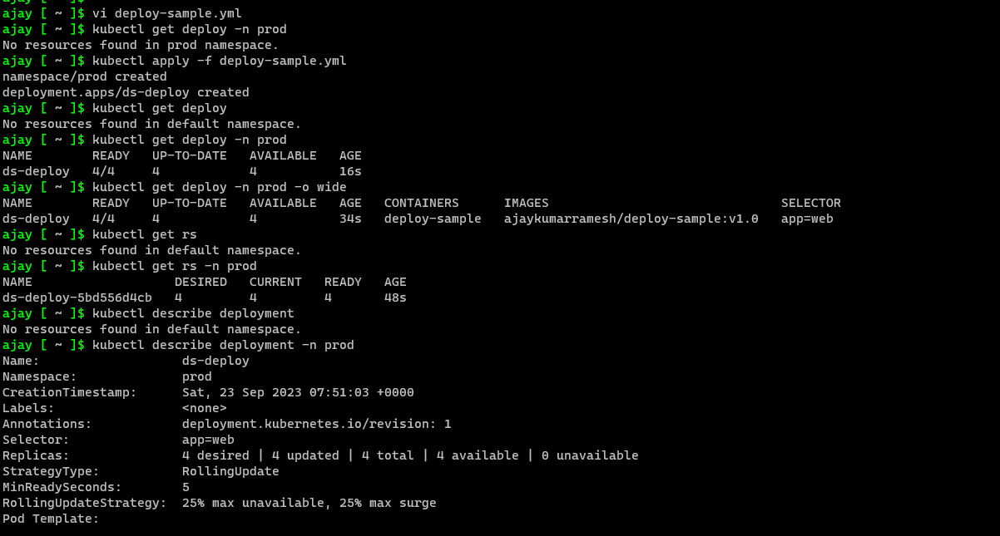
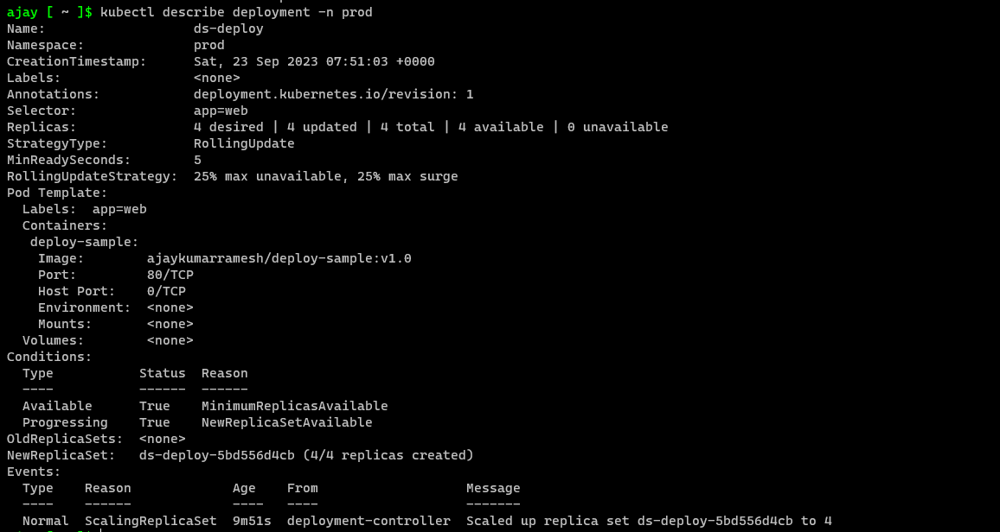
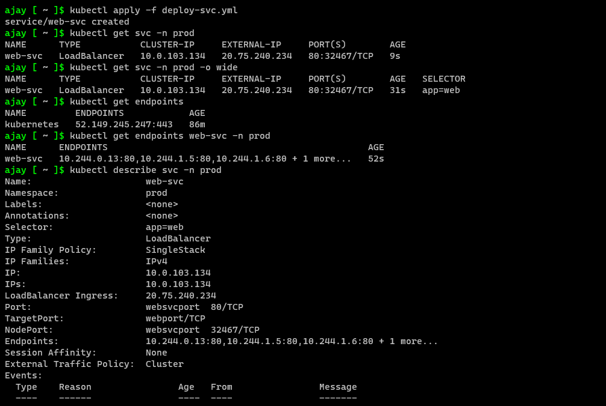
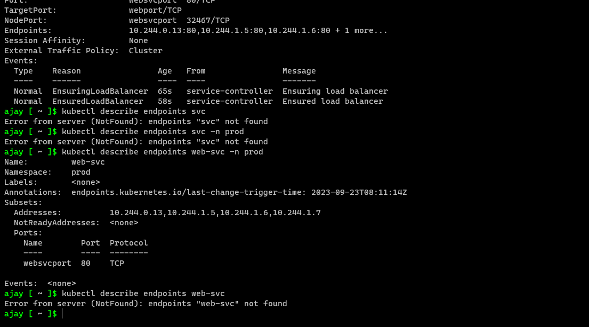
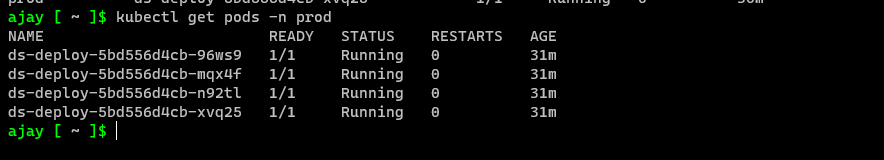


#### Experiment for Rolling Update:
* creating three new app with different version and color using dockerfile and index.html file:
* Steps: 1
  * needs to install docker on ec2 machine
  * create dockerfile with three different version of index.html file background color to show the experiment 
  * [Refer Here](https://github.com/AjayKumarRamesh/QT-DevOps-AzureCloud-Trainings-Ajay/tree/master/Kubernetes/Examples_Yaml/Deployments/Rolling-Update/deploy-sample) for Dockerfile and index.html file
* Step: 2
  * creating docker image for step:1 dockerfile and index.html file
  * create repository in docker hub `deploy-sample` the repository name will be `ajaykumarramesh/deploy-sample`
  * [Refer Here](https://www.w3schools.com/html/tryit.asp?filename=tryhtml_styles_background-color) for html background color
  * [Refer Here](https://www.docker.com/blog/how-to-use-the-official-nginx-docker-image/) for nginx html image 
  * Follow below steps to create docker image for version v1.0:
```
# paste the above Dockerfile content
vi Dockerfile
# paste the above index.html content
vi index.html
docker image build -t ajaykumarramesh/deploy-sample:v1.0 .
docker images
docker container run -d --name version-v1.0 -P ajaykumarramesh/deploy-sample:v1.0
 docker container ls
# access the application and check
http://ipaddress:portfarwarding
http://54.185.5.241:32768/ 
# to push image into docker repository
docker login
username
password
docker push ajaykumarramesh/deploy-sample:v1.0
```
* For version v2.0 needs to change the content in index.html file like version and color but dockerfile remains same refer below for example

```
<!DOCTYPE html>
<html>
<body style="background-color:blue;">
<h1>Version v2.0</h1>
</body>
</html>
```
* Follow below steps to create docker image version v2.0

```
# paste the above Dockerfile content
vi Dockerfile
# paste the above index.html content
> index.html
vi index.html
docker image build -t ajaykumarramesh/deploy-sample:v2.0 .
docker images
docker container run -d --name version-v2.0 -P ajaykumarramesh/deploy-sample:v2.0
 docker container ls
# access the application and check
http://ipaddress:portfarwarding
http://54.185.5.241:32769/ 
# to push image into docker repository
docker login
username
password
docker push ajaykumarramesh/deploy-sample:v2.0
```

* For version v3.0 needs to change the content in index.html file like version and color but dockerfile remains same refer below for example

```
<!DOCTYPE html>
<html>
<body style="background-color:yellow;">
<h1>Version v3.0</h1>
</body>
</html>
```
* * Follow below steps to create docker image version v3.0

```
# paste the above Dockerfile content
vi Dockerfile
# paste the above index.html content
> index.html
vi index.html
docker image build -t ajaykumarramesh/deploy-sample:v3.0 .
docker images
docker container run -d --name version-v3.0 -P ajaykumarramesh/deploy-sample:v3.0
 docker container ls
# access the application and check
http://ipaddress:portfarwarding
http://54.185.5.241:32770/
# to push image into docker repository
docker login
username
password
docker push ajaykumarramesh/deploy-sample:v3.0
```
#### Performing Rolling updates and Rollback using Deployments and service with three different version of an applications: 

* set the current namespace to prod command below:
`kubectl config set-context --current --namespace=prod`

* After applying the deployment and service:

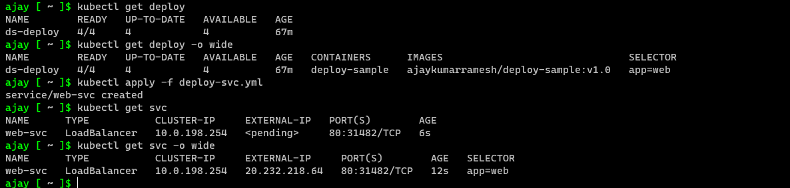

* Now Access the Application:

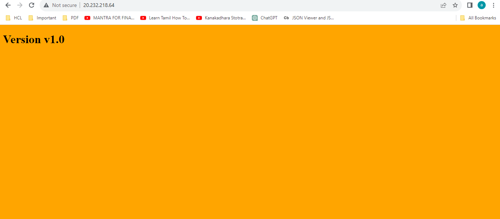

* To check rollout status and history:

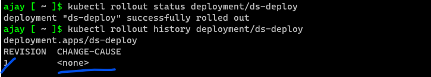

* Here is to notice that `Revision is - 1` but `Change-Cause is - none` because we dint had `annotation` in our deployment.yml file, we can do that below to have record for us what was the change cause and why and when we did that.

#### Annotation:
* [Refer Here](https://kubernetes.io/docs/concepts/overview/working-with-objects/annotations/) for official document
* [Refer Here](https://medium.com/@sangjinn/kubernetes-annotations-e61b19effdf9#:~:text=Annotations%20in%20Kubernetes%20(K8s)%20are,metadata%20or%20provide%20additional%20information.) for other author document 
* We will be adding an annotation to our deployment.yml file which we return above/earlier to see difference in the `change cause`
* Annotations in Kubernetes (K8s) are metadata used to express additional information related to a resource or object.
* Annotations consist of key-value pairs, each pair used to describe the resource’s metadata or provide additional information. For example, it can be used to record a resource’s creator, version, change history, relationship to a particular component, and so on.
* Annotation is used for external tool or any other tool.
* [Refer Here](https://github.com/AjayKumarRamesh/QT-DevOps-AzureCloud-Trainings-Ajay/blob/master/Kubernetes/Examples_Yaml/Deployments/Rolling-Update/deploy-sample.yaml) for annotation code change in deployment manifest/yml file 

* apply the deployment by adding annotation and image v2.0 creation:

* after applying the deployment app version v2.0 the app screen has changed

`kubectl rollout status deployment/ds-deploy`

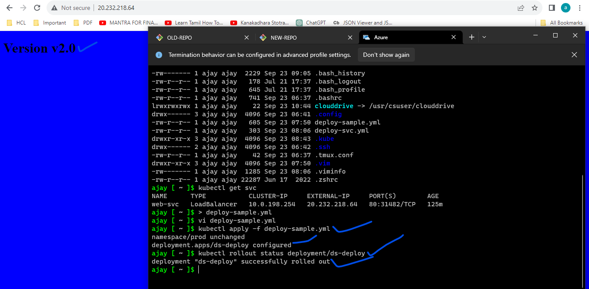

* Now observe below after adding the annoataion change cause is getting some value

`kubectl rollout history deployment/ds-deploy`

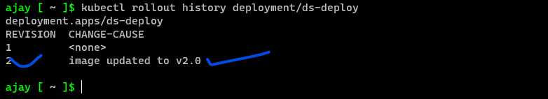

* Lets check detailed rollout history

`kubectl rollout history deployment/ds-deploy --revision=3`

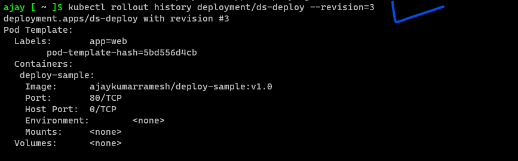


* Lets rollback previous version:

`kubectl rollout undo deployment/ds-deploy`
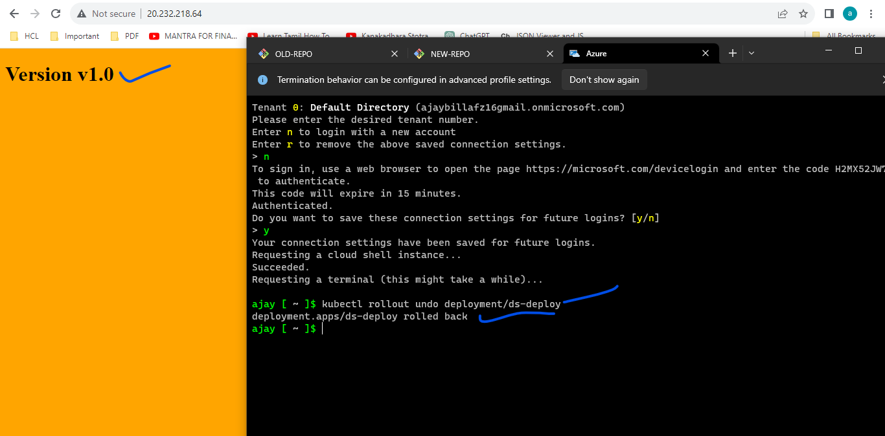

* Lets rollback to specific version:

`kubectl rollout undo deployment/ds-deploy --to-revision=1`

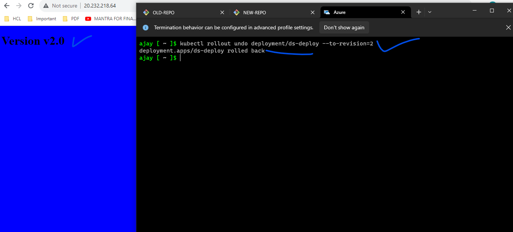

* Lets scale the deployment of replicas=6:

`kubectl scale deployment/ds-deploy --replicas=6`

* before it was 4 replicas now after we scaled it. it become 6 replicas below screen shot:

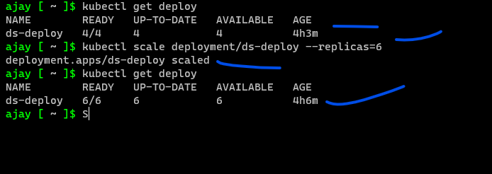
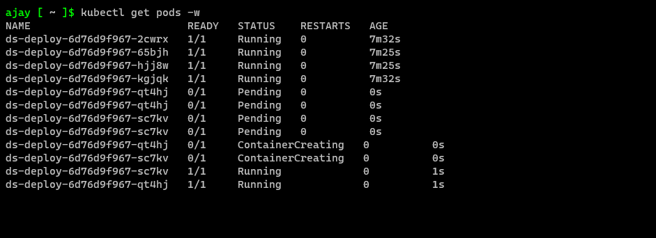
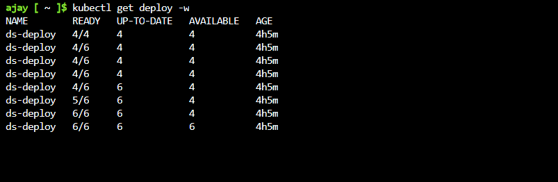

* Lets enable horizontal auto pod scaling:

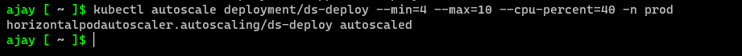

* Lets see Rollout Pause of deployment
  * after i run command below i am unable to rollout undo or specific version of deployment below screen shot proves it.

  `kubectl rollout pause deployment/ds-deploy`

  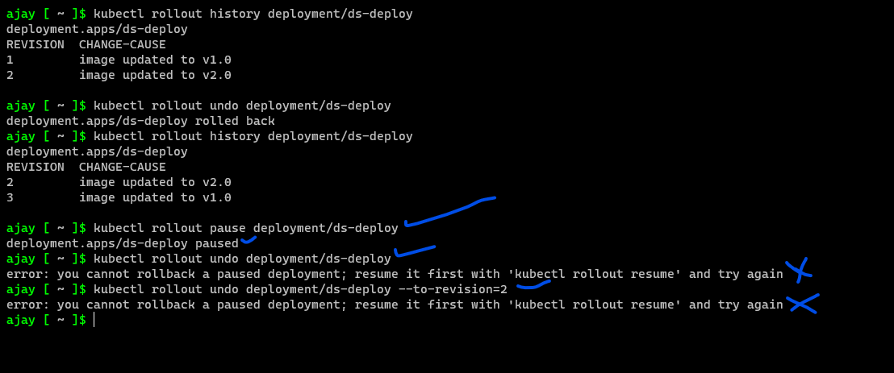

* After resume the rollout deployment i am able to rollout to undo or specific version below screen shot proves it.

` kubectl rollout resume deployment/ds-deploy`


* When we run pause command for deployment only the below commands works to update the image version nor other command work
* proves below screen shots:

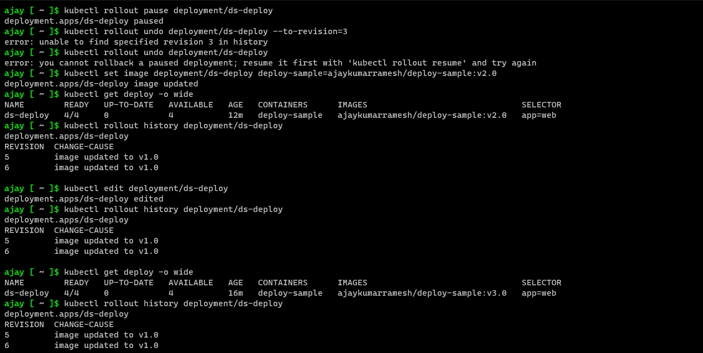

* **Recreate:**
  * Recreate means for an example we have 4 apps running in our environment.it will destroy at a time all 4 apps and it will recreate new apps with new version at a time so here we will have some down time for our application.
  * this strategy is useful when we have business hours like 24/5 so since weekends users doesn't 
use the application and also some applications required to restart while getting update with new version of applications, so in this case this recreate strategy is useful.
  * You have the ability to schedule planned maintenance during off times (for example, during the weekend for an application only accessed during business hours). 
  * A recreate deployment lets you shut down all the pods has  previous version of applications and only then start the new pods with new version of applications.
  * in the recreate strategy we down time for our applications 

#### Example Deployment Recreate Strategy:
* Lets create deployment and service for recreate strategy manifest/yml
* [Refer Here](https://github.com/AjayKumarRamesh/QT-DevOps-AzureCloud-Trainings-Ajay/tree/master/Kubernetes/Examples_Yaml/Deployments/Recreate)

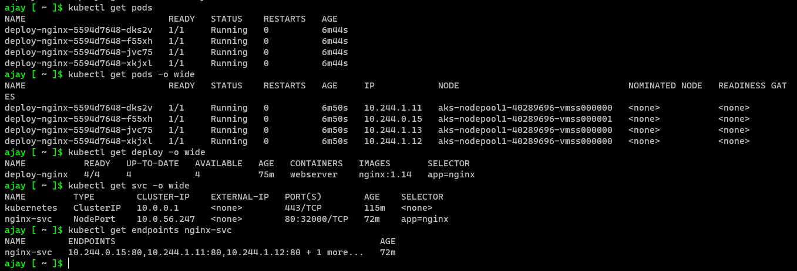

* After editing/updating the image new version recreate strategy will work terminate all the pods with older version and recreating the pods with newer version all at once refer below screen shots:

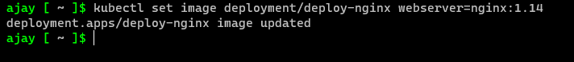
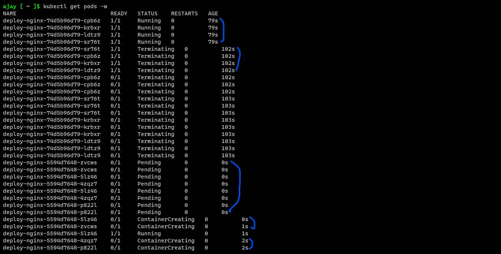
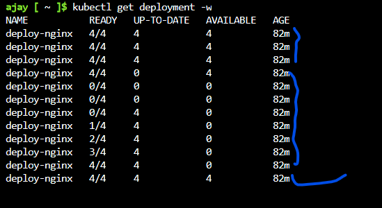


* **Blue/Green:**
  * Examples for blue/green has not done since not so important if required we can refer to google and do the task.

  * Blue/Green means consider Blue as a old version of an applications and Green is a new version of applications
  * Initially, a service routes all traffic to the ‘Blue’ version of an application
  * Once the ‘Green’ version of an applications is ready and tested, update the service to route traffic to the ‘Green’ version of an application 
  * If any issues arise, while deploying new version of an applications 'green' we can switch/rollback the service back to point to the ‘Blue’ version of an applications.
  * since the old blue version of an applications will be alive until we decommission
  * Then, we can keep the blue deployment for a future rollback or decommission it. 
  * By using labels and selectors in Kubernetes easily we can switch the service traffic between two deployments
  * here we will have some down time for an applications while switching the the service traffic between two deployments

#### Example of Blue/Green deployments with service manifest/yml file below:

* [Refer Here](https://auth0.com/blog/deployment-strategies-in-kubernetes/) for blue/green deployment steps

* Deployment manifest/yml file for Blue version of an applications:

```
kind: Deployment
metadata:
  name: web-app-01
spec:
  template:
    metadata:
      labels:
        app: web-app
        version: "v1.0.0"
```
* Service manifest/yml file for Blue version of an applications:

```
kind: Service
metadata:
  name: web-app-01
    labels:
      app: web-app
    selector:
      app: web-app
      version: v1.0.0
```

* Deployment manifest/yml file for Green version of an applications:

```
kind: Deployment
metadata:
  name: web-app-02
spec:
  template:
    metadata:
      labels:
        app: web-app
        version: "v2.0.0 
```

* Service manifest/yml file for Green version of an applications:

```
kind: Service
metadata:
  name: web-app-02
    labels:
      app: web-app
    selector:
      app: web-app
      version: v2.0.0
```

* **Canary Deployment:**
  * Canary Deployment means testing some new features or releasing new version of an applications for the users
  * Two or more services or versions of an application are deployed in parallel
  *  one running an existing version of an applications , and another one with adding new features version of an applications
  * now enabling the new version of an applications for testing with small subset of users, If no errors are reported, then new versions of an applications can be gradually deployed to all users or roll out to the rest of the infrastructure. 
  * here there is no downtime but not sure we have not done it. 

* **These Below not so important:**
    * **A/B Testing/Dark deployments:**  
    * **Shadow Deployment:** 
    * **Ramped slow rollout:**
    * **Best-effort controlled rollout:**
* So i have not done the experiment to it. 
---

## Health Checks/Probes for container in Kubernetes Pods:

* [Refer Here](https://kubernetes.io/docs/tasks/configure-pod-container/configure-liveness-readiness-startup-probes/) for official docs

### K8s supports 3 kinds of Health checks/Probes:

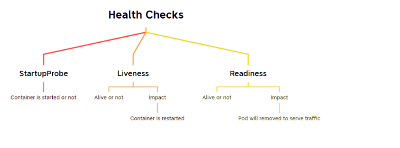

* [Refer Here](https://kubernetes.io/docs/concepts/workloads/pods/pod-lifecycle/#container-probes) for probes

* **Liveness probe:**
   * checks is application is running or not. 
     * **Impact:** 
        * if its not running then it will restart the container
   * if this check fails kubernetes will restart the container.

* **Readiness probe:**
    * checks is application is running or not.
      * **Impact:**
          * if its not running then it will stop service sending a request/traffic to that pod.
   * if this check fails the pod will be removed from service (pod will not get requests from service)

* **Startup probe:**
   * it will check is container is started or not.
   * This checks for startup and until startup is ok/fine, the other checks will be paused.

### Types of Probes/checks can be performed by:

* **exec:** 
  * we can run any linux/windows command in which returns status code `0` is success and status code exit `1` or non zero is unsuccess.

  * http: we send http request to the application. based on status codes `200` indicate whether a specific `http` is success or not we can decide.
  * how this will happen we are sending http request to our application/container port so when we receive the response then it is success or failure
  * [Refer Here](https://developer.mozilla.org/en-US/docs/Web/HTTP/Status)

* **grpc:** 
    * This communicates over grpc based on the our application implementation

* **tcp:** 
  * With this tcp configuration, the kubelet will attempt to open a socket to your container on the specified port. If it can establish a connection, the container is considered healthy, if it can't it is considered a failure.
  * this happens through sending tcp request 

# Lets write Startup, liveness, readiness probes in the deployment spec:
* Probes are written as part of container spec in the deployment manifest file.

* [REfer Here](https://github.com/AjayKumarRamesh/QT-DevOps-AzureCloud-Trainings-Ajay/blob/master/Kubernetes/Examples_Yaml/Deployments/Rolling-Update/deploy-sample.yaml) for startup,liveness,readiness manifest/yml file 

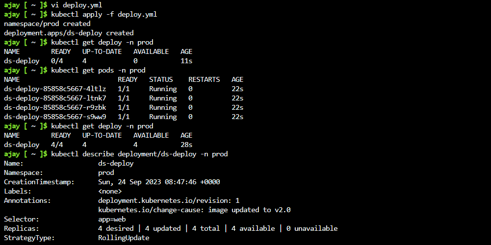
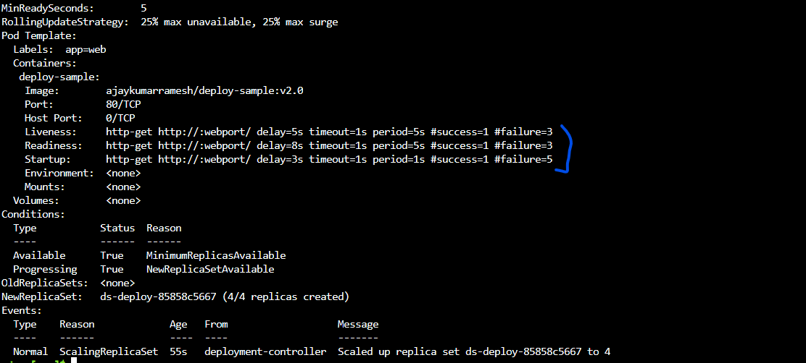


### ConfigMap:

* A ConfigMap is an API object used to store non-confidential or non sensitive data in key-value pairs.
* A ConfigMap stores data in a plain text formate 
* A ConfigMap stores configuration settings for your code. Store connection strings, public credentials, hostnames, and URLs in your ConfigMap.
* Why we are using ConfigMap because while configuration settings may change. but application code doesn't change. This is where ConfigMaps come in.  to keep your application code separate from your configuration for the specific environment.
* ConfigMaps allow you to decouple environment-specific configurations from containers to make applications portable
* ConfigMaps are not encrypted in any way, and all data they contain is visible to anyone who can access the file.
* ConfigMap are not suitable for confidential data storage.

* For Example:
   * we have some java applications so for that we have app.properties file so for this app.properties files we will keep configmaps
so each time we add some new configuration to our java application or for each new build for our java applications , our configuration 
files will have some changes that changes will take place by default through configmaps to our applications

* we can store our applications config files in docker image in the docker file but when we want to change some config files then we have to rebuild the image every time this is not good concept. 

*  we can even store our application config files  in the pod by giving environment variables but when ever we have to change our application configuration files then we need to delete old pod and re-create new pod so this is not possible or good concept

* [Refer Here](https://kubernetes.io/docs/concepts/configuration/configmap/) for official docs


* **Pods can consume ConfigMaps in Four Ways or usage of ConfigMap to configure a container inside a Pod:**
* **EX: 1**
  * Inside a container command and args
  * Environment variables for a container
  * Add a file in read-only volume, for the application to read
  * Write code to run inside the Pod that uses the Kubernetes API to read a ConfigMap

* **Commandline to create ConfigMaps from directories, files, or literal values:**
* **EX: 2**
  * Set the contents of an entire directory with:

   `kubectl create configmap my-config --from-file=./my/dir/path/`

  * Use the contents of a file or specific set of files with:
  
   `kubectl create configmap my-config --from-file=./my/file.txt`

  * Use literal key-value pairs defined on the command line with:

   `kubectl create configmap my-config --from-literal=key1=value1 --from-literal=key2=value2`

  * information about this command using:
 
  `kubectl create configmap --help`

* For EX:1 and EX:2 Refer Here Below official documents k8s:
   * [Refer Here](https://kubernetes.io/docs/tasks/configure-pod-container/configure-pod-configmap/)

### Overview for below:
* Environmental Variable
* Volume mounted to some folder

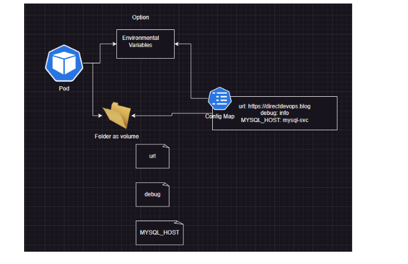

#### Example ConfigMap:
* Lets create configmap with pod:
* Example of Environmental Variable:
* [Refer Here](https://github.com/AjayKumarRamesh/QT-DevOps-AzureCloud-Trainings-Ajay/tree/master/Kubernetes/Examples_Yaml/ConfigMap) for configmap and pod manifest/yml

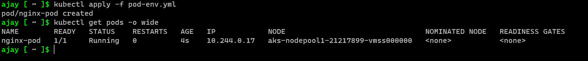
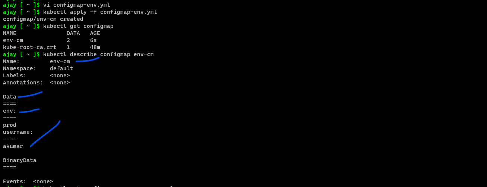
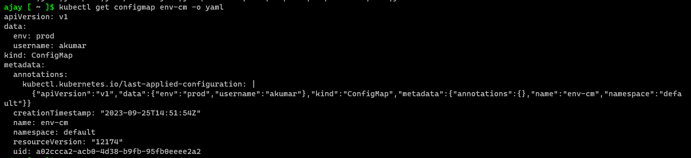
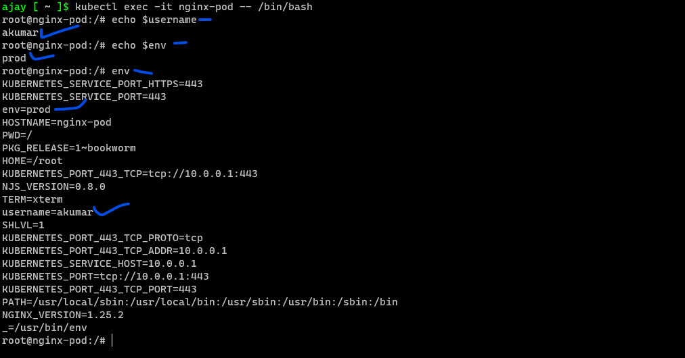

* [Refer Here](https://github.com/AjayKumarRamesh/QT-DevOps-AzureCloud-Trainings-Ajay/tree/master/Kubernetes/Examples_Yaml/ConfigMap) for configmap and pod manifest/yml

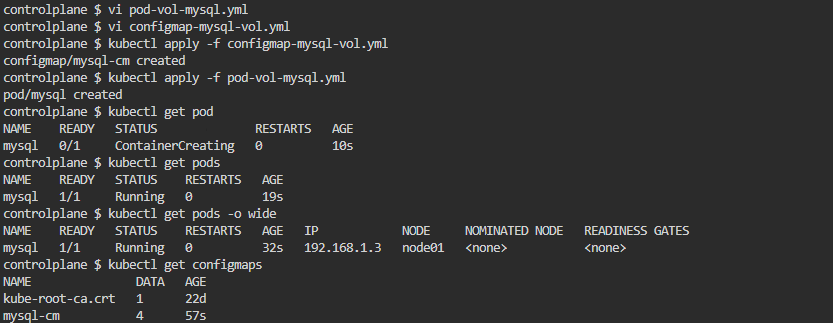
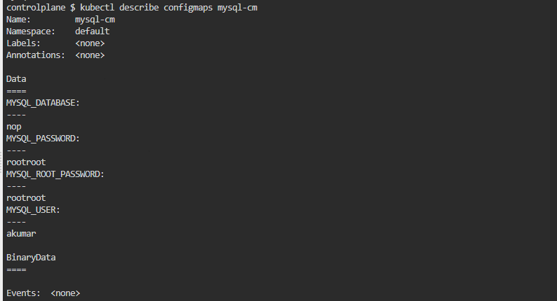
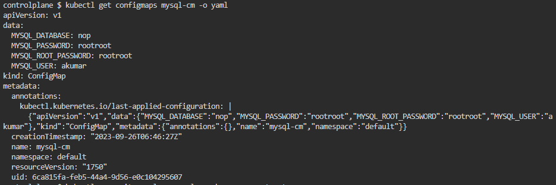
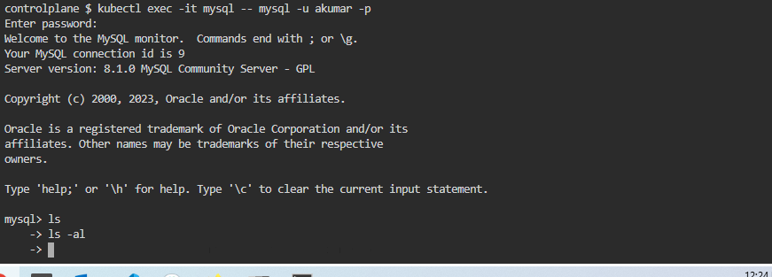


* Lets create configmap with pod:
* Example of Volume mounted to some folder:
* [Refer Here](https://github.com/AjayKumarRamesh/QT-DevOps-AzureCloud-Trainings-Ajay/tree/master/Kubernetes/Examples_Yaml/ConfigMap) for configmap and pod manifest/yml file

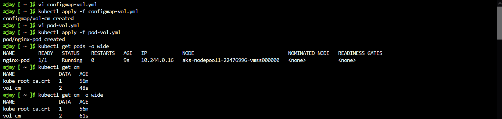
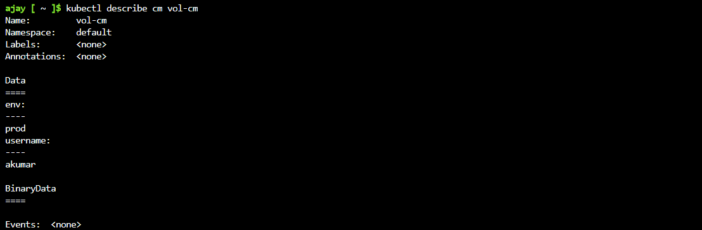
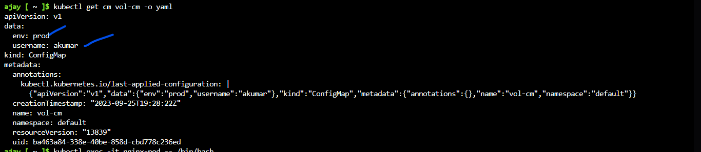


### Secrets:

* [Refer Here](https://kubernetes.io/docs/concepts/configuration/secret/) for official docs

* More about Secret types [Refer Here](https://kubernetes.io/docs/concepts/configuration/secret/#secret-types)

* [Refer Here](https://faun.pub/secrets-kubernetes-298ea8dd9911) very detailed explaination refer only this it is good.

* Secrets is to store sensitive data like `passwords`, `certificates`, `tokens` `ssh keys` and  `API keys`
* `Opaque` is the default Secret type
* The values for all keys in the data field have to be base64-encoded strings.

```
Encoding —
echo -n "admin@123" | base64
Decoding -
echo -n "cGFzc3dvcmQ" | base64 --decode
```
* Base64 URL [Refer Here](https://www.base64decode.org/)

* Secrets can specify the data and/or the stringData field. reason is:
   * in the secret `Data` specifying should be encoded before specifying it.
   * in the `stingdData` not required to encode since by default it will encode for us, but problem is we have to specify the data as it is, even all the credentials so if someone looks our yml file they will come to know all credentials.

#### Example Secrets:
* Lets create configmap with pod:
* Example of Environmental Variable:

* [Refer Here](https://github.com/AjayKumarRamesh/QT-DevOps-AzureCloud-Trainings-Ajay/tree/master/Kubernetes/Examples_Yaml/Secrets) for pod and secrets manifest/yml file


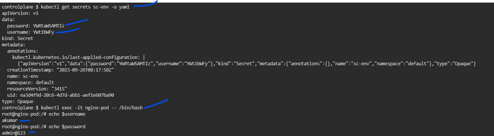
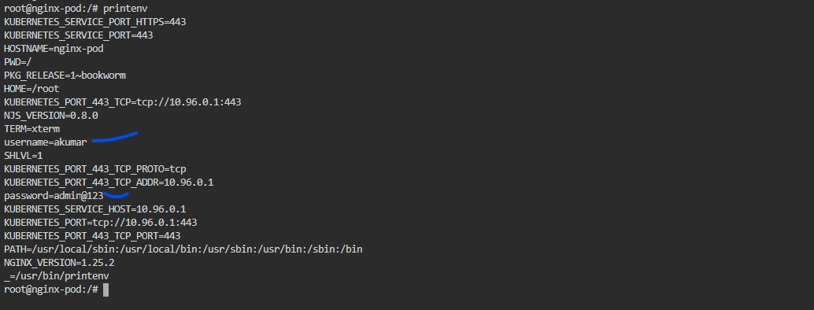

* Lets create configmap with pod:
* Example of Volume mounted to some folder:

* [Refer Here](https://github.com/AjayKumarRamesh/QT-DevOps-AzureCloud-Trainings-Ajay/tree/master/Kubernetes/Examples_Yaml/Secrets) for pod and secrets manifest/yml file

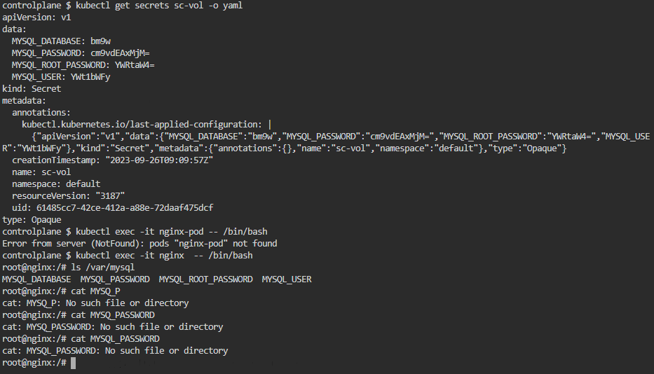


### External Secrets in Kubernetes:

* Kubernetes External Secrets store information outside the Kubernetes cluster while still allowing Kubernetes resources to use them.
* They are stored in an external service that Kubernetes interacts with to read and write secrets.
* Kubernetes External Secrets allow you to use different storage backends for your secrets.
  * HashiCorp Vault
  * AWS Secrets Manager 
  * Google Secrets Manager 
  * Azure Key Vault 
  * IBM Cloud Secrets Manager 
  * Akeyless
  * CyberArk Conjur and many more etc:

* To use Kubernetes External Secrets, you must configure an external secrets backend and create a Kubernetes Secret object that points to the external backend. Kubernetes will then interact with the secret backend to read and write the secrets.


#### AWS Secret Manager:

* To create secret manager and configure with kubernetes just google it or youtube will be best.   

#### Azure Key Vault:

* To create azure key vault and configure with kubernetes just google it or watch youtube will be best.


### Kubernetes Volumes:

* Lets see what are options for storage provisioning in k8s
  * [Refer Here](https://kubernetes.io/docs/concepts/storage/) for official docus 

* **Types of volumes in kubernetes:**
* [Refer Here](https://kubernetes.io/docs/concepts/storage/volumes/) 
   * **Volumes:**
      * volumes are ephemeral like on-disk files in a container when container crashes data is lost
      * volumes is a lifetime of a pod 
      * this is for temporary purpose only for some time this will create volume  in each pod level and when pod dies we will lose this volume too. 
      * Volumes can be mounted to containers and they have lifetime equivalent to Pods. means when pods dies even volume will also die/loose
      * its like vm machine once machine delete volumes will be deleted
* **Example:**
  * we create hostpath/nodepath as volume and mount that volume to container so once pod is deleted then again pod will recreate in the different node then hostpath will change and also data will be lost.
  * below is example of manifest/yml file:

```
apiVersion: v1
kind: Pod
metadata:
  name: test-webserver
spec:
  containers:
  - name: webserver
    image: nginx:latest
    volumeMounts:
    - mountPath: /var/local/data
      name: mydir
  volumes:
  - name: mydir
    hostPath:
      path: /var/data
      type: directory
``` 

* **PersistentVolumes:**
* [Refer Here](https://kubernetes.io/docs/concepts/storage/persistent-volumes/) for official docs
   * very popular in k8s and all cloud environment is providing this option and using it
   * A PersistentVolume (PV) is a piece of storage in the cluster
   *  persistent volumes exist beyond the lifetime of a pod.
   * These volumes will have a lifetime different than Pod i.e. they exist even after pod is dead
   * PersistentVolume It is a resource in the cluster. just like a node is a cluster resource.
   * A PersistentVolumeClaim (PVC) is a request for storage by a user.
   * It is similar to a Pod. 
       * Pods consume node resources like below:
           * Pods can request specific levels of resources (CPU and Memory). and 
       * PVCs consume PV resources like below:
           * Claims can request specific size and access modes (e.g., they can be mounted ReadWriteOnce, ReadOnlyMany or ReadWriteMany)
   * PersistentVolume API object captures the details of the implementation of the storage, can be that NFS, iSCSI, or a cloud-provider-specific storage system.
   * pv is not belongs to namespace, it is belongs to cluster 
* **Kubernetes supports two volumeModes of PersistentVolumes:**
  * `Filesystem` and `Block`.
  * `Filesystem` is the default mode

* **There are Two Types Of PersistentVolumes:**
  * **Static Volumes/Provisioning:**
    * static volumes means we have to create everything like in aws `efs` in azure `azurefile` for storing the data as volume.
    * then we needs to create `PV` with `StorageClass`
    * then we needs to create `PCV` to claim that volume, with `pod spec`
    * so once that claim is done then we cannot create another `pvc` and `pod` to claim again since it is static what ever the volume amount has been used by other pod. or refer below
    * Now if we tried to create another `PVC`, it would fail because we don’t have any more `PVs` left (a PV can be bound to a single PVC) that is where dynamic provisioning would come in handy.
* Refer below about static volumes above said are from there and also there is good example we can learn
  * [Refer Here](https://aws.amazon.com/blogs/storage/persistent-storage-for-kubernetes/)

* Azure static volumes/provisoning examles, like creating azure disk and then creating pv,pvc and pod to mount that pv.
  * [Refer Here](https://learn.microsoft.com/en-us/azure/aks/azure-csi-disk-storage-provision#statically-provision-a-volume)  

* **Dynamic Volumes/Provisioning:**
 * in this example we will create storageclass and pvc and mount the volume for pod can consume it.. 
 * dynamic volumes means we will create only storageclass and pvc and pod can  claim  that storage
 * Refer below about dynamic volumes above said points from there also good examples is there to learn
   * [Refer Here](https://aws.amazon.com/blogs/storage/persistent-storage-for-kubernetes/) 

#### Azure Examples:
* Dynamic volumes/Provisioning with creating own storage:
* [Refer Here](https://github.com/AjayKumarRamesh/QT-DevOps-AzureCloud-Trainings-Ajay/tree/master/Kubernetes/Examples_Yaml/PV_Volumes/dynamic_volume_with_own_storage)

* created sc,pvc and pod to mount volume
* observe after creating pvc the status shows `pending`, once created pod and mounted that volume then status become `Bound` observe all the screen shots:

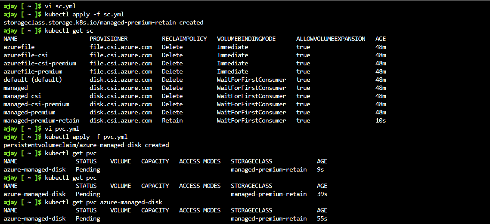
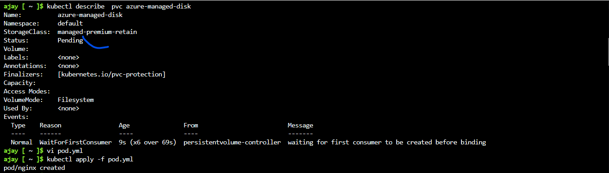
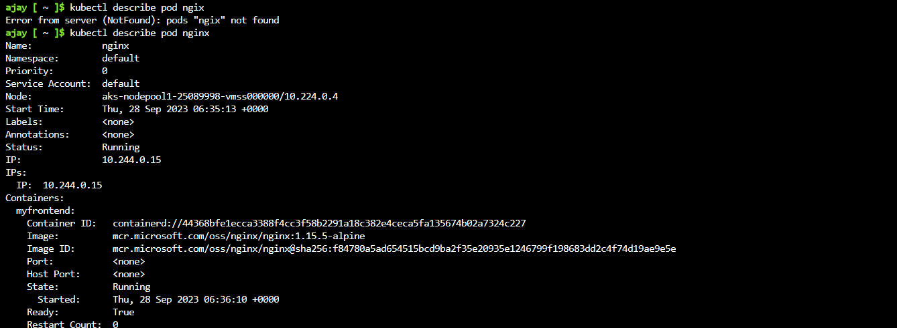
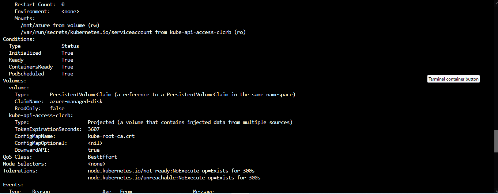
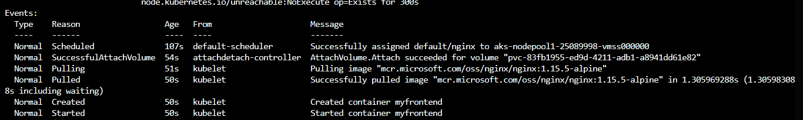
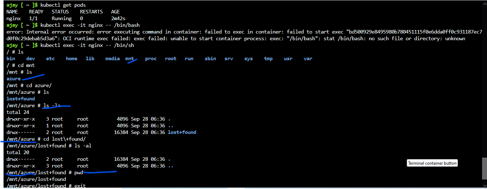
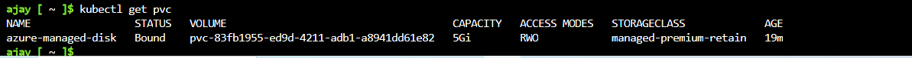

* Refer below aks cluster UI screen shot which created storage
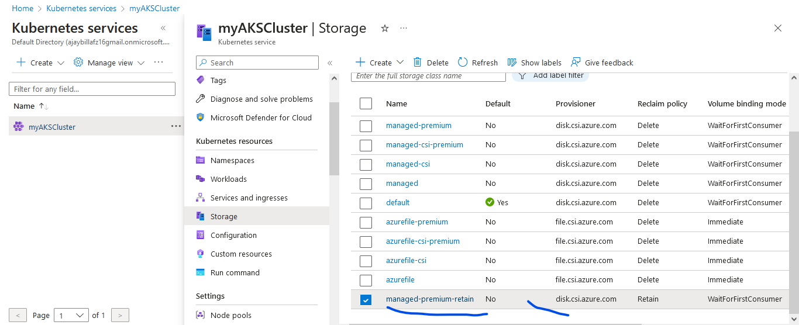
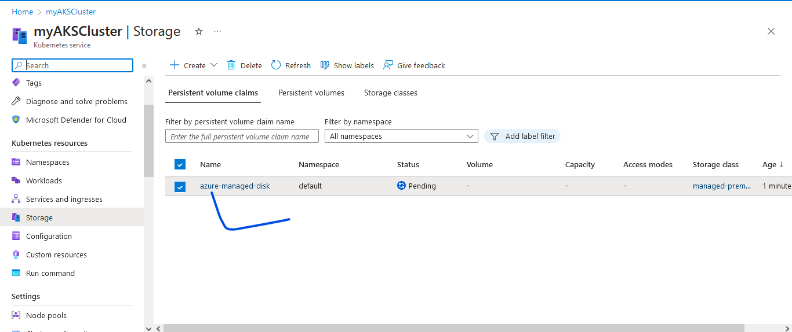

* now observe below sc and pvc is created but pv is not found why because we have not created the pod to claim that persistentvolume so pv is showing not found.
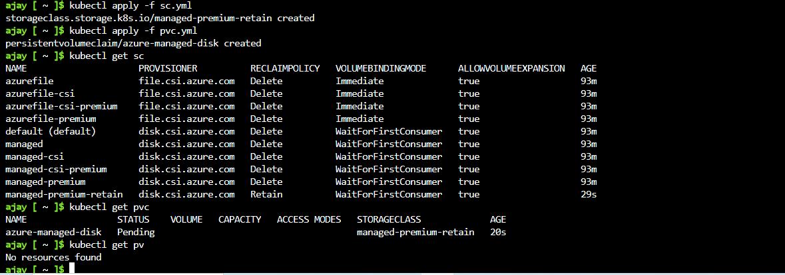
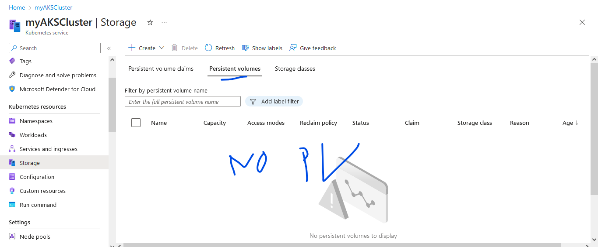

* Now observe pvc status showing `Bound` 

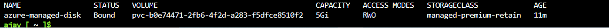
* Now observer pv is created and status showing `Bound`

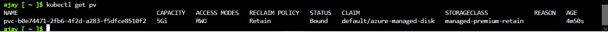

* check storageclass has created in the aks
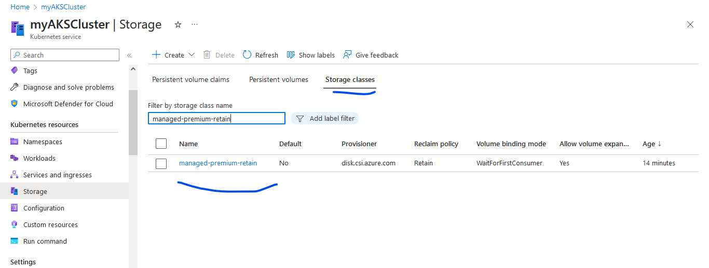
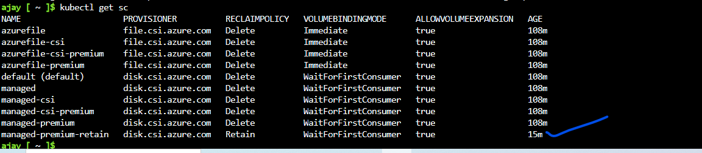

* Dynamic volumes/Provisioning with azure existing  storage, means just claiming that existing storage of azure by creating pvc, and pod to claim that volume(pv).

* [Refer Here](https://github.com/AjayKumarRamesh/QT-DevOps-AzureCloud-Trainings-Ajay/tree/master/Kubernetes/Examples_Yaml/PV_Volumes/dynamic_volume_with_exsiting_storage)

* after apply pvc below status
* please note pvc status shows `pending` since still we have not created pod to claim that pv 
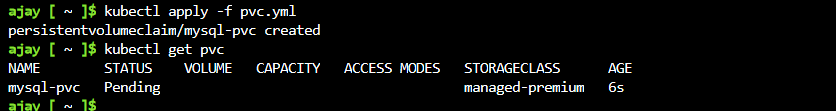
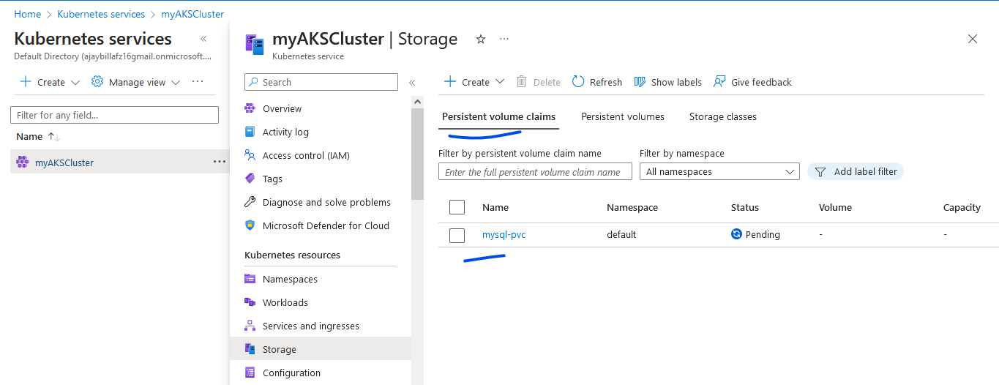
* applied secrets manifest this is because we need environment variable to access our database
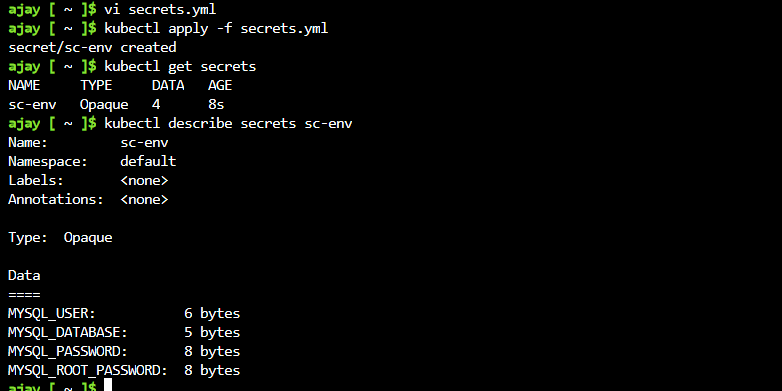
* Now lets apply pod to claim that pv
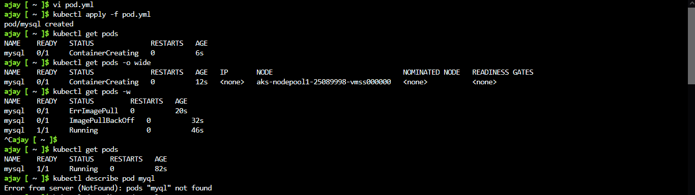
* when i describe the pod shows mount path 
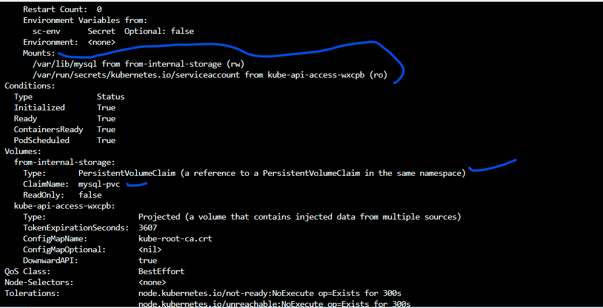
* Now check pvc status shows `bond` and other details shows because we have created the pod to claim that pv
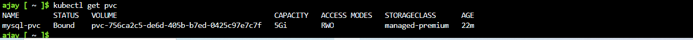
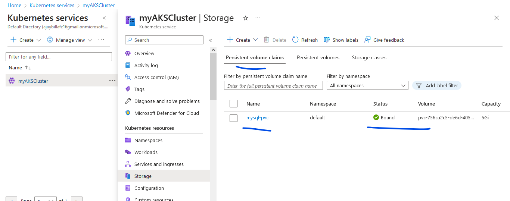
* Now check pv is also created after pod is created that claimed that pv
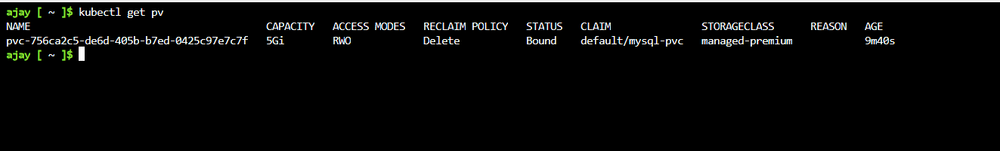
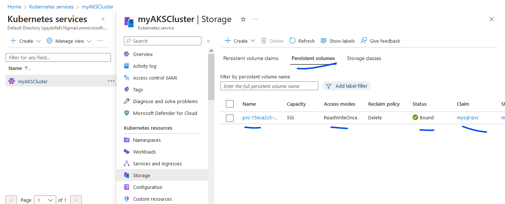
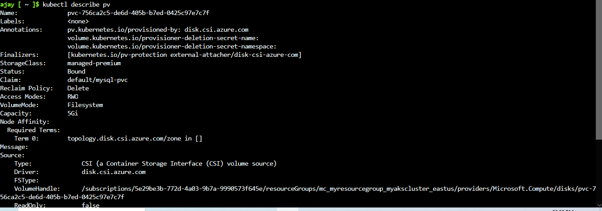
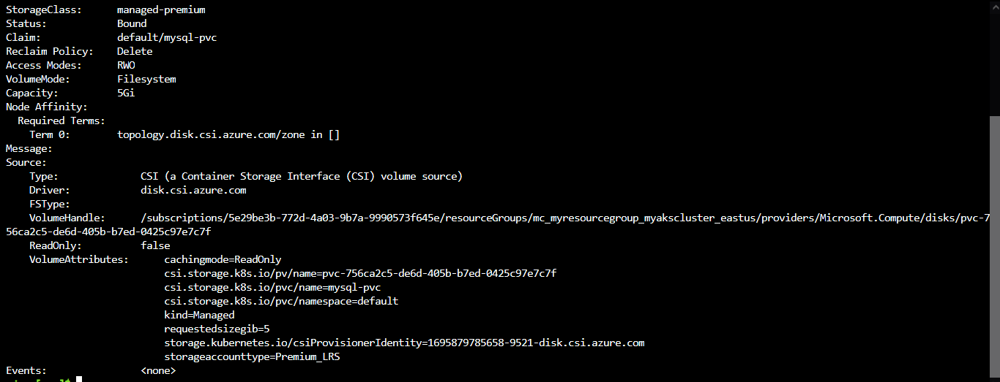
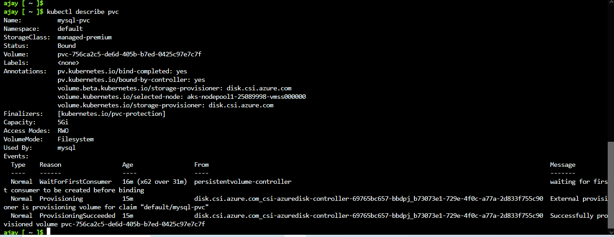
* after we created pod to claim the pv then even azure disk has been created and stored in azure
* so based on the reclaimPolicy it will act means ours is default storage of existing storage we have picked to store the pods data so in that storage the reclaimpolicy was already return has delete so this means once pv is delete that disk which is created in the azure also will be deleted, if we want retain then needs to change the reclaimppolicy to retain or if we want recyle and use that pv for some other pod then change reclaimpolicy to recyle. [Refer Here](https://kubernetes.io/docs/concepts/storage/persistent-volumes/#reclaim-policy)
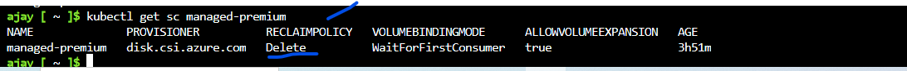

#### Experiment on mysql database:
* doing experiment on mysql databse how this pv is persistent and restorable.

```
# login into database
kubectl exec -it mysql -- databse -u akumar -p
# enter a password
# change databse
use mysql;
# Database changed
# create a table
CREATE TABLE authors (id INT, name VARCHAR(20), email VARCHAR(20));
# insert some records
INSERT INTO authors (id,name,email) VALUES(1,"Vivek","xuz@abc.com");
# then exit
kubectl get pods
# delete the pods
kubectl delete pod mysql
# recreate the pod
kubectl apply -f pod.yml 
# again login into mysql database
kubectl exec -it mysql -- mysql -u akumar -p
# enter password
# change database
use mysql;
# Database changed
show tables;
select * From authors;
# still data is present
```  
* so as per above experiment after we insert some data and delete the pod and again if we recreate the pod the data will be exist because our volume are stored as disk in azure.
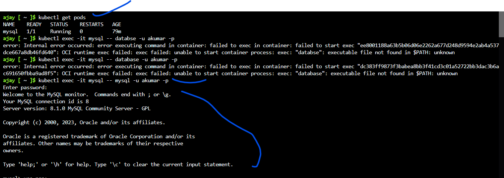
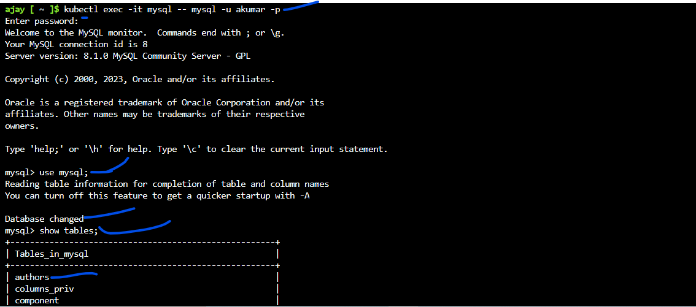
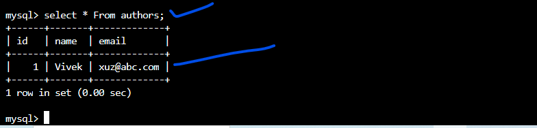

[Refer Here](https://www.cyberciti.biz/faq/howto-linux-unix-creating-database-and-table/) for database creation steps mysql 

* **Storage Classes:**
* [Refer Here](https://kubernetes.io/docs/concepts/storage/storage-classes/) for official docs
    * storageclass is to store persistentvolume with capacity amount of gb to use by pod.
    * storageclass is created as external storage like aws-efs, azure-azure-file or azure-disk so that storage of volume will be in common location as external so that any pod can access it and use it data will be safe.
    * storage is not belongs to namespace, its belong to entire cluster

* **Persistent Volume Claims:**
     * A PersistentVolumeClaim (PVC) is a request for storage by a user.
     * PVC will request to PV with particular storage class for required amount of volume to use by pod mentioning the access mode, readwriteonce, readwritemany, and readonlymany
     * pvc is belongs to namespace
* **The access modes are:**
  * ReadWriteOnce
  * ReadOnlyMany
  * ReadWriteMany 
  * ReadWriteOncePod
    * Only a single pod can gain access to the volume  
   * [Refer Here](https://kubernetes.io/docs/concepts/storage/persistent-volumes/#access-modes) for official docs        

* **All three items simple explaination like below:**
  * persistent volume means the disk or filesystem given to us 
  * storageclass is how to create storage and assign the name of that storage 
  * PVC means the sending a request to PV on particular storageclass for resource to use by pod

* **CSI Drivers:**
     * this is for extra set of features for an example to take snapshot or etc:
     * CSI is the second version storage of k8s 
     * CSI is an advanced implementation of storage 

### Daemonset:
* [Refer Here](https://kubernetes.io/docs/concepts/workloads/controllers/daemonset/) for official docs
* Daemonset is used to run same copy/kind of pod on every node 
* Daemonset ensures that copy of a specific pod runs on each or selected nodes with in cluster

#### Uses of a DaemonSet are:
* logs collectors:
  * run the daemon on every node to collect the logs
* monitoring:   
  * run the daemon on every node to monitor the nodes status.
* Deploying agents:  
  * run the daemon on every node to deploy agents 
* etc:

* Refer Below image for example of daemonset:
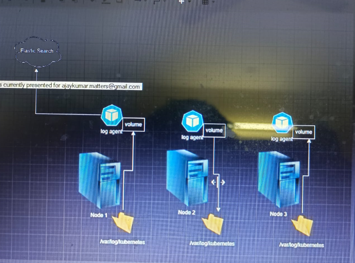

#### Demonstration Daemonset:
* [Refer Here](https://github.com/AjayKumarRamesh/QT-DevOps-AzureCloud-Trainings-Ajay/blob/master/Kubernetes/Examples_Yaml/DaemonSet/fluented-ds.yml) for daemonset manifest/yml file

* Refer below screen shots that is proved pod has been scheduled in all the two nodes fo above daemon statement is true.

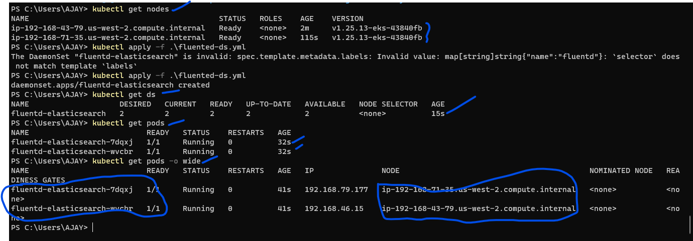
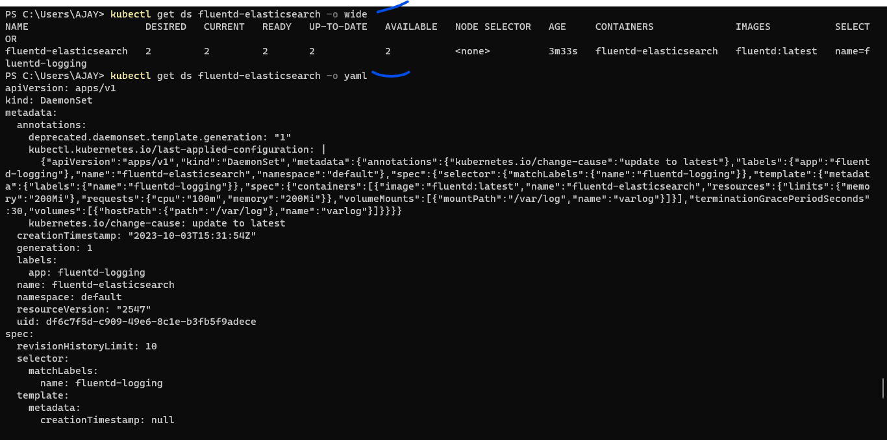
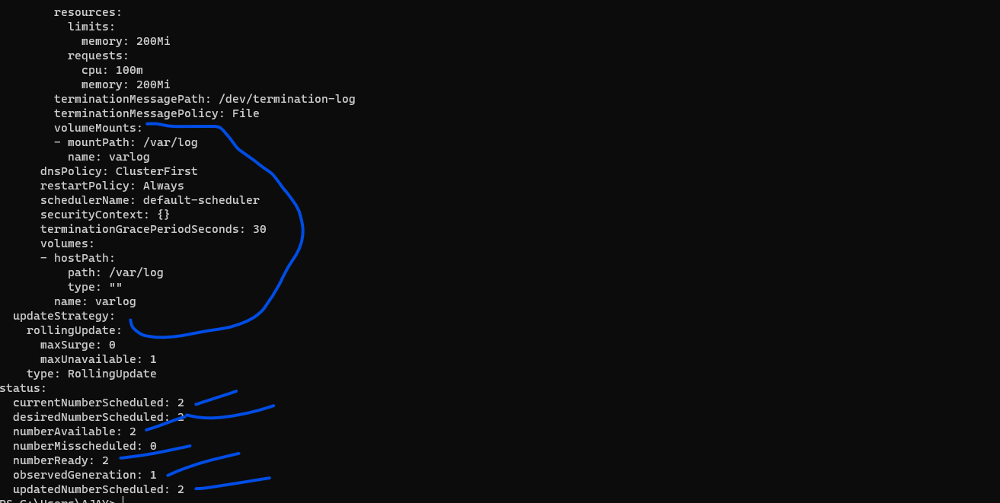
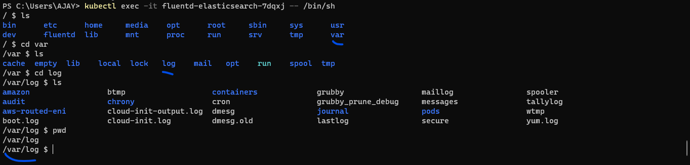

* Even daemon set works for rollout/undo update th image version below screen shot:
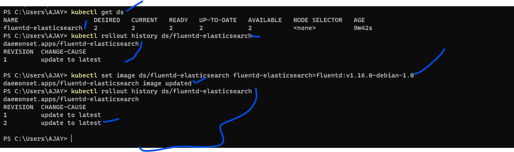


### Stateful Set:
* [Refer Here](https://kubernetes.io/docs/concepts/workloads/controllers/statefulset/) for official docs stateful set
* [Refer Here](https://kubernetes.io/docs/tasks/run-application/run-replicated-stateful-application/) for running Replicated Stateful set Application
* Stateful Set is designed for stateful applications
* When we create replicas in Stateful Set we get predictable/particular names for pods
* We can access individual pod, by creating headless service and by using `<pod_name.<svc_name>` if we namespaces then  `<pod_name.<svc_name><namespaces_name.svc.cluster.local>`
* in stateful set each pods will get its own persistent volume(pv)
* The stateful set is designed to manage deployment and scaling of stateful applications such as databases,
* Unlike deployment which is designed for stateless applications,
* To work with stateful set application we need headless service, means service type is none.
* Stateful set is useful for database where we are running one or more database, if we have only one database is running then we dont need this kind of circus to do it. 
* we will use volumeClaimTemplates in stateful set not for pod level, it is for statful set level so that each and every pods will have its own volume(pv)
* When we create replicas in Stateful Set we get predictable names

#### Example Scenario why we need Stateful set:
* To run database we will use stateful set, why,
* Why because assume that we have two database pods like database-0  another pod is database-1, so we have two application is running one like app-1, another is app-2, so now app-1 should read a database-0 and another app-2 should write the database-1 so now in this case how we will redirect our service request to a particular database like database-0 or database-1.? 
* Here is the solution:
  * in this case/scenario we will create service called headless service means service type none, through which we can  our database-0 or database-1 pods with our app-1 or app-2 pods like `<pod_name.<svc_name>`, means we can access by individual pod name
* Same scenario we cannot do with deployment with service, even if we give service type is none or creating headless service, why because deployments will create random name for pods like strange name not in order like stateful set, and also we access the service then it will forward the request to our pods with randomly not to particular pods.
* can we do this things in deployment.? means accessing with particular podname.? 
  * yes we can do it in deployment. But in deployment we will not get predictable/particular name for pods. we will get random name for pods so it is difficult to identify or to access the pod. 
  so in stateful set we will get predictable/particular name for pods so it is easy to access the pods.

#### Deployment VS Stateful Set:
* **Deployment:**
   * deployment means all pods will combine one state
   * in deployment if we create volumeClaimTemplates we will get only one common pv for all the pods to share
   * where as in deployment not possible, if we scale replicas only pods will increase not the pv 
* **Stateful Set:**
   * stateful set means each and every pods will have one state
   * where as in stateful set if we create volumeClaimTemplates we will get every pods with own pv.
   * in stateful set if one database pod is full with load of volumes then we scale the replicas then new database pod with pv will be creating it

#### Headless Service:
* to work with stateful set application we need headless service means, service which do not have cluster ip address is called headless service, in this case service type is none.
* what is headless service.? 
  * headless service means in  k8s service which does not have cluster ip address means none is known as headless service
* what is the advantage of headless service or service type is none.?
  *  using headless service i can access the particular/individual  pods by its naming `<pod_name.<svc_name>`  

#### Stateful Set has following features:
* Stable Network Identity
   * [Refer Here](https://kubernetes.io/docs/concepts/workloads/controllers/statefulset/#stable-network-id)
* Ordered Deployment and Scaling
   * [Refer Here](https://kubernetes.io/docs/concepts/workloads/controllers/statefulset/#deployment-and-scaling-guarantees)
* Persistent Storage
   * each pod will create its own pv/volume
   * [REfer Here](https://kubernetes.io/docs/concepts/workloads/controllers/statefulset/#stable-storage)
* Ordered, automated rolling updates.
   * [Refer Here](https://kubernetes.io/docs/concepts/workloads/controllers/statefulset/#rolling-updates)

#### Example Scenario above why required stateful set
* So can we do it in deployment.? as stateful set does
  if we do then what is the issue already described above but even here we showing n practicle 
* Refer below screen shot that when we create deployment it doesn't give predictable/particular name for pod, hence we cant access pod with `<podname.svcname>`  it proves it. 

* Manifest for deployment:

```
---
apiVersion: apps/v1
kind: Deployment
metadata:
  name: ds-deploy
  labels:
    app: ds-pod 
spec:
  replicas: 4
  selector:
    matchLabels:
      app: web
  template:
    metadata:
      labels:
        app: web
    spec:
      containers:
        - name: deploy-sample
          image: nginx
          ports:
            - name: webport
              containerPort: 80
              protocol: TCP          
```
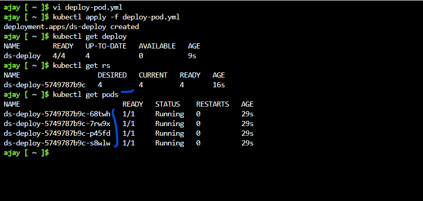

#### Stateful Set Demonstration:
* Work Flow of Stateful Set
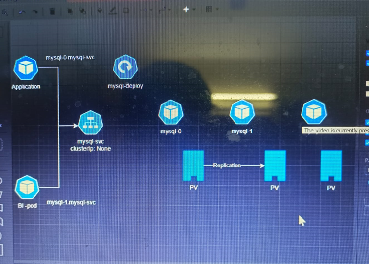
* [Refer Here](https://github.com/AjayKumarRamesh/QT-DevOps-AzureCloud-Trainings-Ajay/tree/master/Kubernetes/Examples_Yaml/Stateful-Set) for stateful set manifest/yml file 
* Refer below screen shot that stateful set has been created ordered pods names.
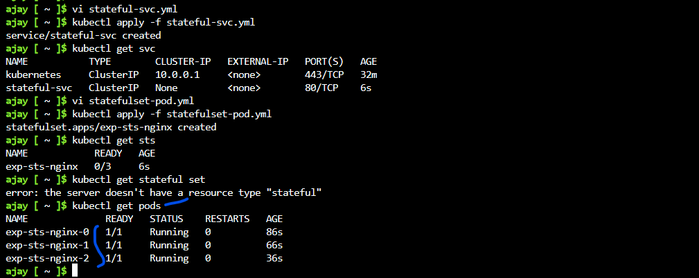
* Now create one random nginx pod to do experiment.
  in imperative way.
`kubectl run nginx --image=nginx`
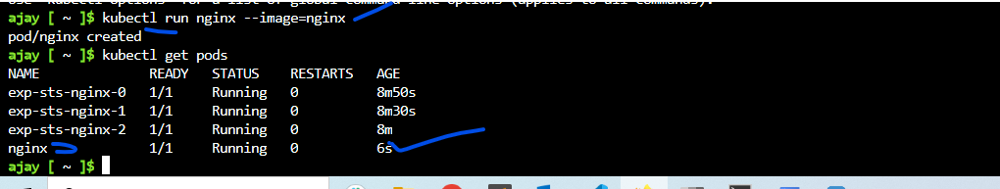
* Now send a curl request from imperavtive/random created pod to a sts-pod by using `<pod_name>.<svc_name>` that is >  `exp-sts-nginx-0.stateful-svc`
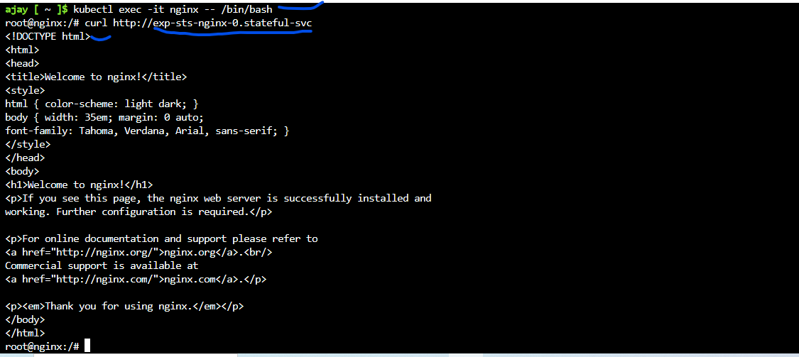
* Now stateful set is proved that we can communicate from a pod to another pod by its naming with svc. 
* Its proved volume has been mounted in side pods contianer.
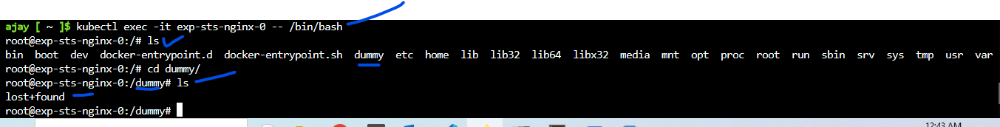
* using this command `kubectl describe pod exp-sts-nginx-0`
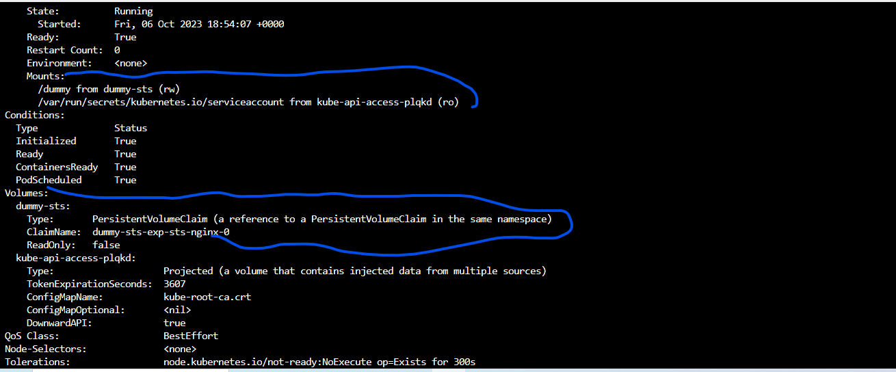
* Now it is proved even each pod got individual `PV` and `PVC`
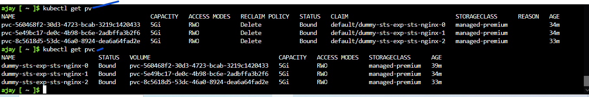


### Ingress:
* ingress is layer 7 (applications) load-balancer so that we can write rules on ingress resource
* We use ingress to overcome service to expose our pods to outside the cluster, like service type `loadbalancer` or `node-port`
* Ingress exposes `HTTP` and `HTTPS` routes from outside the cluster to services within the cluster. Traffic routing is controlled by rules defined on the Ingress resource.
* An ingresss is an API object that manages external access to the services in a cluster, typically `HTTP/HTTPS`.
* If no host is specified in the ingress rule, so the rule applies to all inbound HTTP traffic through the IP address specified.
* If a host is provided (for example, foo.bar.com), the rules apply to that host
* An Ingress with no rules/service defined sends all traffic to a single default backend
* If none of the hosts or paths match the HTTP request in the Ingress objects, the traffic is routed to your default backend


#### Ingress controller:
* An Ingress controller fulfills the rules set in the Ingress.
* In order for the Ingress resource to work, the cluster must have an ingress controller running.
* we must have an Ingress controller to satisfy an Ingress. Only creating an Ingress resource has no effect.
* we will need to make sure your Ingress targets exactly one Ingress controller by specifying the ingress.class annotation,and that you have an ingress controller running in your cluster.
* K8s does not have ingress controller for ingress. is designed, So This is where we can use external ingress controller implementations.
* Examples:
   * nginx
   * haproxy
   * traefik
      * these above three works anywhere external loadbalancer
      * For these external loadbalancer means there will be some re-write will happen and also k8s resource created like service,pods and deployments running 
   * azure application gateway(works only in aks soft loadbalancer)
     * internally what happens is, there will be k8s resource created like service,pods and deployments running as actual loadbalancer, if it soft 
   * elastic application load balancer(works only in eks soft loadbalancer)
       * internally what happens is, there will be k8s resource created like service,pods and deployments running as actual loadbalancer, if it soft
* The above examples of ingress controller mentioned is few there is lot more, to know that refer below official docs for ingress controller  


#### Request Flow Of Ingress:
```
users or clients hit DNS/(Route 53) it will direct to load balancer/ingress controller 
then here Ingress Controller will handle request and route to Ingress.
and here ingress will act like load balancer all the request will route to service and traffic is controlled by mentioning the rules in the ingress file then from service request will forward to particular pod to access our applications by using certain urls or path  
```
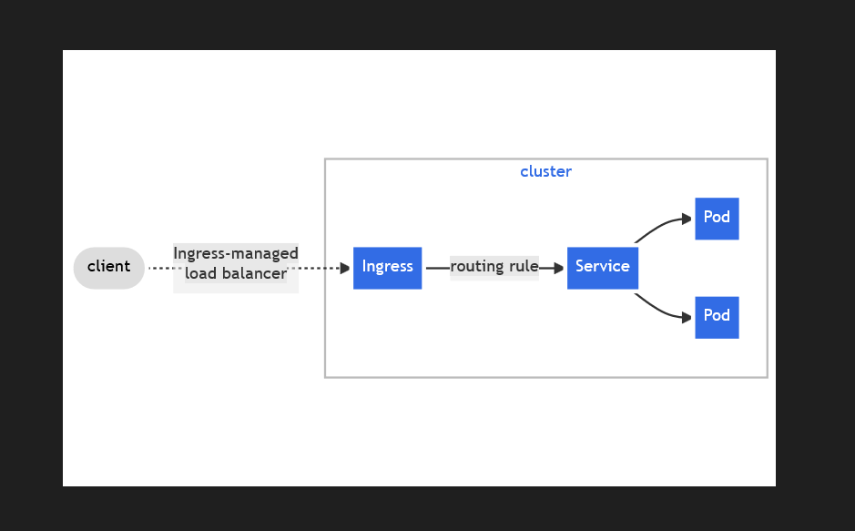 

* Refer Below Links for various documents:
  * [Refer Here](https://kubernetes.io/docs/concepts/services-networking/ingress/) official docs for Ingress 
  * [Refer Here](https://kubernetes.io/docs/concepts/services-networking/ingress-controllers/#additional-controllers) official docs for Ingress Controllers 
  * [Refer Here](https://kubernetes.github.io/ingress-nginx/deploy/) for nginx-ingress-controller Installation Guide
  * [Refer Here](https://github.com/kubernetes/ingress-nginx/blob/main/docs/examples/rewrite/README.md) nginx-controller re-write rules/target
  * [Refer Here](https://github.com/kubernetes/ingress-nginx/blob/main/docs/user-guide/multiple-ingress.md) Multiple Ingress controllers
  * To understand concept of ingress:
     * [Refer Here](https://doc.traefik.io/traefik/getting-started/concepts/)
  * Set up Ingress on Minikube with the NGINX Ingress Controller
     * [Refer Here](https://kubernetes.io/docs/tasks/access-application-cluster/ingress-minikube/)  
      
### Ingress Demonstration/Experiment:
#### Our implementation:
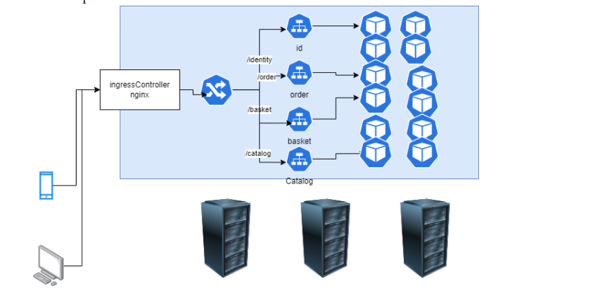

* Lets create four customized simple applications:
  using dockerfile and index.html file.
* [Refer Here](https://github.com/AjayKumarRamesh/QT-DevOps-AzureCloud-Trainings-Ajay/tree/master/Kubernetes/Examples_Yaml/Ingress/dummy-microservices/Dockerfile) for dockerfile and index.html files  
* Create docker image and push them to registry
#### Example Basket-service:
```
# paster the content in the files below
vi Dockerfile
vi index.html
docker image build -t basket-service:1.0 .
docker image ls
docker container run -d --name test-basket -P basket-service:1.0
docker container ls
# access and check application is working or not
http://192.168.0.8:80
# before this docker login create repository in docker hub
docker login
docker tag basket-service:1.0 ajaykumarramesh/basket-service:1.0
docker push ajaykumarramesh/basket-service:1.0
```  
* Rest of below services same above procedure follow it 
 * catalog-service
 * order-service
 * identity-service

* Lets install nginx-ingress controller using helm:
   * * Please Note should install nginx-ingress controller on local terminal where i used to created k8s cluster and got kubectl get nodes
   * in this demonstration we are using nginx-ingress controller
   * without ingress controller we cannot satisfy or work with ingress
   * [Refer Here](https://www.nginx.com/products/nginx-ingress-controller/) 
* **Steps:1**

```
helm repo add nginx-stable https://helm.nginx.com/stable
helm repo update
helm upgrade --install ingress-nginx ingress-nginx \
             --repo https://kubernetes.github.io/ingress-nginx \
             --namespace ingress-nginx --create-namespace
```
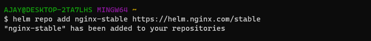
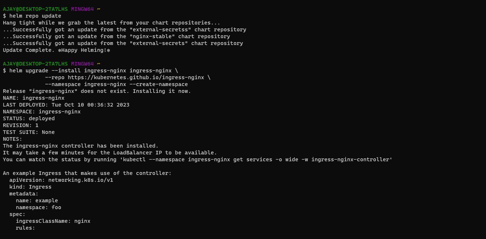
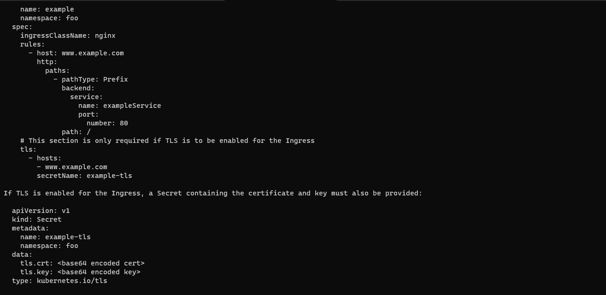

* To delete hel items execute below commands

```
kubectl delete namespace ingress-nginx
helm repo list
helm repo remove nginx-stable
```


* **Steps:2**
* After last command we see output which better copy to some notepad
* Execute following command to see what all resources created in the nginx namespaces

`kubectl get all --namespace ingress-nginx`
* we can see external ip is created with that nginx controller is created
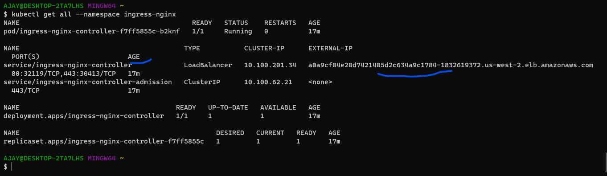
* So here nginx controller has created aws loadbalancer called external ip, with this we needs to write ingress with rules so when ever user access this loadbalancer request will forward to nginx controller where as it forward the request to  ingress and based on the ingress rules request will forward to service to access our pods.
* Now execute the following command to watch for external ip to nginx ingress controller

`kubectl --namespace ingress-nginx get services -o wide -w ingress-nginx-controller`
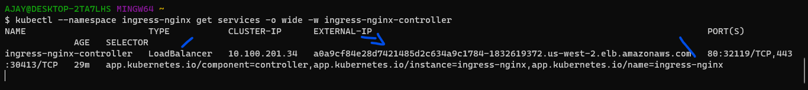

* Get ingress classes and there should be nginx ingress class from helm chart

` kubectl get ingressclasses.networking.k8s.io`
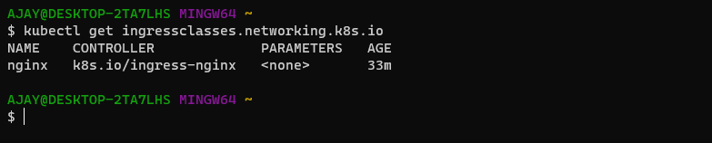

* Lets Deploy Applications refer below for manifest/yml files for deployment, and service
  * [Refer Here](https://github.com/AjayKumarRamesh/QT-DevOps-AzureCloud-Trainings-Ajay/tree/master/Kubernetes/Examples_Yaml/Ingress/dummy-microservices/Ingress-yaml)
* We have created four deployments
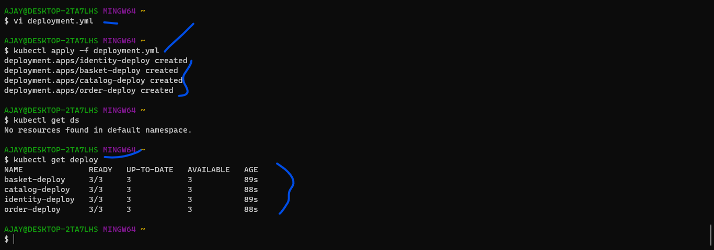
* Deployment has created 12 pods in deployment 3 replicas
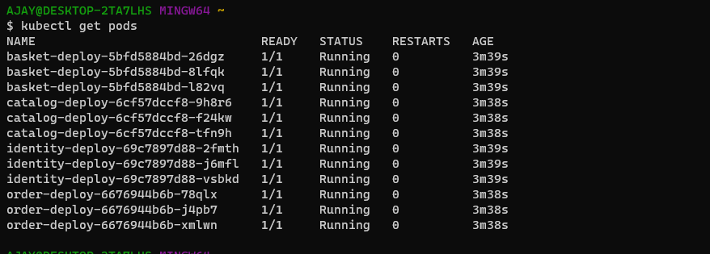
* We have created four services, all type is cluster ip
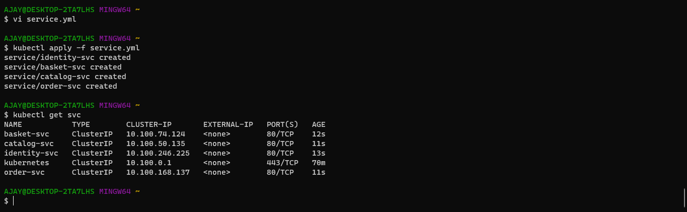

* We have created replicaset
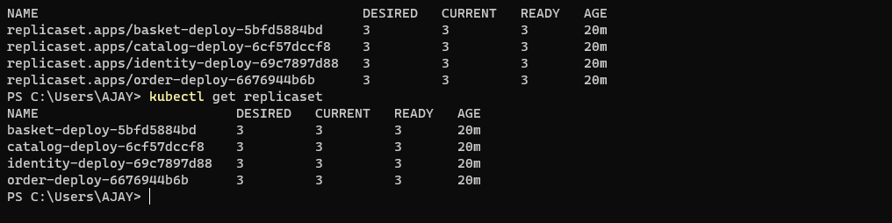

* Now Lets create Ingress manifest/yml file:
   * [Refer Here](https://github.com/AjayKumarRamesh/QT-DevOps-AzureCloud-Trainings-Ajay/blob/master/Kubernetes/Examples_Yaml/Ingress/dummy-microservices/Resources-yaml/ingress.yml) for manifest/yml ingress

* Now Lets Apply ingress:
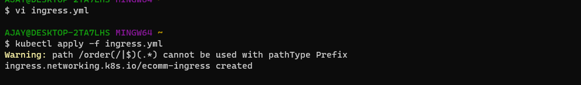

* Check external ip which we got when created `nginx-ingress-controller` and `ingress` both are same
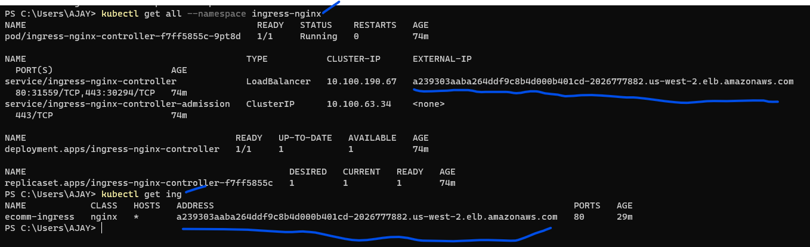
* Common ingress screen shots:
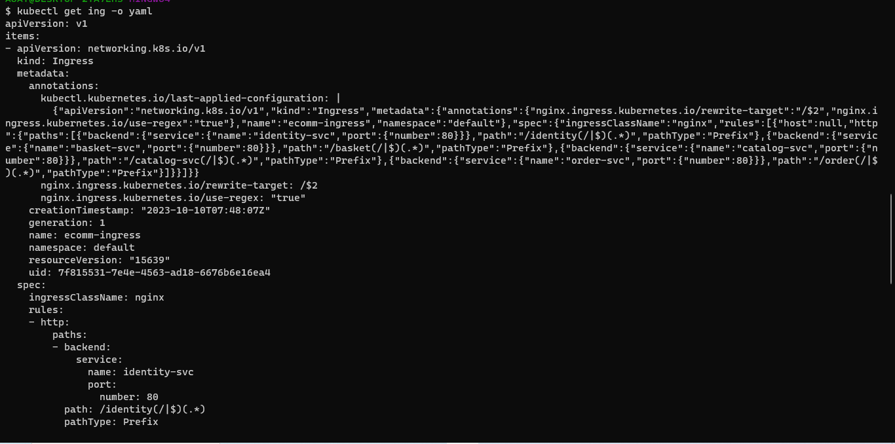
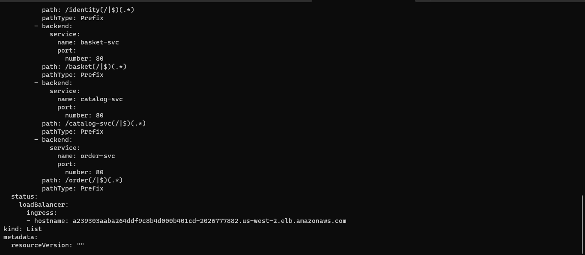
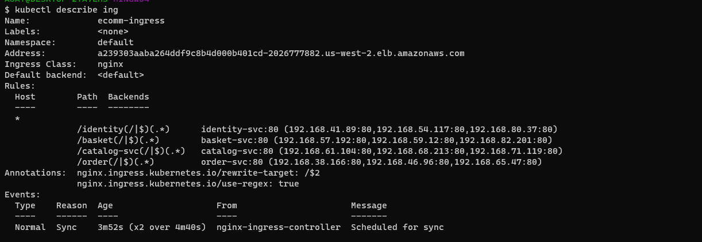

* Now Access the applications with ingress-controller loadbalancer or ingress loadbalancer both are same.

`http://a239303aaba264ddf9c8b4d000b401cd-2026777882.us-west-2.elb.amazonaws.com/identity`

`loadbalancer/service_path`
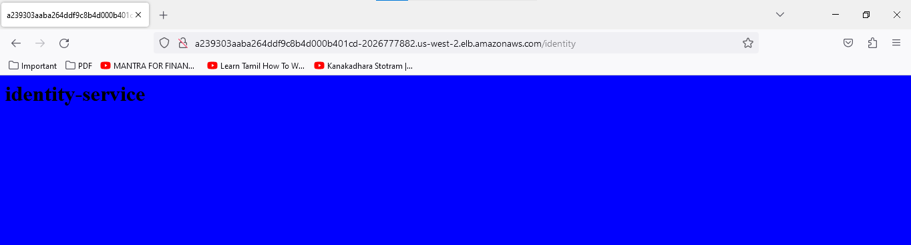
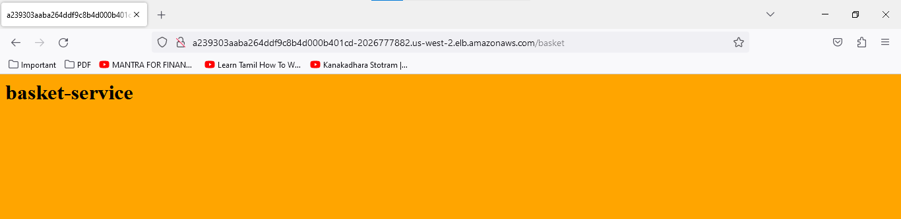
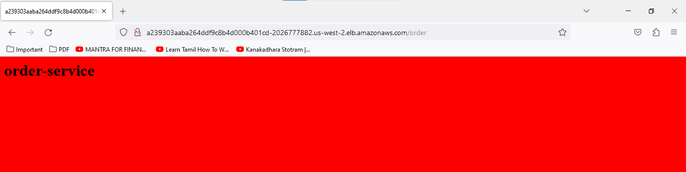
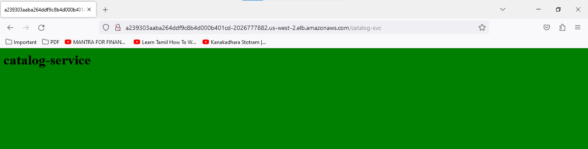

* With out ingress creation, even ingress-controller loadbalancer will not work since we have to write the redirect rules in the ingress file.

### Important Points to Note:
```
after creating nginx ingress controller it will give us external ip address
if it on-premises we expose our service via nodeport, means ingress controller will give us external ip for nodeport
if is is aks or eks ingress controller will give us loadbalancer url, so giving this loadbalancer url doesn't look good idea for users
so we will have a dns for our applications and we will configure this loadbalancer in route 53 or in azure dns so that we will have one domain for all our applications when ever user hit the route 53 it will redirect to ingress controller and and forwards to ingress and service so on.... 
```
```
if the 
pathtype: exact then we can mention 
path: /identity like this, so that when ever user request for identity blendly forwared the request to /dentity 
exact path actually should match if not validation will fail it
```
```
but here we have one problem, means if we mention pathype is : excat then after the /identity will not forward further ur request
because in our application / is for only main/home/html page, with in the main/home/html page we have to go inside to know more about something rite.
for that we needs to menion.
---
pathype: prefix
prefix means after /identity or / path it will redirect inside ur applications , means this is the path it will start then after that something more is there and allow it. 
---
if we dont have anything apartment form home page/html page not required to mention pathtype: prefix
---
prefix means this is what it will start after that there will be many 
---
```
#### This example demonstrates how to use Rewrite annotations:
* [Refer Here](https://github.com/kubernetes/ingress-nginx/blob/main/docs/examples/rewrite/README.md)


## Assigning/Scheduling Pods to Nodes:
* what this means creating or assigning pods to particular nodes.
* pods selecting particular nodes
* we can constrain a Pod so that it is restricted to run on particular node(s), or to prefer to run on particular nodes.
* [Refer Here](https://kubernetes.io/docs/concepts/scheduling-eviction/assign-pod-node/) for official docs
* **Pods selecting nodes possible ways below:**
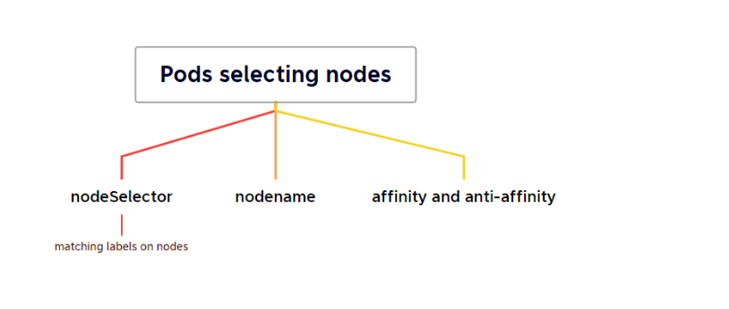
  * NodeSelector
  * NodeName
  * Affinity and AntiAffinity 

#### NodeSelector:
  * this will work using matching nodes labels
  * pods will select nodes by matching nodes labels
  * any pods matches the nodes labels go on schedule on that nodes
  * when ever kube scheduler see pods with nodes labels then it will go and schedule there.

#### Example of NodeSelector:
 * There are two ways to assign labels to nodes.
   * One is writing labels for nodes in manifest/yml files.
      * [Refer Here](https://github.com/AjayKumarRamesh/QT-DevOps-AzureCloud-Trainings-Ajay/blob/master/Kubernetes/Examples_Yaml/Assinging-Scheduling-pods-to-nodes/nodeselecting-labels/eks-cluster.yml)
      * refer below screen shot for proof for above manifest/yml files
      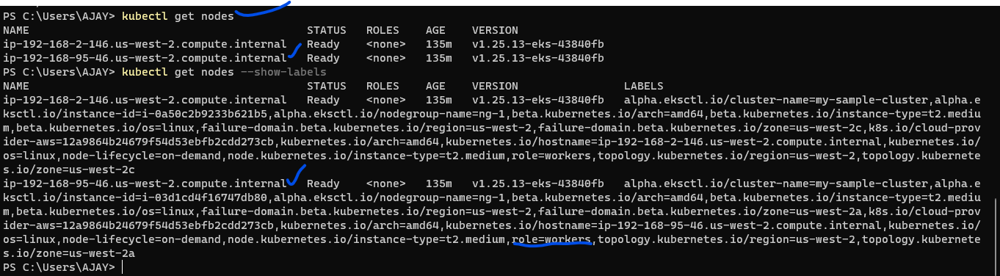
  * Another way is Adding a label to a node is imperative see below
  ```
  kubectl get nodes --show-labels
  kubectl label nodes <your-node-name> disktype=ssd
  kubectl get nodes --show-labels
  # In the preceding output for above command, you can see that the node has a disktype=ssd label added
  ```   
  * Refer belwo screen shot for above steps:
  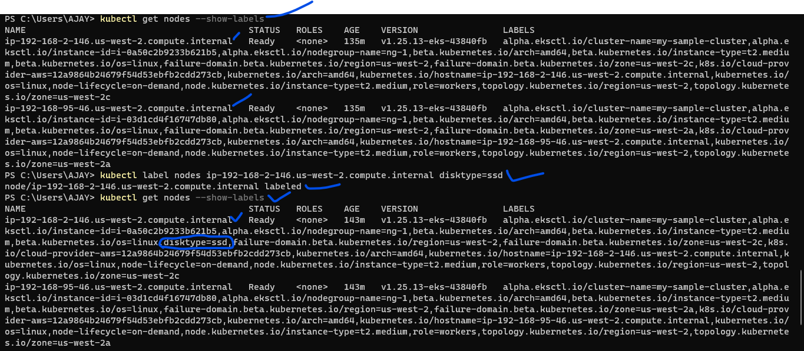

* Refer below for NodeSelector pod manifest/yml file
  * [Refer Here](https://github.com/AjayKumarRamesh/QT-DevOps-AzureCloud-Trainings-Ajay/blob/master/Kubernetes/Examples_Yaml/Assinging-Scheduling-pods-to-nodes/nodeselecting-labels/nodeselecting-pod.yml)  
* Refer below screen shot out of two nodes pod has selected nodes which is matching the label, which we mentioned in the pod so it assign the pods on that particular node
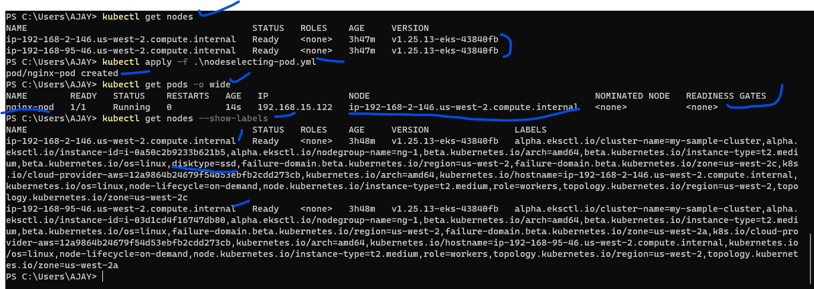

#### NodeName:
  * its is straight forward if this pod has particular node name then go and schedule there
  * `nodeName` is a field in the Pod spec then that pod will go to specific node and schedules it
#### Example of NodeSelector:  
  * Refer below pod spec for `nodename` manifest/yml file
    * [Refer Here](https://github.com/AjayKumarRamesh/QT-DevOps-AzureCloud-Trainings-Ajay/blob/master/Kubernetes/Examples_Yaml/Assinging-Scheduling-pods-to-nodes/node-name/nodename-pod.yml)
  * Refer below screen shot out two nodes in pod spec we have mentioned nodename is `nodeName: ip-192-168-95-46.us-west-2.compute.internal` so pod has scheduled with particular node which name is matched.
  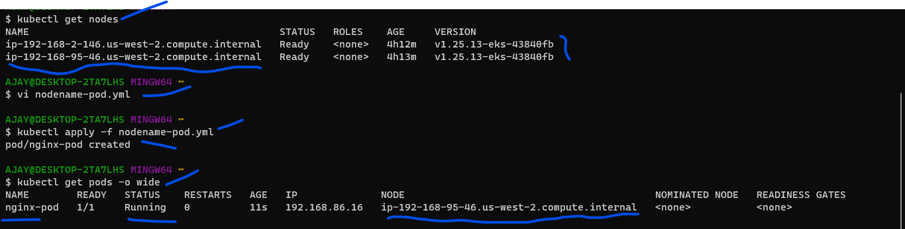


#### Affinity and AntiAffinity 
  * Affinity and Antiaffinity is tells some condition, like if pods are with this condition then go and schedule in that nodes
  * Affinity and Antiaffinity based pods condition scheduler will schedule the pods to particular nodes

  * **Affinity:**
      * Affinities define rules that either must or should be met before a Pod can be allocated to a Node.
      * pod with affinity surely/tel like to scheduler to schedule that pod to that particular node
  * **Antiaffinity:**
     * pod with antiaffinity in reverse direction telling like it will be schedule to that particular node 

#### Affinity and Antiaffinity can assess/indicate rules in two ways:         
* **Hard:**
   * hard affinities act as a required means the node should have the particular expression of pods afffinity condition then it will schedule, if not met pods affinity/condition in the nodes means that pod will not schedule to that node

* **Soft:**
     * Soft affinities act as a preference, means indicating to the scheduler that nodes should have the either one of the pods antiaffinity/conditions then go and schedule to that node and also A Node that doesn’t meet the condition will still be selected if necessary. or scheduler still schedules the Pod even if it can't find a matching node.     

### Types of Affinity Features/Condition 
* There are two different types of affinity features/condition that we can define:

* **Node Affinity:**
    * node affinity functions like Allows us to specify some hard and soft rules to schedule the pod
* Two Types of Node Affinity:
  * `requiredDuringSchedulingIgnoredDuringExecution:`
  This is the `hard affinity` The scheduler can't schedule the Pod unless the rule is met.
  * If the affinity requirements specified by this field are not met at scheduling time, the pod will not be scheduled onto the node.
  * once the pods has been scheduled on to that nodes affinity isn’t re-evaluated.
  * Changes to the Node won’t cause a Pod eviction due to changed affinity values

#### Examples of Node Affinity/Hard Affinity:
* [Refer Here](https://github.com/AjayKumarRamesh/QT-DevOps-AzureCloud-Trainings-Ajay/blob/master/Kubernetes/Examples_Yaml/Assinging-Scheduling-pods-to-nodes/node-affinity-antiaffinity/node-affinity-hard-.yml)  

```
kubectl get nodes
kubectl get nodes --show-labels
kubectl label nodes ip-192-168-24-152.us-west-2.compute.internal diskspeed=high
# output will be below
node/ip-192-168-24-152.us-west-2.compute.internal labeled
 kubectl get nodes --show-labels
```
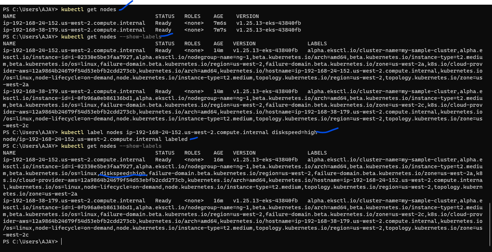

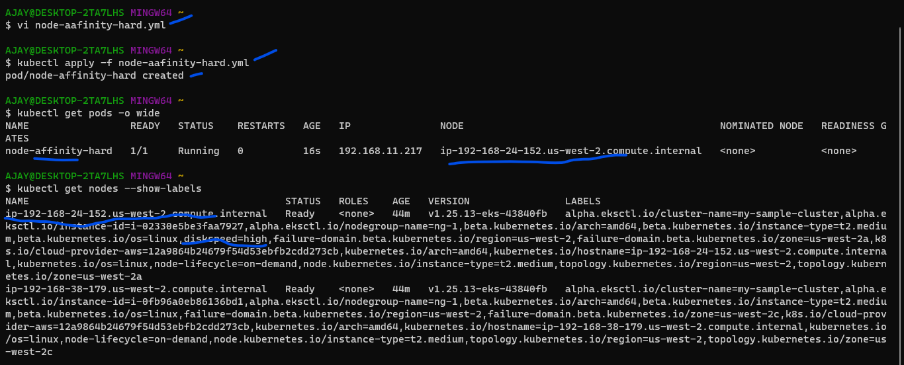


  * `preferredDuringSchedulingIgnoredDuringExecution:`
  This is the `soft affinity` The scheduler tries to find a node that meets the rule. If a matching node is not available, the scheduler still schedules the Pod. 
  * once the pods has been scheduled on to that nodes affinity isn’t re-evaluated.
  * Changes to the Node won’t cause a Pod eviction due to changed affinity values
  * Preference-based rules have an additional field called weight that accepts an integer from 1 to 100.
  * the Node that ends up with the highest overall weight will be allocated the Pod.

#### Examples of Node AntiAffinity/soft antiAffinity:
* [Refer Here](https://github.com/AjayKumarRamesh/QT-DevOps-AzureCloud-Trainings-Ajay/blob/master/Kubernetes/Examples_Yaml/Assinging-Scheduling-pods-to-nodes/node-affinity-antiaffinity/node-antiaffinity-soft-.yml)


```
kubectl get nodes
kubectl get nodes --show-labels
kubectl label nodes ip-192-168-38-179.us-west-2.compute.internal disktype=low
# output will be below
node/ip-192-168-24-152.us-west-2.compute.internal labeled
 kubectl get nodes --show-labels
```
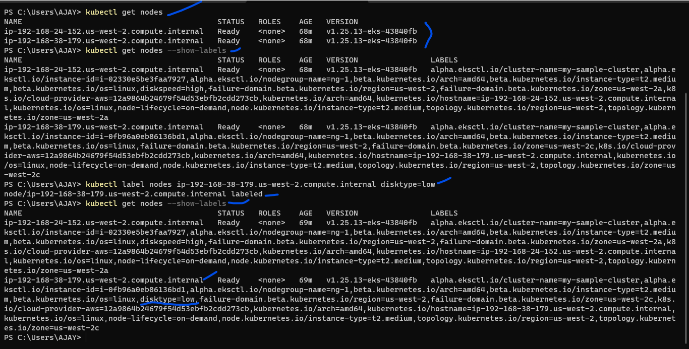

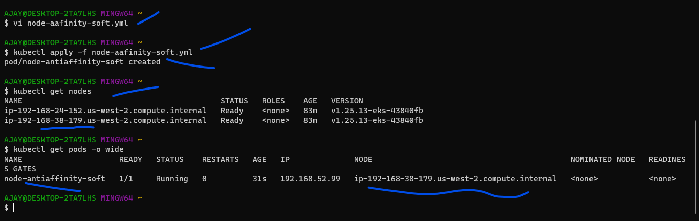


> **Note:** "In the preceding types `IgnoredDuringExecution` means 
that if the node labels change after Kubernetes schedules the Pod,
the Pod continues to run."


#### Inter-pod affinity/pod-anti-affinity:
* Here The node does not have control over the placement of pods. 
* Inter-pod affinity and anti-affinity allow you to constrain which nodes your Pods can be scheduled on based on the labels of Pods already running on that node, instead of the node labels.
* **Inter-pod affinity:**
   * The inter-pod affinity rule tells the scheduler to schedule the pod on that node if existing pod is running with same/matching labels of new pod.
   * The inter-Pod affinity rule uses the "hard" `requiredDuringSchedulingIgnoredDuringExecution`
   * Required rules must be met before a pod can be scheduled on a node. 
#### For Experiment/Demonstrtation of Inter-pod affinity 
* [Refer Here](https://docs.openshift.com/container-platform/3.11/admin_guide/scheduling/pod_affinity.html)

* **pod-anti-affinity:**
    * The pod anti-affinity rule tells the scheduler should avoid/prevent scheduling the new Pod on a node that already pods are running with same/matching labels 

    * the pod anti-affinity rule uses the "soft" `preferredDuringSchedulingIgnoredDuringExecution`
    * Preferred rules specify that, if the rule is met, the scheduler tries to enforce the rules, but does not guarantee enforcement.

#### For Experiment/Demonstrtation of pod-anti- affinity 
* [Refer Here](https://docs.openshift.com/container-platform/3.11/admin_guide/scheduling/pod_affinity.html)

---
## Taints and Tolerations:
* nodes repelling pods: taints and tolerations
* Node affinity: is a property of Pods that allows pods to schedule based on (prference or hard requirements) but Taints are quite opposite > they allow a node to repel/reject a set of pods.
* Tolerations are applied to pods.
* Tolerations allow the scheduler to schedule pods with matching taints.
* Tolerations allow scheduling but don't guarantee scheduling: the scheduler also [evaluates other parameters](https://kubernetes.io/docs/concepts/scheduling-eviction/pod-priority-preemption/) as part of its function.
* Taints and tolerations work together to ensure that pods are not scheduled onto inappropriate nodes.
* One or more taints are applied to a node; this marks that the node should not accept any pods that do not tolerate the taints.
#### For complete experiment/demonstration and also manifest/yml files refer below official docs 
* [Refer Here](https://kubernetes.io/docs/concepts/scheduling-eviction/taint-and-toleration/)

---

### Journey of Application from Docker to Kubernetes:
* just read this below Article and we can build docker image with pod and db pod and create k8s cluster and access the applications with service
  * [Refer Here](https://directdevops.blog/2019/11/02/deploying-the-docker-application-and-mysql-with-volume-support-into-kubernetes-from-code-to-docker-registries-like-acr-ecr-and-then-to-eks-aks/) Article

* Like below image this above article will be setting up.
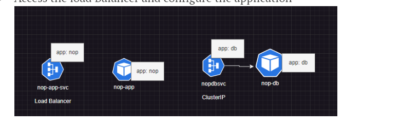
* Request flow for above image:
  * we will access service called loadbalancer to nop:app then nop:app will forward the request to nop:svc, and this clusterip svc will forward request to nop:db.
---

### Lens:
* To controll/manage kubernetes cluster
* kubernetes IDE
* [Refer Here](https://k8slens.dev/)


    


 


