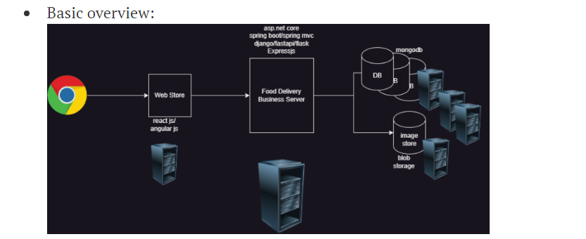
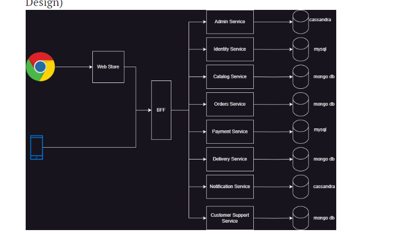
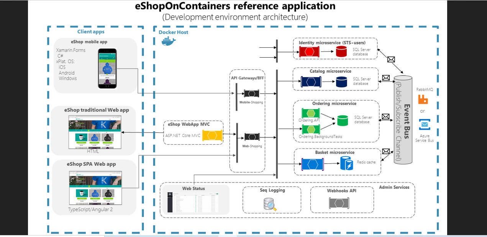

Kubernetes Microservices:
--------------------------
### What is Microservices:
  * breaks large/complex applications into piece of code/applications with its own database is called as microservices.
  * basic concept of microservice is a smallest component which run on individually 
  * for each microservices we will be writing deployment, for database stateful set and one service, and this service will be internal, it will not be external, so all the yamls will be internal only one component will be external that is ingress controller, even ingress also will be internal. 
* This below for (message broker) means in microservices updates between the application or communications 
  * communication for data updates propagation across multiple services based on Integration Events and an Event Bus (a light message broker, to choose between RabbitMQ or Azure Service Bus), 
  ```
  # this is for above scenario communication example:
  command area is called publisher or subscribe pattern like a queue, so when user orders some products, on overall catalog it will reduce one item or any of microservices wants to talk communicate each other, it will do it with common area subscriptions for examples rabit mq or azure service bus
  ```
   
### Examples of scenario microservices:
* Problem Statement: My organization want to build a Food delivery application
#### solution 1: 
* Layered architecture:


* Pros:
  * Simple setup
  * one code base

* Cons:
   * For updating the application, entire app has to be brought down
   * Entire application/layer has to be one tech stack/strech

#### Solution 2: Microservices

* Domains:
  * Identity (User & Role Management)
  * Catalog (Items list on sale)
  * Orders (Order)
  * Payment Services
  * Delivery Services
  * Administrative Services
  * Notification Services
  * Customer Support Service
* breaks one applications into multiple with its own database and manage the application is called microservices
* His idea is to have one service per domain (Domain Driven Design)



* Pros:
  * Deployments will not impact whole system
  * Scaling can be done depending on load on each service
  * No-vendor lockin
* Cons:
   * Development is across different code bases
   * complex system

* To implement this microservices we Need:
  * kubernetes (orchestration)
  * containerization applications

#### Refer for microservices documents:
* [Refer Here](https://github.com/dotnet-architecture/eShopOnContainers)

* Microservices Architecture:



* When and where Kubernetes is not the solution:
  * Container-less architecture
  * Monolith architecture
  * Small number of microservices
  * Single node deployment 


