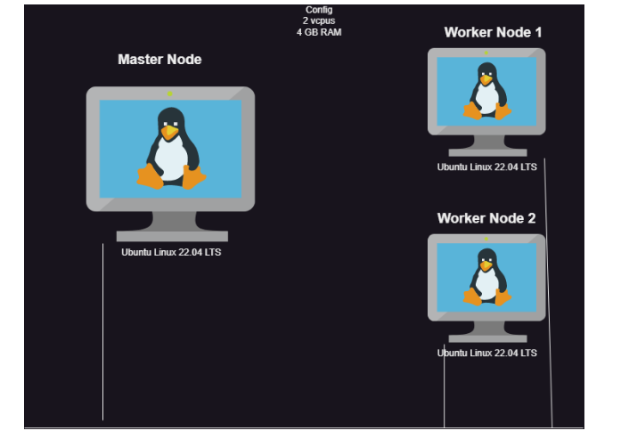
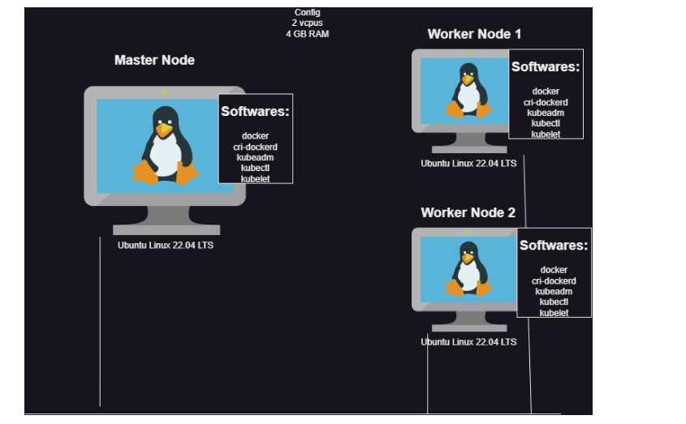
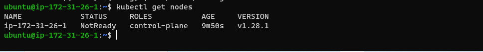
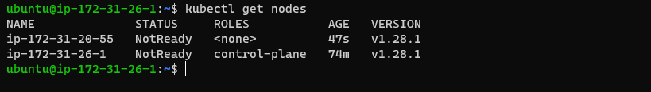
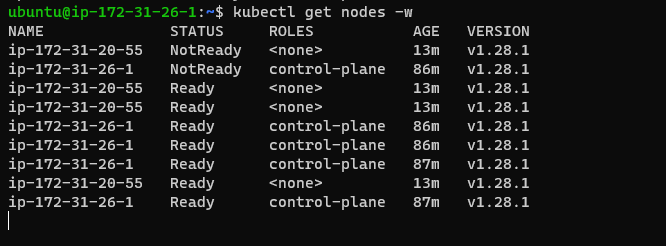

Kubernetes Installation Options:
--------------------------------

### Single Machine (Developer Setups)
* minikube
* kind
  * Install Docker and Run minikube or kind in single machine, this is only for developer so we are not interested

### Self Hosted K8s (On-premises)
* kubeadm
* kubespray
  * This where when organization is not using any cloud platform then install manually on physically servers.  

### Managed K8s (Kubernetes as a Service)
* Azure Kubernetes Services (AKS)
* Elastic Kubernetes Services (EKS)
* Google Kubernetes Engine (GKE)


### More Options on Kubernetes installation 
* Like options of Turnkey
    * [Refer Here](https://kubernetes.io/docs/setup/production-environment/turnkey-solutions/)

### Our Playgrounds
 * means in which area we wil be working on:       
   * kubeadm
   * AKS
   * EKS

### Kubernetes PlayGround
* for quick set up use kubernetes playground 
* Enter below command in the master node then consider that as your master node
  * **Initializes cluster master node:**
  `kubeadm init --apiserver-advertise-address $(hostname -i) --pod-network-cidr 10.5.0.0/16`
  * **Initialize cluster networking:**
  `kubectl apply -f https://raw.githubusercontent.com/cloudnativelabs/kube-router/master/daemonset/kubeadm-kuberouter.yaml`

* Now enter below command in you worker nodes so consider that is as worker node
    * **Then you can join any number of worker nodes by running the following on each as root:**
`kubeadm join 192.168.0.13:6443 --token 5v9svf.ea66lodq5lvrb1ft \--discovery-token-ca-cert-hash sha256:b4be09c1eef1881e3961849a23362f8b4286d78a3dbdf45583190664acf559ad`


### Installing K8s using Kube-adm Main:

#### Kube-adm installation Lab setup:

#### Overview


#### Kubernetes no longer supports docker (What does it mean)

* [Refer Here](https://kubernetes.io/blog/2020/12/02/dont-panic-kubernetes-and-docker/) for more info

* Don't Panic: Kubernetes and Docker
* This means in in-house installation you need install an extra called CRI like (cri-o) on every node.


#### Solution or Explaination  for above question:

* k8s has designed to run only docker container in initial days later k8s become very popular so k8s told that i want run all the container technologies. 
* in this above scenario k8s has component called `kubelet` so this kubelet used to know then all the container technologies of concept/method/logic, then kubelet will become heavy so k8s has decided that why should kubelet should know all the container technologies method/concept/logic.?
* so k8s has decided kubelet will know only one simple implementation about `CRI` so which ever container is using they need to install extra called `CRI` then k8s will support to create containers inside pod. 

* so k8s has remove docker shim, that is a reason why k8s cannot support docker unless or until `CRI` implementation is done. 

* so k8s has designed to run only docker in this case docker dint install anything like `CRI` so k8s has come with return called docker shim, due to which k8s has supporting docker with installing `CRI` 

### Installation Starts From Here:

* Installing Kubeadm
  * [Refer Here](https://kubernetes.io/docs/setup/production-environment/tools/kubeadm/install-kubeadm/)

* [Refer Here](https://kubernetes.io/docs/reference/networking/ports-and-protocols/) For Port opening

#### Steps:

* Create 3 vms/ec2 instances as discussed in the class (Azure/AWS)
* Install Docker on all the 3 nodes below commands:

```
curl -fsSL https://get.docker.com -o install-docker.sh
sudo sh install-docker.sh
sudo usermod -aG docker ubuntu
exit
login
```

* To install `CRI-dockerd` [Refer Here](https://directdevops.blog/2023/09/07/devops-classroomnotes-07-sep-2023/) and get the latest releases. 

* any other latest release please refer above link 
* Below steps are specific to ubuntu 22.04
* Execute below commands on master and worker node also

```
wget https://github.com/Mirantis/cri-dockerd/releases/download/v0.3.4/cri-dockerd_0.3.4.3-0.ubuntu-jammy_amd64.deb
sudo dpkg -i cri-dockerd_0.3.4.3-0.ubuntu-jammy_amd64.deb
```


* Install kubeadm, kubectl and kubelet on 3 nodes below commands mentioned:
* needs anything procedure refer below link:   

   * [Refer Here](https://kubernetes.io/docs/setup/production-environment/tools/kubeadm/install-kubeadm/#installing-kubeadm-kubelet-and-kubectl)

```
sudo apt-get update
sudo apt-get install -y apt-transport-https ca-certificates curl
curl -fsSL https://pkgs.k8s.io/core:/stable:/v1.28/deb/Release.key | sudo gpg --dearmor -o /etc/apt/keyrings/kubernetes-apt-keyring.gpg
echo 'deb [signed-by=/etc/apt/keyrings/kubernetes-apt-keyring.gpg] https://pkgs.k8s.io/core:/stable:/v1.28/deb/ /' | sudo tee /etc/apt/sources.list.d/kubernetes.list
sudo apt-get update
sudo apt-get install -y kubelet kubeadm kubectl
sudo apt-mark hold kubelet kubeadm kubectl
```


* Now we came to above image state .
* Now Lets create a k8s cluster using kubeadm [Refer Here](https://kubernetes.io/docs/setup/production-environment/tools/kubeadm/create-cluster-kubeadm/)

* Execute the below on master node:
* Lets initialize the cluster using the below command as a root user:

```
sudo su -

kubeadm init --pod-network-cidr "10.244.0.0/16" --cri-socket "unix:///var/run/cri-dockerd.sock"
```

* Kubeadm responds with the following info

```
To start using your cluster, you need to run the following as a regular user:

  mkdir -p $HOME/.kube
  sudo cp -i /etc/kubernetes/admin.conf $HOME/.kube/config
  sudo chown $(id -u):$(id -g) $HOME/.kube/config

Alternatively, if you are the root user, you can run:

  export KUBECONFIG=/etc/kubernetes/admin.conf

You should now deploy a pod network to the cluster.
Run "kubectl apply -f [podnetwork].yaml" with one of the options listed at:
  https://kubernetes.io/docs/concepts/cluster-administration/addons/

Then you can join any number of worker nodes by running the following on each as root:

kubeadm join 172.31.26.1:6443 --token hp8s0f.xjfhvex4aszd3io2 \
        --discovery-token-ca-cert-hash sha256:735cbd72250ec95b696d536c33abfb8b24b78a6c9d8618599bd3da8df26ba876
```

* On the master node to run kubectl as regular user execute the following
* before run the below command become as regular means `exit from root`

```
exit

mkdir -p $HOME/.kube
  sudo cp -i /etc/kubernetes/admin.conf $HOME/.kube/config
  sudo chown $(id -u):$(id -g) $HOME/.kube/config
```

* Now as a regular user execute in master node `kubectl get nodes`


* Now as a root user in node 1 and node 2 execute the join command
* before executing the join below command should add
`--cri-socket "unix:///var/run/cri-dockerd.sock"` at end the of kubeadm join command below example refer 

```
sudo su -

kubeadm join 172.31.26.1:6443 --token hp8s0f.xjfhvex4aszd3io2 \
--discovery-token-ca-cert-hash sha256:735cbd72250ec95b696d536c33abfb8b24b78a6c9d8618599bd3da8df26ba876 \
--cri-socket "unix:///var/run/cri-dockerd.sock"
```

* Now execute `kubectl get nodes` from master node



* Now kubernetes needs CNI Plugin so that pod-network is enabled. Till this is done the DNS does not work, services do not work so nodes are shown as NotReady.
* [Refer Here](https://kubernetes.io/docs/concepts/cluster-administration/addons/) official docus types of plugin
* We can choose among wide range of CNI Plugins, For this lets use flannel.
* how two pods can communicate each other, through installing `CNI`(contianer networking interface) plugin that intelligence is given by kubernetes to `CNI` 
* Execute the below on master node

`kubectl apply -f https://github.com/flannel-io/flannel/releases/latest/download/kube-flannel.yml`

* Now execute `kubectl get nodes -w` and wait for all the nodes to get to ready state


* End of installations:
* Lets setup autocomplete for kubectl note: use tabs.
* for this above line please refer kubectl cheatsheet
* Inside k8s we have a Certificate Authority and keys available which are used to secure all k8s communications.
* The kubeconfig file contians the certificate data to be connected securely as admin into k8s (This is based on installations which we have done so far)


### installing a highly available k8s cluster using kubeadm:
* [Refer Here](https://kubernetes.io/docs/setup/production-environment/tools/kubeadm/high-availability/)

