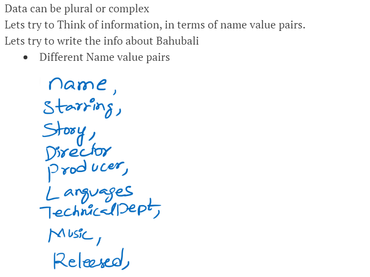
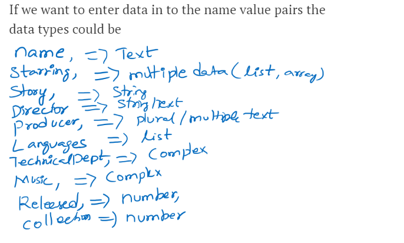

# Software installation And Json,Yaml file code Writing Videos contain here:

Json and Yml file Code Video:
-------------------------------
* [Refer Here](https://www.youtube.com/watch?v=ggOmHlnhPaM&list=PLuVH8Jaq3mLud3sVDvJ-gJ__0zd15wGDd&index=16) khaja sir video 


# Json(Java Script Object Notation):
### How to write json file and understand very deep about json should learn this below:


* This is collection of name value pairs
* This is a data representation format
* syntax: <name/key>: <value pair>
* Advantages:
  * It is light weight
  * Easy to read and write
* Data can be in the form of
  * Text
  * Numbers
  * Boolean  
* Data can be plural or complex
* 
* 
* Basic Json Representation:
   * In Json Data is represented as `<name>: <value>`
   * Example:
 
          "Hero": "Prabhas"
* Json Data Types: Value section might have different values. Value Types could be one of these below:

  * String/Text: ”
  * Number
  * Boolean: true/false
  * list: represented in []
  * object (Complex): Describing this type might    require some more name value pairs. Represented in { }

* Lets write a simple json to represent Bahubali:

```
{
  "title": "Bahubali The Begining", 
  "Director": "S.S. Rajamouli",
  "Writer": "Vijayendra Prasad",
  "BoxOfficeInCrores": 600,
  "BudgetInCrores": 180,
  "Released": "10/07/2015",
  "Languages": [ "Telugu", "Tamil", "Malayalam", "Hindi" ],
  "Distributors": {
	"Telugu": "Arka Media Works",
	"Tamil": [ "StudioGreen", "Sri Thenandal Films", "UV Productions"],
	"Hindi": "Dharma Productions",
	"Malayalam": "Global United Media"
  }
}
```
### Json Convertor to Yaml [Refer Here](https://www.json2yaml.com/)

* Types in Json:
    * **Simple:**
      * String/Text:
        * The value should be in `double or single quotes`
     * **Number:**
        * The value should be `Numeric without quotes`
     * **Boolean:**
        * The value should be `true` or `false`        
    * **Complex:**
       * List/Array 
         * This represented `[] bracket`
         * This represented Plural

       * **Object/Dictionary/Map**
         * This represented multiple `Name` and `Value` pairs to define something and is represented in `{}` 
         
* **Example:**
 * Simple:
 ```
  "table" = "wood"
  "amount" = 18000
  "break" = false
```
* Complex:
```
"human parts" [ "eyes", "ears", "nose" ]
"car" {
  "wheels": 4,
  "colour": "red",
  "accident": yes,
  "stearing": 1,
  "qualtiy": "good",
  "city": "bangalore"
}
```
* Generally json files can be in any format but most widely used is `.json`

* **Json Tree Viewer to check objects and list/array:**

  * [Refer Here](https://codebeautify.org/jsonviewer)
---

Software Installation Video:
----------------------------

* [Refer Here](https://www.youtube.com/watch?v=9guzVbZPGuw&list=PLuVH8Jaq3mLud3sVDvJ-gJ__0zd15wGDd&index=17) khaja sir video 

---

YAML (YAML Ain’t a Markup Language)
------------------------------------
* This also can be used for data exchanges and configurations
* Belives in indendation like python
* YAML is also collection of name value pairs
* In YAML Data is represented as `<name>: <value>`
* The Data types for Yaml are same as json.
   * Text is represented in quotes
   * List Items start with –
   * Object will start at the next indendation
* Example:

```
---
Tile: Bahubali 
Director: S.S. Rajamouli
Writer: Vijayendra Prasad
BoxOfficeInCrores: 600
BudgetInCrores: 180
Released: 10.07.2015
Languages:
- Tamil
- Telugu
- Malayalam
- Hindi
Distributors:
- Telugu: Arka Media Works
- Tamil: 
  - Studio Green
  - Sri Thenandal Films
  - UV Productions
- Hindi: Dharma Productions
- Malayalam: Global United Media
```
---

