# What is Terraform and its Uses:

* Terraform can automate infrastructure  creation in almost all the virtual environments in All Clouds Environment and Terraform is an open source software and provides enterprise support.

* Terraform also allows us to deal with multiple environments, like using or term called workspace.

Concepts Of Terraform:
----------------------

* **Provider:** This determines the target area/which virtual environment needs to create infra structure
* [Refer Here](https://registry.terraform.io/browse/providers) For The List Of Providers

* [Refer](https://developer.hashicorp.com/terraform/language/providers) Documentation About Providers

* Providers are not part of terraform installations as we try to create infra, as part of initializations providers are downloaded
* Providers have resources and data sources as part of it
* This allows us to declare the infrastructure i.e. we would represent our needs in some format and the tool does the rest of creation/deletion/updating the resources.
* We deal with declarative language and desired state.

Infra Provisioning
--------------------
* This is about a tool which lets you express your infrastructure as a code and manages multiple environments and reusability


### To write Terraform code please refer terraform official document and we can write what ever code is:

* [Refer Here](https://registry.terraform.io/providers/hashicorp/aws/latest/docs#aws-configuration-reference)

               or

# Logic to write any terraform code:
   * two ways:
       * **first option:** search in google what ever code we want to write for example below
          * terraform azure virtual network - directly searching in the google
          * terraform aws ec2 - directly searching in the google   
      * **second option:**
           * terraform aws/azure provider
           * then in that terraform search bar search for required resource like below
           * azure resource group
           * azure storage account
           * azure virtual network
           * aws resource group
           * aws ec2 
           * aws vpc 
           * ETC:- 

# To comment terraform code:

  * `#` for single comment
  * `//` for single comment
  * `/* */` for full/entire block to comment - SHIFT+ALT+A - uncomment same reverse
  * `contrl + K + C` or `contrl /` for entire block of code to comment with #
  * `contrl + K + U` for entire block of code to uncomment 
  * [Refer Here](https://itsfoss.com/comment-multiple-lines-vs-code/) 

# Architecture of Terraform:

* 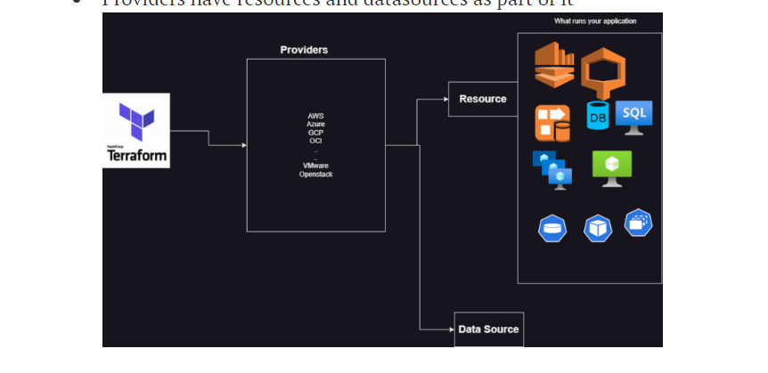


# Terraform Installation:

* for windows 
    * choco install terraform 
            
            or
    * chcocolety install terraform

* for linux refer below link 

   * [Refer Here](https://developer.hashicorp.com/terraform/downloads)


# Terraform Information: 
* Install Terraform extension in VSCode
* Terraform Language: 
  * Declarative configuration language(DCL) known as HashiCorp Configuration Language (HCL), or optionally JSON.
* Terraform is developed in Go language and installation of terraform is one executable  


* Arguments and Attributes:
  --------------------------

  * Argument refers to inputs in terraform
  * Attributes refers to outputs in terraform


Ways of Working with Terraform  (First version)
------------------------------------------------

* Create the infrastructure manually at least once as this helps
  * in figuring out inputs to be passed.
  * order of creation
  * every resource to be part of architecture

* Figure out the right provider and resources

Syntaxes in Terraform
---------------------
### Providers: 
* Provider [Refer Here](https://developer.hashicorp.com/terraform/language/providers/configuration) For Official Documents

* ***syntax:***
```
terraform {
  required_providers {
    aws = {
      source = "hashicorp/aws"
      version = "5.9.0"
    }
  }
}
```

* A provider requirement consists of a local name, a source location, and a version constraint
* The `required_providers` block must be nested inside the top-level `terraform block`
* **Each provider has two identifiers:**
* **Local Names and Addresses:**
* Local names are module-specific, and are assigned when requiring a provider. Local names must be unique per-module.
    * A unique source address, which is only used when requiring a provider.
    * A local name, which is used everywhere else in a Terraform module/code.
* Outside of the `required_providers` block, Terraform configurations always refer to providers by their local names.     
* **For example**
    * the following configuration above syntax declares
    aws as the local name for source `hashicorp/aws`
    * then uses that local name when `configuring the provider` below example shows 

* **Source Addresses:**
* A provider's source address is its global identifier. 
* It also specifies the primary location where Terraform can download it.

* **Version Constraints:**
  * Each provider plugin has its own set of available versions
  
```
provider '<name-of-provider>' {
arg-name-1 = arg-value-1 => Input
..
arg-name-n = arg-value-n => Input
}
```
* Example for Above:
```
provider "aws" {
region = "us-west-2"
}
```
* Generally we need to configure credentials for providers in aws or any cloud since terraform should authenticate to create infrastructure in cloud

### Resource:
* [Refer Here](https://developer.hashicorp.com/terraform/language/resources/syntax)

* This represents the infrastructural element to be created 
* Resource means what exactly we want to create in the cloud mention detailed information
* (If a resource doesn't specify which provider configuration to use, Terraform interprets the first word of the resource type as a local provider name.)


### Resource Types:
* Each resource is associated with a single resource type
* which determines the kind of infrastructure object it manages and what arguments and other attributes the resource supports

### Resource Arguments:
* Most of the arguments within the body of a resource block are specific to the selected resource type.
The resource type's documentation lists which arguments are available and how their values should be formatted
* The values for resource arguments can make full use of expressions and other dynamic Terraform language features.


* **Syntax:**
```
resource "<provider_name><resource_type>" "refer_name" {
arg-name-1 = arg-value-1 => input
..
arg-name-n = arg-value-n => input
}
```
* Example for above:

```
resource "aws_instance" "fromtf" {
    ami = "ami-03f65b8614a860c29"
    instance_type = "t2.micro"
    tags = {
        Name = "from terraform"

    } 

    key_name = "Devops.rsa" 
    vpc_security_group_ids = ["sg-0f980acf2bab4bb5b"]
} 
```

# Terraform Most Important/Main Commands:

* terraform fmt
  --------------
    * to make code in proper queue formate or alignment
    * Use terraform fmt to align the terraform template into common canonical format
    * Reformat your configuration in the standard style

* terraform init
  ------------------  
   * To initialize the provider and other binaries required for terraform

 * terraform validate
   --------------------
    * to check our terraform code is Success! The configuration is valid.   

* terraform plan
  ----------------

   * To check the resource what will be deployed when we create its just like trial

* terraform apply
  -----------------

    * To executed the decided infrastructure in to virtual environment

* terraform destroy
  -------------------

   * To delete the created resources/infrastructure in the virtual environment   

* To executive terraform var file by passing user input
  -----------------------------------------------------
  * `terraform apply/plan -var 'resource_group_name=ntier-dev' -var 'location=eastus`
* To executive terraform var file directly assigning
var file
  --------------------------------------------------
  * `terraform apply -var-file="dev.tfvars"`
  * `terraform apply -var-file dev.tfvars`


## All other commands:
 * **console** 
   * Try Terraform expressions at an interactive command prompt
   * This command provides an interactive command-line console for evaluating and experimenting with expressions.  
   * [Refer Here](https://developer.hashicorp.com/terraform/cli/commands/console)
   * 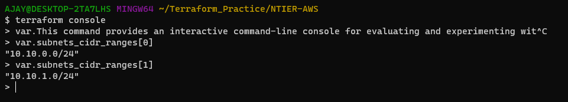
* **force-unlock** 
   * Release a stuck lock on the current workspace
* **get** 
   * Install or upgrade remote Terraform modules
* **graph** 
  * Generate a Graphviz graph of the steps in an operation
  * it show created resource in the graph formate or way
* **import** 
   * Associate existing infrastructure with a Terraform resource
* **login** 
    * Obtain and save credentials for a remote host
* **logout** 
    * Remove locally-stored credentials for a remote host
* **metadata** 
     * Metadata related commands
*  **output** 
     
     * Show output values from your root module
* **providers** 
      * Show the providers required for this configuration
* **refresh**
    *  Update the state to match remote systems
    * it is checking the state to match the remote system means cloud 
    * it will refresh the terraform.tfstate file means it will compare the resource created in the cloud and .tfstate file which is present in the locally and it prints the output
* **show** 
     * Show the current state or a saved plan
     * it will show all resource created in the cloud/VM 
*  **state** 
     * Advanced state management
* **taint** 
    * Mark a resource instance as not fully functional
    * The terraform taint command informs Terraform that a particular object has become degraded or damaged. Terraform represents this by marking the object as "tainted" in the Terraform state, and Terraform will propose to replace it in the next plan you create.
    * [Refer Here](https://developer.hashicorp.com/terraform/cli/commands/taint)
    * Commands:
        *  terraform taint tls_private_key.my_key
        * 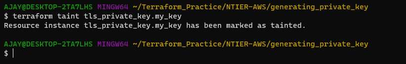
        * after taint again applying it below:
            * 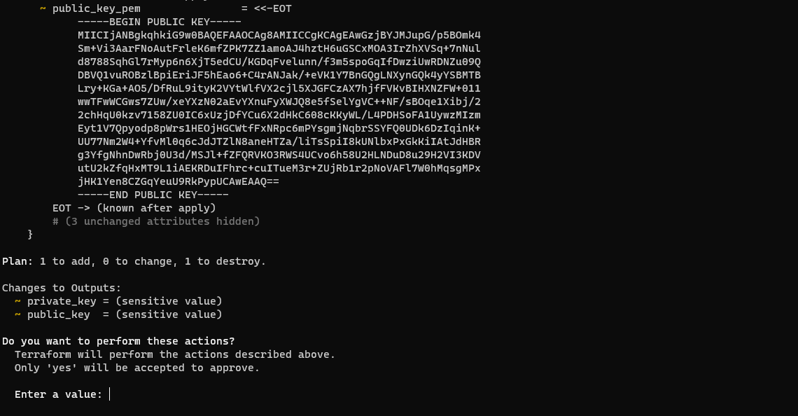

* **untaint**  
    * Remove the 'tainted' state from a resource instance 
    * to remove the tainted resource            
     * terraform untaint tls_private_key.my_key       
       * [Refer Here](https://developer.hashicorp.com/terraform/cli/commands/untaint)
     * below screen shot after untainted
       * 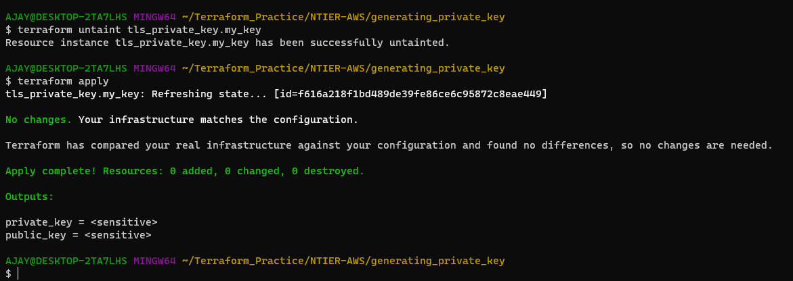

* **test**  
    * Experimental support for module integration testing

* **version**  
     * Show the current Terraform version
* **workspace**     
     * Workspace management


# Terraform most Use case types or options:-

## Depends_on :
   * it is a tag which allow us to use dependencies between one resource to another and module
   * it is known as explicit dependency, which means  i will tell terraform please depends_on this item first before you create that item
   * [Refer Here](https://developer.hashicorp.com/terraform/language/meta-arguments/depends_on) depends_on documents
   * Technique to use one resource in other resource argument
   * sytanx:
      * `<provider_resource_type>.<name>`
* **EXample**
```
provider "azurerm"{
  features { 
  }

}

resource "azurerm_resource_group" "myresg"{
  name     = "fromtf"
  location = "eastus"
}

resource "azurerm_storage_account" "first" {
  name                     = "fromtffortf"
  resource_group_name      = "fromtf"
  location                 = "eastus"
  account_tier             = "Standard"
  account_replication_type = "GRS"
  depends_on = [ azurerm_resource_group.myresg ] //explicity dependencies example 
}
```

## Locals are named (values) in Terraform:
  * A local value assigns a name to an expression, so you can use the name multiple times within a module instead of repeating the expression.
  * When you use Locals in the code, since you are reducing duplication of the same value or if we are using same value for multiple times then we can use locals block
  * you also increase the readability of the code
  * local in Terraform doesn’t change its value once assigned.
  * example for locals block of code see below path
      * same folder-`\Terraform\NTIER-AWS\locals.tf`
  * Refer below for locals terraform document
  * [Refer Here](https://developer.hashicorp.com/terraform/language/values/locals) 

  # Count Argument(Loopging):
   * This is an argument can be used in resource block to create multiple resources instead of writing terraform same code for multiple resource
   * which removes the need to write a separate block of code for each one
   * For example, instead of defining 3 virtual machines all with their own separate resource blocks, you could define one and add the count = 3 ‘meta-argument’ into the resource block, it will create 3 virtual machine
   * [Refer Here](https://developer.hashicorp.com/terraform/language/meta-arguments/count)
   * example for count of code see below path
      * same folder-`\Terraform_Example_Code\NTIER-AWS\inputs.tf`

# Length Function:

 * Length is a function
 * length determines the length of a given list, map, or string.
 * If given a list or map, the result is the number of elements in that collection. If given a string, the result is the number of characters in the string.
 * Example below:
    * 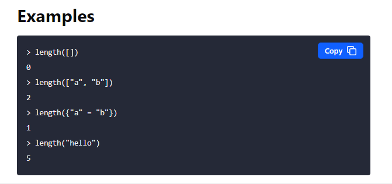
    * 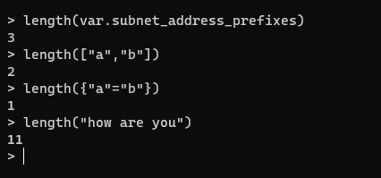
* Refer below for built in function under which go to > `Function` Select `Collection Function` for length and also there is lots of functions
  * [Refer Here](https://developer.hashicorp.com/terraform/language/functions)    
* Refer below direct length function
    * [Refer Here](https://developer.hashicorp.com/terraform/language/functions/length)  

# Formate Function:
  * [Refer Here](https://developer.hashicorp.com/terraform/language/functions/format)
  
  * The format function produces a string by formatting a number of other values according to a specification string. It is similar to the printf function in C, and other similar functions in other programming languages.

# IP Network Function:
  * cidrsubnet Function:
    * [Refer Here](https://developer.hashicorp.com/terraform/language/functions/cidrsubnet)
    
       * Example below
         * 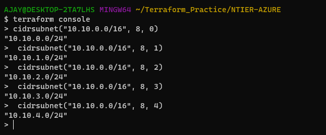
  * example for cidrsubnet function of code see below path
      * same folder-`\Terraform_Example_Code\NTIER-AWS\inputs.tf`  

# File Function:-
* file reads the contents of a file at the given path and returns them as a string.
  * [Refer Here](https://developer.hashicorp.com/terraform/language/functions/file)
* example of terraform code for file function refer below path:
   * `\Terraform_Example_Code\NTIER-AWS\inputs.tf\appserver.tf`  

# Terraform Graph:
  * The terraform graph command is used to generate a visual representation of either a configuration or execution plan. The output is in the DOT format, which can be used by GraphViz to generate charts.
  * Refer below for definition of graph
    * [Refer Here](https://developer.hashicorp.com/terraform/cli/commands/graph)
 * Click below link to view the terraform graph online viewer   
    * [Refer Here](https://www.google.com/search?q=dot+format+visualizer&rlz=1C1CHBD_enIN1051IN1051&oq=dotformate+visual&gs_lcrp=EgZjaHJvbWUqCQgBEAAYDRiABDIGCAAQRRg5MgkIARAAGA0YgAQyCggCEAAYhgMYigUyCggDEAAYhgMYigUyCggEEAAYhgMYigUyCggFEAAYhgMYigUyCggGEAAYhgMYigXSAQg4MjkzajBqN6gCALACAA&sourceid=chrome&ie=UTF-8)

# Index Function:
* index finds the element index for a given value in a list
* to find the which subnet is belongs to db1, and db2 we need to follow the method of collections function in that index_function
* [Refer Here](https://developer.hashicorp.com/terraform/language/functions/index_function) 

* below example of using terraform index function which tried in terraform console
* 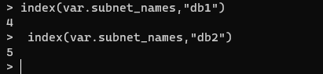

* index example below:
  * 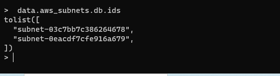

# Provisioners in Terraform:
 * [Refer Here](https://developer.hashicorp.com/terraform/language/resources/provisioners/syntax)

   * ### Local-exec Provisioner in Terraform  
   * means if want to get details of the resources created in the cloud to our local where terraform is running 
   * EG:- vpc_id, ec2_ipaddress etc. 

   * ### Remote-exec in Terraform
   * to run or execute some commands or scripts on remote resources which is already created or after creating it in the cloud ec2 machine 
   * EG:- ec2 machine 

   * ###  File Provisioner in Terraform
   * to copy some files or directories from our local where terraform is running to remote machine/ec2 which is running in the cloud 

 ### Provisioner Connection:
   * To establish remote connection, we need to pass connection information
   * Most provisioners require access to the remote resource via SSH or WinRM and expect a nested connection block with details about how to connect.
   * provisioner connection is needed for file and remote-exec provisioner to connect to remote machine is which is created by terraform 
  * [Refer Here](https://developer.hashicorp.com/terraform/language/resources/provisioners/connection) For Provisioner Connection Documents also connection block how to connect.

# Null-Resource in Terraform:
  * does nothing means if we want to run some commands or scripts on remote resource which is already created in the cloud which missing some block codes to add that we will use this null-resources   
  * EG:- local-exec, remote-exec, file
  * instead of tainting nul resource block is better since taint is not good idea always doing also there will some extra cost to company if we cross limit of taint. 
  * [Refer Here](https://registry.terraform.io/providers/hashicorp/null/latest/docs/resources/resource)
  
  * * command to run the null resource after first time:
    * `terraform apply -var "app_script_version=2,3"` so on.

# Backend in Terraform:
 * [Refer Here](https://developer.hashicorp.com/terraform/language/settings/backends/configuration)

  
  * A backend defines where Terraform stores its .state-file/state.tf file
  * to avoid the conflict between group of people workin together on same stat file.

### Types of Backend:
  * The default backend is local backend
  * Local — where the state file is stored on the local filesystem.
  * Remote — where the state file is stored in some remote filesystem

* There are many other available backends:
   * [Refer Here](https://developer.hashicorp.com/terraform/language/settings/backends/configuration#available-backends)

# State Lock in Terraform
  * out of many team members any one person does the terraform init with in the 1 miliseconds earlyer then other then that person use the terraform state file, the file will be lock until he does the work.
  then later lock will be released.
  * If supported by your backend, Terraform will lock your state for all operations that could write state. 
  * This prevents others from acquiring the lock and potentially corrupting your state. 
  * State locking happens automatically on all operations that could write state.
  *  in the s3 bucket block for state file storing in the common location we needs to add dynamodb table name is not locking features will not be avaiable 

# Workspace in Terraform:
  * why is workspace required in terraform because above we spoke about lock rite.
  * so in lock concept if one user is executing terraform code for dev env, and another user is executing terraform code for test env so then even if it is two different env terraform will stop executing the code at a time so lock acquire and lock release concept will take place so to get rid of this conflict, workspace has come into picture.

  * Terraform workspaces allows us to create multiple environments from the same template.
  * if users are two different env then lock should not apply or any problem terraform should accept it.
  * By default we were working with a workspace called as default
  * To create workspace in terraform, this is because if we want to run our terraform code in different environment     
  
  * terraform workspace commands:
     * terraform workspace --help
     * new, list, show, select and delete Terraform workspaces.

* Subcommands:
    * delete -   Delete a workspace
    * list    -  List Workspaces
    * new     -  Create a new workspace
    * select  -  Select a workspace
    * show   -   Show the name of the current workspace
    
    * EG:- terraform workspace new prod/dev/test
 * [Refer Here](https://developer.hashicorp.com/terraform/language/state/workspaces)
 * [Refer Here](https://developer.hashicorp.com/terraform/cloud-docs/workspaces) 

# For Each in Terraform(looping):
  * [Refer Here](https://developer.hashicorp.com/terraform/language/meta-arguments/for_each)
  * it is similar of count argument to create multiple resources 
* This is For Loop Concept 
* to create multiple resources we can use this for each concept

# conditional expression in Terraform:
 * conditional resource creation refer below:
 * [Refer Here](https://developer.hashicorp.com/terraform/language/expressions/conditionals)

* conditional expression in terraform refer to boolean means true or false, if true means do this...
if false means do that...
* A conditional expression uses the value of a boolean expression to select one of two values
* means if statement if prod env then create 2 ec2 machine, else dev env create 1 ec2 machine 

# Import/Importing terraform resources:
* Use the terraform import command to import existing infrastructure to Terraform state
* The terraform import command can only import one resource at a time. It cannot simultaneously import an entire collection of resources, like an AWS VPC.
* using this option we can import the resource which is already created in the cloud env to our local terraform installed it will import to state file
* [Refer Here](https://developer.hashicorp.com/terraform/cli/import)   

* Command to import Azure Resources:
  * `terraform import <resource_name>.<resource_reference_name><space><resource_id>`
  * `terraform import azurerm_resource_group.import"/subscriptions5e29be3b-772d-4a03-9b7a-9990573f645e/resourceGroups/import"`
  * then to see imported resources `terraform show`

* Command to import AWS Resources:
  * `terraform import <resource_name>.<resource_reference_name><space><resource_id>`
  * `terraform import aws_vpc.My-VPC vpc-0665c6b26833adb4c`
  * then to see imported resources `terraform show`

# Modules/Reusability in terraform:

* means we can use modules for deploying infrastructure  with multiple env, keeping source file same location nor in different location just specifying source - location of module files in modules  and also multiple .tf files

* for terraform registry refer below link:
    * [Refer Here](https://registry.terraform.io/)

      * then select which providers required and then check for modules below one example for AWS:
        * [Refer Here](https://registry.terraform.io/providers/hashicorp/aws/latest)  

* Terraform registry is collection of public modules
       
  * modules can be used from various sources refer below:
     * [Refer Here](https://developer.hashicorp.com/terraform/language/modules/sources)


# LifeCycle in Terraform:
  * lifecycle means already created resources needs to do some changes or is there some mistake in created resource, we use below options like.

### create_before_destroy:
   *  if we adopt this option before destroying the resources, it will create and then it will destroy, without creating it will not destroy it.

###  prevent_destroy:
   
   * using this option we safe guard our resources already created cannot do any changes or destroy to our created resources.   

### ignore_changes:

  * using this option we can ignore any changes we have done to our existing or created resources by done in manually in aws web ui and again if we run the terraform it will ignore all the changes what we have done it.

* [Refer Here](https://developer.hashicorp.com/terraform/language/meta-arguments/lifecycle) for above life cycle


 # Activity Practice to work with terraform code 
* follow first version of writing terraform code 
    * like creating what ever resource first manually then understand the arguments and inputs make a note then try to implement in terraform code
* i written the terraform code for this example in two place please refer it
   * 1st place same folder `Terraform_Example`
   * 2nd place this path /c/Users/AJAY/Terraform_Practice
* should create aws crendential for aws provider to authenticate between terraform and aws
   * Handling credenitals in AWS
   * install aws cli
   * aws configure
   * Refer Here for user creation and generate access key and secret key in AWS
   * [Refer Here](https://sst.dev/chapters/create-an-iam-user.html)
* Refer Here AWS Authentication and Configuration
     * [Refer Here](https://registry.terraform.io/providers/hashicorp/aws/latest/docs#authentication-and-configuration)

* 6  ways out of which 2 ways below shown of providing our aws credentials to authenticate terraform between aws providers
    * 1st providing access key and secret key directly in the aws providers block
    * once we have done the work delete the access key and secret key in the aws console 
    * 2nd doing aws configure in the commandline provide below details:
       * aws configure => enter
       * AWS Access Key ID [None]: `XXXXXX`
       * AWS Secret Access Key [None]: `XXXX`
       * Default region name [None]: `us-west-2`
       * Default output format [None]: `nothing just enter`
       * aws configure is ready now no need to pass access key and secret key in the providers block
* when we do aws configure what will happen is below
* under our home like below
   * /c/Users/AJAY/.aws/configure and /credentials will store the in this directory and it will keep using it 

# Create a storage account in Azure:

* [Refer Here](https://learn.microsoft.com/en-us/azure/storage/common/storage-account-create?tabs=azure-portal) storage account in Azure

* **Manual steps taken from azure cloud console the requirements for prepare terraform code**

* Resources:
    * Resource Group
        * inputs:
           * name
           * location
* storage account 
    * inputs:
      * resource group name
      * location
      * name of storage account
* [Refer Here](https://registry.terraform.io/providers/hashicorp/azurerm/latest/docs) for terraform provider

* [Refer Here](https://registry.terraform.io/providers/hashicorp/azurerm/latest/docs#authenticating-to-azure) The ways of Authenticate Azure in Terraform 
* [Refer Here](https://learn.microsoft.com/en-us/cli/azure/install-azure-cli) install azure cli for which ever os

* **Terraform supports 5 number of different methods for authenticating to Azure out of which one is shown below**
* Authenticating using the Azure CLI
     * az login 
     * it will display below screen shot then login to browser 
     * 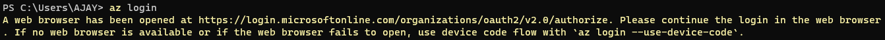
     * then it will show all ur authentication relates stuff which is there in the azure cloud 
     * finally ur authenticated below screen shot
     * 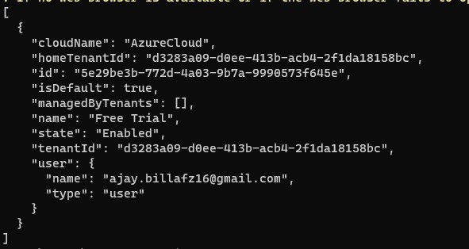
* [Refer Here](https://registry.terraform.io/providers/hashicorp/azurerm/latest/docs/resources/resource_group) for resource group docs
* below screen shot for resource group name
    * 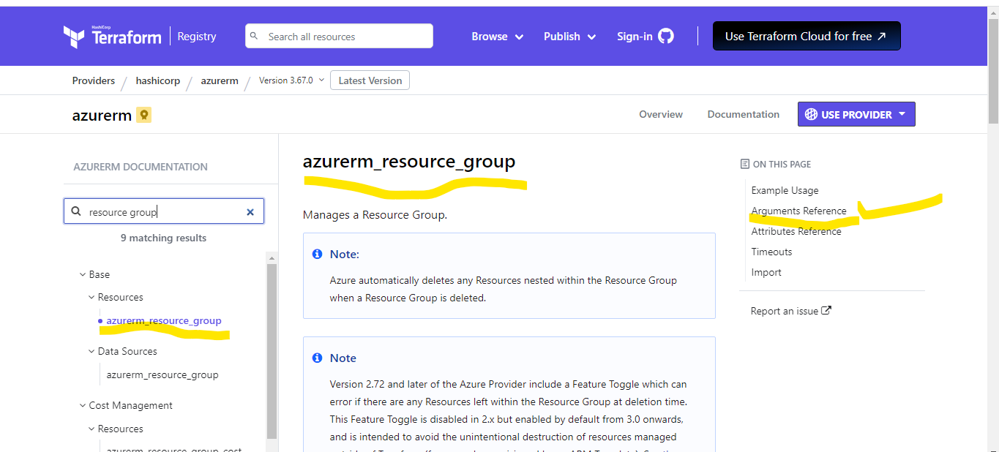

* [Refer Here](https://registry.terraform.io/providers/hashicorp/azurerm/latest/docs/resources/storage_account) for resource group docs

* below screen shot for resources
     * 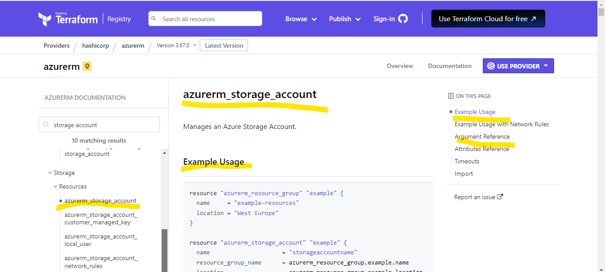

 * [Refer Here](https://github.com/asquarezone/TerraformZone/commit/3c82fe735bee3e9d83579ba377d3f447f0605329) Khaja sir repo refer for any details


* **Order of resource Creation in Azure**
   * Order of creation can be acheived in two ways:

      * **explicit dependency:** using `depends_on`
          * explicit means i will terraform please depends on this item first to create before you create that item
          * [Refer Here](https://developer.hashicorp.com/terraform/language/meta-arguments/depends_on) depends_on documents
      * **implicit dependency:** Terraform figures out by looking at your configuration/template which created it will do by itself
         * When the output (attribute) of one resource is used as input (argument) to other
     * **Technique:** To use one resource in other resource argument `<provider_resource_type>.<name>`    
    ```
    depends_on = [ azurerm_resource_group.myresg ]
    ```
    * Implicitly Dependencies is there way to write below example please refer for understanding
       * [Refer Here](https://github.com/asquarezone/TerraformZone/commit/d08e36cd8bd1c68069d85e364f4ca623ce658c55)
```
provider "azurerm" {
  features {
  }

}

resource "azurerm_resource_group" "myresg"{
  name     = "fromtf"
  location = "eastus"
}

resource "azurerm_storage_account" "first" {
  name                     = "fromtffortf"
  resource_group_name  = azurerm_resource_group.myresg.name"
  location = azurerm_resource_group.myresg.location"
  account_tier             = "Standard"
  account_replication_type = "GRS"
} 
```      
# Best Practice to write terraform template:
* Terraform reads all the .tf files in the folder and then combines as one file and executes the terraform => While writing terraform templates there is no need write everything in one file
* From now one lets have one tf for provdier and then one tf file for logical group of resources.
* All the variables will be in one file inputs.tf and all the outputs will be in the file outputs.tf
* 

# Example Architecture:

* Azure

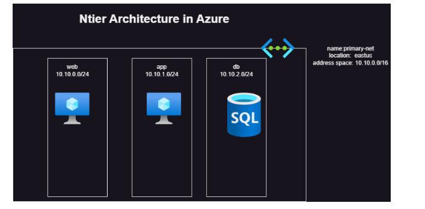


## ntier network in Azure:-
* Manual steps
    * Create a resource group
    * Create a vnet [Refer Here](https://learn.microsoft.com/en-us/azure/virtual-network/quick-create-portal) Quick Start for screenshots
    * network range: 10.10.0.0/16
        * subnets:
           * web: 10.10.0.0/24
           * app: 10.10.1.0/24
           * db: 10.10.2.0/24
* **Now lets create ntier-vnet virtual network manually:**
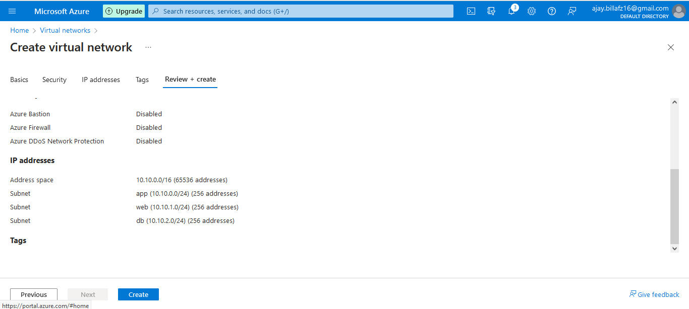

* After creating virtual network looks like this below:
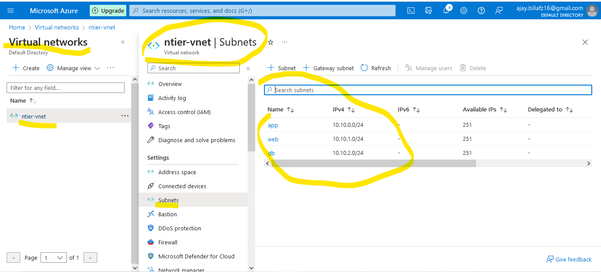

Terraform implementation:
--------------------------
* above created virtual-network manually will be creating same with using terraform code please look below:

* check for code in same terraform folder that is `Terraform_Example_Code\ntier-vnet` for the for basic structure of terraform files.

* manually created virtual network in the azure portal below:
* 

### Variables Concept:
   * check this below path for code and refer the below terraform document for variable understanding better
   * same folder `\Terraform\Terraform_Example_Code\NTIER-AZURE`
* ntier-azure: adding 3 subnets:
   * CIDR Ranges
     ```
     web: 10.10.0.0/24
     app: 10.10.1.0/24
     db: 10.10.2.0/24
     ``` 
* terraform created in the same folder check below path
   * same folder `\Terraform_Example_Code\NTIER-AZURE`     

   
* ### To pass input variables we have two options
  * **Option 1:**
      * option for users to pass the value instead of taking it default value which is mention in the variable.tf file `-var`
      * a) Example command: `terraform apply -var 'resource_group_name=ntier-dev' -var 'location=eastus'
      * b) Example command: below screen shot, also we have to remove default value which we mentioned in the variable.tf file
      * 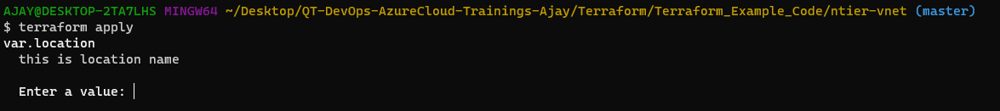 

 * **Option 2:** 
     * create a file with variable values and  
     executing the below command directley after creating .tfvars file and putting all the variables their.
        * Example Command: `terraform apply -var-file="dev.tfvars`
### Variable Definitions `(.tfvars)` Files and command to execute refer below
   * [Refer Here](https://developer.hashicorp.com/terraform/language/values/variables#variable-definitions-tfvars-files)

* example of count arguments code check below path
   * same folder `\Terraform_Example_Code\NTIER-AZURE\inputs.tf/network.tf`

*  example of Length function code check below path
   * same folder `\Terraform_Example_Code\NTIER-AZURE\inputs.tf/network.tf` 

example of format function code check below path
   * same folder `\Terraform_Example_Code\NTIER-AZURE\inputs.tf/network.tf`

* IP Network Function:
  * fixing cidr range issue with terraform cidrsubnet functions
  * example of cidr function code check below path
  * same folder `\Terraform_Example_Code\NTIER-AZURE\inputs.tf/network.tf`

* Creating a Network security group for
  * web
    * incoming:
        * http (80): allow to all
        * ssh (22): allow to all
  *  terraform code for web network security group and security rules created in the same folder check below path
   * same folder `\Terraform_Example_Code\NTIER-AZURE\inputs.tf\dev.tfvars\network.tf`

  * app
     * incoming:
        * ssh (22): allow to all
*  terraform code for app network security group and security rules created in the same folder check below path  
   * same folder  `\Terraform_Example_Code\NTIER-AZURE\inputs.tf\dev.tfvars\network.tf`

* for terraform code resource documents for network security group creation refer below:
    * [Rfer Here](https://registry.terraform.io/providers/hashicorp/azurerm/latest/docs/resources/network_security_group)   

### Creating an azure sql database:**

  * Manual steps:
    * [Refer Here](https://learn.microsoft.com/en-us/azure/azure-sql/database/single-database-create-quickstart?view=azuresql&tabs=azure-portal)

* terraform code for qzure sql database and sql server refer below:
   * Please Note:
      * azurerm sql server is depcreated to below name
      * azurerm mssql server so please follow same name to create resources 
  * [Refer Here](https://registry.terraform.io/providers/hashicorp/azurerm/latest/docs/resources/mssql_database)   for mysql_server
  * [Refer Here](https://registry.terraform.io/providers/hashicorp/azurerm/latest/docs/resources/sql_database) sql server 

* terraform code for sql server and sql database refer below path:
  * same folder -`\Terraform_Example_Code\NTIER-AZURE\dev.tfvars\inputs.tf\database.tf` 

### creating VM in Azure:
* Manual steps:
  *  network: ntier-vnet
   * subnet
   * public ip address
   * network security group
   * network interface

* refer here for manual steps VM [Refer Here](https://learn.microsoft.com/en-us/azure/virtual-machines/linux/quick-create-portal?tabs=ubuntu)

* **Points To Note:**
   * in azure to access our vm , we need virtutal network, subnets, network security group, which already we have 
   * but we dont have network interface and public ip which we can access our vm through public ip to connect with private ip and access our vm and app this is flow of environment.
* Flow of below and above creation:
  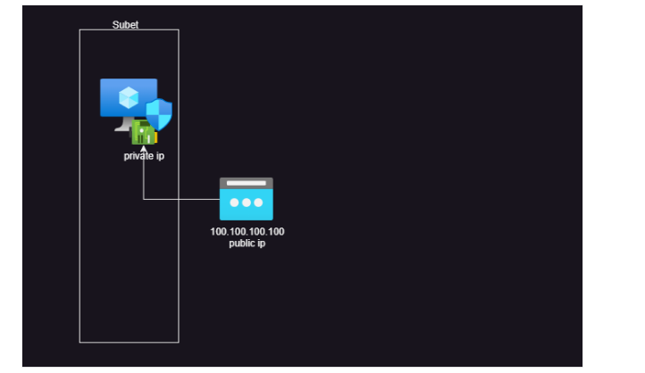

* So now lets create:
  * public ip: 
     * [Refer Here](https://registry.terraform.io/providers/hashicorp/azurerm/latest/docs/resources/public_ip) 

     * terraform code for creation of public ip refer below path:
        * `\Terraform\Terraform_Example_Code\NTIER-AZURE\appvm.tf\inputs.tf`  


  * network interface:
     * [Refer Here](https://registry.terraform.io/providers/hashicorp/azurerm/latest/docs/resources/network_interface) 

 * terraform code for creation of network interface refer below path:
        * `\Terraform\Terraform_Example_Code\NTIER-AZURE\appvm.tf`

* network interface and security group association:
  * [Refer Here](https://registry.terraform.io/providers/hashicorp/azurerm/latest/docs/resources/network_interface_application_security_group_association)   

* terraform code for creation of network interface and security group association refer below path:
        * `\Terraform\Terraform_Example_Code\NTIER-AZURE\appvm.tf`

* For creating Azure linux virtual machine:
   * [Refer Here](https://registry.terraform.io/providers/hashicorp/azurerm/latest/docs/resources/linux_virtual_machine)
* terraform code to create azurerm_linux_virtual_machine:

  * apply the template and view the resources visualier:

     * 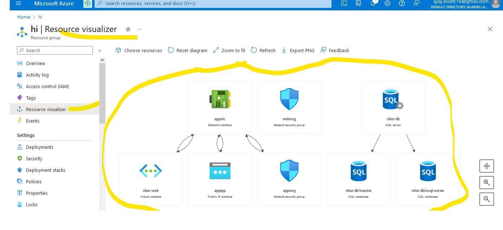

### To check source_image_reference refer below:
  * [Refer Here](https://learn.microsoft.com/en-US/cli/azure/vm/image?view=azure-cli-latest#az-vm-image-list)  
    
* VM Created Belwo screen shot:    
* 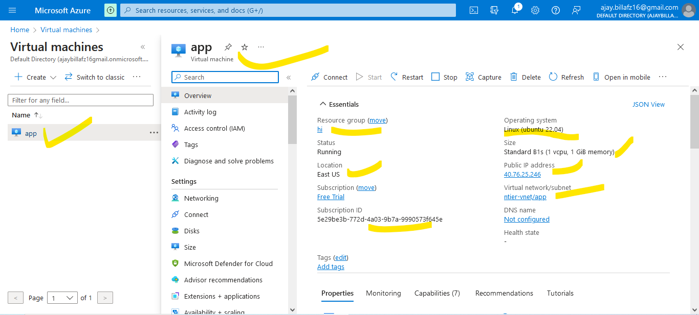    
* Successful Login:
  * 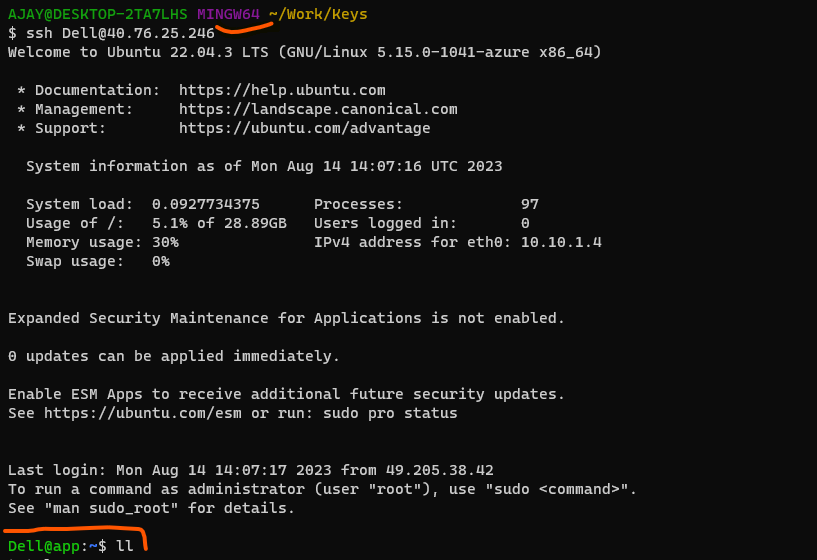

# Null Resource:

* using null resource we have created terraform code and used provisioners like - file, remote-exec and local-exec
* command to run the null resource after first time:
    * terraform apply -var "app_script_version=2,3" so on..
* terraform code for file, null resource, remote-exec and local-exec, please refer below path:
  * `\Terraform_Example_Code\NTIER-AZURE\appvm.tf\inputs.tf\dev.tfvars`

* as our aim successfully used null resource and used remote-exec done some thing below screen shot:

 * 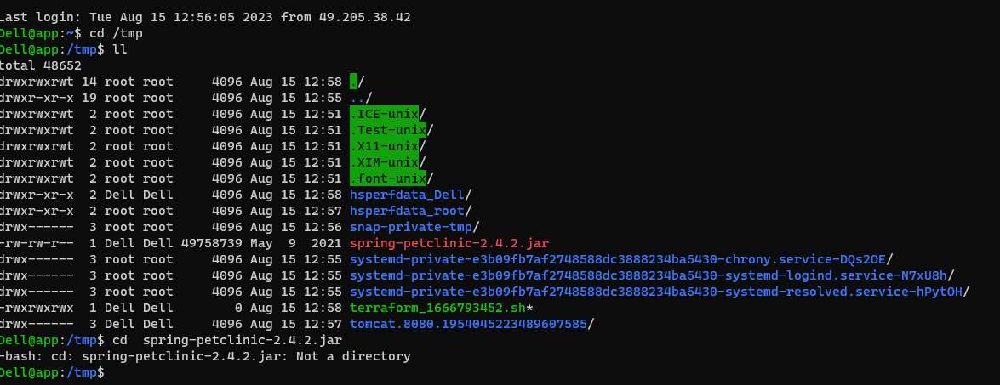

* Local-exec Provisioner in Terraform  
   * means if want to get details of the resources created in the cloud to our local where terraform is running 
   * EG:- vpc_id, ec2_ipaddress etc. 

* * terraform code for file, null resource, local-exec please refer below path:
  * `\Terraform_Example_Code\NTIER-AZURE\appvm.tf\inputs.tf\dev.tfvars`

* exambple below screen shot:

  * 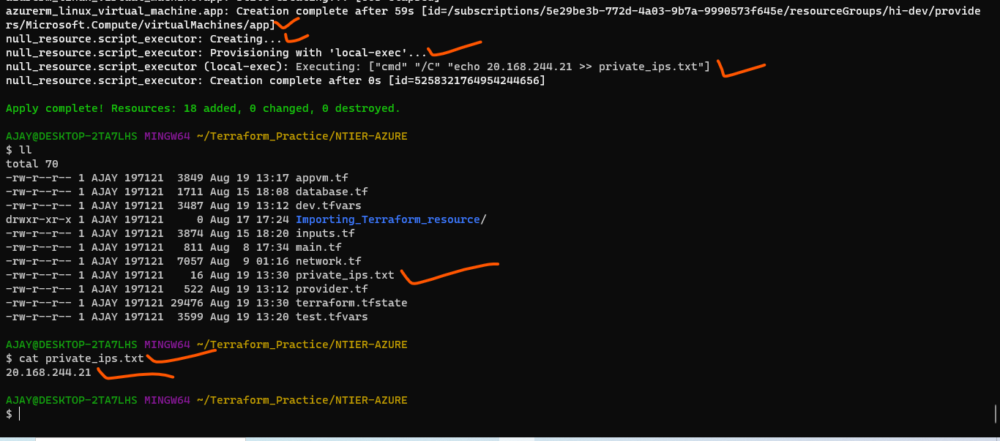


# AZURERM as Backend in Azure:

 * [Refer Here](https://developer.hashicorp.com/terraform/language/settings/backends/azurerm) for Azurerm Backend

 * here not required anything extra like dynamodb_table for locking, azurerm is supported default by locking

  * when one user is executing terraform code see the below screen shot that lock is acquiring, so that another user cannot access it.

  * 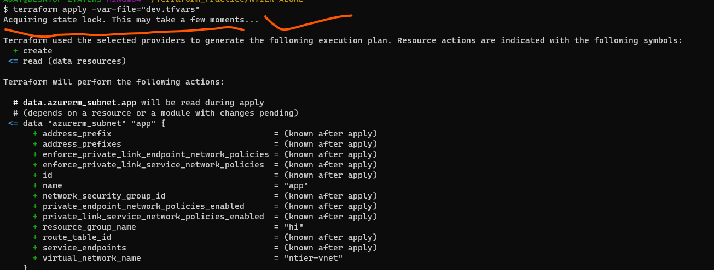

* when one user is finished executing the terraform code then lock is released by default below screen shot:
  
  * 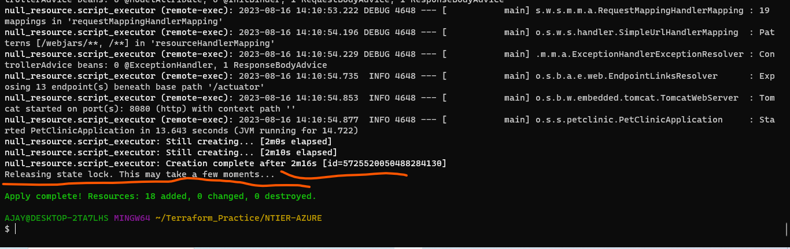
 
* for terraform code for backend and dynamodb refer below path:
`\Terraform_Example_Code\NTIER-AZURE\provider.tf`

# Workspace usage:
  * [Refer Here](https://developer.hashicorp.com/terraform/language/state/workspaces)
* [Refer Here](https://developer.hashicorp.com/terraform/cloud-docs/workspaces)

* after creating new workspace below screen shot:
  * 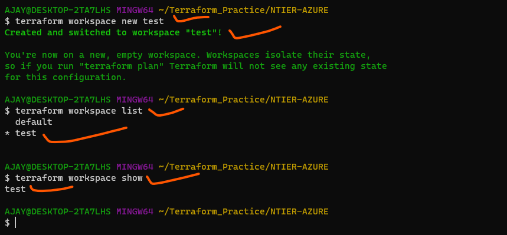

* if users work in two different env like dev and test then terraform will not restrict and apply lock it will allow to work on it.

* created new workspace called `test`
 * 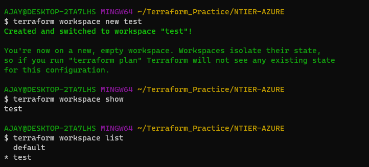

* workspace dafault is executing the terraform code as dev.tfvars and at same time when test workspace is executing below screen shot:
   *  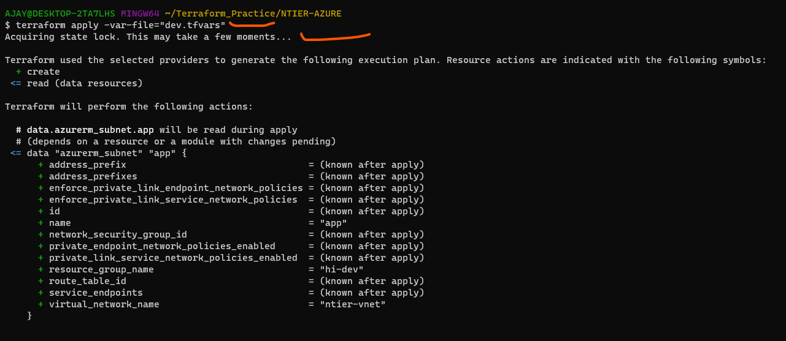

* workspace test is executing the terraform code as test.tfvars and at the same time when default workspace is executing below screen shot:
* 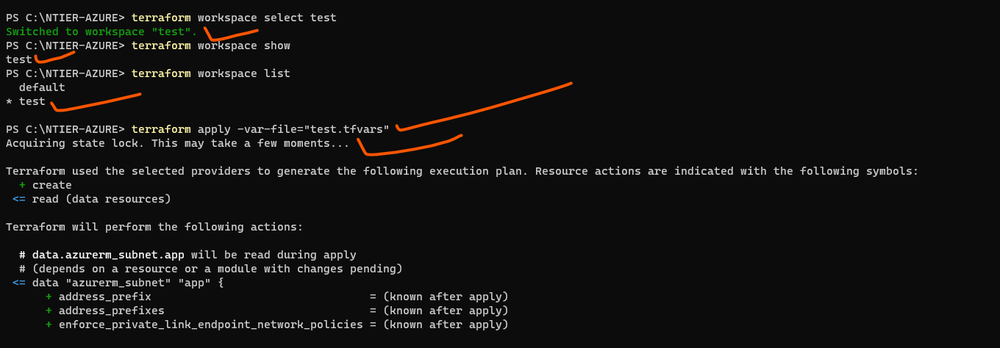

* below screen shot we can see 2 state file(state.tf file)

* 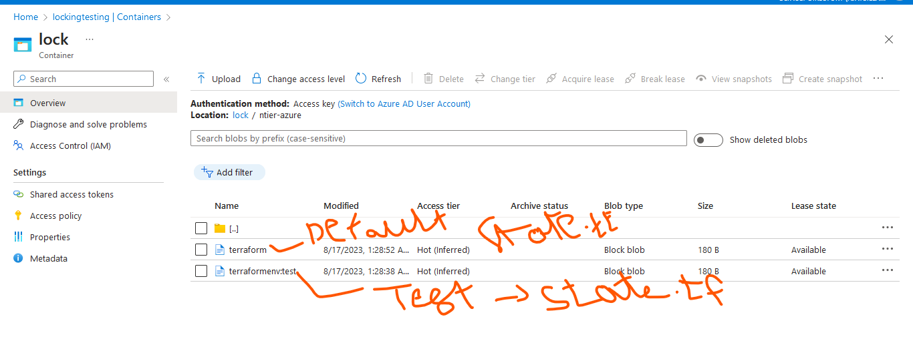


# Import/Importing terraform resources:
* Use the terraform import command to import existing infrastructure to Terraform state
* Command to import Azure Resources:
  * `terraform import <resource_name>.<resource_reference_name><space><resource_id>`
  * `terraform import azurerm_resource_group.import"/subscriptions5e29be3b-772d-4a03-9b7a-9990573f645e/resourceGroups/import"`
  * then to see imported resources `terraform show`
  * below screen shot:
  
  * 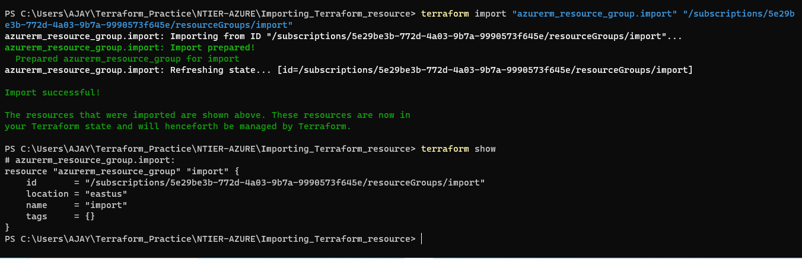

* terraform code for importing resource refer below path: 
  `\Terraform_Example_Code\NTIER-AZURE\Importing_Terraform_resource\maint.tf\provider.tf`


# Modules/Reusability in Terraform AZURE:
* In Azure to create resources in two different subscriptions/accounts, is possbile refer below
 * [Refer Here](https://build5nines.com/terraform-deploy-to-multiple-azure-subscriptions-in-single-project/)


# Example Architecture:
 * AWS

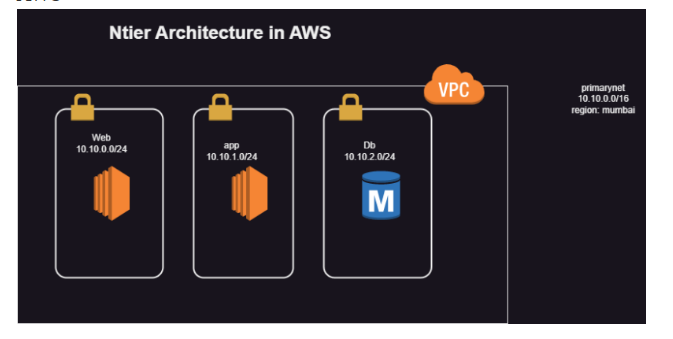

## ntier network in AWS

  * Manual steps:
    * Create a vpc
      * network: 10.10.0.0/16 => 10.10.x.x ( 10.10.0.0 to 10.10.255.255)

      * do it in AWS console for manual 
* terraform code is created check in the same folder below path
  * same folder-`\Terraform\NTIER-AWS\locals.tf`

* Lets add one subnet
   * cidr: 10.10.0.0/24 => 10.10.0.x => 10.10.0.0 to 10.10.0.255
     * name: web 1
* terraform code is created check in the same folder below path
   * same folder `\Terraform\NTIER-AWS`

* adding 5 more subnets:
   * CIDR Ranges:
```
web2: 10.10.1.0/24
db1: 10.10.2.0/24
db2: 10.10.3.0/24
app1: 10.10.4.0/24
app2: 10.10.5.0/24
```
* terraform code is created for above 6 subnets please check in the same folder below path
   * same folder `\Terraform_Example_Code\NTIER-AWS\inputs.tf`
   
* example of count arguments code check below path
   * same folder `\Terraform_Example_Code\NTIER-AWS\inputs.tf/main.tf`

*  example of Length function code check below path
   * same folder `\Terraform_Example_Code\NTIER-AWS\inputs.tf/main.tf` 

example of format function code check below path
   * same folder `\Terraform_Example_Code\NTIER-AWS\inputs.tf/main.tf`

* IP Network Function:
  * fixing cidr range issue with terraform cidrsubnet functions
  * example of cidr function code check below path
  * same folder `\Terraform_Example_Code\NTIER-AWS\inputs.tf/main.tf`

* example for locals block of code see below path
      * same folder-`\Terraform\NTIER-AWS\locals.tf`

* creating security groups for 
   * web
     * ingress:
     * http (80): allow to all
     * ssh (22): allow to all
   * app
     * ingress:
     * ssh (22): allow to all
     * ssh (8080): allow to all
   * db:
     * ingress:
     * tcp 3306: allow within vpc range      
* try creating a security groups by using list(object) as input type

    * [Refer Here](https://registry.terraform.io/providers/hashicorp/aws/latest/docs/resources/security_group)

* terraform created for security group and security rules refer below path:
   * same folder - `\Terraform_Example_Code\NTIER-AWS\securitygroup.tf`

* In AWS to make network/vpc to work:
   * We need to create an internet gateway and attach to vpc
   * We need to add route to the default route table to internet gateway
* for above this above default route table we will use datasource option in terraform to fetch the information also refer below concept of datasource

## Internet Gateway:
   * [Refer Here](https://registry.terraform.io/providers/hashicorp/aws/latest/docs/resources/internet_gateway#argument-reference)
   * for terraform code for internet gateway refer below path:
   * same folder `\Terraform_Example_Code\NTIER-AWS\main.tf`

* **internet_gateway_attachment**
    * [Refer Here](https://registry.terraform.io/providers/hashicorp/aws/latest/docs/resources/internet_gateway_attachment) 

    * for terraform code for internet gateway refer below path:
   * same folder `\Terraform_Example_Code\NTIER-AWS\main.tf`

* **needs to attach internet gateway to route table 
in aws route table i need to route**
* [Refer Here](https://registry.terraform.io/providers/hashicorp/aws/latest/docs/resources/route)
* for terraform code for internet gateway refer below path:
   * same folder `\Terraform_Example_Code\NTIER-AWS\main.tf\locals.tf`

### Creating a rds database in AWS:
* Manual steps:

   * region: us-west-1
   * database engine: mysql
   * db instance type/size: db.t2.micro
   * storage: 20 GB
   * vpc security group
   * db subnet group:
     * this is group of subnets

* terraform documents for aws_db_instance code refer below:
   * [Refer Here](https://registry.terraform.io/providers/hashicorp/aws/latest/docs/resources/db_instance)

* Terraform Index Function:
    * to find the which subnet is belongs to db1, and db2 we need to follow the method of collections function in that index_function
    * [Refer Here](https://developer.hashicorp.com/terraform/language/functions/index_function) 
     * below example of using terraform index function
     which tried in terraform console
     
     

* terraform document for aws_db_subnet_group creation refer below:
  * [Refer Here](https://registry.terraform.io/providers/hashicorp/aws/latest/docs/resources/db_subnet_group)

* terraform code for database and subnets groups refer below path:

  * same folder - `\Terraform_Example\NTIER-AWS\database.tf`

### Creating ec2 machine in AWS:

* Manual Steps:
  * import key pair (generate key pair)
  * Figure out ami id for os ami-0f8e81a3da6e2510a
  * instance type t2.micro
  * select security group

* terraform code for import key pair refer below path:
  * `\Terraform\Terraform_Example_Code\NTIER-AWS\inputs.tf\appserver.tf` 


* To Import ssh public key refer below terraform document:
   * [Refer Here](https://registry.terraform.io/providers/hashicorp/aws/latest/docs/resources/key_pair)
* Instead of giving full public key in the terraform code or path we are using file function to call that variable.
### File Function:-
* file reads the contents of a file at the given path and returns them as a string.
  * [refer Here](https://developer.hashicorp.com/terraform/language/functions/file)

* Creating or Generating the key pair in terraform:
   * [Refer Here](https://registry.terraform.io/providers/hashicorp/tls/latest/docs/resources/private_key)

   * for terraform code creating or generating key pair refer below path:
     * `\Terraform_Example_Code\NTIER-AWS\generating_private_key\main.tf`
     * Commands:
       * terraform output private_key
       * terraform output -raw private_key
       * terraform output public_key
   * refer below screen shot:
      * 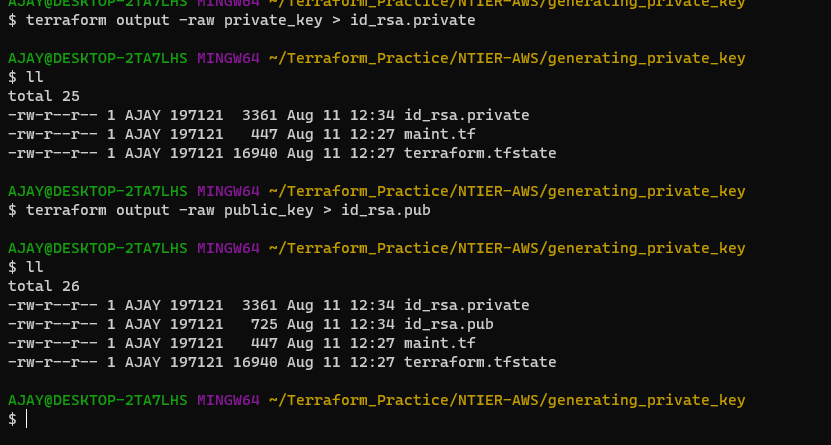    

### creating ec2 machine in aws for appserver
* for terraform code to create ec2 machine refer below:
  * [Refer Here](https://registry.terraform.io/providers/hashicorp/aws/latest/docs/resources/instance) 

### Install jenkins or spring pet clinic ec2:
* Manual steps to install jenkins:
```
#!/bin/bash
curl -fsSL https://pkg.jenkins.io/debian-stable/jenkins.io-2023.key | sudo tee \
  /usr/share/keyrings/jenkins-keyring.asc > /dev/null
echo deb [signed-by=/usr/share/keyrings/jenkins-keyring.asc] \
  https://pkg.jenkins.io/debian-stable binary/ | sudo tee \
  /etc/apt/sources.list.d/jenkins.list > /dev/null
sudo apt update
sudo apt install openjdk-17-jdk -y
sudo apt install jenkins -y
``` 

```
sudo apt update
sudo apt install openjdk-11-jdk -y
cd /tmp && wget https://referenceapplicationskhaja.s3.us-west-2.amazonaws.com/spring-petclinic-2.4.2.jar
java -jar /tmp/spring-petclinic-2.4.2.jar &

```
   * using remote-exec provisioner and adding connection provisioner or block to connect ec2 machine
   * terraform code for remote-exec, file, and connection provisioners please refer below path:
     * `\Terraform_Example_Code\NTIER-AZURE\appvm.tf\inputs.tf\installjenkins.sh`
   * using null resource and utilized remote-exec provisioner
      * terraform code for null resource refer below path
      * `\Terraform_Example_Code\NTIER-AZURE\appvm.tf\inputs.tf\`

# S3 Bucket as Backend in AWS:

* Lets apply backend to ntier-aws, so that let to store state file in s3 bucket:
  * [Refer Here](https://developer.hashicorp.com/terraform/language/settings/backends/s3)    

* created the s3 bucket in the amazon website ui, then we can use that bucket name in the backend block to store the state file in the s3 bucket.
   * below screen shot created s3 bucket

    * 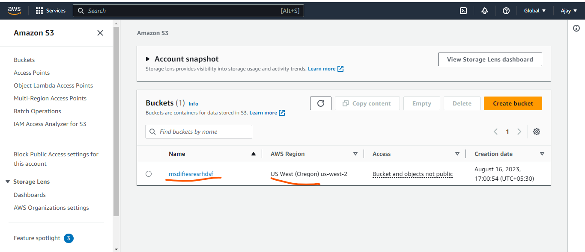

* alo create dynamodb db table for availing the 
lock ing system for our state file.
 
 * below screen shot created Dynamodb table

    * 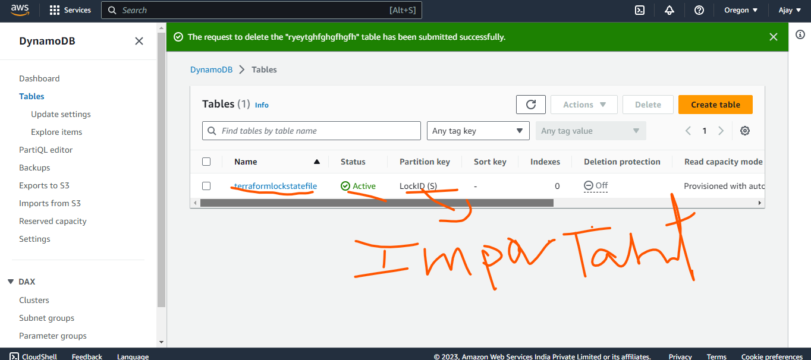
 * in the s3 bucket block for state file storing in the common location we needs to add dynamodb table name if not locking features will not be avaiable 
* As we have observed when multiple users try to execute at the same time only user gets the lock and others user have to wait till the lock is released

 * when one user is executing terraform code see the below screen shot that lock is acquiring, so that another user cannot access it.

  * 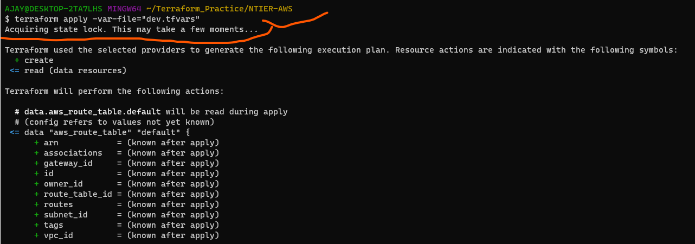
  * 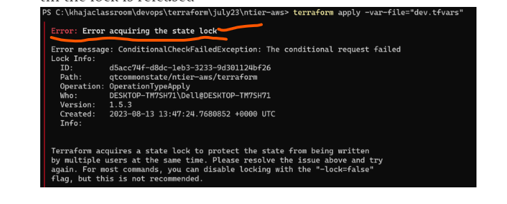
  

* when one user is finished executing the terraform code then lock is released by default below screen shot:
  * 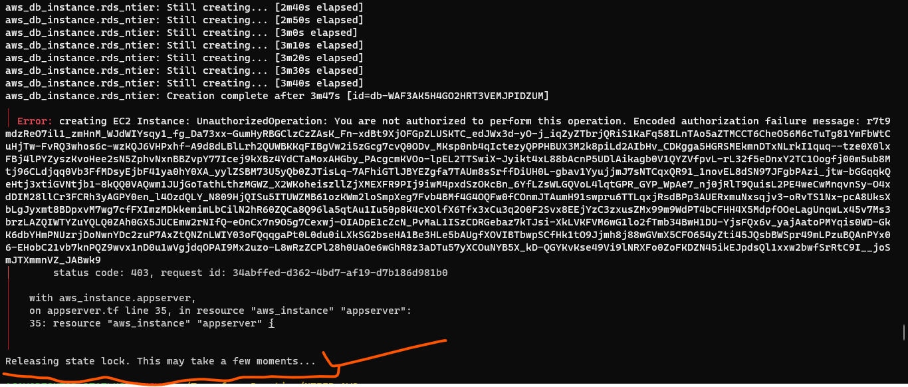
 

* for terraform code for backend and dynamodb refer below path:
`\Terraform_Example_Code\NTIER-AWS\provider.tf`


# For_Each Argument(looping):
  * to create mutiple resource we use for_each same like count, there is no difference in it.

  * terraform code for for_each refer below path:

    * `\Terraform_Example_Code\NTIER-AWS\For_Each/main.tf\inputs.tf`

# Random String:
* [Refer](https://registry.terraform.io/providers/hashicorp/random/latest/docs/resources/password.html)
* if we want to create random string then we can use this. 

# conditional expression in Terraform:
 * conditional expression in terraform refer to boolean means true or false, if true means do this...
if false means do that...

* terraform code for conditional expression refer below path:

 * `\Terraform_Example_Code\NTIER-AWS\Conditional_Expression/main.tf\`


# Import/Importing terraform resources:
* Use the terraform import command to import existing infrastructure to Terraform state
* Command to import Azure Resources:
  * `terraform import <resource_name>.<resource_reference_name><space><resource_id>`
  * `terraform import aws_vpc.My-VPC vpc-0665c6b26833adb4c`
  * then to see imported resources `terraform show`
  * below screen shot:
  
  * 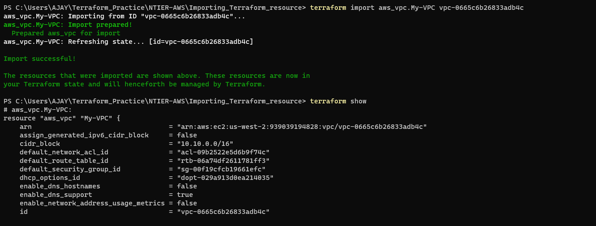

* terraform code for importing resource refer below path: 
  `\Terraform_Example_Code\NTIER-AWS\Importing_Terraform_resource\main.tf\provider.tf`

# Modules/Reusability in terraform:
 
* means we can use modules for deploying infrastructure  with multiple env, keeping source file same location nor in different location just specifying source - location of module files in modules  and also multiple .tf files 
 * for terraform registry refer below link:
    * [Refer Here](https://registry.terraform.io/)
* then select which providers required and then check for modules below one example for AWS:
  * [Refer Here](https://registry.terraform.io/providers/hashicorp/aws/latest)    

* [Refer Here](https://registry.terraform.io/modules/terraform-aws-modules/vpc/aws/latest) for vpc module

* [Refer Here](https://developer.hashicorp.com/terraform/language/modules) for terraform modules

* Terraform registry is collection of public modules
* modules can be used from various sources refer below:
  * [Refer Here](https://developer.hashicorp.com/terraform/language/modules/sources)

 ### Lets create  a vpc in us-west-2a/2b for example of modules:
* for modules below one example for AWS vpc creation:
  * [Refer Here](https://registry.terraform.io/providers/hashicorp/aws/latest)    

* terraform code for modules creation for vpc refer below:
  * `\Terraform_Example_Code\NTIER-AWS\Modules_Reusability\vpc.tf\provider.tf`

### Lets Create a module to create aws security group:
* here we are creating modules for security groups and module source in different location so that while creating source module we just needs to provide the modules security groups location in the source module and with values for variables which we have given in the modules security groups inputs.tf file so that it will create the resources.
* over hall idea is of module to reuse the code and also as per our connivent we give different values in the source module main.tf file so that according to our define values infrastructure will be created.

### Local Path:
* terraform code for modules security group refer below path:
* `\Terraform_Example_Code\NTIER-AWS\Modules_Reusability\module_demo\modules\securitygroup\inputs.tf\main.tf\output.tf`

* terraform code for module source refer below path and this module source file ran form one step behind folder so hence it is local path: 
* `\Terraform_Example_Code\NTIER-AWS\Modules_Reusability\moduledemo\main.tf\providers.tf`

* Terraform supports connecting to same cloud using provider, this is usual acitivity
* but where as terraform even supports with alias for different configurations as part of one deployment
 * In AWS if we want terraform to create resources in two different regions or two different accounts, it is possbile by doing with help of providers alias refer blow ofr aws. 
    * [Refer Here](https://developer.hashicorp.com/terraform/language/providers/configuration)


### Github Repo(Remote Path):
* terraform code for modules security group refer below path: this code is in github repo:
* `github.com/AjayKumarRamesh/QT-DevOps-AzureCloud-Trainings-Ajay/tree/master/QT_Module_Practice/securitygroup`

* terraform code for module source and  refer below path: and this code is in local path so from local path we have mentioned the source location to github repo above is shown and executed terraform command:
* `\Terraform_Example_Code\NTIER-AWS\Modules_Reusability\moduledemo\main.tf\providers.tf`


# LifeCycle in Terraform:

#### create_before_destroy:
    
* terraform code for create_before_destroy refer below path:
     \Terraform\Terraform_Example_Code\NTIER-AWS\Life_cycle\main.tf\providers.tf

  * 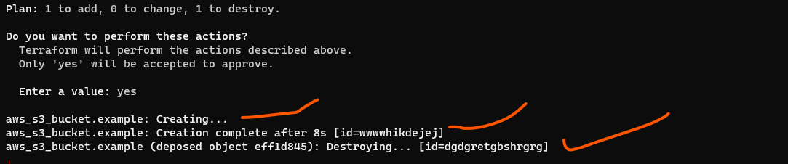


###  prevent_destroy:
   
* terraform code for prevent_destroy refer below path:
     \Terraform\Terraform_Example_Code\NTIER-AWS\Life_cycle\main.tf\providers.tf

### ignore_changes:

 * terraform code for prevent_destroy refer below path:
     \Terraform\Terraform_Example_Code\NTIER-AWS\Life_cycle\main.tf\providers.tf

     

## Concept of Datasources:
 * **Datasources:**
     * Datasources in terraform allows us to fetch information from provider
     * [Refer Here](https://developer.hashicorp.com/terraform/language/data-sources) for terraform Datasources documents
* to search in terraform about datasource refer below
  * [Refer](https://registry.terraform.io/providers/hashicorp/aws/latest/docs)
  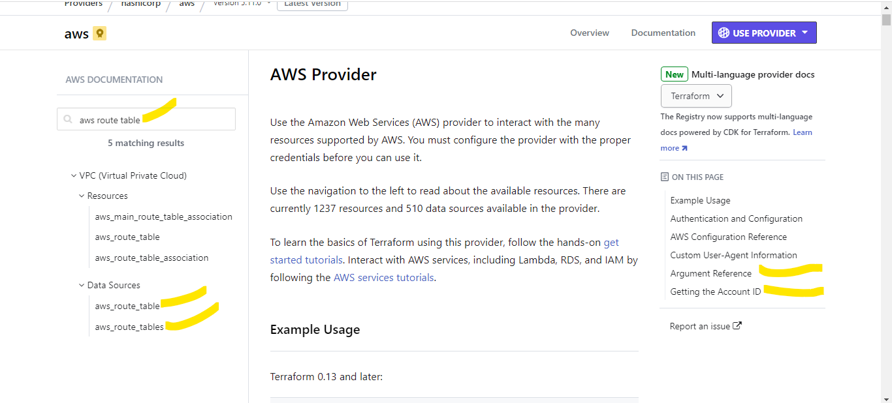
* terraform code is created for datasource please refer below path:
    * same folder - `\Terraform_Example_Code\NTIER-AWS\main.tf`   

## Concept of Output in terraform:
  * output usually will print or show the resources after created in the cloud or vm
  * or expose information of our infrastructure or other Terraform configurations to use
  * Output values are similar to return values in programming languages means what ever we have return as input it will show the answer as output simple 
  * [Refer Here](https://developer.hashicorp.com/terraform/language/values/outputs)

  * terraform code is created for output please refer below path:
    * same folder - `\Terraform_Example_Code\NTIER-AWS\output.tf`

# The Way Terraform works:

 * while using terraform init command
    * it will create two file called 
        * .teraform.lock.hcl
        * .terraform folder
    * these above file and folder contain the information about provider version and provider details

* while using terraform apply command for first time
   * it will create file called 
     * terraform.tfstate
   * in this file contain all resource which is created on the cloud/VM it stores it in json format.
* while using terraform apply command for second time
   * it will refresh the terraform.tfstate file means it will compare the resource created in the cloud and .tfstate file which is present in the locally and it prints the output    
* while after executed the apply command and rsource is created it will store in .tfstate file 
* later if we delete that created resource or again if we add anther resource then it will create .tfstatebackup file and store all the resource details which is created earlyer 


# Explanation of Terraform block and provider block:

 * ### Terraform block: 
   * [Refer Here](https://developer.hashicorp.com/terraform/language/settings)

 * ### Terraform block can help in setting provider requirements: 
    * [Refer Here](https://developer.hashicorp.com/terraform/language/settings#specifying-provider-requirements)
 
* ### Terraform block will help in setting terraform requirements: 
    * [Refer](https://developer.hashicorp.com/terraform/language/settings#specifying-a-required-terraform-version)

* ### Version Constraints:
   *  [Refer Here](https://developer.hashicorp.com/terraform/language/expressions/version-constraints)
* ### Terraform Data Types:
    *  [Refer Here](https://developer.hashicorp.com/terraform/language/expressions/types)

* ### Terraform input variables:
    *  [Refer Here](https://developer.hashicorp.com/terraform/language/values/variables)


### hi vijay how r you 

